# xTalent Module Documentation Standards

**Version**: 2.4  
**Last Updated**: 2025-12-23  
**Status**: Official Standard  
**Applies To**: All xTalent Modules

> [!IMPORTANT]
> **v2.4 Major Update - Modular Structure**: Ontology layer now uses one-file-per-entity and one-file-per-workflow-catalog patterns for better maintainability, AI agent efficiency, and scalability.

---

## 📑 Table of Contents

1. [Purpose & Principles](#-purpose--principles)
2. [Directory Structure](#-directory-structure)
3. [Required Documents](#-required-documents-by-phase)
4. [File Naming Conventions](#-file-naming-conventions)
5. [Templates](#-templates)
   - [Ontology Layer](#ontology-layer-templates)
   - [Concept Layer](#concept-layer-templates)
   - [Specification Layer](#specification-layer-templates)
6. [Best Practices](#-best-practices)
7. [Version History](#-version-history)

---

## 🎯 Purpose & Principles

### Documentation Purpose

This standard defines the structure and content requirements for all xTalent module documentation. It ensures:
- **Consistency** across all modules
- **Completeness** of requirements and design
- **Clarity** for stakeholders, developers, and AI agents
- **Traceability** from business requirements to implementation
- **Maintainability** through modular, manageable file sizes

### Core Principles

1. **Separation of Concerns**: Ontology (WHAT exists) → Concept (HOW it works) → Specification (EXACT requirements) → Design (TECHNICAL implementation)
2. **One Entity = One File**: Keep entity definitions to 150-250 lines for optimal AI agent processing
3. **One Workflow Catalog = One File**: Organize workflow catalogs by sub-module
4. **Business-First**: Prioritize business logic and domain understanding over technical details
5. **DRY (Don't Repeat Yourself)**: Single source of truth for each concept

---

## 📁 Directory Structure

```
[MODULE-CODE]/
├── README.md                       # REQUIRED (module overview)
│
├── 00-ontology/                    # ONTOLOGY LAYER: What exists
│   ├── README.md                   # REQUIRED (ontology navigation hub)
│   │
│   ├── domain/                     # Entity Definitions (one entity = one file)
│   │   ├── 01-[submodule]/         # Sub-module 1 entities
│   │   │   ├── README.md           # REQUIRED (entity index for sub-module)
│   │   │   ├── 01-[entity].md      # REQUIRED (150-250 lines each)
│   │   │   ├── 02-[entity].md
│   │   │   └── ...
│   │   ├── 02-[submodule]/         # Sub-module 2 entities
│   │   │   ├── README.md
│   │   │   └── ...
│   │   └── 99-shared/              # OPTIONAL (cross-submodule entities)
│   │       └── [entity].md
│   │
│   ├── workflows/                  # Workflow Catalogs (metadata only)
│   │   ├── 01-[submodule]/         # Sub-module 1 workflows
│   │   │   └── README.md           # REQUIRED (workflow catalog)
│   │   ├── 02-[submodule]/         # Sub-module 2 workflows
│   │   │   └── README.md
│   │   └── ...
│   │
│   ├── glossary-index.md           # REQUIRED (master glossary nav)
│   ├── glossary-[submodule].md     # REQUIRED (quick reference per submodule)
│   └── ONTOLOGY-REVIEW.md          # RECOMMENDED (ontology review notes)
│
├── 01-concept/                     # CONCEPT LAYER: How it works
│   ├── README.md                   # REQUIRED (concept guides index)
│   ├── 01-overview.md              # REQUIRED (module overview)
│   ├── 02-[submodule]/             # Submodule 1 concepts
│   │   ├── overview.md             # REQUIRED (submodule overview)
│   │   ├── [workflow]-guide.md     # REQUIRED (workflow detail guides)
│   │   └── ...
│   ├── 03-[submodule]/             # Submodule 2 concepts
│   │   ├── overview.md
│   │   └── ...
│   └── 99-shared/                  # OPTIONAL (cross-cutting concepts)
│       └── [topic]-guide.md
│
├── 02-spec/                        # SPECIFICATION LAYER: Exact requirements
│   ├── README.md                   # REQUIRED
│   ├── 01-functional-requirements.md   # REQUIRED
│   ├── 02-api-specification.md         # REQUIRED
│   ├── 03-data-specification.md        # REQUIRED
│   ├── 04-business-rules.md            # REQUIRED
│   ├── 05-integration-spec.md          # REQUIRED
│   ├── 06-security-spec.md             # REQUIRED
│   ├── INTEGRATION-GUIDE.md            # REQUIRED (PO/BA → Dev handoff)
│   └── FEATURE-LIST.yaml               # REQUIRED
│
├── 03-design/                      # DESIGN LAYER: Technical design
│   ├── README.md                   # REQUIRED
│   ├── [module].dbml               # REQUIRED (database schema)
│   └── diagrams/                   # OPTIONAL
│
├── 04-implementation/              # Implementation guides
│   └── README.md
│
└── 05-api/                         # API documentation
    ├── README.md
    └── openapi.yaml
```

---

## 📝 Required Documents by Phase

### Phase 0: Ontology (Foundation)

| Document | Status | Owner | Purpose |
|----------|--------|-------|---------|
| `00-ontology/README.md` | **REQUIRED** | Architect/BA | Navigation hub for all ontology docs |
| `domain/[NN]-[submodule]/README.md` | **REQUIRED** | Architect | Entity index for sub-module |
| `domain/[NN]-[submodule]/[NN]-[entity].md` | **REQUIRED** | Architect | Individual entity (150-250 lines) |
| `workflows/[NN]-[submodule]/README.md` | **REQUIRED** | BA | Workflow catalog for sub-module |
| `glossary-index.md` | **REQUIRED** | BA | Master glossary navigation |
| `glossary-[submodule].md` | **REQUIRED** | BA | Quick-reference glossary per submodule |

> **🎯 Key Principle**: One Entity = One File. Each entity is documented in a separate file within its sub-module folder for optimal AI agent efficiency and parallel work.

### Phase 1: Concept (Business Understanding)

| Document | Status | Owner | Purpose |
|----------|--------|-------|---------|
| `01-concept/README.md` | **REQUIRED** | PO/BA | Concept guides index |
| `01-overview.md` | **REQUIRED** | PO/BA | High-level module overview |
| `[NN]-[submodule]/overview.md` | **REQUIRED** | PO/BA | Submodule overview |
| `[NN]-[submodule]/[workflow]-guide.md` | **REQUIRED** | PO/BA | Detailed workflow guides |

### Phase 2: Specification (Requirements)

| Document | Status | Owner | Purpose |
|----------|--------|-------|---------|
| `02-spec/README.md` | **REQUIRED** | PO/BA | Spec index |
| `01-functional-requirements.md` | **REQUIRED** | PO/BA | All functional requirements |
| `02-api-specification.md` | **REQUIRED** | PO/BA | All API endpoints |
| `03-data-specification.md` | **REQUIRED** | PO/BA | Data validation rules |
| `04-business-rules.md` | **REQUIRED** | PO/BA | Business logic rules |
| `05-integration-spec.md` | **REQUIRED** | PO/BA | External integrations |
| `06-security-spec.md` | **REQUIRED** | PO/BA | Security requirements |
| `INTEGRATION-GUIDE.md` | **REQUIRED** | PO/BA | Handoff to dev team |
| `FEATURE-LIST.yaml` | **REQUIRED** | PO/BA | Feature breakdown |

### Phase 3: Design (Technical)

| Document | Status | Owner | Purpose |
|----------|--------|-------|---------|
| `03-design/README.md` | **REQUIRED** | Architect | Design index |
| `[module].dbml` | **REQUIRED** | Architect | Database schema |

---

## 🏷️ File Naming Conventions

### Sub-module Folders

**Pattern**: `[NN]-[submodule]`
- `NN`: 2-digit sequence number (01-99)
- `submodule`: kebab-case name

**Examples**:
- `01-config`
- `02-processing`
- `03-gateway`

### Entity Files

**Pattern**: `[NN]-[entity-name].md`
- `NN`: 2-digit sequence within sub-module (01-99)
- `entity-name`: kebab-case, singular

**Examples**:
- `01-pay-frequency.md`
- `02-pay-calendar.md`
- `04-pay-element.md`

### Workflow Files

**Pattern**: `README.md` (for workflow catalog index)

Workflow catalogs are maintained in README.md within each sub-module's workflow folder. Individual workflow entries are sections within this README.

### Glossary Files

**Pattern**: `glossary-[submodule].md`

**Examples**:
- `glossary-config.md`
- `glossary-processing.md`

---

## 📋 Templates

### Ontology Layer Templates

#### Template O1: Ontology README (Navigation Hub)

**File**: `00-ontology/README.md`

```markdown
# [Module Name] - Ontology

**Module**: [Module Name] ([MODULE-CODE])  
**Version**: 2.0  
**Last Updated**: YYYY-MM-DD

---

## Overview

[Brief description of the module and its ontology structure]

---

## Sub-modules

| # | Sub-module | Entities | Workflows | Purpose |
|---|------------|----------|-----------|---------|
| 01 | [NAME] | [N] | [M] | [Brief purpose] |
| 02 | [NAME] | [N] | [M] | [Brief purpose] |

---

## Quick Navigation

### Domain Entities

- [01-[submodule]](./domain/01-[submodule]/README.md) - [N entities] - [Purpose]
- [02-[submodule]](./domain/02-[submodule]/README.md) - [N entities] - [Purpose]

### Workflow Catalogs

- [01-[submodule]](./workflows/01-[submodule]/README.md) - [M workflows]
- [02-[submodule]](./workflows/02-[submodule]/README.md) - [M workflows]

### Glossaries

- [Master Index](./glossary-index.md)
- [[Submodule 1]](./glossary-[submodule].md)
- [[Submodule 2]](./glossary-[submodule].md)

---

## Design Principles

[Key design principles for this module's ontology]

---

## Module Integration

### Upstream Dependencies
- [Module 1]: [Integration points]
- [Module 2]: [Integration points]

### Downstream Consumers
- [Module 3]: [What they consume]

---

## References

- [Module README](../README.md)
- [Concept Layer](../01-concept/README.md)
- [Database Design](../03-design/[module].dbml)
```

---

#### Template O2: Sub-module Entity Index (README.md)

**File**: `00-ontology/domain/[NN]-[submodule]/README.md`

```markdown
# [SUBMODULE-NAME] - Domain Entities

**Module**: [Module Name] ([MODULE-CODE])  
**Submodule**: [SUBMODULE-CODE]  
**Version**: 2.0  
**Last Updated**: YYYY-MM-DD

---

## Overview

[Brief description of this sub-module and its domain purpose]

**Purpose**: [What business problems this sub-module solves]

**Total Entities**: [N]

---

## Entity Index

| # | Entity | File | Classification | Purpose |
|---|--------|------|----------------|---------|
| 01 | [EntityName] | [01-entity-name.md](./01-entity-name.md) | CORE_ENTITY | [Brief purpose] |
| 02 | [EntityName] | [02-entity-name.md](./02-entity-name.md) | REFERENCE_DATA | [Brief purpose] |
| 03 | [EntityName] | [03-entity-name.md](./03-entity-name.md) | TRANSACTION_DATA | [Brief purpose] |

---

## Entity Relationships

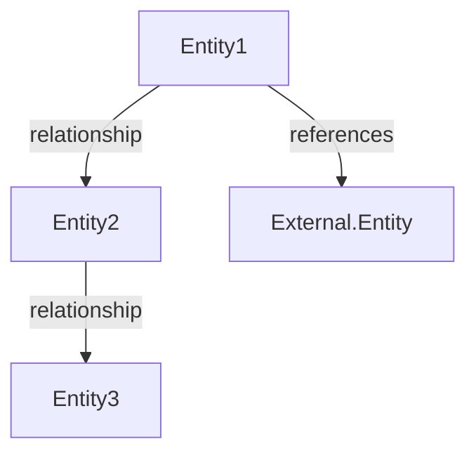

---

## Design Patterns

### SCD Type 2 Entities

Entities using SCD Type 2 for historical tracking:
- Entity1
- Entity2

**Standard SCD2 Fields**:
- `effective_start_date`: When this version becomes effective
- `effective_end_date`: When this version expires (NULL = current)
- `is_current_flag`: `true` for current version

### [Other Patterns]

[Document any other design patterns used in this sub-module]

---

## Integration Points

### [External Module 1]

- **[ExternalEntity]** → `Entity1.foreign_key_field` - [Description]
- **[ExternalEntity]** → `Entity2.foreign_key_field` - [Description]

---

## Related Workflows

Workflow catalog: [../../workflows/[NN]-[submodule]/README.md](../../workflows/[NN]-[submodule]/README.md)

**Key Workflows**:
- WF-[CODE]-001: [Workflow Name]
- WF-[CODE]-002: [Workflow Name]

---

## Quick Navigation

**By Entity Type**:
- **Master Data**: [Entity1](./01-entity.md), [Entity2](./02-entity.md)
- **Transactions**: [Entity3](./03-entity.md)

**By Function**:
- **[Function 1]**: Entity1, Entity2
- **[Function 2]**: Entity3, Entity4

---

## References

- **Parent Ontology**: [../../README.md](../../README.md)
- **Workflow Catalog**: [../../workflows/[NN]-[submodule]/README.md](../../workflows/[NN]-[submodule]/README.md)
- **Glossary**: [../../glossary-[submodule].md](../../glossary-[submodule].md)
- **Database Schema**: [../../../03-design/[module].dbml](../../../03-design/[module].dbml)
```

#### Template O3: Individual Entity Definition

**File**: `00-ontology/domain/[NN]-[submodule]/[NN]-[entity-name].md`

> **🎯 Target**: 150-250 lines for optimal AI agent processing
> 
> **📐 Focus**: Entity definition (WHAT it is) - attributes, constraints, lifecycle. Business context belongs in **Concept Layer**.

```markdown
# [EntityName]

**Module**: [Module Name] ([MODULE-CODE])  
**Submodule**: [SUBMODULE-CODE]  
**Version**: 2.0  
**Last Updated**: YYYY-MM-DD

---

## Entity: [EntityName] {#entity-name}

**Classification**: CORE_ENTITY | VALUE_OBJECT | REFERENCE_DATA | TRANSACTION_DATA

**Definition**: [One-paragraph clear definition of what this entity represents]

**Purpose**: [Why this entity exists - business purpose]

**Key Characteristics**:
- [Characteristic 1]
- [Characteristic 2]
- **SCD Type 2**: Yes/No [if Yes, briefly explain why historical tracking is needed]
- [Other important characteristics]

---

### Attributes

| Attribute | Type | Required | Constraints | Description |
|-----------|------|----------|-------------|-------------|
| `id` | UUID | ✅ | PK | Primary identifier |
| `code` | varchar(50) | ✅ | UNIQUE, NOT NULL | Business code |
| `name` | varchar(100) | ✅ | NOT NULL | Display name |
| `[attribute]` | [Type] | ✅/❌ | [Constraints] | [Description] |
| `created_at` | timestamp | ✅ | Auto | Creation timestamp |
| `updated_at` | timestamp | ❌ | Auto | Last modification |

**Attribute Details** (for complex attributes only):

#### `[complex_attribute]`

**Type**: jsonb | complex type  
**Purpose**: [What this attribute stores]

**Structure**:
```yaml
attribute_name:
  field1: "value1"
  field2: 100
  nested:
    subfield: "value"
```

**Structure Diagram**:
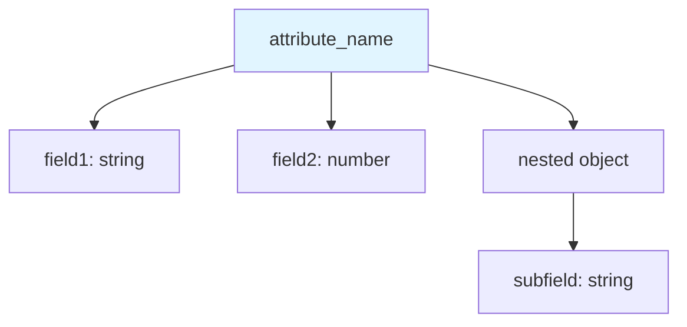

**Validation**:
- field1 must match pattern [pattern]
- field2 must be > 0

---

### Relationships

> **📌 Note**: Structural relationships only (FKs, references). For business context (how entities interact in workflows), see [Concept Layer](../../../01-concept/[NN]-[submodule]/).

#### Entity Relationship Diagram

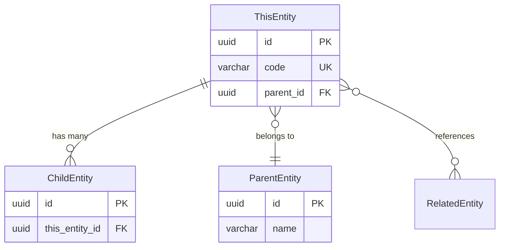

#### Relationship Details

| Relationship | Target | Cardinality | Foreign Key | Purpose |
|--------------|--------|-------------|-------------|---------|
| `parent` | [ParentEntity](./[NN]-parent.md) | N:1 | `parent_id` | [Why this FK exists] |
| `children` | [ChildEntity](./[NN]-child.md) | 1:N | (inverse) | [What children represent] |
| `related` | ExternalModule.Entity | N:1 | `related_id` | [Integration purpose] |

**Relationship Notes**:
- Cascade behavior: [CASCADE | RESTRICT | SET NULL] on parent delete
- Required vs Optional: [Which FKs are nullable and why]

**Data Flow** (if entity participates in data transformations):
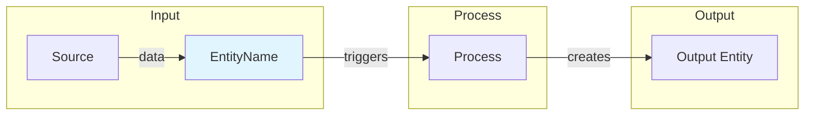

---

### Lifecycle States

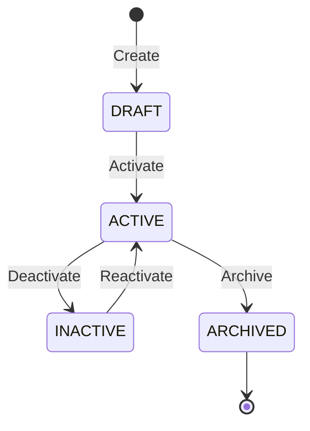

**State Descriptions**:
- **DRAFT**: [When/why entity is in draft]
- **ACTIVE**: [Active state meaning]
- **INACTIVE**: [Temporary disable scenarios]
- **ARCHIVED**: [Permanent retirement]

**State Transition Rules**:
- DRAFT → ACTIVE: [Conditions required]
- Cannot delete entity (must archive for audit trail)

---

### Data Validation & Constraints

> **Note**: Only entity-specific validation rules. Complex business rules belong in Spec layer.

| Field | Validation | Error Message |
|-------|------------|---------------|
| `code` | Unique, 3-50 chars, alphanumeric+underscore | "Code must be unique and 3-50 characters" |
| `[field]` | [Validation logic] | "[User-facing error message]" |

**Database Constraints**:
- `pk_[table]`: PRIMARY KEY (`id`)
- `uk_[table]_code`: UNIQUE (`code`)
- `fk_[table]_parent`: FOREIGN KEY (`parent_id` → `parent.id`)
- `ck_[table]_[field]`: CHECK ([constraint expression])

---

### Examples

#### Example 1: [Common Scenario]

**Description**: [What this example demonstrates]

```yaml
[EntityName]:
  id: "uuid-example"
  code: "EXAMPLE_001"
  name: "Example Entity"
  parent_id: "parent-uuid"
  metadata:
    custom_field: "value"
```

**Business Context**: [When/why this configuration is used in Vietnam/company operations]

#### Example 2: [Edge Case or Special Configuration]

[Additional example demonstrating validation, special configurations, or Vietnam-specific scenarios]

---

### Best Practices

✅ **DO**:
- [Specific best practice with rationale]
- [Naming conventions or patterns to follow]
- [When to create new SCD2 version vs update]

❌ **DON'T**:
- [Common antipatterns to avoid]
- [What not to do and why]
- [Deletion policies]

**Performance Tips**:
- [Caching strategies]
- [Query optimization hints]
- [Application-layer considerations]

**Security Considerations**:
- [Access control requirements]
- [Audit requirements]
- [Data sensitivity notes]

---

### Migration Notes

**Version History**:
- **v2.0 (YYYY-MM-DD)**: [Major changes in this version]
- **v1.0 (YYYY-MM-DD)**: Initial definition

**Deprecated Fields**:
- `old_field`: Replaced by `new_field` in v2.0

**Breaking Changes**:
- [List of breaking changes with migration impact]

---

## References

- **Sub-module Index**: [README.md](./README.md)
- **Concept Guides**: [../../../01-concept/[NN]-[submodule]/](../../../01-concept/[NN]-[submodule]/)
- **Workflows**: [../../workflows/[NN]-[submodule]/README.md](../../workflows/[NN]-[submodule]/README.md)
- **Database Schema**: [../../../03-design/[schema-file].dbml](../../../03-design/[schema-file].dbml)
```

---

**Key Template Changes (v2.5)**:
1. ✅ **Added**: ER diagram in Relationships section for visualization
2. ❌ **Removed**: Business Rules section (moved to Spec layer - FR/BR files)
3. ❌ **Removed**: Indexes section (too technical for ontology)
4. ❌ **Removed**: Audit Fields section (redundant)
5. ✅ **Simplified**: SCD2 to just a note in Key Characteristics
6. ✅ **Merged**: Related Entities into Relationships section (ER diagram + relationship details)
7. ✅ **Simplified**: Data Validation focused on entity-specific rules only

**Focus**: Entity definition (structure, attributes, constraints). Business context, complex rules, and workflows belong in Concept/Spec layers.


---

#### Template O4: Workflow Catalog (Sub-module)

**File**: `00-ontology/workflows/[NN]-[submodule]/README.md`

```markdown
# [SUBMODULE-NAME] - Workflow Catalog

**Module**: [Module Name] ([MODULE-CODE])  
**Submodule**: [SUBMODULE-CODE]  
**Version**: 2.0  
**Last Updated**: YYYY-MM-DD

---

## Overview

This catalog lists all workflows for the [SUBMODULE-NAME] sub-module with metadata only. Detailed step-by-step guides are in the [Concept Layer](../../../01-concept/[NN]-[submodule]/).

**Total Workflows**: [N]

---

## Workflow Index

| ID | Workflow Name | Type | Trigger | Actors | Status |
|----|---------------|------|---------|--------|--------|
| WF-[CODE]-001 | [Name] | [Type] | [Trigger] | [Actors] | [Status] |
| WF-[CODE]-002 | [Name] | [Type] | [Trigger] | [Actors] | [Status] |

---

## Workflows

### WF-[CODE]-001: [Workflow Name] {#wf-001}

**Type**: TRANSACTIONAL | CONFIGURATION | INQUIRY | BATCH  
**Category**: [Sub-module category]  
**Priority**: HIGH | MEDIUM | LOW  
**Frequency**: DAILY | MONTHLY | ON_DEMAND | CONTINUOUS

**Description**: [One-paragraph description]

**Triggers**:
- [Trigger 1]
- [Trigger 2]

**Actors**:
- [Actor 1]: [Role]
- [Actor 2]: [Role]

**Prerequisites**:
- [Prerequisite 1]
- [Prerequisite 2]

**Inputs**:
- [Input 1]: [Description]
- [Input 2]: [Description]

**Outputs**:
- [Output 1]: [Description]
- [Output 2]: [Description]

**Key Entities**:
- [Entity1](../../domain/[NN]-[submodule]/[NN]-entity.md): [How used]
- [Entity2](../../domain/[NN]-[submodule]/[NN]-entity.md): [How used]

**Business Rules**:
- BR-[CODE]-001: [Rule name]
- BR-[CODE]-002: [Rule name]

**Exception Scenarios**:
- [Exception 1]: [Handling]
- [Exception 2]: [Handling]

**Integration Points**:
- [System 1]: [Integration]
- [System 2]: [Integration]

**Detailed Guide**: [../../../01-concept/[NN]-[submodule]/[workflow]-guide.md](../../../01-concept/[NN]-[submodule]/[workflow]-guide.md)

---

### WF-[CODE]-002: [Workflow Name] {#wf-002}

[Same structure as above]

---

## Workflow Dependencies

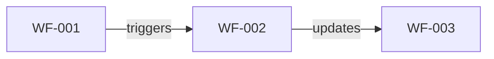

---

## References

- **Entity Catalog**: [../../domain/[NN]-[submodule]/README.md](../../domain/[NN]-[submodule]/README.md)
- **Concept Guides**: [../../../01-concept/[NN]-[submodule]/](../../../01-concept/[NN]-[submodule]/)
- **Business Rules**: [../../../02-spec/04-business-rules.md](../../../02-spec/04-business-rules.md)
```

---

#### Template O5: Glossary (Quick Reference)

**File**: `00-ontology/glossary-[submodule].md`

```markdown
# [Submodule] - Quick Reference Glossary

**Module**: [Module Name] ([MODULE-CODE])  
**Submodule**: [SUBMODULE-CODE]  
**Version**: 2.0  
**Last Updated**: YYYY-MM-DD

---

## Quick Reference

| Term | Type | Definition | Full Docs |
|------|------|------------|-----------|
| [Entity1] | Entity | [One-sentence def] | [domain/01-submodule/01-entity.md](./domain/01-submodule/01-entity.md) |
| [Entity2] | Entity | [One-sentence def] | [domain/01-submodule/02-entity.md](./domain/01-submodule/02-entity.md) |
| [Workflow1] | Workflow | [One-sentence def] | [workflows/01-submodule/README.md#wf-001](./workflows/01-submodule/README.md#wf-001) |

---

## Entities

### [Entity1]

**Definition**: [One-sentence definition]  
**Purpose**: [Why exists]

**Key Attributes**: `id`, `code`, `name`, `[key_attr]`

**Relationships**: Links to [Entity2], [Entity3]

**Full Documentation**: [domain/01-submodule/01-entity.md](./domain/01-submodule/01-entity.md)

---

### [Entity2]

[Same structure]

---

## Workflows

### [Workflow1]

**Definition**: [One-sentence definition]  
**Actors**: [Who performs]  
**Frequency**: [How often]

**Full Documentation**: [workflows/01-submodule/README.md#wf-001](./workflows/01-submodule/README.md#wf-001)

---

## Common Terms

| Term | Definition |
|------|------------|
| [Term1] | [Definition] |
| [Term2] | [Definition] |
```

---

### Concept Layer Templates

#### Template C1: Module Overview

**File**: `01-concept/01-overview.md`

```markdown
# [Module Name] - Overview

**Module**: [MODULE-CODE]  
**Version**: 2.0  
**Last Updated**: YYYY-MM-DD

---

## What is [Module Name]?

[High-level description of what the module does]

---

## Problems It Solves

1. **[Problem 1]**: [Explanation]
2. **[Problem 2]**: [Explanation]

---

## Key Concepts

### [Concept 1]

[Explanation]

### [Concept 2]

[Explanation]

---

## Sub-modules

| Sub-module | Purpose | Key Workflows |
|------------|---------|---------------|
| [NAME] | [Purpose] | [Workflows] |

---

## Integration Points

[How this module integrates with others]

---

## Quick Start

[How to get started understanding this module]
```

---

#### Template C2: Workflow Detail Guide

**File**: `01-concept/[NN]-[submodule]/[workflow]-guide.md`

> **🎯 Purpose**: Detailed step-by-step guide showing HOW workflows execute and HOW entities interact in business context. Heavy use of mermaid diagrams for visualization.

```markdown
# [Workflow Name] - Detail Guide

**Workflow ID**: WF-[CODE]-[NNN]  
**Module**: [MODULE-CODE]  
**Submodule**: [SUBMODULE-CODE]  
**Version**: 2.0

---

## Overview

[Brief description of workflow purpose and business value]

**Metadata**: See [../../00-ontology/workflows/[NN]-[submodule]/README.md#wf-[nnn]](../../00-ontology/workflows/[NN]-[submodule]/README.md#wf-[nnn])

**Actors**:
- [Actor 1]: [Role and responsibility]
- [Actor 2]: [Role and responsibility]

---

## Workflow Overview Diagram

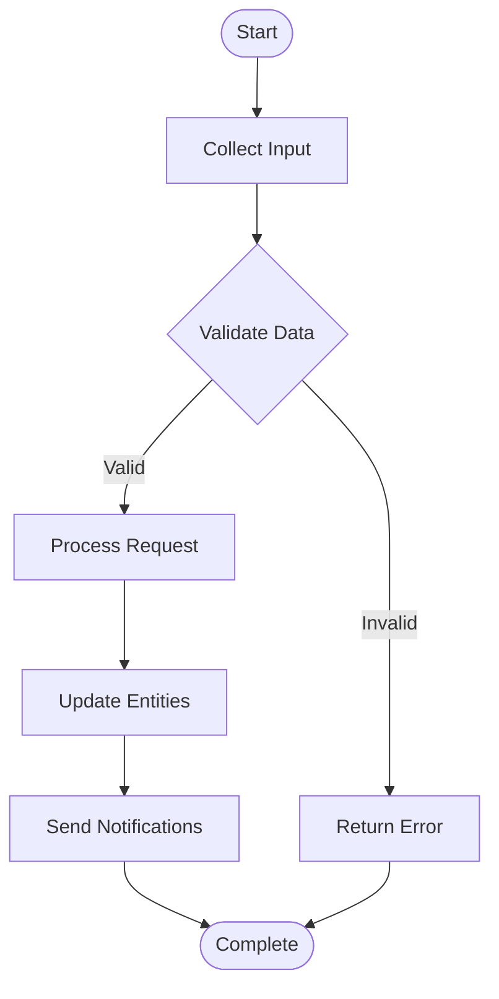

---

## Entity Interaction Context

> **📌 Business Context**: How entities work together in this workflow

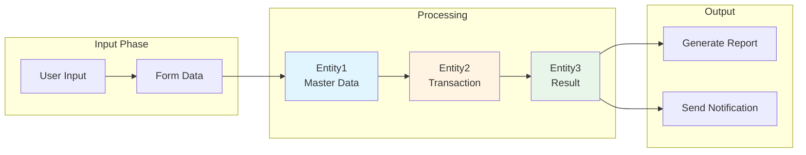

**Entity Roles in this Workflow**:
- **Entity1**: Provides configuration/master data
- **Entity2**: Records transaction details
- **Entity3**: Stores calculated results

---

## Step-by-Step Process

### Step 1: [Step Name]

**Actor**: [Who performs this step]  
**Action**: [What they do in detail]  
**System Behavior**: [What system does automatically]

**Sequence Diagram**:
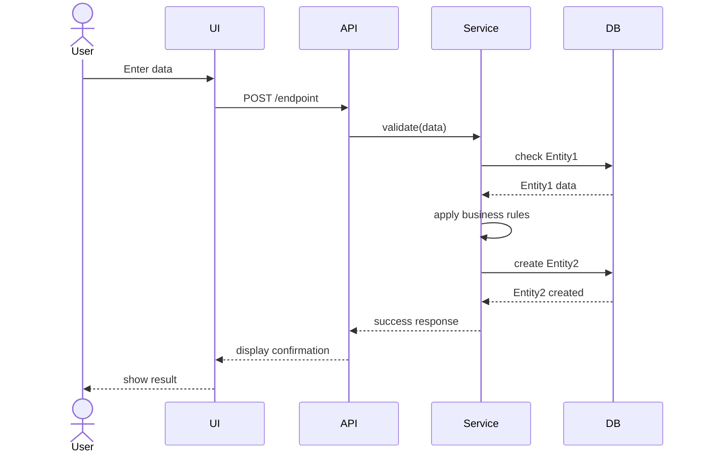

**Business Rules Applied**:
- BR-[CODE]-001: [Rule name and outcome]
- BR-[CODE]-002: [Rule name and outcome]

**Decision Points**:
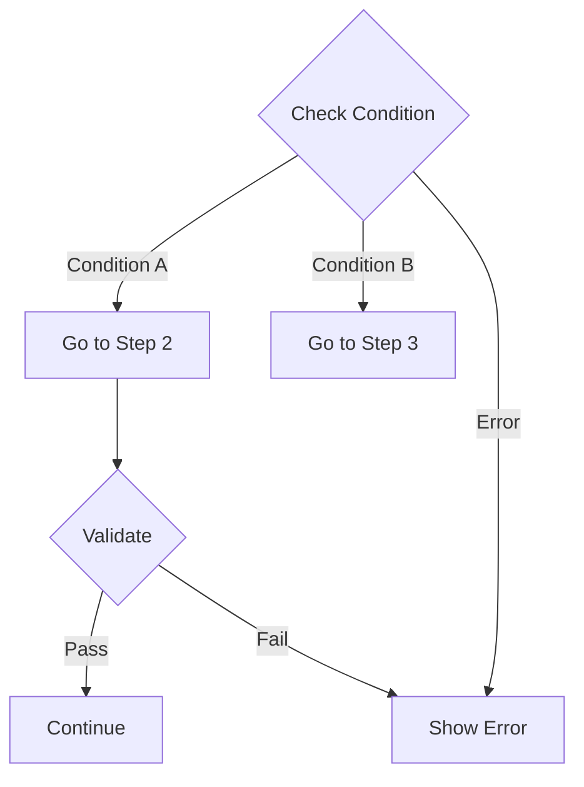

---

### Step 2: [Step Name]

**Actor**: [Who]  
**Action**: [What]  
**System Behavior**: [How]

**Entity State Changes**:
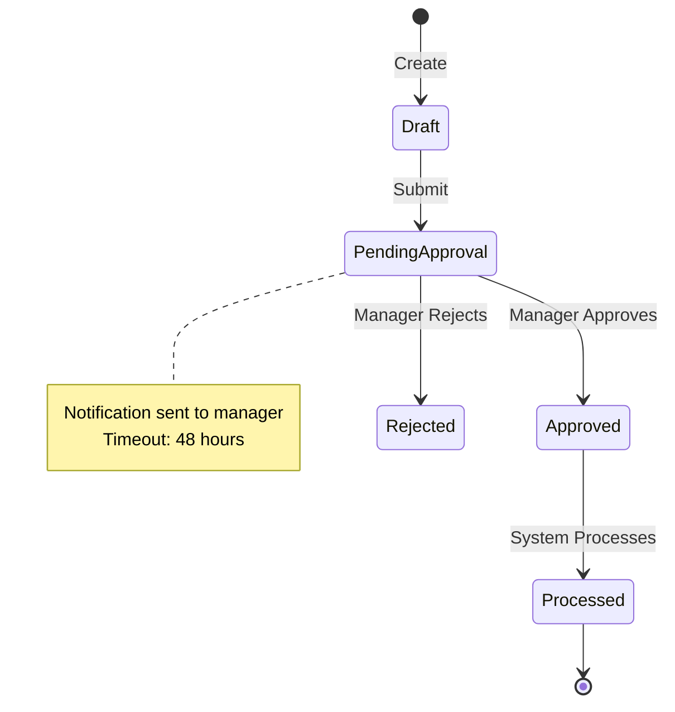

**Data Transformations**:
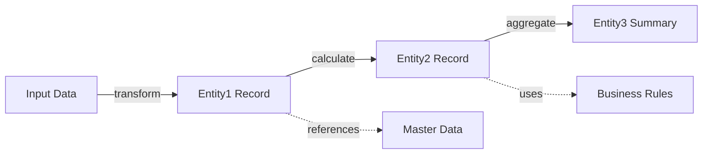

---

### Step 3: [Step Name]

[Same structure as above with relevant diagrams]

---

## Exception Handling

### Exception 1: [Exception Name]

**Scenario**: [When this exception occurs]

**Exception Flow**:
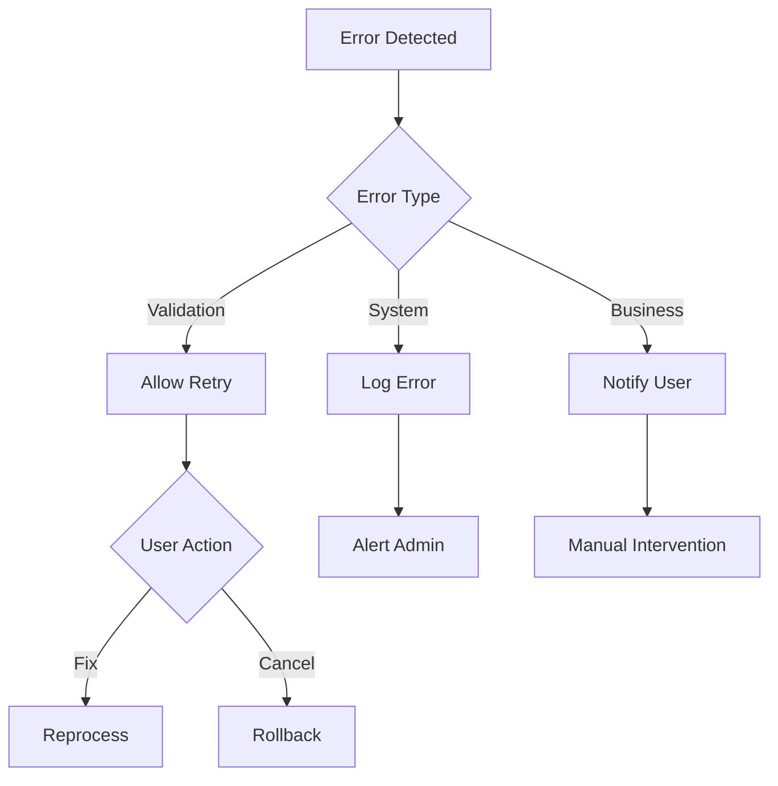

**Handling Steps**:
1. [Step 1 of exception handling]
2. [Step 2 of exception handling]

**Recovery Actions**:
- [Recovery action 1]
- [Recovery action 2]

---

## Complete Workflow Timeline

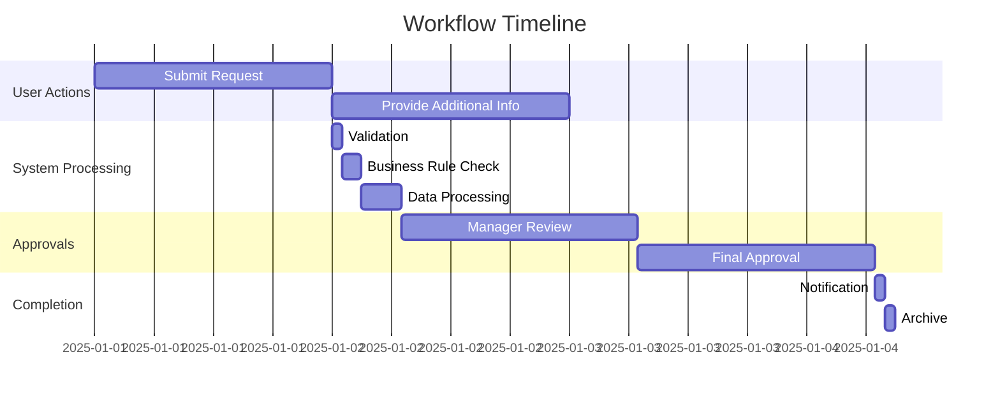

---

## Examples

### Example 1: [Typical Scenario]

**Context**: [Business situation]

**Step-by-Step with Data**:

1. **Initial State**:
```yaml
Entity1:
  code: "INITIAL_001"
  status: DRAFT
```

2. **After Step 1**:
```yaml
Entity1:
  code: "INITIAL_001"
  status: PENDING_APPROVAL
  submitted_by: user_123
  submitted_at: "2025-01-01T10:00:00Z"
```

3. **Final State**:
```yaml
Entity1:
  code: "INITIAL_001"
  status: APPROVED
Entity2:
  code: "RESULT_001"
  source_id: "INITIAL_001"
  calculated_value: 1500.00
```

**Outcome**: [What was achieved]

---

### Example 2: [Edge Case Scenario]

[Walk through a complex or edge case scenario]

---

## Entity Groupings in Context

> **📌 Business Context**: How related entities form logical groups in this workflow

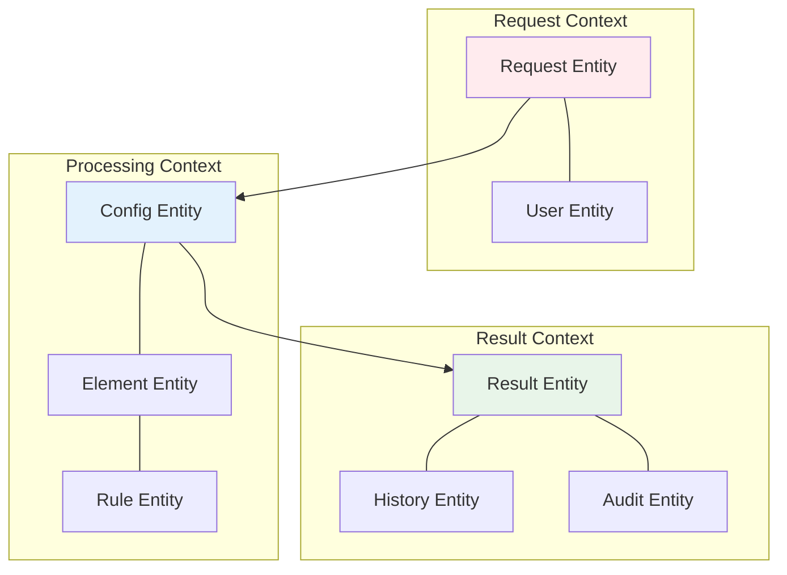

**Context Explanations**:
- **Request Context**: User initiates request with their identity
- **Processing Context**: System applies configuration and rules
- **Result Context**: Outcomes are recorded with full audit trail

---

## Integration Points

### Integration 1: [External System]

**Integration Flow**:
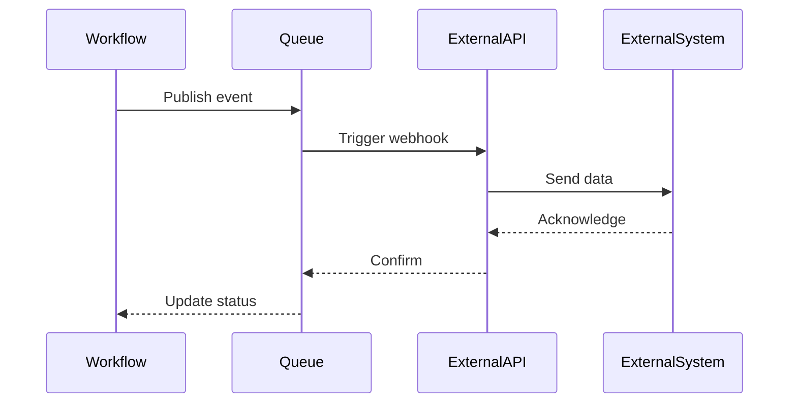

**Data Mapping**: [How data is transformed for integration]

---

## Related Workflows

### Upstream Workflows
- [WF-XXX-001](./workflow1-guide.md): Triggers this workflow

### Downstream Workflows  
- [WF-XXX-003](./workflow3-guide.md): Triggered by this workflow

**Workflow Chain**:
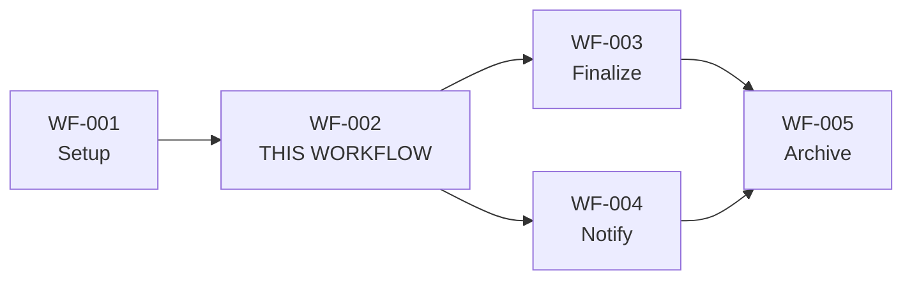

---

## Performance Considerations

**Typical Processing Time**:
- Step 1: ~2 seconds  
- Step 2: ~5 seconds
- Step 3: ~10 seconds
- **Total**: ~17 seconds average

**Bottlenecks**:
- [Bottleneck 1 and mitigation]
- [Bottleneck 2 and mitigation]

---

## References

- [Workflow Catalog](../../00-ontology/workflows/[NN]-[submodule]/README.md#wf-[nnn]) - Metadata
- [Entity Index](../../00-ontology/domain/[NN]-[submodule]/README.md) - Entity definitions
- [Business Rules](../../02-spec/04-business-rules.md) - Detailed rules
- [API Spec](../../02-spec/02-api-specification.md) - Technical API details
```

---

**🎯 Mermaid Diagram Types for Concept Layer**:

1. **Overview Diagrams**: High-level workflow flow
2. **Entity Interaction**: How entities relate in business context
3. **Sequence Diagrams**: Actor-system interactions over time
4. **State Diagrams**: Business state transitions
5. **Decision Flows**: Business logic branching
6. **Data Flow**: Entity transformations
7. **Exception Flows**: Error handling paths
8. **Timeline/Gantt**: Workflow duration and phases
9. **Integration Flows**: External system interactions
10. **Workflow Chains**: Related workflow dependencies

---

---

### Specification Layer Templates

#### Template S1: Business Rules

**File**: `02-spec/04-business-rules.md`

```markdown
# Business Rules

**Module**: [MODULE-CODE]  
**Version**: 2.0

---

## [Sub-module] Rules

### BR-[CODE]-001: [Rule Name]

**Category**: [Validation | Calculation | Authorization | Workflow]  
**Priority**: [Critical | High | Medium | Low]  
**Applicable To**: [Entity/Workflow]

**Description**: [Detailed description]

**Business Logic**:
```
IF [condition]
THEN [action]
ELSE [alternative action]
```

**Validation Trigger**: [When validated]

**Error Message**: "[User-facing message]"

**Examples**:
- **Valid**: [Example]
- **Invalid**: [Example] → Error: "[Message]"

**Traceability**:
- Requirement: FR-[CODE]-[NNN]
- Entity: [EntityName]
- Workflow: WF-[CODE]-[NNN]
```

---

## 🎯 Best Practices

### File Organization

**DO**:
- ✅ Keep entity files to 150-250 lines
- ✅ Use numbered prefixes for clear ordering
- ✅ Create comprehensive sub-module README files
- ✅ Link between related documents

**DON'T**:
- ❌ Create monolithic entity files (\>1000 lines)
- ❌ Skip sub-module README files
- ❌ Duplicate content across files
- ❌ Use absolute paths (use relative)

### Content Organization

**DO**:
- ✅ Focus on business logic and domain understanding
- ✅ Provide real-world examples
- ✅ Include mermaid diagrams for relationships
- ✅ Document business rules explicitly

**DON'T**:
- ❌ Document boilerplate technical fields (id, created_at)
- ❌ Include implementation details in ontology
- ❌ Mix ontology (WHAT) with concept (HOW)

### AI Agent Efficiency

**DO**:
- ✅ Keep files under 300 lines
- ✅ Use clear section headers
- ✅ Provide structured data (tables, YAML)
- ✅ Include validation rules inline

**DON'T**:
- ❌ Create deeply nested file structures
- ❌ Use inconsistent naming
- ❌ Skip file headers with metadata

---

## 📜 Version History

### v2.4 (2025-12-23) - Modular Structure

**Major Changes**:
- Implemented one-entity-per-file pattern for domain entities
- Organized workflows by sub-module with README.md catalogs
- Added comprehensive templates for sub-module README files
- Removed legacy templates to eliminate conflicts
- Enhanced file naming conventions with numbered prefixes

**Benefits**:
- ✅ Optimal file size (150-250 lines) for AI agent processing
- ✅ Parallel work capability across team/agents
- ✅ Clean git history with isolated changes
- ✅ Scalable structure for large modules

**Breaking Changes**:
- Entity files now in `domain/[NN]-[submodule]/[NN]-entity.md` instead of `domain/[submodule]-entities.md`
- Workflow catalogs now in `workflows/[NN]-[submodule]/README.md` instead of `workflows/[submodule]-workflows.md`

---

### v2.3 (2025-12-22)

- Enhanced ontology/glossary template separation
- Business-centric documentation focus

### v2.0 (2024-12-01)

- Introduced 3-layer structure (Ontology-Concept-Spec)

### v1.0 (2024-01-01)

- Initial standards

---

**End of Document**  
**For questions or updates**: Contact xTalent Architecture Team
### Specification Layer Templates

> **🎯 PO Priority**: Focus on FR and BR. Technical specs are OPTIONAL for PO unless special requirements (GDPR, compliance).

---

#### Template S1: Functional Requirements Index

**File**: `02-spec/01-FR/README.md`

```markdown
# Functional Requirements - Index

**Module**: [Module Name] ([MODULE-CODE])  
**Version**: 2.0  
**Last Updated**: YYYY-MM-DD

---

## Overview

**Total Requirements**: [N]  
**Total Sub-modules**: [M]

---

## Requirements by Sub-module

| # | Sub-module | File | Requirements | Status |
|---|------------|------|--------------|--------|
| 01 | [Submodule 1] | [FR-01-submodule.md](./FR-01-submodule.md) | [N] | [Status] |
| 02 | [Submodule 2] | [FR-02-submodule.md](./FR-02-submodule.md) | [N] | [Status] |

---

## Traceability Matrix

| FR ID | Title | Entities | Workflows | Business Rules |
|-------|-------|----------|-----------|----------------|
| FR-[CODE]-001 | [Title] | [Entity](../../00-ontology/domain/01-submodule/01-entity.md) | [WF-001](../../00-ontology/workflows/01-submodule/README.md#wf-001) | BR-[CODE]-001 |

---

## Quick Navigation

**By Priority**:
- **HIGH**: FR-001, FR-005, FR-010
- **MEDIUM**: FR-002, FR-006
- **LOW**: FR-003

**By Category**:
- **Configuration**: FR-01-* (Sub-module 1)
- **Processing**: FR-02-* (Sub-module 2)

---

## References

- **Ontology**: [../../00-ontology/README.md](../../00-ontology/README.md)
- **Concept**: [../../01-concept/README.md](../../01-concept/README.md)
- **Business Rules**: [../04-BR/README.md](../04-BR/README.md)
```

---

#### Template S2: Functional Requirements (Sub-module File)

**File**: `02-spec/01-FR/FR-[NN]-[submodule].md`

> **Target Size**: 300-500 lines. If >600 lines, split into batches: `FR-[NN].[XX]-[submodule]-[batch].md`

```markdown
# Functional Requirements - [Submodule Name]

**Module**: [MODULE-CODE]  
**Submodule**: [SUBMODULE-CODE]  
**Version**: 2.0  
**Last Updated**: YYYY-MM-DD

---

## Overview

**Total Requirements**: [N]  
**Priority Distribution**: HIGH ([X]), MEDIUM ([Y]), LOW ([Z])

---

## Requirements

### FR-[CODE]-001: [Requirement Title]

**Priority**: HIGH | MEDIUM | LOW  
**Category**: [Configuration | Processing | Reporting | Integration]  
**Status**: [Draft | Approved | Implemented]

**Description**:
[Detailed description of what the system must do]

**Rationale**:
[Why this requirement exists - business value]

**Acceptance Criteria**:
1. [Criterion 1 - specific, measurable]
2. [Criterion 2]
3. [Criterion 3]

**User Story** (if applicable):
```
As a [role]
I want to [action]
So that [benefit]
```

**Business Rules**:
- [BR-[CODE]-001](../04-BR/BR-[NN]-submodule.md#br-code-001): [Rule name]
- [BR-[CODE]-002](../04-BR/BR-[NN]-submodule.md#br-code-002): [Rule name]

**Entities**:
- [Entity1](../../00-ontology/domain/[NN]-submodule/[NN]-entity1.md): [How used - CRUD operations]
- [Entity2](../../00-ontology/domain/[NN]-submodule/[NN]-entity2.md): [How used]

**Workflows**:
- [WF-[CODE]-001](../../00-ontology/workflows/[NN]-submodule/README.md#wf-001): [Workflow name]
- Detailed guide: [../../01-concept/[NN]-submodule/workflow-guide.md](../../01-concept/[NN]-submodule/workflow-guide.md)

**Dependencies**:
- FR-[CODE]-XXX: [Dependent requirement]
- External: [System/Module dependency]

**Assumptions**:
- [Assumption 1]
- [Assumption 2]

**Constraints**:
- [Technical constraint]
- [Business constraint]

**Examples**:
```yaml
Example 1: [Scenario name]
  Input:
    [field]: [value]
  
  Process:
    [step 1]
    [step 2]
  
  Output:
    [expected result]
```

---

### FR-[CODE]-002: [Requirement Title]

[Same structure as above]

---

## Traceability

| FR ID | Entities | Workflows | Business Rules | Status |
|-------|----------|-----------|----------------|--------|
| FR-[CODE]-001 | Entity1, Entity2 | WF-001 | BR-001, BR-002 | Approved |
| FR-[CODE]-002 | Entity3 | WF-002 | BR-003 | Draft |

---

## References

- **Sub-module Index**: [../README.md](../README.md)
- **Ontology Entities**: [../../00-ontology/domain/[NN]-submodule/README.md](../../00-ontology/domain/[NN]-submodule/README.md)
- **Workflows**: [../../00-ontology/workflows/[NN]-submodule/README.md](../../00-ontology/workflows/[NN]-submodule/README.md)
- **Concept Guides**: [../../01-concept/[NN]-submodule/](../../01-concept/[NN]-submodule/)
- **Business Rules**: [../04-BR/BR-[NN]-submodule.md](../04-BR/BR-[NN]-submodule.md)
```

---

#### Template S3: Business Rules Index

**File**: `02-spec/04-BR/README.md`

```markdown
# Business Rules - Index

**Module**: [Module Name] ([MODULE-CODE])  
**Version**: 2.0  
**Last Updated**: YYYY-MM-DD

---

## Overview

**Total Rules**: [N]  
**Priority Distribution**: CRITICAL ([X]), HIGH ([Y]), MEDIUM ([Z]), LOW ([W])

---

## Rules by Sub-module

| # | Sub-module | File | Rules | Status |
|---|------------|------|-------|--------|
| 01 | [Submodule 1] | [BR-01-submodule.md](./BR-01-submodule.md) | [N] | [Status] |
| 02 | [Submodule 2] | [BR-02-submodule.md](./BR-02-submodule.md) | [N] | [Status] |

---

## Rules by Category

### Validation Rules
- BR-[CODE]-001 to BR-[CODE]-020

### Calculation Rules
- BR-[CODE]-021 to BR-[CODE]-040

### Authorization Rules
- BR-[CODE]-041 to BR-[CODE]-050

### Workflow Rules
- BR-[CODE]-051 to BR-[CODE]-060

---

## Traceability Matrix

| BR ID | Title | FR | Entities | Workflows | Priority |
|-------|-------|---- |----------|-----------|----------|
| BR-[CODE]-001 | [Title] | FR-[CODE]-001 | [Entity](../../00-ontology/domain/01-submodule/01-entity.md) | [WF-001](../../00-ontology/workflows/01-submodule/README.md#wf-001) | HIGH |

---

## References

- **Functional Requirements**: [../01-FR/README.md](../01-FR/README.md)
- **Ontology**: [../../00-ontology/README.md](../../00-ontology/README.md)
- **Concept**: [../../01-concept/README.md](../../01-concept/README.md)
```

---

#### Template S4: Business Rules (Sub-module File)

**File**: `02-spec/04-BR/BR-[NN]-[submodule].md`

> **Target Size**: 400-600 lines (~40-60 rules). If >600 lines, split into batches: `BR-[NN].[XX]-[submodule]-[batch].md`
>
> **Example batches**: `BR-02.01-processing-validation.md`, `BR-02.02-processing-calculation.md`

```markdown
# Business Rules - [Submodule Name]

**Module**: [MODULE-CODE]  
**Submodule**: [SUBMODULE-CODE]  
**Version**: 2.0  
**Last Updated**: YYYY-MM-DD

---

## Overview

**Total Rules**: [N]  
**Priority Distribution**: CRITICAL ([X]), HIGH ([Y]), MEDIUM ([Z])

---

## Category: [Category Name]

### BR-[CODE]-001: [Rule Name]

**Priority**: CRITICAL | HIGH | MEDIUM | LOW  
**Category**: Validation | Calculation | Authorization | Workflow  
**Applicable To**: [Entity/Workflow name]

**Description**:
[Clear, concise description of what this rule enforces]

**Business Logic**:
```
IF [condition 1]
  AND [condition 2]
THEN [action/result]
ELSE IF [condition 3]
THEN [alternative action]
ELSE [default action]
```

**Conditions**:
1. [Precondition 1]
2. [Precondition 2]

**Validation Trigger**: [When rule is checked - On Create | On Update | On Delete | On Status Change]

**Error Handling**:
- **Error Code**: `ERR_[CODE]_001`
- **Error Message**: "[User-facing error message]"
- **Severity**: Error | Warning | Info
- **Recovery Action**: [What user should do]

**Examples**:

**Example 1: Valid Scenario**
```yaml
Given:
  Entity:
    field1: "value1"
    field2: 100
    status: ACTIVE

When:
  Action: Update field2 to 150

Then:
  BR-[CODE]-001: PASS
  Result: Update successful
```

**Example 2: Invalid Scenario**
```yaml
Given:
  Entity:
    field1: "value1"
    field2: 100
    status: INACTIVE

When:
  Action: Update field2 to 150

Then:
  BR-[CODE]-001: FAIL
  Error: ERR_[CODE]_001
  Message: "Cannot update field2 when status is INACTIVE"
```

**Traceability**:
- **Functional Requirement**: [FR-[CODE]-001](../01-FR/FR-[NN]-submodule.md#fr-code-001)
- **Entities**: 
  - [Entity1](../../00-ontology/domain/[NN]-submodule/[NN]-entity1.md): [How rule affects this entity]
  - [Entity2](../../00-ontology/domain/[NN]-submodule/[NN]-entity2.md): [How rule affects this entity]
- **Workflows**:
  - [WF-[CODE]-001](../../00-ontology/workflows/[NN]-submodule/README.md#wf-001): [Where rule applies]
  - Concept Guide: [../../01-concept/[NN]-submodule/workflow-guide.md](../../01-concept/[NN]-submodule/workflow-guide.md)

**Exceptions**:
- [Exception scenario 1] - Requires [approval level]
- [Exception scenario 2] - System override allowed

**Related Rules**:
- BR-[CODE]-XXX: [Related rule]
- BR-[CODE]-YYY: [Dependent rule]

**Implementation Notes**:
- [Database constraint needed]
- [API validation point]
- [UI validation feedback]

---

### BR-[CODE]-002: [Rule Name]

[Same structure as above]

---

## Rule Dependencies

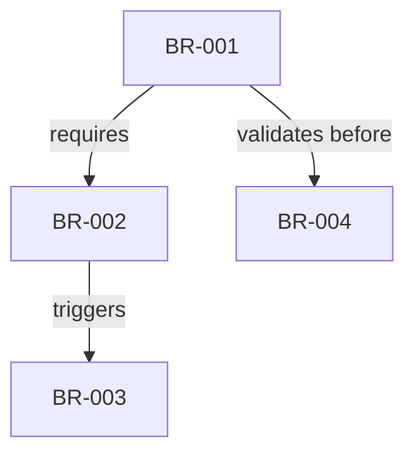

---

## Traceability Matrix

| BR ID | FR | Entities | Workflows | Priority | Status |
|-------|-----|----------|------------|-------|--------|
| BR-[CODE]-001 | FR-[CODE]-001 | Entity1, Entity2 | WF-001 | HIGH | Approved |
| BR-[CODE]-002 | FR-[CODE]-002 | Entity3 | WF-002 | MEDIUM | Draft |

---

## References

- **Sub-module Index**: [README.md](./README.md)
- **Functional Requirements**: [../01-FR/FR-[NN]-submodule.md](../01-FR/FR-[NN]-submodule.md)
- **Ontology Entities**: [../../00-ontology/domain/[NN]-submodule/README.md](../../00-ontology/domain/[NN]-submodule/README.md)
- **Workflows**: [../../00-ontology/workflows/[NN]-submodule/README.md](../../00-ontology/workflows/[NN]-submodule/README.md)
- **Concept Guides**: [../../01-concept/[NN]-submodule/](../../01-concept/[NN]-submodule/)
```

---

**🎯 Batching Guidelines**:

1. **When to Batch**:
   - File >600 lines
   - >60 rules in single file
   - Logically separable groups

2. **Batch Naming**:
   - Pattern: `[TYPE]-[NN].[XX]-[submodule]-[batch].md`
   - Example: `BR-02.01-processing-validation.md`
   - Example: `BR-02.02-processing-calculation.md`

3. **Batch Organization**:
   - Group by rule category (validation, calculation)
   - Group by entity scope
   - Group by workflow phase

4. **Cross-batch References**:
   - Always use relative paths
   - Include batch name in anchor links
   - Maintain master index in README.md

---
---
