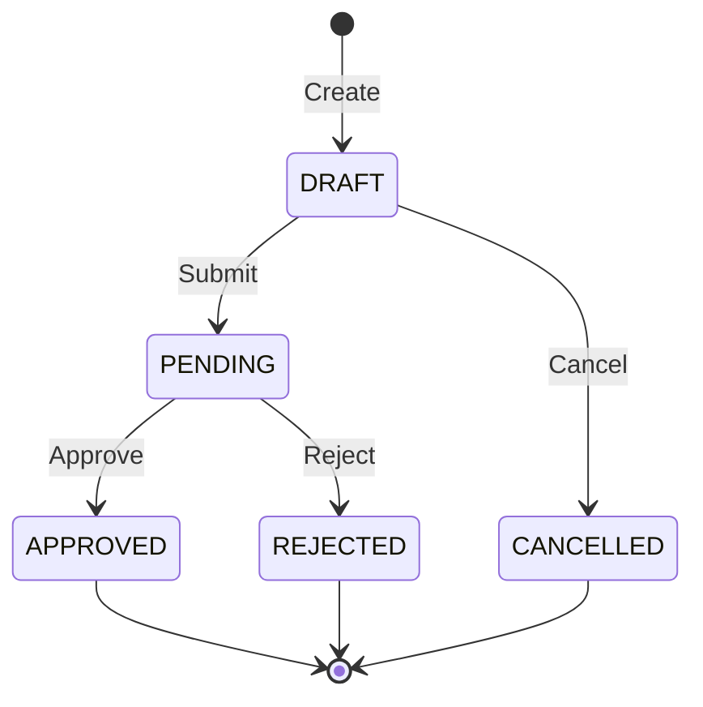
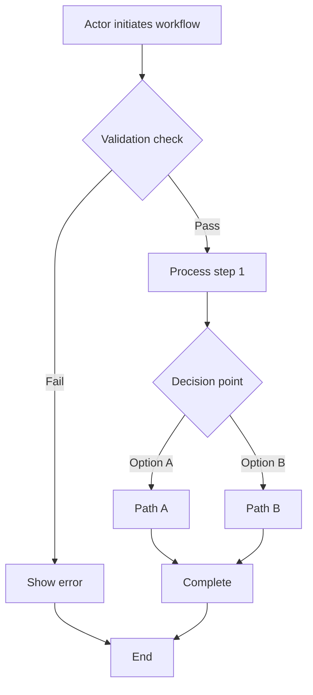
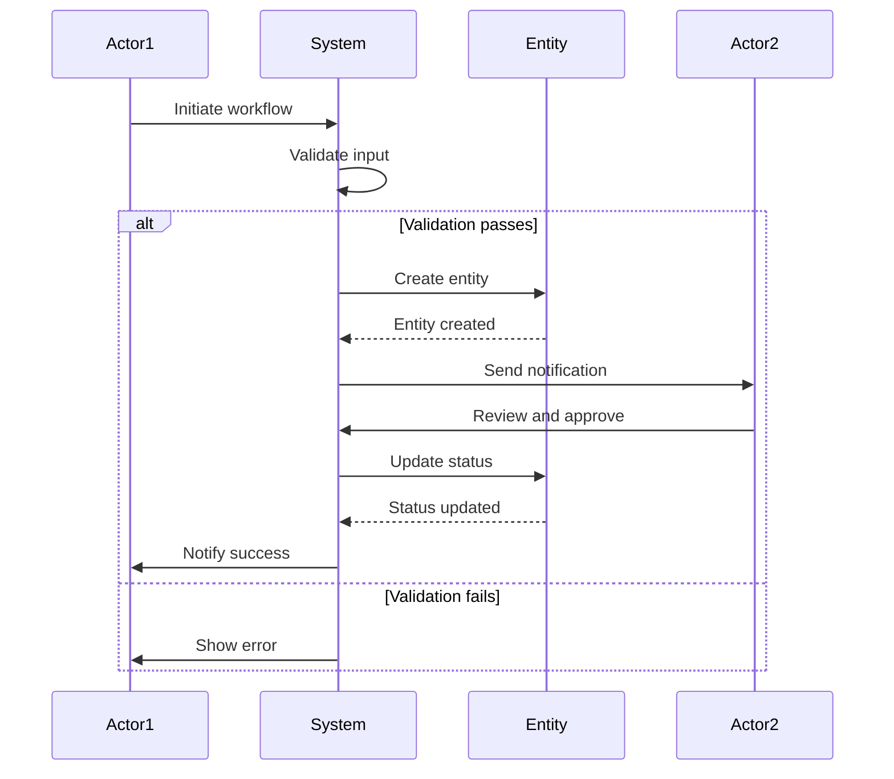

# xTalent Module Documentation Standards

**Version**: 2.2  
**Last Updated**: 2025-12-19  
**Status**: Official Standard  
**Applies To**: All xTalent Modules

---

## 🎯 Purpose

This document defines the **standard documentation structure and templates** for all xTalent modules to ensure consistency, quality, and reusability across the entire product.

**Lessons Learned**: The TA (Time & Attendance) module was documented differently from the Core module, causing inconsistencies. This standard prevents that.

---

## 📁 Standard Module Structure

### Every Module MUST Follow This Structure

```
xTalent/docs/01-modules/[MODULE-CODE]/

├── 00-ontology/                    # Data Model Foundation
│   ├── README.md                   # REQUIRED (index + overview)
│   │
│   ├── domain/                     # Entity Definitions (split by submodule)
│   │   ├── [submodule-1]-entities.md    # REQUIRED (entities for submodule 1)
│   │   ├── [submodule-2]-entities.md    # REQUIRED (entities for submodule 2)
│   │   └── shared-entities.md           # OPTIONAL (cross-submodule entities)
│   │
│   ├── workflows/                  # Workflow Catalog (metadata only)
│   │   ├── [submodule-1]-workflows.md   # REQUIRED (workflow list + metadata)
│   │   └── [submodule-2]-workflows.md   # REQUIRED (workflow list + metadata)
│   │
│   ├── glossary-[submodule].md     # REQUIRED (one per sub-module)
│   ├── glossary-[submodule]-vi.md  # OPTIONAL (Vietnamese)
│   ├── glossary-index.md           # REQUIRED
│   └── ONTOLOGY-REVIEW.md          # RECOMMENDED
│
├── 01-concept/                     # Business Guides
│   ├── README.md                   # REQUIRED (index)
│   ├── 01-overview.md              # REQUIRED (module overview)
│   ├── 02-[submodule-1]/           # Concept guides per submodule
│   │   ├── overview.md             # Submodule overview
│   │   ├── [workflow-1]-guide.md   # Workflow detail guide
│   │   └── [workflow-2]-guide.md   # Workflow detail guide
│   ├── 03-[submodule-2]/           # Concept guides per submodule
│   │   ├── overview.md             # Submodule overview
│   │   └── [workflow-n]-guide.md   # Workflow detail guide
│   └── 99-shared/                  # OPTIONAL (cross-cutting concepts)
│       └── [topic]-guide.md
│
├── 02-spec/                        # Module-Level Specifications
│   ├── README.md                   # REQUIRED (index)
│   ├── 01-functional-requirements.md    # REQUIRED
│   ├── 02-api-specification.md          # REQUIRED
│   ├── 03-data-specification.md         # REQUIRED
│   ├── 04-business-rules.md             # REQUIRED
│   ├── 05-integration-spec.md           # REQUIRED
│   ├── 06-security-spec.md              # REQUIRED
│   ├── 03-scenarios/                    # REQUIRED (use cases per workflow)
│   │   └── [scenario-name].md
│   ├── INTEGRATION-GUIDE.md             # REQUIRED (PO/BA → Dev handoff)
│   └── FEATURE-LIST.yaml                # REQUIRED
│
├── 03-design/                      # Technical Design
│   ├── README.md                   # REQUIRED
│   ├── [module].dbml               # REQUIRED (database schema)
│   └── diagrams/                   # OPTIONAL
│
├── 04-implementation/              # Implementation Guides
│   ├── README.md                   # REQUIRED
│   └── [guides].md                 # As needed
│
└── 05-api/                         # API Documentation
    ├── README.md                   # REQUIRED
    └── openapi.yaml                # REQUIRED
```

---

## 📝 Required Documents by Phase

### Phase 0: Ontology (Foundation)

| Document | Status | Owner | Purpose |
|----------|--------|-------|---------|
| `00-ontology/README.md` | **REQUIRED** | PO/BA + Architect | Ontology index and overview |
| `domain/[submodule]-entities.md` | **REQUIRED** | PO/BA + Architect | Entity definitions per submodule |
| `domain/shared-entities.md` | OPTIONAL | PO/BA + Architect | Cross-submodule entities |
| `workflows/[submodule]-workflows.md` | **REQUIRED** | PO/BA + Architect | Workflow catalog per submodule |
| `glossary-[submodule].md` | **REQUIRED** | PO/BA | Entity definitions (English) |
| `glossary-[submodule]-vi.md` | OPTIONAL | PO/BA | Entity definitions (Vietnamese) |
| `glossary-index.md` | **REQUIRED** | PO/BA | Glossary navigation |

> **Key Principle**: Ontology separates **WHAT exists** (entities in `domain/`) from **WHAT workflows exist** (workflow catalog in `workflows/`). Workflow details are documented in the Concept layer.

### Phase 1: Concept (Business Understanding)

| Document | Status | Owner | Purpose |
|----------|--------|-------|---------|
| `01-concept/README.md` | **REQUIRED** | PO/BA | Concept guides index |
| `01-overview.md` | **REQUIRED** | PO/BA | High-level module overview |
| `02-[submodule-1]/overview.md` | **REQUIRED** | PO/BA | Submodule overview |
| `02-[submodule-1]/[workflow]-guide.md` | **REQUIRED** | PO/BA | Workflow detail guides (one per workflow) |
| `03-[submodule-2]/overview.md` | **REQUIRED** | PO/BA | Submodule overview |
| `03-[submodule-2]/[workflow]-guide.md` | **REQUIRED** | PO/BA | Workflow detail guides (one per workflow) |
| `99-shared/[topic]-guide.md` | OPTIONAL | PO/BA | Cross-cutting concept guides |

**Minimum Required Guides**: 1 module overview + 1 overview per submodule + 1 guide per core workflow

**Guide Structure**:
- **01-overview.md**: What the module is, problems it solves, scope, key concepts, business value
- **[NN]-[submodule]/overview.md**: Submodule-specific overview and context
- **[NN]-[submodule]/[workflow]-guide.md**: Step-by-step workflow details, decision points, exceptions
- **99-shared/[topic]-guide.md**: Cross-cutting topics (policies, patterns, best practices)

> **Key Principle**: Concept layer provides **HOW workflows work** in detail. Each workflow from the Ontology catalog gets a detailed guide here.

### Phase 2: Specification (Requirements)

| Document | Status | Owner | Purpose |
|----------|--------|-------|---------|
| `02-spec/README.md` | **REQUIRED** | PO/BA | Spec index |
| `01-functional-requirements.md` | **REQUIRED** | PO/BA | All functional requirements |
| `02-api-specification.md` | **REQUIRED** | PO/BA | All API endpoints |
| `03-data-specification.md` | **REQUIRED** | PO/BA | Data validation rules |
| `04-business-rules.md` | **REQUIRED** | PO/BA | Business logic rules |
| `05-integration-spec.md` | **REQUIRED** | PO/BA | External integrations |
| `06-security-spec.md` | **REQUIRED** | PO/BA | Security requirements |
| `INTEGRATION-GUIDE.md` | **REQUIRED** | PO/BA | Handoff to dev team |
| `FEATURE-LIST.yaml` | **REQUIRED** | PO/BA | Feature breakdown |

### Phase 3: Design (Technical)

| Document | Status | Owner | Purpose |
|----------|--------|-------|---------|
| `03-design/README.md` | **REQUIRED** | Architect | Design index |
| `[module].dbml` | **REQUIRED** | Architect | Database schema |

### Phase 4+: Implementation & API

| Document | Status | Owner | Purpose |
|----------|--------|-------|---------|
| `04-implementation/README.md` | **REQUIRED** | Dev Lead | Implementation index |
| `05-api/README.md` | **REQUIRED** | Dev Lead | API documentation index |
| `05-api/openapi.yaml` | **REQUIRED** | Dev Lead | OpenAPI specification |

---

## 📋 Document Templates

### Template 1: Module Ontology

**File**: `00-ontology/[module]-ontology.yaml`

```yaml
# [Module Name] Ontology
# Version: 2.0
# Last Updated: YYYY-MM-DD

metadata:
  module:
    code: [MODULE-CODE]
    name: "[Module Full Name]"
    version: "2.0"
    description: |
      [Module description]
  
  sub_modules:
    - code: [SUBMODULE-1]
      name: "[Sub-module Name]"
      entities:
        - [Entity1]
        - [Entity2]
    
    - code: [SUBMODULE-2]
      name: "[Sub-module Name]"
      entities:
        - [Entity3]
        - [Entity4]

# Entity Definitions
entities:
  [Entity1]:
    description: |
      [Entity description]
    
    attributes:
      id:
        type: UUID
        required: true
        description: "Primary key"
      
      [attribute_name]:
        type: [data_type]
        required: [true/false]
        maxLength: [number]
        description: "[Description]"
    
    relationships:
      [relationship_name]:
        target: [TargetEntity]
        cardinality: "[1:1 / 1:N / N:M]"
        description: "[Description]"
    
    constraints:
      - name: "[constraint_name]"
        type: "[CHECK / UNIQUE / FK]"
        description: "[Description]"
    
    business_rules:
      - id: "BR-[CODE]-001"
        description: "[Rule description]"
    
    indexes:
      - name: "idx_[table]_[field]"
        columns: [[field1], [field2]]
        unique: [true/false]
    
    audit:
      scd_type: 2
      fields:
        - created_at
        - created_by
        - updated_at
        - updated_by
        - effective_start_date
        - effective_end_date
        - is_current_flag

# Design Patterns
design_patterns:
  scd_type_2:
    description: "Slowly Changing Dimensions Type 2"
    applies_to: [List of entities]
  
  hierarchical_data:
    description: "Materialized Path pattern"
    applies_to: [List of entities]

# Version History
version_history:
  - version: "2.0"
    date: "YYYY-MM-DD"
    changes: "[Description of changes]"
```

---

> **Note**: Template 1 above shows the legacy YAML format. For new modules, use the markdown-based templates below (1A and 1B).

---

### Template 1A: Entity Definition (Ontology Layer)

**File**: `00-ontology/domain/[submodule]-entities.md`

**Purpose**: Define all entities for a specific submodule with attributes, relationships, lifecycle, and business rules.

```markdown
# [Submodule Name] - Domain Entities

**Module**: [MODULE-CODE]  
**Submodule**: [SUBMODULE-CODE]  
**Version**: 2.0  
**Last Updated**: YYYY-MM-DD

---

## Overview

[Brief description of this submodule and its entities]

---

## Entity: [EntityName] {#entity-name}

**Classification**: CORE_ENTITY | VALUE_OBJECT | REFERENCE_DATA | TRANSACTION_DATA  
**Description**: [One-paragraph description of what this entity represents and why it exists]

### Attributes

| Attribute | Type | Required | Constraints | Description |
|-----------|------|----------|-------------|-------------|
| `id` | UUID | ✅ | PK | Primary identifier |
| `[attribute_name]` | [Type] | ✅/❌ | [Constraints] | [Description] |
| `status` | Enum | ✅ | `DRAFT\|ACTIVE\|INACTIVE` | Current state |
| `created_at` | Timestamp | ✅ | Auto-generated | Creation timestamp |
| `created_by` | UUID | ✅ | FK → [User](#user) | Creator reference |

### Relationships

| Relationship | Target | Cardinality | Description |
|--------------|--------|-------------|-------------|
| `[relationshipName]` | [TargetEntity](./[file].md#target-entity) | N:1 | [Description] |
| `[relationshipName]` | [TargetEntity](./[file].md#target-entity) | 1:N | [Description] |

### Lifecycle States



**State Descriptions**:
- **DRAFT**: Initial state, editable
- **PENDING**: Submitted for review
- **APPROVED**: Approved and active
- **REJECTED**: Rejected by approver
- **CANCELLED**: Cancelled by requester

### Business Rules

| Rule ID | Description |
|---------|-------------|
| BR-[CODE]-001 | [Rule description] |
| BR-[CODE]-002 | [Rule description] |

### Constraints

| Constraint | Type | Description |
|------------|------|-------------|
| `[constraint_name]` | CHECK | [Description] |
| `[constraint_name]` | UNIQUE | [Description] |

### Indexes

| Index Name | Columns | Unique | Purpose |
|------------|---------|--------|---------|
| `idx_[table]_[field]` | `[field1], [field2]` | ✅/❌ | [Purpose] |

### Audit Fields (if SCD2)

| Field | Type | Description |
|-------|------|-------------|
| `effective_start_date` | Date | SCD2: Valid from |
| `effective_end_date` | Date | SCD2: Valid until |
| `is_current_flag` | Boolean | SCD2: Current version |

### Examples

```yaml
Example 1: [Scenario Name]
  [EntityName]:
    id: "550e8400-e29b-41d4-a716-446655440000"
    [attribute]: [value]
    status: ACTIVE
    created_at: "2025-01-15T10:30:00Z"
```

### Related Entities

- [Entity1](./[file].md#entity1) - [Relationship description]
- [Entity2](./[file].md#entity2) - [Relationship description]

### Related Workflows

- [Workflow 1](../workflows/[submodule]-workflows.md#wf-001) - [How this entity is used]
- [Workflow 2](../workflows/[submodule]-workflows.md#wf-002) - [How this entity is used]

---

## References

- **Workflow Catalog**: [../workflows/[submodule]-workflows.md](../workflows/[submodule]-workflows.md)
- **Glossary**: [../glossary-[submodule].md](../glossary-[submodule].md)
- **Concept Guides**: [../../01-concept/[NN]-[submodule]/](../../01-concept/[NN]-[submodule]/)
```

---

### Template 1B: Workflow Catalog (Ontology Layer)

**File**: `00-ontology/workflows/[submodule]-workflows.md`

**Purpose**: Catalog all workflows for a submodule with metadata only. Detailed workflow guides are in the Concept layer.

```markdown
# [Submodule Name] - Workflow Catalog

**Module**: [MODULE-CODE]  
**Submodule**: [SUBMODULE-CODE]  
**Version**: 2.0  
**Last Updated**: YYYY-MM-DD

---

## Overview

[Brief description of workflows in this submodule]

---

## Workflow Index

| ID | Name | Classification | Trigger | Concept Guide |
|----|------|----------------|---------|---------------|
| WF-[CODE]-001 | [Workflow Name] | CORE | User Action | [→ Guide](../../01-concept/[NN]-[submodule]/[workflow]-guide.md) |
| WF-[CODE]-002 | [Workflow Name] | SUPPORT | Event | [→ Guide](../../01-concept/[NN]-[submodule]/[workflow]-guide.md) |
| WF-[CODE]-003 | [Workflow Name] | INTEGRATION | API Call | [→ Guide](../../01-concept/[NN]-[submodule]/[workflow]-guide.md) |

---

## WF-[CODE]-001: [Workflow Name] {#wf-code-001}

**Classification**: CORE | SUPPORT | INTEGRATION  
**Trigger**: User Action | Scheduled | Event | API Call  
**Description**: [Brief description of what this workflow accomplishes]

### Actors

| Actor | Type | Role |
|-------|------|------|
| [Actor Name] | USER | [Role description] |
| System | SYSTEM | [Role description] |
| [External System] | EXTERNAL | [Role description] |

### Related Entities

- [Entity1](../domain/[submodule]-entities.md#entity1) - Created/Updated
- [Entity2](../domain/[submodule]-entities.md#entity2) - Read
- [Entity3](../domain/[submodule]-entities.md#entity3) - Validated

### High-Level Steps

1. **[Step Name]** - [Actor] - [Brief action]
2. **[Step Name]** - [Actor] - [Brief action]
3. **[Step Name]** - [Actor] - [Brief action]
4. **[Step Name]** - [Actor] - [Brief action]

### Outcomes

| Outcome | Description |
|---------|-------------|
| Success | [Description of successful outcome] |
| Failure | [Description of failure outcome] |
| Partial | [Description of partial outcome, if applicable] |

### Business Rules Applied

- [BR-[CODE]-001](../domain/[submodule]-entities.md) - [Rule name]
- [BR-[CODE]-002](../domain/[submodule]-entities.md) - [Rule name]

> **📖 Detailed Guide**: See [Workflow Concept Guide](../../01-concept/[NN]-[submodule]/[workflow]-guide.md) for step-by-step flow, decision points, and exception handling.

---

## References

- **Entity Definitions**: [../domain/[submodule]-entities.md](../domain/[submodule]-entities.md)
- **Glossary**: [../glossary-[submodule].md](../glossary-[submodule].md)
- **Concept Guides**: [../../01-concept/[NN]-[submodule]/](../../01-concept/[NN]-[submodule]/)
```

---

### Template 1C: Workflow Detail Guide (Concept Layer)

**File**: `01-concept/[NN]-[submodule]/[workflow]-guide.md`

**Purpose**: Provide detailed, step-by-step guide for how a specific workflow operates.

```markdown
# [Workflow Name] - Concept Guide

**Workflow**: [WF-[CODE]-001](../../00-ontology/workflows/[submodule]-workflows.md#wf-code-001)  
**Version**: 2.0  
**Last Updated**: YYYY-MM-DD  
**Audience**: BA, PO, End Users, Developers

---

## Overview

[Brief description of what this workflow accomplishes and its business value]

### What You'll Learn
- [Learning objective 1]
- [Learning objective 2]
- [Learning objective 3]

### Prerequisites
- [Prerequisite 1]
- [Prerequisite 2]

---

## Process Flow



---

## Step-by-Step Guide

### Step 1: [Step Name]

**Actor**: [Actor Name]  
**Action**: [What the actor does]

**System Behavior**:
- [What the system does automatically]
- [Validations performed]
- [Data retrieved/stored]

**Business Rules Applied**:
- [BR-[CODE]-001](../../00-ontology/domain/[submodule]-entities.md) - [Rule description]
- [BR-[CODE]-002](../../00-ontology/domain/[submodule]-entities.md) - [Rule description]

**Validation**:

| Field | Validation | Error Message |
|-------|------------|---------------|
| [Field Name] | [Validation rule] | "[Error message]" |
| [Field Name] | [Validation rule] | "[Error message]" |

**Example**:
```yaml
Input:
  [field]: [value]
  [field]: [value]

System Action:
  - Validates [field]
  - Checks [condition]
  - Creates [entity]
```

---

### Step 2: [Step Name]

[Same structure as Step 1]

---

## Decision Points

### Decision 1: [Decision Name]

**Condition**: [What determines the decision]

**Options**:

| Option | Condition | Outcome |
|--------|-----------|---------|
| [Option A] | IF [condition] | [What happens] |
| [Option B] | IF [condition] | [What happens] |
| [Default] | ELSE | [What happens] |

---

## Exception Handling

| Exception | Trigger | System Response | User Action |
|-----------|---------|-----------------|-------------|
| [Exception Name] | [What causes it] | [System behavior] | [What user should do] |
| [Exception Name] | [What causes it] | [System behavior] | [What user should do] |

---

## Complete Example

```yaml
Scenario: [Scenario Name]
  Step 1:
    Actor: [Actor]
    Input:
      [field]: [value]
    Result:
      [entity]: [state]
  
  Step 2:
    Actor: [Actor]
    Input:
      [field]: [value]
    Result:
      [entity]: [state]
  
  Final Outcome:
    Status: SUCCESS
    [Entity] created with ID: [id]
```

---

## Sequence Diagram



---

## Related Information

### Related Entities
- [Entity1](../../00-ontology/domain/[submodule]-entities.md#entity1) - [How it's used]
- [Entity2](../../00-ontology/domain/[submodule]-entities.md#entity2) - [How it's used]

### Related Workflows
- [Workflow 2](./[workflow-2]-guide.md) - [Relationship]
- [Workflow 3](./[workflow-3]-guide.md) - [Relationship]

### Related Specifications
- [FR-[CODE]-001](../../02-spec/01-functional-requirements.md#fr-code-001) - [Requirement]
- [BR-[CODE]-001](../../02-spec/04-business-rules.md#br-code-001) - [Business rule]
- [API Endpoint](../../02-spec/02-api-specification.md) - [API details]

---

## Best Practices

✅ **DO**:
- [Best practice 1]
- [Best practice 2]

❌ **DON'T**:
- [Anti-pattern 1]
- [Anti-pattern 2]

---

**Document Version**: 1.0  
**Created**: YYYY-MM-DD  
**Last Review**: YYYY-MM-DD
```

---

### Template 1D: Submodule Overview (Concept Layer)

**File**: `01-concept/[NN]-[submodule]/overview.md`

**Purpose**: Provide submodule-specific context before diving into workflow guides.

```markdown
# [Submodule Name] - Overview

**Module**: [MODULE-CODE]  
**Submodule**: [SUBMODULE-CODE]  
**Version**: 2.0  
**Last Updated**: YYYY-MM-DD

---

## Purpose

[What this submodule does and why it exists]

---

## Key Concepts

### Concept 1: [Concept Name]
[Brief explanation]

### Concept 2: [Concept Name]
[Brief explanation]

---

## Workflows in This Submodule

| Workflow | Purpose | Complexity |
|----------|---------|------------|
| [Workflow 1](./[workflow-1]-guide.md) | [Purpose] | Low/Medium/High |
| [Workflow 2](./[workflow-2]-guide.md) | [Purpose] | Low/Medium/High |

---

## Key Entities

| Entity | Purpose |
|--------|---------|
| [Entity1](../../00-ontology/domain/[submodule]-entities.md#entity1) | [Purpose] |
| [Entity2](../../00-ontology/domain/[submodule]-entities.md#entity2) | [Purpose] |

---

## Integration Points

**With Other Submodules**:
- [Submodule X] - [Integration description]
- [Submodule Y] - [Integration description]

**With External Systems**:
- [System A] - [Integration description]

---

## References

- **Entity Definitions**: [../../00-ontology/domain/[submodule]-entities.md](../../00-ontology/domain/[submodule]-entities.md)
- **Workflow Catalog**: [../../00-ontology/workflows/[submodule]-workflows.md](../../00-ontology/workflows/[submodule]-workflows.md)
- **Specifications**: [../../02-spec/](../../02-spec/)
```

---

### Template 2: Glossary

**File**: `00-ontology/glossary-[submodule].md`

```markdown
# [Sub-module Name] - Glossary

**Version**: 2.0  
**Last Updated**: YYYY-MM-DD  
**Module**: [Module Name] ([MODULE-CODE])  
**Sub-module**: [Sub-module Name]

---

## Overview

[Brief description of this sub-module]

---

## Entities

### [Entity Name]

**Definition**: [One-sentence definition]

**Purpose**: [Why this entity exists]

**Key Characteristics**:
- [Characteristic 1]
- [Characteristic 2]
- [Characteristic 3]

**Attributes**:

| Attribute | Type | Required | Description |
|-----------|------|----------|-------------|
| `id` | UUID | Yes | Primary key |
| `[attribute]` | [Type] | [Yes/No] | [Description] |

**Relationships**:

| Relationship | Target Entity | Cardinality | Description |
|--------------|---------------|-------------|-------------|
| `[relationship]` | [Entity] | [1:1/1:N/N:M] | [Description] |

**Business Rules**:

1. **BR-[CODE]-001**: [Rule description]
2. **BR-[CODE]-002**: [Rule description]

**Examples**:

```yaml
Example 1: [Scenario name]
  [Entity]:
    id: [ID]
    [attribute]: [value]
    [attribute]: [value]
```

**Best Practices**:
- ✅ DO: [Best practice]
- ❌ DON'T: [Anti-pattern]

**Related Entities**:
- [Entity1] - [Relationship description]
- [Entity2] - [Relationship description]

---

## References

- Ontology: [module]-ontology.yaml
- Concept Guide: ../01-concept/[NN]-[topic]-guide.md
```

---

### Template 2A: Concept Overview

**File**: `01-concept/01-concept-overview.md`

**Purpose**: Provides high-level understanding of what the module is, what problems it solves, its scope, key concepts, and business value. This is the entry point for all stakeholders.

```markdown
# [Module Name] - Concept Overview

**Version**: 2.0  
**Last Updated**: YYYY-MM-DD  
**Audience**: All stakeholders (Business Users, HR Administrators, Managers, Developers)  
**Reading Time**: 15-20 minutes

---

## 📋 What is this module?

> [One-paragraph description of the module, its purpose, and its sub-modules]

The module consists of [N] integrated sub-modules:
- **[Sub-module 1]**: [Brief description]
- **[Sub-module 2]**: [Brief description]

---

## 🎯 Problem Statement

### What problem does this solve?

**[Sub-module 1] Challenges**:
- [Challenge 1]
- [Challenge 2]
- [Challenge 3]

**[Sub-module 2] Challenges**:
- [Challenge 1]
- [Challenge 2]
- [Challenge 3]

### Who are the users?

**[User Role 1]**:
- [Action/Capability 1]
- [Action/Capability 2]
- [Action/Capability 3]

**[User Role 2]**:
- [Action/Capability 1]
- [Action/Capability 2]
- [Action/Capability 3]

**[User Role 3]**:
- [Action/Capability 1]
- [Action/Capability 2]

---

## 💡 High-Level Solution

### How does this module solve the problem?

**[Sub-module 1] Solution**:

[Description of how this sub-module works, including:]
1. [Key capability 1]
2. [Key capability 2]
3. [Key capability 3]

**[Sub-module 2] Solution**:

[Description of how this sub-module works, including:]
1. [Key capability 1]
2. [Key capability 2]
3. [Key capability 3]

---

## 📦 Scope

### What's included?

**[Sub-module 1]** ✅:
- [Feature/Capability 1]
- [Feature/Capability 2]
- [Feature/Capability 3]
- [Feature/Capability 4]

**[Sub-module 2]** ✅:
- [Feature/Capability 1]
- [Feature/Capability 2]
- [Feature/Capability 3]

**Shared Components** ✅:
- [Shared component 1]
- [Shared component 2]
- [Shared component 3]

### What's NOT included?

❌ [Out of scope item 1] (handled by [Other Module])
❌ [Out of scope item 2]
❌ [Out of scope item 3]
❌ [Out of scope item 4]

---

## 🔑 Key Concepts

### [Sub-module 1] Concepts

#### [Concept 1]
[Brief explanation of the concept, 2-3 sentences]

#### [Concept 2]
[Brief explanation of the concept, 2-3 sentences]

#### [Concept 3]
[Brief explanation of the concept, 2-3 sentences]

### [Sub-module 2] Concepts

#### [Concept 4]
[Brief explanation of the concept, 2-3 sentences]

#### [Concept 5]
[Brief explanation of the concept, 2-3 sentences]

### Shared Concepts

#### [Shared Concept 1]
[Brief explanation of the concept, 2-3 sentences]

---

## 💼 Business Value

### Benefits

**Efficiency**:
- [Efficiency benefit 1]
- [Efficiency benefit 2]
- [Efficiency benefit 3]

**Accuracy**:
- [Accuracy benefit 1]
- [Accuracy benefit 2]
- [Accuracy benefit 3]

**Compliance**:
- [Compliance benefit 1]
- [Compliance benefit 2]
- [Compliance benefit 3]

**Visibility**:
- [Visibility benefit 1]
- [Visibility benefit 2]

**[Other Category]**:
- [Benefit 1]
- [Benefit 2]

### Success Metrics

**[Sub-module 1]**:
- [Metric 1 with target]
- [Metric 2 with target]
- [Metric 3 with target]

**[Sub-module 2]**:
- [Metric 1 with target]
- [Metric 2 with target]
- [Metric 3 with target]

---

## 🔗 Integration Points

**[Module 1] ([CODE])**:
- [Integration point 1]
- [Integration point 2]

**[Module 2] ([CODE])**:
- [Integration point 1]
- [Integration point 2]

**[External System 1]**:
- [Integration point 1]
- [Integration point 2]

---

## 📋 Assumptions & Dependencies

### Assumptions

**[Sub-module 1]**:
- [Assumption 1]
- [Assumption 2]

**[Sub-module 2]**:
- [Assumption 1]
- [Assumption 2]

### Dependencies

**Required**:
- [Required dependency 1]
- [Required dependency 2]

**Optional**:
- [Optional dependency 1]
- [Optional dependency 2]

---

## 🚀 Future Enhancements

**[Sub-module 1]**:
- [Enhancement 1]
- [Enhancement 2]

**[Sub-module 2]**:
- [Enhancement 1]
- [Enhancement 2]

---

## 📖 Glossary

| Term | Definition |
|------|------------|
| **[Term 1]** | [Definition] |
| **[Term 2]** | [Definition] |
| **[Term 3]** | [Definition] |

---

## 📚 Related Documents

- [Conceptual Guide](./02-conceptual-guide.md) - How the system works
- [Ontology](../00-ontology/[module]-ontology.yaml) - Data model
- [Glossary](../00-ontology/glossary-index.md) - Complete terminology
- [Specifications](../02-spec/) - Detailed requirements

---

**Document Version**: 1.0  
**Created**: YYYY-MM-DD  
**Last Review**: YYYY-MM-DD  
**Author**: xTalent Documentation Team
```

---

### Template 2B: Conceptual Guide

**File**: `01-concept/02-conceptual-guide.md`

**Purpose**: Explains HOW the system works at a conceptual level, covering workflows, behaviors, and entity interactions. This is the operational guide for understanding system mechanics.

```markdown
# [Module Name] - Conceptual Guide

> This document explains HOW the [Module Name] system works at a conceptual level, covering workflows, behaviors, and interactions across all sub-modules.

---

## 📋 System Overview

[Brief overview of how the system operates, including:]
- [Key architectural pattern 1]
- [Key architectural pattern 2]
- [Integration approach]

---

## 🔄 Key Workflows

### Workflow 1: [Workflow Name]

#### Overview
[Brief description of what this workflow accomplishes]

#### Actors
- **[Actor 1]**: [Role and responsibilities]
- **[Actor 2]**: [Role and responsibilities]
- **[System]**: [Automated behaviors]

#### Trigger
[What initiates this workflow]

#### Steps


**Detailed Steps**:

1. **[Step Name]**
   - What happens: [Description]
   - Who: [Actor]
   - System behavior: [What the system does]
   - Business rules applied: [Rules that govern this step]

2. **[Step Name]**
   - What happens: [Description]
   - Who: [Actor]
   - System behavior: [What the system does]
   - Business rules applied: [Rules that govern this step]

[Continue for all steps...]

#### Decision Points

| Decision | Condition | Outcome |
|----------|-----------|---------|
| [Decision 1] | [Condition] | [Outcome] |
| [Decision 2] | [Condition] | [Outcome] |

#### Outcomes

- **Success**: [Description of successful outcome]
- **Failure**: [Description of failure outcome]
- **Partial**: [Description of partial outcome if applicable]

#### Variations

**Variation 1: [Variation Name]**
- Condition: [When this variation applies]
- Difference: [How it differs from main flow]
- Flow: [Brief description of different flow]

---

### Workflow 2: [Workflow Name]

[Same structure as Workflow 1]

---

## ⚙️ Domain Behaviors

### Behavior 1: [Behavior Name]

**What it does**: [Description of the behavior]

**When it happens**: [Trigger conditions]

**How it works**:
1. [Step 1]
2. [Step 2]
3. [Step 3]

**Business rules**:
- [Rule 1]
- [Rule 2]
- [Rule 3]

**Example**:
> [Concrete example with sample data showing the behavior in action]

---

### Behavior 2: [Behavior Name]

[Same structure as Behavior 1]

---

## 🔗 Entity Interactions

### How [Entity A] and [Entity B] Work Together

[Detailed explanation of how these entities interact, including:]

**[Scenario 1]**:
1. [Step 1]
2. [Step 2]
3. [Step 3]

**[Scenario 2]**:
1. [Step 1]
2. [Step 2]
3. [Step 3]

---

### How [Entity C] and [Entity D] Work Together

[Same structure as above]

---

## 🎯 Design Patterns

### Pattern 1: [Pattern Name]

**Purpose**: [Why this pattern is used]

**How it works**: [Description of the pattern]

**Entities involved**:
- [Entity 1]
- [Entity 2]

**Example**:
```yaml
[YAML example showing the pattern]
```

---

## ✅ Best Practices

### 1. [Practice Area]

✅ **DO**:
- [Best practice 1]
- [Best practice 2]

❌ **DON'T**:
- [Anti-pattern 1]
- [Anti-pattern 2]

---

## ⚠️ Common Pitfalls

### Pitfall 1: [Pitfall Name]

❌ **Wrong**:
```yaml
[Example of incorrect approach]
```

✅ **Correct**:
```yaml
[Example of correct approach]
```

**Why**: [Explanation]

---

## 📚 Related Documents

- [Concept Overview](./01-concept-overview.md) - What the module is
- [Topic Guides](./03-*.md) - Deep dives into specific topics
- [Ontology](../00-ontology/[module]-ontology.yaml) - Data model
- [Specifications](../02-spec/) - Detailed requirements

---

**Document Version**: 1.0  
**Created**: YYYY-MM-DD  
**Last Review**: YYYY-MM-DD  
**Author**: xTalent Documentation Team
```

---

### Template 3: Topic-Specific Concept Guide

**File**: `01-concept/[NN]-[topic]-guide.md`

```markdown
# [Topic] Guide

**Version**: 2.0  
**Last Updated**: YYYY-MM-DD  
**Audience**: [Business Users / HR Administrators / Managers / All]  
**Reading Time**: [XX-YY] minutes

---

## 📋 Overview

[Brief overview of what this guide covers]

### What You'll Learn
- [Learning objective 1]
- [Learning objective 2]
- [Learning objective 3]

### Prerequisites
- [Prerequisite 1]
- [Prerequisite 2]

---

## 🎯 [Main Section 1]

### [Subsection]

[Content with examples, diagrams, code blocks]

```yaml
Example:
  [YAML example]
```

---

## 📊 [Main Section 2]

[Content]

---

## ✅ Best Practices

### 1. [Practice Area]

✅ **DO**:
- [Best practice 1]
- [Best practice 2]

❌ **DON'T**:
- [Anti-pattern 1]
- [Anti-pattern 2]

---

## ⚠️ Common Pitfalls

### Pitfall 1: [Pitfall Name]

❌ **Wrong**:
```yaml
[Wrong example]
```

✅ **Correct**:
```yaml
[Correct example]
```

---

## 🎓 Quick Reference

### Checklist: [Task Name]

- [ ] Step 1
- [ ] Step 2
- [ ] Step 3

---

## 📚 Related Guides

- [Guide 1](./[NN]-[topic]-guide.md)
- [Guide 2](./[NN]-[topic]-guide.md)

---

**Document Version**: 1.0  
**Created**: YYYY-MM-DD  
**Last Review**: YYYY-MM-DD
```

---

### Template 4: Functional Requirements

**File**: `02-spec/01-functional-requirements.md`

```markdown
# [Module Name] - Functional Requirements

**Version**: 2.0  
**Last Updated**: YYYY-MM-DD  
**Module**: [Module Name] ([MODULE-CODE])

---

## Overview

[Module description and scope]

---

## Feature Areas

### 1. [Feature Area Name]

#### FR-[CODE]-001: [Requirement Title]

**Priority**: [HIGH / MEDIUM / LOW]

**User Story**:
```
As a [role]
I want [action]
So that [benefit]
```

**Description**:
[Detailed requirement description]

**Acceptance Criteria**:
- Given [context]
- When [action]
- Then [expected result]
- And [additional result]

**Dependencies**:
- [Dependency 1]
- [Dependency 2]

**Business Rules**:
- BR-[CODE]-001: [Rule reference]
- BR-[CODE]-002: [Rule reference]

**Related Entities**:
- [Entity1]
- [Entity2]

**API Endpoints**:
- `POST /api/v1/[resource]`
- `GET /api/v1/[resource]/{id}`

---

#### FR-[CODE]-002: [Next Requirement]

[Same structure as above]

---

## Requirements Summary

| ID | Title | Priority | Status |
|----|-------|----------|--------|
| FR-[CODE]-001 | [Title] | HIGH | ✅ Defined |
| FR-[CODE]-002 | [Title] | MEDIUM | ✅ Defined |

---

**Total Requirements**: [Number]  
**High Priority**: [Number]  
**Medium Priority**: [Number]  
**Low Priority**: [Number]
```

---

### Template 5: Business Rules

**File**: `02-spec/04-business-rules.md`

```markdown
# [Module Name] - Business Rules

**Version**: 2.0  
**Last Updated**: YYYY-MM-DD  
**Module**: [Module Name] ([MODULE-CODE])

---

## Overview

[Description of business rules in this module]

---

## Business Rules Catalog

### Category: [Category Name]

#### BR-[CODE]-001: [Rule Title]

**Priority**: [HIGH / MEDIUM / LOW]

**Description**:
[Detailed rule description]

**Conditions**:
```
IF [condition 1]
AND [condition 2]
THEN [action]
```

**Rules**:
1. [Rule detail 1]
2. [Rule detail 2]

**Exceptions**:
- [Exception 1]
- [Exception 2]

**Error Messages**:
- `[ERROR_CODE]`: "[Error message]"

**Examples**:

```yaml
Example 1: [Scenario]
  Input:
    [field]: [value]
  
  Validation:
    BR-[CODE]-001: PASS/FAIL
  
  Output:
    [result]
```

**Related Requirements**:
- FR-[CODE]-001
- FR-[CODE]-002

**Related Entities**:
- [Entity1]
- [Entity2]

---

## Business Rules Summary

| ID | Title | Category | Priority | Status |
|----|-------|----------|----------|--------|
| BR-[CODE]-001 | [Title] | [Category] | HIGH | ✅ Defined |

---

**Total Rules**: [Number]  
**High Priority**: [Number]  
**Medium Priority**: [Number]  
**Low Priority**: [Number]
```

---

### Template 6: Feature List

**File**: `02-spec/FEATURE-LIST.yaml`

```yaml
# [Module Name] - Feature List
# Version: 2.0
# Last Updated: YYYY-MM-DD

module:
  code: [MODULE-CODE]
  name: "[Module Name]"

features:
  # Feature 1
  - id: "001"
    name: "[feature-name]"
    title: "[Feature Title]"
    priority: HIGH
    epic: "[Epic Name]"
    
    sources:
      concept_guides:
        - "01-concept/[NN]-[topic]-guide.md"
      
      functional_requirements:
        - "FR-[CODE]-001 to FR-[CODE]-020"
      
      business_rules:
        - "BR-[CODE]-001 to BR-[CODE]-010"
      
      entities:
        - "[Entity1]"
        - "[Entity2]"
      
      apis:
        - "POST /api/v1/[resource]"
        - "GET /api/v1/[resource]/{id}"
    
    spec_kit_outputs:
      - "spec.md"
      - "data-model.md"
      - "contracts/api-spec.yaml"
    
    status: "PLANNED"
    estimated_effort: "[Story points / Days]"
  
  # Feature 2
  - id: "002"
    name: "[feature-name]"
    # ... same structure

# Feature Summary
summary:
  total_features: [Number]
  by_priority:
    HIGH: [Number]
    MEDIUM: [Number]
    LOW: [Number]
  by_status:
    PLANNED: [Number]
    IN_PROGRESS: [Number]
    COMPLETED: [Number]
```

---

## 📏 Quality Standards

### Documentation Quality Checklist

Every document MUST meet these criteria:

#### Content Quality
- [ ] Clear, unambiguous language
- [ ] Consistent terminology (use glossary)
- [ ] Complete examples provided
- [ ] Real-world scenarios included
- [ ] Best practices documented
- [ ] Common pitfalls identified

#### Structure Quality
- [ ] Follows standard template
- [ ] Proper heading hierarchy (H1 → H2 → H3)
- [ ] Table of contents (for long docs)
- [ ] Cross-references to related docs
- [ ] Version information included
- [ ] Last updated date included

#### Technical Quality
- [ ] YAML/code blocks properly formatted
- [ ] Tables properly structured
- [ ] Links working (no broken links)
- [ ] Diagrams clear and readable
- [ ] Examples validated

#### Completeness
- [ ] All required sections present
- [ ] No "TODO" or "TBD" in final version
- [ ] Reviewed by stakeholders
- [ ] Approved by module owner

---

## 🎨 Formatting Standards

### Headings

```markdown
# H1: Document Title (One per document)

## H2: Major Section

### H3: Subsection

#### H4: Sub-subsection (use sparingly)
```

### Code Blocks

```markdown
Use YAML for data examples:
```yaml
Entity:
  attribute: value
```

Use bash for commands:
```bash
command --option value
```

Use markdown for API examples:
```http
POST /api/v1/resource HTTP/1.1
Content-Type: application/json

{
  "field": "value"
}
```
```

### Tables

```markdown
| Column 1 | Column 2 | Column 3 |
|----------|----------|----------|
| Value 1  | Value 2  | Value 3  |
```

### Emojis (Consistent Usage)

```markdown
📋 Overview
🎯 Purpose/Goal
📊 Data/Statistics
✅ Success/Correct
❌ Error/Wrong
⚠️ Warning/Caution
🔍 Detail/Analysis
🔗 Reference/Link
📚 Documentation
🛠️ Tools/Technical
🎓 Learning/Education
💡 Tip/Insight
```

---

## 🔄 Module Development Workflow

### Standard Process for All Modules

```yaml
Phase 0: Planning (Week 1)
  - Define module scope
  - Identify sub-modules
  - List entities
  - Create directory structure

Phase 1: Ontology (Week 2-3)
  - Write [module]-ontology.yaml
  - Write glossaries (one per sub-module)
  - Review with stakeholders
  - Approve ontology

Phase 2: Concept Guides (Week 4-6)
  - Write 5-7 concept guides
  - Cover all core concepts
  - Include examples and scenarios
  - Review with business users
  - Approve guides

Phase 3: Specifications (Week 7-10)
  - Write functional requirements
  - Write API specification
  - Write data specification
  - Write business rules
  - Write integration spec
  - Write security spec
  - Create scenarios
  - Write integration guide
  - Create feature list
  - Review with all stakeholders
  - Approve specs

Phase 4: Design (Week 11-12)
  - Create DBML schema
  - Create diagrams
  - Review with architects
  - Approve design

Phase 5: Handoff to Dev Team
  - Generate Spec-Kit specs (automated)
  - Dev team creates technical plans
  - Dev team creates task breakdowns
  - Implementation begins
```

---

## 📊 Module Comparison Matrix

### Use This to Ensure Consistency

| Aspect | Core (CO) | Time & Attendance (TA) | [Your Module] |
|--------|-----------|------------------------|---------------|
| **Ontology** | ✅ core-ontology.yaml | ✅ time-attendance-ontology.yaml, absence-ontology.yaml | ❓ TBD |
| **Workflows** | ⚠️ To be created | ⚠️ To be created | ❓ TBD |
| **Glossaries** | ✅ 7 glossaries | ⚠️ In progress | ❓ TBD |
| **Concept Overview** | ⚠️ To be created | ✅ 01-concept-overview.md | ❓ TBD |
| **Conceptual Guide** | ⚠️ To be created | ✅ 02-conceptual-guide.md | ❓ TBD |
| **Topic Guides** | ✅ 5+ guides | ⚠️ 0 guides (7 planned) | ❓ TBD |
| **Total Concept Guides** | ✅ 7 guides | ⚠️ 2/7 guides (in progress) | ❓ TBD |
| **Functional Req** | ✅ Standardized | ⚠️ Different format | ❓ TBD |
| **API Spec** | ✅ Standardized | ⚠️ Missing | ❓ TBD |
| **Business Rules** | ✅ Standardized | ⚠️ Different format | ❓ TBD |
| **Scenarios/Use Cases** | ⚠️ To be created | ⚠️ To be created | ❓ TBD |
| **Integration Guide** | ✅ Present | ❌ Missing | ❓ TBD |
| **Feature List** | ✅ Present | ❌ Missing | ❓ TBD |

**Goal**: All modules should have ✅ in all rows.

**TA Module Progress**: 
- ✅ Has excellent concept-overview and conceptual-guide (now standardized)
- ⚠️ Needs 5 more topic-specific guides (03-09) to complete concept documentation
- ⚠️ Spec documents need standardization
- ⚠️ Needs workflows.yaml and scenarios documentation

**Goal**: All modules should have ✅ in all rows.

---

## 🎯 Module Checklist

### Before Declaring Module "Complete"

#### Phase 0: Ontology ✅
- [ ] `00-ontology/README.md` created
- [ ] Entity definitions created (one per submodule in `domain/`)
- [ ] All entities have complete attribute tables
- [ ] All relationships defined with cardinality
- [ ] All constraints and business rules documented
- [ ] Lifecycle states defined (where applicable)
- [ ] Workflow catalogs created (one per submodule in `workflows/`)
- [ ] All workflows have actors, triggers, and outcomes
- [ ] Workflow catalogs link to concept guides
- [ ] Glossaries created (one per sub-module)
- [ ] Glossary index created
- [ ] Ontology reviewed and approved

#### Phase 1: Concept ✅
- [ ] `01-concept/README.md` created
- [ ] Module overview (`01-overview.md`) created
- [ ] Submodule folders created (one per submodule)
- [ ] Submodule overviews created (one per submodule)
- [ ] Workflow detail guides created (one per core workflow)
- [ ] All guides have Mermaid diagrams
- [ ] All guides have step-by-step details
- [ ] All guides have decision points documented
- [ ] All guides have exception handling
- [ ] All guides have concrete examples
- [ ] All guides link to ontology (entities + workflows)
- [ ] Cross-cutting concept guides created (if needed in `99-shared/`)
- [ ] Guides reviewed and approved

#### Phase 2: Specification ✅
- [ ] `02-spec/README.md` created
- [ ] Functional requirements complete
- [ ] API specification complete
- [ ] Data specification complete
- [ ] Business rules complete
- [ ] Integration spec complete
- [ ] Security spec complete
- [ ] Scenarios created
- [ ] Integration guide created
- [ ] Feature list created
- [ ] Specs reviewed and approved

#### Phase 3: Design ✅
- [ ] `03-design/README.md` created
- [ ] DBML schema created
- [ ] Design reviewed and approved

#### Phase 4: Handoff ✅
- [ ] Spec-Kit specs generated
- [ ] Dev team onboarded
- [ ] Handoff complete

---

## 📞 Getting Help

### Questions About Standards?

- **Ontology questions**: Contact Data Architect
- **Concept guide questions**: Contact PO/BA Lead
- **Spec questions**: Contact PO/BA Lead
- **Design questions**: Contact Technical Architect
- **Process questions**: Contact Project Manager

### Reporting Issues

If you find inconsistencies or have suggestions:
1. Document the issue
2. Propose a solution
3. Submit for review
4. Update standards if approved

---

## 🔗 References

### Example Modules

- **Core Module (CO)**: Reference implementation
  - Location: `docs/01-modules/CO/`
  - Status: ✅ Complete (follows all standards)

- **Time & Attendance (TA)**: Legacy module
  - Location: `docs/01-modules/TA/`
  - Status: ⚠️ Needs migration to new standards

### Related Documents

- [Spec-Kit Integration Guide](../CO/02-spec/INTEGRATION-GUIDE.md)
- [Spec-Kit Analysis](../CO/02-spec/SPEC-KIT-ANALYSIS.md)
- [Core Module Concept Overview](../CO/01-concept/CORE-MODULE-CONCEPT-OVERVIEW.md)

---

**Document Version**: 2.2  
**Created**: 2025-12-02  
**Maintained By**: Documentation Standards Committee  
**Last Review**: 2025-12-19  
**Changelog v2.2**: 
- Restructured Ontology layer: Split into `domain/` (entity definitions) and `workflows/` (workflow catalogs)
- Organized Ontology by submodule for better scalability
- Restructured Concept layer: Organized by submodule with dedicated workflow detail guides
- Added 4 new templates: Entity Definition (1A), Workflow Catalog (1B), Workflow Detail Guide (1C), Submodule Overview (1D)
- Clarified separation: Ontology = WHAT exists/WHAT workflows exist, Concept = HOW workflows work
- Updated Phase 0 and Phase 1 checklists to reflect new structure
- Markdown-based entity definitions replace YAML ontology for better readability

**Changelog v2.1**: Added `[module]-workflows.yaml` as required artifact, clarified `03-scenarios/` for use cases  
**Status**: Official Standard - Mandatory for All Modules
