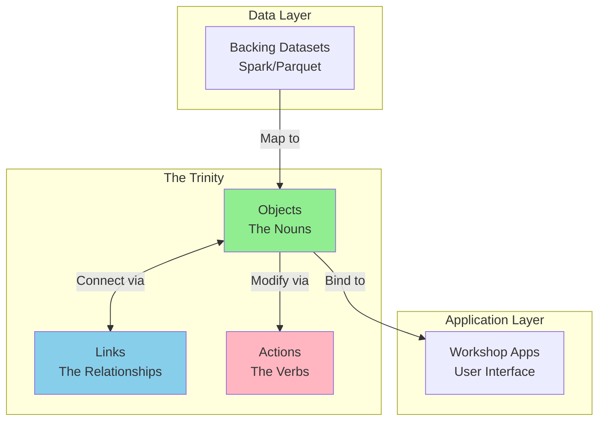
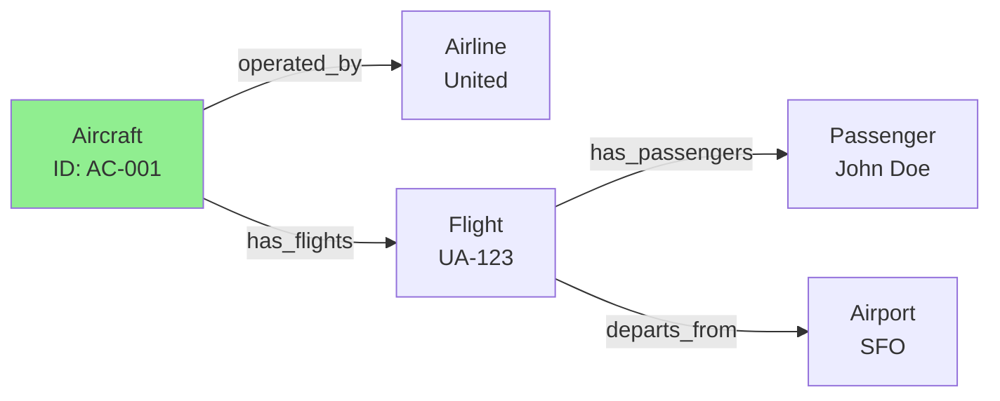
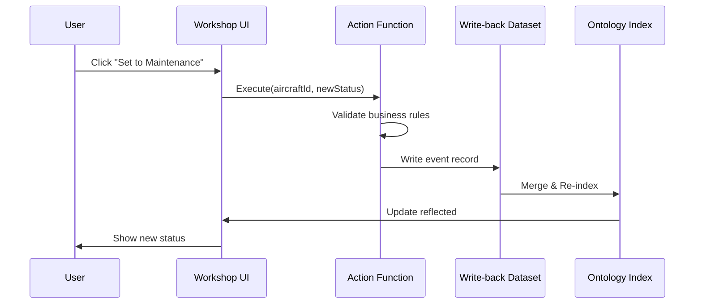

# 02. Case Study: Palantir Foundry (THE HOW)

> [!NOTE]
> **Goal**: Detailed technical analysis of how Palantir Foundry realizes the Ontology concept through the triad of Objects, Links, and Actions.

## 1. Overview: The Foundry Trinity

Palantir Foundry builds its Ontology around 3 core concepts (The Trinity): **Object**, **Link**, and **Action**.



---

## 2. Component 1: Objects & Object Types

### 2.1 Definition

In Foundry, an **Object Type** (e.g., `Aircraft`) is defined by mapping from a **Backing Dataset** (typically a cleaned Spark/Parquet dataset).

### 2.2 Structure of an Object Type

*   **Primary Key:** Each Object must have a unique UID.
*   **Title Property:** A display property (human-readable name).
*   **Properties Mapping:** Mapping from columns to properties.

**Example Mapping:**
```yaml
Object Type: Aircraft
Backing Dataset: cleaned_aircraft_data
Mappings:
  - Column: aircraft_id → Property: id (Primary Key)
  - Column: a_c_model → Property: model
  - Column: mfg_dt → Property: manufactureDate
  - Column: status_code → Property: status
```

### 2.3 The "Write-back" Mechanism

> [!IMPORTANT]
> **Special Note**: Objects are indexed into a dedicated database (Search Index + Graph Database) to serve ultra-fast queries, separate from the big data storage layer (Spark/Hadoop).

**Architecture:**
```
Raw Data (Hadoop) → ETL → Backing Dataset → Ontology Index
                                                     ↓
                                             Fast Query Layer
```

---

## 3. Component 2: Links (Graph Traversal)

### 3.1 Concept

Palantir does not use table `JOIN`s during every query. They define **Link Types** beforehand and use the **"Search Around"** feature to traverse the graph.

### 3.2 Graph Traversal Example



**Query Example:**
```
Start: Aircraft "AC-001"
→ Search Around "has_flights" 
→ Get all Flight objects
→ Search Around "has_passengers"
→ Get all Passenger objects

Result: List of passengers who flew on this aircraft
```

### 3.3 Technical Aspects

*   **Graph Traversal** is much more performant than joining multiple large SQL tables.
*   Pre-indexed relationships allow for fast "hops" between objects.
*   No need to write complex JOIN queries.

---

## 4. Component 3: Actions (The Kinetic Layer)

> [!IMPORTANT]
> **Actions** are the most critical component, transforming the Ontology from a "Read-only Catalog" into an "Operating System." This is the only way to modify data.

### 4.1 Structure of an Action



### 4.2 Components of an Action

1.  **Parameters:** Inputs
    ```typescript
    interface SetMaintenanceParams {
      aircraftId: string;
      newStatus: 'MAINTENANCE' | 'OPERATIONAL';
      reason: string;
      scheduledDate: Date;
    }
    ```

2.  **Logic (Functions):** Server-side code
    ```typescript
    function setMaintenanceStatus(params: SetMaintenanceParams) {
      // Validate
      if (params.scheduledDate < new Date()) {
        throw new Error("Cannot schedule in the past");
      }
      
      // Business logic
      cancelUpcomingFlights(params.aircraftId, params.scheduledDate);
      notifyMaintenanceCrew(params.aircraftId);
      
      // Write-back
      return {
        aircraftId: params.aircraftId,
        status: params.newStatus,
        updatedAt: new Date()
      };
    }
    ```

3.  **Side Effects (Write-back):**
    *   The system writes events into a "Write-back Dataset."
    *   This dataset is merged into the Ontology **immediately.**
    *   The user sees the updated status in real-time.

---

## 5. Dynamic Layer: Applications (Workshop)

Palantir solves application development with **Workshop** - a low-code platform that binds directly to the Ontology.

### 5.1 Object Set Concept

*   A screen does not load "data"; it loads an "Object Set."
*   Example: `Active Employees in Sales Dept`

### 5.2 Widget Binding

```
Table Widget → Bind to: Employee Object Set
Detail Widget → Bind to: Selected Employee
Button → Bind to: Action "Promote Employee"
```

### 5.3 Benefits

**Decoupling:**
```
DB Schema changes → Update Ontology mapping → Apps still work
(No code changes needed in Workshop)
```

**Reusability:**
```
Action "Promote Employee" defined once
→ Used in 10 different apps
→ Change logic once, all apps updated
```

---

## 6. Advanced Feature: Time Travel & Provenance

Since Foundry is built on a Big Data foundation (Spark), it supports **Provenance** (Data Flow).

**Capabilities:**
*   Review an Object's status at any point in time.
*   Traceability: Which user, which action, and when changed the `Maintenance Status` property.
*   Automatic audit trail for compliance.

---

## 7. Key Takeaways

- 🏗️ **Trinity Architecture**: Objects (data) + Links (relationships) + Actions (mutations)
- 🚀 **Performance**: Graph traversal is faster than SQL JOINs.
- 🔄 **Real-time**: The write-back mechanism allows for instant updates.
- 🎨 **Low-code**: Workshop apps bind directly to the Ontology.

> [!NOTE]
> **Technical Summary**: Palantir Foundry builds a Middleware layer (Ontology Service) with 4 steps: Ingest → Model → Index → Act.

## Related Documents
- **Previous**: [Ontology Concept](./01-concept-ontology.md)
- **Next**: [Strategic Value](./03-strategic-value.md)
- **Our Solution**: [Ontology-Driven Development](../03-Solution/07-concept-odd.md)

---

# 02. Case Study: Palantir Foundry (THE HOW) (Vietnamese Original)

> [!NOTE]
> **Mục tiêu**: Phân tích kỹ thuật chi tiết về cách Palantir Foundry hiện thực hóa khái niệm Ontology thông qua bộ ba Objects, Links, và Actions.

## 1. Overview: The Foundry Trinity

Palantir Foundry xây dựng Ontology xoay quanh 3 khái niệm cốt lõi (Trinity): **Object**, **Link**, và **Action**.


---

## 2. Component 1: Objects & Object Types

### 2.1 Định nghĩa

Trong Foundry, một **Object Type** (ví dụ: `Aircraft`) được định nghĩa bằng cách map (ánh xạ) từ một **Backing Dataset** (thường là Spark/Parquet dataset đã được làm sạch).

### 2.2 Cấu trúc của Object Type

*   **Primary Key:** Mỗi Object phải có một UID duy nhất
*   **Title Property:** Một thuộc tính hiển thị (human-readable name)
*   **Properties Mapping:** Ánh xạ từ columns sang properties

**Example Mapping:**
```yaml
Object Type: Aircraft
Backing Dataset: cleaned_aircraft_data
Mappings:
  - Column: aircraft_id → Property: id (Primary Key)
  - Column: a_c_model → Property: model
  - Column: mfg_dt → Property: manufactureDate
  - Column: status_code → Property: status
```

### 2.3 The "Write-back" Mechanism

> [!IMPORTANT]
> **Điểm đặc biệt**: Các Objects được đánh chỉ mục (indexed) vào một cơ sở dữ liệu chuyên dụng (Search Index + Graph Database) để phục vụ truy vấn cực nhanh, tách biệt khỏi lớp lưu trữ dữ liệu lớn (Spark/Hadoop).

**Architecture:**
```
Raw Data (Hadoop) → ETL → Backing Dataset → Ontology Index
                                                    ↓
                                            Fast Query Layer
```

---

## 3. Component 2: Links (Graph Traversal)

### 3.1 Khái niệm

Palantir không dùng `JOIN` bảng mỗi khi truy vấn. Họ định nghĩa **Link Types** trước và sử dụng tính năng **"Search Around"** để duyệt đồ thị.

### 3.2 Graph Traversal Example


**Query Example:**
```
Start: Aircraft "AC-001"
→ Search Around "has_flights" 
→ Get all Flight objects
→ Search Around "has_passengers"
→ Get all Passenger objects

Result: List of passengers who flew on this aircraft
```

### 3.3 Kỹ thuật

*   **Graph Traversal** hiệu năng cao hơn nhiều so với việc join nhiều bảng SQL lớn
*   Pre-indexed relationships cho phép "hop" nhanh giữa các objects
*   Không cần viết complex JOIN queries

---

## 4. Component 3: Actions (The Kinetic Layer)

> [!IMPORTANT]
> **Actions** là thành phần quan trọng nhất biến Ontology từ "Read-only Catalog" thành "Operating System". Đây là cách duy nhất để thay đổi dữ liệu.

### 4.1 Cấu trúc của một Action


### 4.2 Các thành phần của một Action

1.  **Parameters:** Đầu vào
    ```typescript
    interface SetMaintenanceParams {
      aircraftId: string;
      newStatus: 'MAINTENANCE' | 'OPERATIONAL';
      reason: string;
      scheduledDate: Date;
    }
    ```

2.  **Logic (Functions):** Đoạn mã chạy server-side
    ```typescript
    function setMaintenanceStatus(params: SetMaintenanceParams) {
      // Validate
      if (params.scheduledDate < new Date()) {
        throw new Error("Cannot schedule in the past");
      }
      
      // Business logic
      cancelUpcomingFlights(params.aircraftId, params.scheduledDate);
      notifyMaintenanceCrew(params.aircraftId);
      
      // Write-back
      return {
        aircraftId: params.aircraftId,
        status: params.newStatus,
        updatedAt: new Date()
      };
    }
    ```

3.  **Side Effects (Write-back):**
    *   Hệ thống ghi event vào "Write-back Dataset"
    *   Dataset này được merge vào Ontology **ngay lập tức**
    *   User thấy trạng thái cập nhật real-time

---

## 5. Dynamic Layer: Applications (Workshop)

Palantir giải quyết bài toán phát triển ứng dụng bằng công cụ **Workshop** - một low-code platform bind trực tiếp vào Ontology.

### 5.1 Object Set Concept

*   Một màn hình không load "dữ liệu", mà load một "Object Set"
*   Example: `Active Employees in Sales Dept`

### 5.2 Widget Binding

```
Table Widget → Bind to: Employee Object Set
Detail Widget → Bind to: Selected Employee
Button → Bind to: Action "Promote Employee"
```

### 5.3 Lợi ích

**Decoupling:**
```
DB Schema changes → Update Ontology mapping → Apps still work
(No code changes needed in Workshop)
```

**Reusability:**
```
Action "Promote Employee" defined once
→ Used in 10 different apps
→ Change logic once, all apps updated
```

---

## 6. Advanced Feature: Time Travel & Provenance

Do Foundry xây dựng trên nền tảng Big Data (Spark), nó hỗ trợ tính năng **Provenance** (Dòng chảy dữ liệu).

**Capabilities:**
*   Xem lại trạng thái của Object tại bất kỳ thời điểm nào
*   Truy vết: Property `Maintenance Status` đã bị thay đổi bởi Action nào, User nào, lúc nào
*   Audit trail tự động cho compliance

---

## 7. Key Takeaways (Điểm Chính)

- 🏗️ **Trinity Architecture**: Objects (data) + Links (relationships) + Actions (mutations)
- 🚀 **Performance**: Graph traversal nhanh hơn SQL JOINs
- 🔄 **Real-time**: Write-back mechanism cho phép update tức thì
- 🎨 **Low-code**: Workshop apps bind trực tiếp vào Ontology

> [!NOTE]
> **Tóm tắt kỹ thuật**: Palantir Foundry xây dựng một lớp Middleware (Ontology Service) với 4 bước: Ingest → Model → Index → Act.

## Related Documents
- **Previous**: [Ontology Concept](./01-concept-ontology.md)
- **Next**: [Strategic Value](./03-strategic-value.md)
- **Our Solution**: [Ontology-Driven Development](../03-Solution/07-concept-odd.md)

