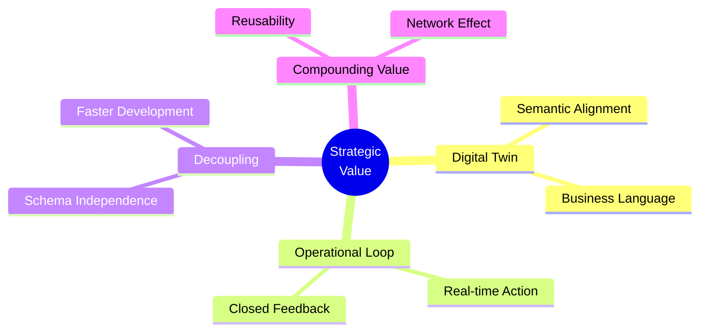
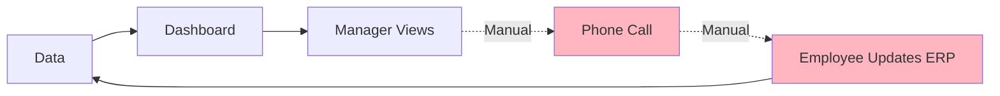
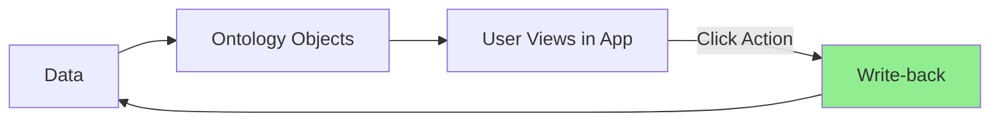
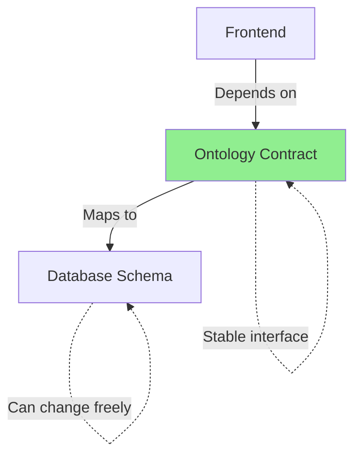
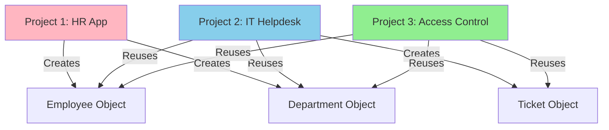

# 03. Strategic Value (THE WHY)

> [!NOTE]
> **Goal**: Analyze the strategic values of the Ontology model - why modern engineering organizations choose this path over traditional CRUD.

## 1. Overview: The Strategic Imperative

Why do Palantir (and modern engineering organizations) choose this complex path instead of just building traditional CRUD applications on top of Databases?



---

## 2. Value 1: The "Digital Twin" Vision

### 2.1 The Problem: The Semantic Gap

> [!WARNING]
> The **Semantic Gap** between IT and Business is the primary cause of misunderstandings and failures in software projects.

**The Problem:**
```
IT View:          Business View:
TBL_HR_01         "Employee A"
TBL_LOG_2024      "Recruitment Process"
FK_DEPT_ID        "In Sales Department"
```

### 2.2 The Solution: Ontology as a Common Language

The software system speaks the same language as the Business:
*   Business: "The aircraft is under maintenance"
*   System: Object `Aircraft` with `status = 'MAINTENANCE'`
*   **No translation needed**

**Example:**
```typescript
// Traditional approach (Technical language)
SELECT * FROM aircraft_tbl WHERE status_cd = 'M'

// Ontology approach (Business language)
getAircraft().filter(a => a.status === 'MAINTENANCE')
```

---

## 3. Value 2: Operational Loop

### 3.1 Traditional BI: Analytical Only

Most traditional BI systems stop at **Analytical**.



**The Problem:** The loop is slow, fragmented, and dependent on human intervention.

### 3.2 Ontology: Operational Intelligence



**New Process:**
1.  Data → Ontology Object
2.  User views on App
3.  User triggers **Action** directly on the App
4.  Ontology updates instantly

> [!IMPORTANT]
> **Value**: Transforms data from "Post-hoc" (looking back at the past) into "Real-time" (immediate action).

---

## 4. Value 3: Decoupling & Agility

### 4.1 The Problem: Schema Rigidity

In traditional development, the UI is tightly bound to the DB Schema:

```
DB Schema Change → API Breaks → Frontend Breaks → Cascade Failure
```

**Example:**
```sql
-- Week 1: Column name
ALTER TABLE employees RENAME COLUMN emp_name TO employee_name;

-- Result: 50 API endpoints break, 100 UI components break
```

### 4.2 The Solution: Ontology as a Stable Contract



**Benefits:**
*   Data Engineers can refactor the DB freely.
*   App Developers are not affected.
*   Only the mapping layer needs updating.

**Example:**
```typescript
// Frontend code (unchanged)
employee.name  // Always works

// Backend mapping (flexible)
// Week 1: maps to DB column "emp_name"
// Week 2: maps to DB column "employee_name"
// Week 3: maps to API call to an external service
```

### 4.3 Impact: Faster Time-to-Market

> [!NOTE]
> **Result**: Application development speed skyrockets. New applications can be assembled from existing Objects in hours instead of weeks.

---

## 5. Value 4: Compounding Value

When building with an Ontology-driven approach, the system's value increases exponentially, not linearly.



**Timeline:**
*   **Project 1 (HR App):** Effort spent building `Employee`, `Department` (4 weeks)
*   **Project 2 (IT Helpdesk):** Reuses 2 objects, only builds `Ticket` (2 weeks)
*   **Project 3 (Access Control):** Reuses all 3, only configures (3 days)

**Formula:**
```
Marginal Cost(n) = Initial Cost / n
→ As n increases, cost approaches 0
```

---

## 6. Key Takeaways

- 🌐 **Digital Twin**: Systems speak the language of Business, no translation needed.
- ⚡ **Operational Loop**: From "Viewing reports" → "Immediate action".
- 🔓 **Decoupling**: Schema changes do not break applications.
- 📈 **Compounding Value**: The more you build, the lower the marginal cost.

> [!NOTE]
> **Conclusion**: Ontology is not meant to complicate issues, but to create stability and sustainable development speed in the long term.

## Related Documents
- **Previous**: [Palantir Foundry Case Study](./02-case-study-palantir-foundry.md)
- **Our Solution**: [Ontology-Driven Development](../03-Solution/07-concept-odd.md)
- **Pain Points**: [Why Current Methods Fail](../02-Pain-Points/04-product-development-pain-points.md)

---

# 03. Strategic Value (THE WHY) (Vietnamese Original)

> [!NOTE]
> **Mục tiêu**: Phân tích các giá trị chiến lược của mô hình Ontology - tại sao các tổ chức engineering hiện đại chọn hướng đi này thay vì CRUD truyền thống.

## 1. Overview: The Strategic Imperative

Tại sao Palantir (và các tổ chức engineering hiện đại) lại chọn hướng đi phức tạp này thay vì chỉ xây dựng các ứng dụng CRUD truyền thống trên nền Database?


---

## 2. Value 1: The "Digital Twin" Vision

### 2.1 Vấn đề: The Semantic Gap

> [!WARNING]
> **Khoảng cách ngữ nghĩa** (Semantic Gap) giữa IT và Business là nguyên nhân chính gây ra sự hiểu lầm và thất bại trong dự án phần mềm.

**The Problem:**
```
IT View:          Business View:
TBL_HR_01         "Nhân viên A"
TBL_LOG_2024      "Quy trình tuyển dụng"
FK_DEPT_ID        "Thuộc phòng Sales"
```

### 2.2 Giải pháp: Ontology as Common Language

Hệ thống phần mềm nói cùng ngôn ngữ với Business:
*   Business: "Máy bay đang bảo trì"
*   System: Object `Aircraft` với `status = 'MAINTENANCE'`
*   **Không cần phiên dịch**

**Example:**
```typescript
// Traditional approach (Technical language)
SELECT * FROM aircraft_tbl WHERE status_cd = 'M'

// Ontology approach (Business language)
getAircraft().filter(a => a.status === 'MAINTENANCE')
```

---

## 3. Value 2: Operational Loop (Vòng lặp vận hành)

### 3.1 Traditional BI: Analytical Only

Hầu hết các hệ thống BI truyền thống chỉ dừng lại ở **Analytical** (Phân tích).


**Vấn đề:** Vòng lặp chậm, đứt gãy, phụ thuộc vào con người.

### 3.2 Ontology: Operational Intelligence


**Quy trình mới:**
1.  Dữ liệu → Ontology Object
2.  User xem trên App
3.  User kích hoạt **Action** ngay trên App
4.  Ontology cập nhật tức thì

> [!IMPORTANT]
> **Giá trị**: Biến dữ liệu từ "Hậu kỳ" (nhìn lại quá khứ) thành "Thời gian thực" (hành động ngay lập tức).

---

## 4. Value 3: Decoupling & Agility

### 4.1 Vấn đề: Schema Rigidity

Trong phát triển truyền thống, UI binding chặt chẽ vào DB Schema:

```
DB Schema Change → API Breaks → Frontend Breaks → Cascade Failure
```

**Example:**
```sql
-- Week 1: Column name
ALTER TABLE employees RENAME COLUMN emp_name TO employee_name;

-- Result: 50 API endpoints break, 100 UI components break
```

### 4.2 Giải pháp: Ontology as Stable Contract


**Benefits:**
*   Data Engineers refactor DB thoải mái
*   App Developers không bị ảnh hưởng
*   Chỉ cần update mapping layer

**Example:**
```typescript
// Frontend code (unchanged)
employee.name  // Always works

// Backend mapping (flexible)
// Week 1: maps to DB column "emp_name"
// Week 2: maps to DB column "employee_name"
// Week 3: maps to API call to external service
```

### 4.3 Impact: Faster Time-to-Market

> [!NOTE]
> **Kết quả**: Tốc độ phát triển ứng dụng tăng vọt. Các ứng dụng mới có thể được lắp ghép từ các Objects có sẵn trong vài giờ thay vì vài tuần.

---

## 5. Value 4: Compounding Value (Giá trị tích lũy)

Khi xây dựng theo hướng Ontology, giá trị của hệ thống tăng theo hàm mũ, không phải tuyến tính.


**Timeline:**
*   **Dự án 1 (HR App):** Tốn công xây dựng `Employee`, `Department` (4 weeks)
*   **Dự án 2 (IT Helpdesk):** Tái sử dụng 2 objects, chỉ xây `Ticket` (2 weeks)
*   **Dự án 3 (Access Control):** Tái sử dụng cả 3, chỉ config (3 days)

**Formula:**
```
Marginal Cost(n) = Initial Cost / n
→ As n increases, cost approaches 0
```

---

## 6. Key Takeaways (Điểm Chính)

- 🌐 **Digital Twin**: Hệ thống nói ngôn ngữ Business, không cần phiên dịch
- ⚡ **Operational Loop**: Từ "Xem báo cáo" → "Hành động tức thì"
- 🔓 **Decoupling**: Schema thay đổi không làm hỏng ứng dụng
- 📈 **Compounding Value**: Càng làm nhiều, chi phí biên càng giảm

> [!NOTE]
> **Kết luận**: Ontology không phải để làm phức tạp vấn đề, mà để tạo ra sự ổn định và tốc độ phát triển bền vững trong dài hạn.

## Related Documents
- **Previous**: [Palantir Foundry Case Study](./02-case-study-palantir-foundry.md)
- **Our Solution**: [Ontology-Driven Development](../03-Solution/07-concept-odd.md)
- **Pain Points**: [Why Current Methods Fail](../02-Pain-Points/04-product-development-pain-points.md)

