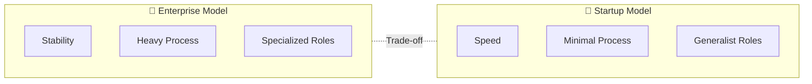
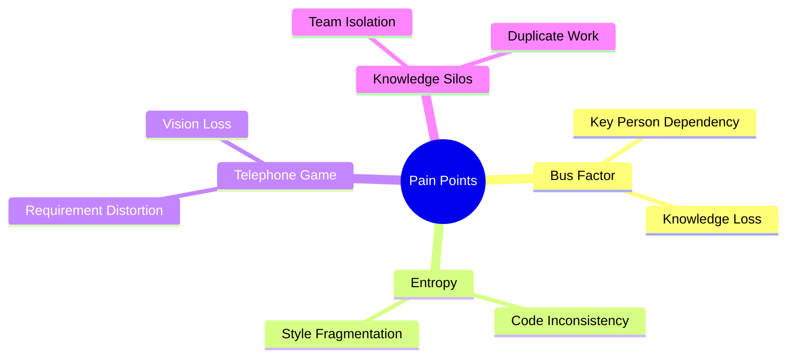
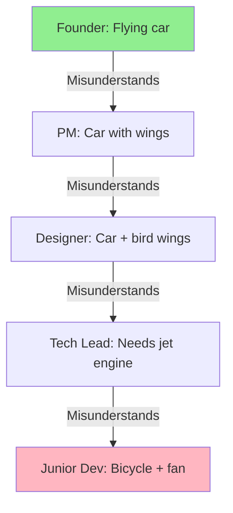
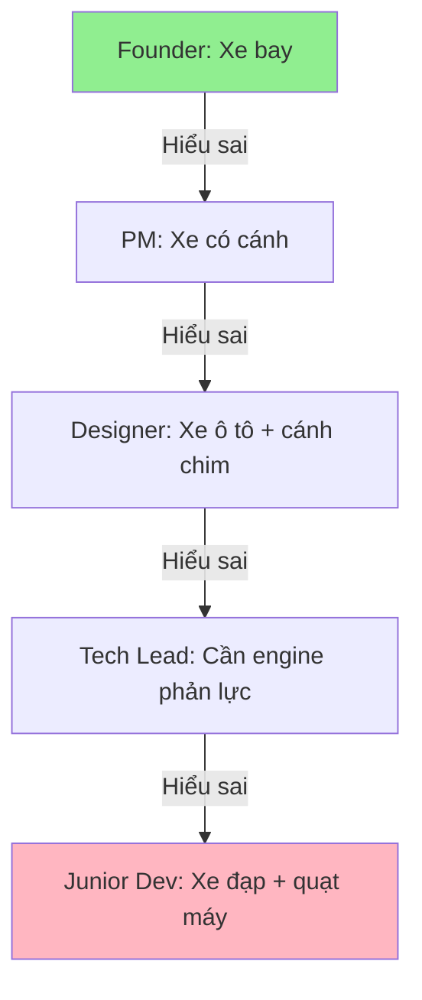

# 04. Product Development Models Analysis

> [!NOTE]
> **Goal**: Analyze the differences between Enterprise and Startup models, and expose the core "pain points" in knowledge management and consistency during long-term software product development.

## 1. Overview: Two Extremes of Product Development

Not every "Product" is built the same way. There are two common models with completely opposite cultures and processes:



---

## 2. The Enterprise Model

Characterized by stability, large scale, and high specialization.

### 2.1 Key Characteristics

*   **Structure:** Teams are organized in a Matrix. A Developer reports to an Engineering manager (people side) and a Product Owner (work side).
*   **Roles:** Very clear and specialized.
    *   **Architect:** Draws diagrams, rarely codes, focuses on high-level design.
    *   **DevOps:** Handles infrastructure; Devs aren't allowed to touch Production.
    *   **QA/QC:** A separate team to catch bugs.
*   **Process:** Heavy but safe.
    *   Every change must go through a **Change Request (CR)**.
    *   **ADR (Architecture Decision Records)** must be written before choosing new technologies.
    *   Multi-layered code reviews (Peer review, Tech Lead review).

### 2.2 Trade-offs

| Pros | Cons |
|---------|------------|
| ✅ Stable system, few silly mistakes | ❌ Sluggish speed |
| ✅ Good scalability | ❌ Takes 2 weeks just to change a button color |
| ✅ Comprehensive documentation | ❌ Kills innovation |

---

## 3. The Startup/Agile Model

Characterized by speed, chaos, and a "Move Fast and Break Things" spirit.

### 3.1 Key Characteristics

*   **Structure:** Small, cross-functional teams (Scrum teams, Squads).
*   **Roles:** Blurred; everyone wears many hats.
    *   **Full-stack Developer:** Does everything from Frontend to Backend to DB deployment.
    *   **Founder/CTO:** Meets clients and then fixes bugs at midnight.
*   **Process:** Persistent minimalism.
    *   15-minute Daily Standups.
    *   Deploying to Production multiple times a day (CI/CD).
    *   "Done is better than perfect."

### 3.2 Trade-offs

| Pros | Cons |
|---------|------------|
| ✅ Extremely fast | ❌ Massive **Technical Debt** |
| ✅ Instant market response | ❌ "Spaghetti" code |
| ✅ High flexibility | ❌ System easily collapses under scale |

---

## 4. Pain Points: Why do teams fail?

Regardless of the model, product development teams face these challenging issues:



### 4.1 The "Bus Factor" & Brain Drain

> [!WARNING]
> **Severe Risk**: If a core knowledge holder leaves, the project can become completely paralyzed.

*   **The Issue:** In every project, there are always 1-2 "stars" (Key Persons) who hold a thorough Mental Model of the system logic in their heads.
*   **The Risk:** If this person is "hit by a bus" (or simply quits), the project is paralyzed.
*   **The Cause:**
    *   Knowledge is Implicit (in heads), not Explicit (in documents).
    *   Code is too complex for newcomers to understand quickly.
    *   Missing or outdated documentation.

**Real-world Example:**
```
Scenario: A Senior Dev leaves
- Week 1: Team panics; no one knows how the Payment module works.
- Week 2: Junior Dev reads the code, doesn't understand the logic.
- Week 3: Must hire a consultant at 3x the cost to reverse-engineer.
- Result: Lost 1 month + $30K just to understand old code.
```

### 4.2 The "Consistency vs. Entropy" War

> [!IMPORTANT]
> **Law of Software Entropy**: "Software tends to become chaotic over time if there is no counter-force."

*   **The Decay Timeline:**
    *   **Month 1**: Dev A writes code in Style X (camelCase, functional).
    *   **Month 2**: Dev B joins, prefers Style Y (snake_case, OOP).
    *   **Month 3**: Dev A leaves, Dev C joins, mixes in Style Z (kebab-case, procedural).
    *   **Result**: After 1 year, the codebase looks like a "Frankenstein monster."

*   **The Challenge**: How to make 50 Developers write code that looks like it was written by a single person?

**Code Example (Bad):**
```typescript
// File 1 (by Dev A)
const getUserData = async (userId: string) => { ... }

// File 2 (by Dev B)
function get_user_profile(user_id: number) { ... }

// File 3 (by Dev C)
class UserService {
  fetchUserInfo(id) { ... }
}
```

### 4.3 The "Telephone Game"

Information becomes distorted as it passes through layers of communication:



**The Consequence:** The final product meets the "Specs" (as understood by Devs) but completely misses the "Vision" (of the Founder).

### 4.4 Knowledge Silos

*   The Backend team doesn't know what the Frontend team is doing.
*   The Sales team promises features to clients that the Tech team has never heard of.
*   Knowledge is isolated in small groups, leading to:
    *   Building duplicate features.
    *   Conflicts during integration.
    *   Wasted time on re-work.

---

## 5. Key Takeaways

- ⚖️ **Inevitable Trade-offs**: Enterprise is too rigid; Startup is too loose.
- 🧠 **Knowledge Management** is the core issue, not Technology.
- 📉 **Entropy** is the natural enemy of every codebase.
- 🔗 **Communication Gaps** cause more errors than technical bugs.

> [!NOTE]
> **Insight**: The difficulty of product development is not in writing code, but in **maintaining consistency** and **transferring knowledge** over time and through people.

## Related Documents
- **Next**: [Project-Based Workflows](./05-project-based-workflow-analysis.md)
- **Solution**: [Ontology-Driven Development](../03-Solution/07-concept-odd.md)

---

# 04. Phân tích Mô hình Phát triển Sản phẩm (Product Development Models) (Vietnamese Original)

> [!NOTE]
> **Mục tiêu**: Phân tích sự khác biệt giữa mô hình Enterprise và Startup, đồng thời vạch trần các "điểm đau" cốt tử trong việc quản lý tri thức và tính nhất quán khi phát triển sản phẩm phần mềm dài hạn.

## 1. Overview: Hai thái cực của Phát triển Sản phẩm

Không phải mọi "Sản phẩm" đều được xây dựng giống nhau. Có hai mô hình phổ biến với văn hóa và quy trình hoàn toàn trái ngược:


---

## 2. The Enterprise Model (Mô hình Doanh nghiệp lớn)

Đặc trưng bởi sự ổn định, quy mô lớn và tính chuyên môn hóa cao.

### 2.1 Đặc điểm chính

*   **Structure (Cấu trúc):** Team được tổ chức theo Ma trận (Matrix). Một Developer báo cáo cho Engineering Manager (về con người) và Product Owner (về công việc).
*   **Roles (Vai trò):** Rất rõ ràng và chuyên môn hóa.
    *   **Architect:** Người vẽ sơ đồ, ít khi code, tập trung vào high-level design.
    *   **DevOps:** Người lo hạ tầng, Dev không được chạm vào Production.
    *   **QA/QC:** Team riêng biệt để bắt lỗi.
*   **Process (Quy trình):** Nặng nề nhưng an toàn.
    *   Mọi thay đổi phải qua **Change Request (CR)**.
    *   Phải viết **ADR (Architecture Decision Records)** trước khi chọn công nghệ mới.
    *   Review code qua nhiều lớp (Peer review, Tech Lead review).

### 2.2 Trade-offs

| Ưu điểm | Nhược điểm |
|---------|------------|
| ✅ Hệ thống ổn định, ít lỗi ngớ ngẩn | ❌ Tốc độ chậm (Sluggish) |
| ✅ Khả năng mở rộng (Scale) tốt | ❌ Mất 2 tuần chỉ để đổi màu nút bấm |
| ✅ Documentation đầy đủ | ❌ Giết chết sáng tạo (Innovation) |

---

## 3. The Startup/Agile Model (Mô hình Khởi nghiệp)

Đặc trưng bởi tốc độ, sự hỗn loạn và tinh thần "Move Fast and Break Things".

### 3.1 Đặc điểm chính

*   **Structure:** Team nhỏ (Scrum team, Squad), đa năng (Cross-functional).
*   **Roles:** Mờ nhạt, ai cũng làm được nhiều việc.
    *   **Full-stack Developer:** Làm tất cả từ Frontend, Backend đến Deploy DB.
    *   **Founder/CTO:** Vừa đi gặp khách hàng, vừa về fix bug lúc nửa đêm.
*   **Process:** Tối giản.
    *   Daily Standup 15 phút.
    *   Deploy lên Production nhiều lần trong ngày (CI/CD).
    *   "Done is better than perfect".

### 3.2 Trade-offs

| Ưu điểm | Nhược điểm |
|---------|------------|
| ✅ Tốc độ cực nhanh | ❌ **Technical Debt** khổng lồ |
| ✅ Phản ứng tức thời với thị trường | ❌ Code "Spaghetti" (rối rắm) |
| ✅ Linh hoạt cao | ❌ Hệ thống dễ sập khi scale |

---

## 4. Pain Points: Tại sao các team thất bại?

Dù theo mô hình nào, các team phát triển sản phẩm đều gặp phải những vấn đề nan giải sau đây:


### 4.1 The "Bus Factor" & Brain Drain

> [!WARNING]
> **Rủi ro nghiêm trọng**: Nếu người nắm giữ kiến thức cốt lõi rời đi, dự án có thể tê liệt hoàn toàn.

*   **Vấn đề:** Trong mọi dự án, luôn có 1-2 "ngôi sao" (Key Person) nắm giữ tường tận logic hệ thống trong đầu họ (Mental Model).
*   **Rủi ro:** Nếu người này bị "xe bus tông" (hoặc đơn giản là nghỉ việc), dự án tê liệt.
*   **Nguyên nhân:** 
    *   Kiến thức nằm trong đầu (Implicit Knowledge), không nằm trong tài liệu (Explicit Knowledge)
    *   Code quá phức tạp để người mới có thể hiểu nhanh
    *   Thiếu documentation hoặc documentation lỗi thời

**Ví dụ thực tế:**
```
Scenario: Senior Dev nghỉ việc
- Week 1: Team hoảng loạn, không ai biết module Payment hoạt động thế nào
- Week 2: Junior Dev đọc code, không hiểu logic
- Week 3: Phải hire consultant với giá gấp 3 lần để reverse-engineer
- Result: Mất 1 tháng + $30K chỉ để hiểu lại code cũ
```

### 4.2 The "Consistency vs. Entropy" War

> [!IMPORTANT]
> **Định luật Entropy phần mềm**: "Phần mềm có xu hướng trở nên hỗn loạn theo thời gian nếu không có tác động ngược lại."

*   **Timeline của sự suy thoái:**
    *   **Tháng 1**: Dev A viết code theo style X (camelCase, functional)
    *   **Tháng 2**: Dev B vào, thích style Y (snake_case, OOP)
    *   **Tháng 3**: Dev A nghỉ, Dev C vào, trộn style Z (kebab-case, procedural)
    *   **Kết quả**: Sau 1 năm, Codebase trông như một bãi rác (Frankenstein monster)

*   **Thách thức**: Làm sao để 50 Developers viết code giống như được viết bởi 1 người duy nhất?

**Code Example (Bad):**
```typescript
// File 1 (by Dev A)
const getUserData = async (userId: string) => { ... }

// File 2 (by Dev B)
function get_user_profile(user_id: number) { ... }

// File 3 (by Dev C)
class UserService {
  fetchUserInfo(id) { ... }
}
```

### 4.3 The "Telephone Game" (Tam sao thất bản)

Thông tin bị méo mó khi đi qua các tầng lớp giao tiếp:



**Hậu quả:** Sản phẩm làm ra đúng "Spec" (theo cách hiểu của Dev) nhưng sai hoàn toàn "Vision" (của Founder).

### 4.4 Knowledge Silos (Hốc đảo tri thức)

*   Team Backend không biết Frontend làm gì
*   Team Sales hứa với khách hàng những tính năng mà Team Tech chưa hề nghe nói tới
*   Kiến thức bị cô lập trong các nhóm nhỏ, dẫn đến:
    *   Xây dựng các tính năng trùng lặp
    *   Xung đột khi integrate
    *   Mất thời gian re-work

---

## 5. Key Takeaways (Điểm Chính)

- ⚖️ **Trade-off không tránh khỏi**: Enterprise quá cứng nhắc, Startup quá lỏng lẻo
- 🧠 **Knowledge Management** là vấn đề cốt lõi, không phải Technology
- 📉 **Entropy** là kẻ thù tự nhiên của mọi codebase
- 🔗 **Communication Gap** gây ra nhiều lỗi hơn cả bug kỹ thuật

> [!NOTE]
> **Insight**: Sự khó khăn của làm Product không nằm ở việc viết code, mà nằm ở việc **duy trì sự nhất quán** và **truyền tải tri thức** qua thời gian và qua con người.

## Related Documents
- **Next**: [Project-Based Workflows](./05-project-based-workflow-analysis.md)
- **Solution**: [Ontology-Driven Development](../03-Solution/07-concept-odd.md)

