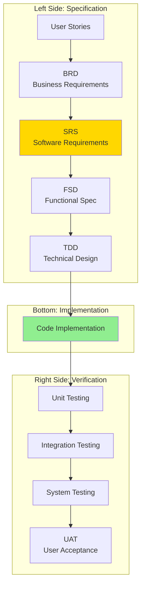
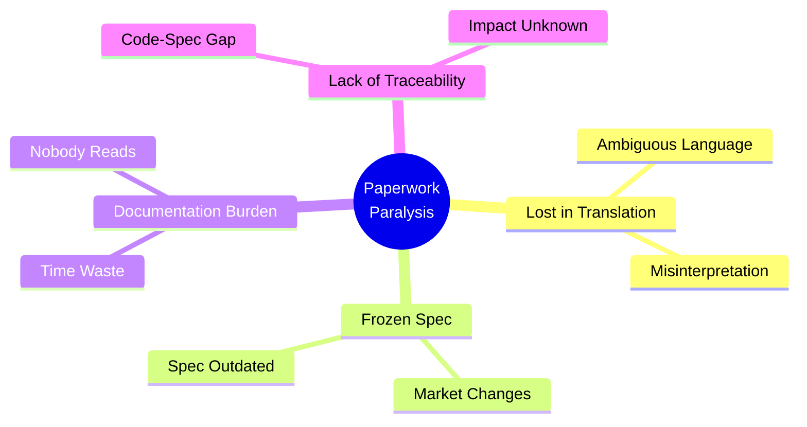

# 05. Phân tích Quy trình Dự án (Project-Based Workflows)

> [!NOTE]
> **Mục tiêu**: Phân tích mô hình phát triển theo Dự án (Outsourcing, Client Projects) với quy trình chuyển giao ý tưởng từ "Khách hàng" sang "Đội ngũ thực thi" thông qua chuỗi tài liệu dày đặc (BRD -> SRS -> Code).

## 1. Overview: The Waterfall V-Model

Mô hình này thường đi theo dạng thác nước (Waterfall) hoặc V-Model, ngay cả khi team tuyên bố họ làm Agile.



---

## 2. The Standard Workflow (Quy trình chuẩn)

### Step 1: User Stories / Requirements Gathering
*   **Input:** Khách hàng nói "Tôi muốn quản lý nhân sự".
*   **Activity:** Business Analyst (BA) phỏng vấn, ghi chép.
*   **Output:** **User Stories** 
    ```
    Là HR manager, tôi muốn xem danh sách nhân viên 
    để có thể quản lý thông tin cơ bản của họ.
    ```

### Step 2: BRD (Business Requirement Document)
*   **Mục tiêu:** Định nghĩa cái **WHAT** (Cái gì) ở mức độ kinh doanh.
*   **Nội dung:** 
    *   Phạm vi dự án (Scope)
    *   Mục tiêu kinh doanh
    *   Các quy trình nghiệp vụ (Business Flows)
    *   Ràng buộc (Constraints)
*   **Đối tượng đọc:** Stakeholders, Project Managers

### Step 3: SRS (Software Requirements Specification) - "Kinh thánh của dự án"

> [!IMPORTANT]
> **SRS** là tài liệu quan trọng nhất, thường được dùng để ký hợp đồng (Sign-off). Mọi thay đổi sau này đều phải qua Change Request (CR) tốn kém.

*   **Mục tiêu:** Chuyển hóa Business thành **System Requirement**.
*   **Nội dung:**
    *   **Functional Requirements (FR)**: Hệ thống phải làm gì (Input, Output, Validation)
    *   **Non-Functional Requirements (NFR)**: Performance, Security, Scalability
    *   **Use Cases** chi tiết với flow diagrams

**Example SRS Section:**
```
FR-001: Employee List Display
- System SHALL display a paginated list of employees
- Each row SHALL show: ID, Name, Department, Status
- Default page size: 20 items
- Response time: < 2 seconds for 10,000 records
```

### Step 4: FSD (Functional Specification Document) & Design
*   **Mục tiêu:** Định nghĩa cái **HOW** (Như thế nào) ở mức độ giao diện và hành vi.
*   **Nội dung:** 
    *   Wireframes, Mockups
    *   Sơ đồ màn hình (Screen Flow)
    *   Logic chi tiết của từng nút bấm

### Step 5: TDD (Technical Design Document)
*   **Mục tiêu:** Dành cho Developer.
*   **Nội dung:** 
    *   Database Schema (ERD)
    *   API Specification (Swagger/OpenAPI)
    *   Class Diagrams, Sequence Diagrams

---

## 3. Pain Points: "Paperwork Paralysis" (Sự tê liệt vì giấy tờ)

Mặc dù quy trình trên trông rất chặt chẽ, nhưng thực tế triển khai thường gặp vô số vấn đề:



### 3.1 The "Lost in Translation" Gap (Khe hở dịch thuật)

> [!WARNING]
> Ngôn ngữ tự nhiên (Tiếng Việt/Anh) rất đa nghĩa (ambiguous). Một câu "Hệ thống phải nhanh" có thể được hiểu theo 10 cách khác nhau.

**Ví dụ thực tế:**
```
BRD: "System must be fast"
↓ (BA interprets)
SRS: "Response time < 3 seconds"
↓ (Dev interprets)
Code: setTimeout(() => showLoader(), 3000) // Wrong!
```

*   Từ **BRD** sang **SRS**: BA hiểu sai ý Khách hàng
*   Từ **SRS** sang **Code**: Dev hiểu sai ý BA
*   **Kết quả**: Sản phẩm sai lệch hoàn toàn so với mong đợi ban đầu

### 3.2 The "Frozen Spec" Fallacy (Ảo tưởng về Spec chết)

*   **Thực tế:** Các dự án thường bắt ký chốt (Sign-off) SRS từ đầu dự án (tháng 1).
*   **Vấn đề:** Khi Dev bắt đầu code (tháng 3), họ mới phát hiện ra:
    *   Logic trong SRS là bất khả thi
    *   Thiếu sót quan trọng
    *   Thị trường đã thay đổi (competitor ra tính năng mới)

*   **Hậu quả:**
    *   **Option 1**: Làm sai (để đúng Spec đã ký) → Sản phẩm vô dụng
    *   **Option 2**: Làm Change Request (CR) → Tốn kém, mất thời gian, mất lòng tin
    *   **Option 3**: Code khác, không update Spec → Tài liệu vô dụng

**Timeline Example:**
```
Month 1: SRS signed (Feature A, B, C)
Month 3: Dev starts, discovers Feature B is impossible
Month 4: CR submitted, waiting approval
Month 5: CR rejected (out of budget)
Month 6: Deliver without Feature B, customer angry
```

### 3.3 Documentation vs. Delivery (Tài liệu hay Sản phẩm?)

*   Team mất quá nhiều thời gian để viết và format tài liệu cho đẹp để "lấy tiền" khách hàng
*   Tài liệu thường quá dài (hàng trăm trang), không ai (kể cả Dev) có đủ kiên nhẫn đọc hết
*   Họ chỉ hỏi miệng hoặc đoán mò

**Statistics (from experience):**
- 📄 Average SRS length: 150-300 pages
- 👀 Percentage actually read: < 20%
- ⏱️ Time spent writing: 2-4 weeks
- 🔄 Time spent updating: 0 (never updated)

### 3.4 Lack of Traceability (Thiếu khả năng truy vết)

**Typical conversation:**
```
Customer: "Tại sao màn hình này lại có nút bấm này?"
Dev: "Em thấy Design vẽ thế."
Designer: "Em thấy SRS ghi thế."
BA: "Em không nhớ, chắc lúc họp khách hàng nói thế."
```

> [!CAUTION]
> **Vấn đề nghiêm trọng**: Không có đường dây liên kết (Link) từ dòng Code → Design → Requirement → Business Goal ban đầu. Khi sửa một Requirement, không biết phải sửa những dòng code nào.

---

## 4. Real-world Example: E-commerce Project Failure

**Case Study:**
```
Project: Build e-commerce platform
Timeline: 12 months
Budget: $500K

Month 1-2: Write BRD, SRS (200 pages)
Month 3-4: Design UI/UX
Month 5-10: Development
Month 11: Testing discovers: Payment gateway integration 
         was never specified in SRS
Month 12: Rush to add feature, bugs everywhere
Result: Launch delayed 6 months, over budget $200K
```

**Root Cause:** SRS was "frozen" at Month 2, no mechanism to evolve it.

---

## 5. Key Takeaways (Điểm Chính)

- 📝 **Heavy Documentation ≠ Clear Communication**: 200 trang SRS không đảm bảo sự hiểu biết chung
- 🧊 **Frozen Specs are Fiction**: Thị trường thay đổi, yêu cầu phải thay đổi theo
- 🔗 **Traceability is Critical**: Cần link từ Code → Requirement → Business Goal
- ⚖️ **Balance needed**: Giữa tính chặt chẽ (Rigor) và tính linh hoạt (Agility)

> [!NOTE]
> **Câu hỏi đặt ra**: Liệu có cách nào để tài liệu (Specification) trở nên "Sống" (Living Documentation) và gắn liền với Code hơn không? → Xem [The Living Spec](../03-Solution/08-the-living-spec.md)

## Related Documents
- **Previous**: [Product Development Models](./04-product-development-pain-points.md)
- **Next**: [AI Era Challenges](./06-ai-era-challenges.md)
- **Solution**: [The Living Spec](../03-Solution/08-the-living-spec.md)
