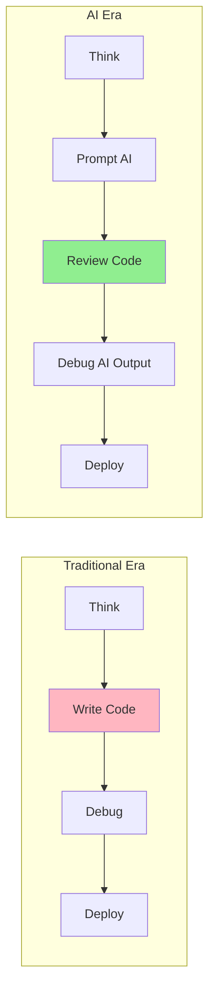
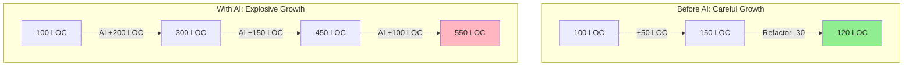
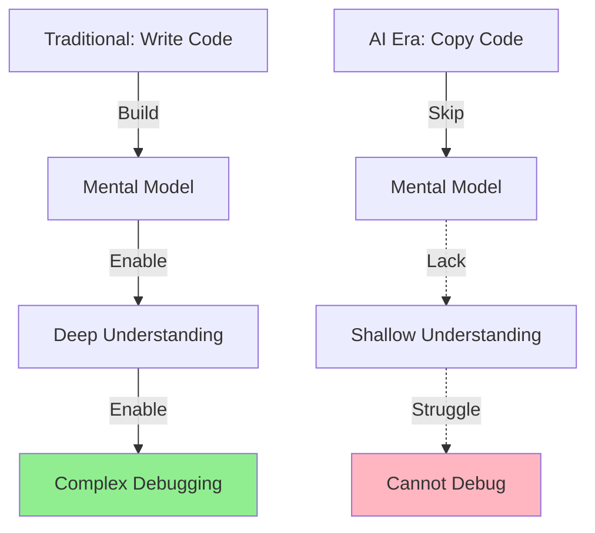

# 06. The AI Era Challenges

> [!NOTE]
> **Goal**: Analyze the impact of GenAI and Coding Assistants on the software development process, focusing on new risks such as Code Bloat, Knowledge Atrophy, and the "Senior Syntax - Junior Logic" trap.

## 1. Overview: The Paradigm Shift

The rise of GenAI (Generative AI) and Coding Assistants (Copilot, Cursor, Windsurf) is changing the software development game faster than any period in history.



### New Context: "Code is Cheap"

*   **Then**: Writing code was the most time-consuming and brain-intensive stage. Code was a valuable asset.
*   **Now**: AI can generate thousands of lines of code in seconds. Code has become a commodity.

> [!IMPORTANT]
> **Role Shift**: Developers are transitioning from "Writers" to "Reviewers/Auditors."

---

## 2. New Pain Points

### 2.1 Code Bloat & Maintenance Nightmare

**The Issue:** Because generating code is so easy, developers tend to overdo it. Instead of refactoring for conciseness, they ask AI to "write one more function" to patch an error.



**Consequences:**
*   Codebases bloat out of control.
*   Lines of Code (LOC) skyrocket while business logic remains the same.
*   More code = More bugs = Harder maintenance.

**Real Example:**
```typescript
// Before AI (Clean)
function calculateDiscount(price: number, userTier: 'gold' | 'silver'): number {
  return userTier === 'gold' ? price * 0.8 : price * 0.9;
}

// After AI (Bloated - AI generated 5 helper functions)
function getGoldDiscount(price: number) { return price * 0.8; }
function getSilverDiscount(price: number) { return price * 0.9; }
function isGoldTier(tier: string) { return tier === 'gold'; }
function isSilverTier(tier: string) { return tier === 'silver'; }
function calculateDiscount(price: number, userTier: string): number {
  if (isGoldTier(userTier)) return getGoldDiscount(price);
  if (isSilverTier(userTier)) return getSilverDiscount(price);
  throw new Error('Invalid tier');
}
```

### 2.2 The "Senior Syntax, Junior Logic" Trap

> [!WARNING]
> **Hidden Danger**: AI can write code with perfect syntax, but the logic might contain silly mistakes or fatal security vulnerabilities.

**The Phenomenon:**
*   AI writes code with perfect syntax.
*   Uses advanced patterns.
*   Names variables professionally (like a Senior).

**The Reality:**
*   The underlying logic may be flawed (hallucination).
*   It may contain security vulnerabilities.

**The Danger:**
*   Junior Devs see beautiful code, test it briefly, and it seems OK → Commit.
*   Business logic errors are buried deep.
*   They only explode during edge cases.

**Example (SQL Injection):**
```typescript
// AI-generated code (looks professional)
async function getUserByEmail(email: string) {
  const query = `SELECT * FROM users WHERE email = '${email}'`; // ❌ SQL Injection!
  return await db.query(query);
}

// Junior dev sees: "Wow, clean async/await, proper typing!"
// Junior dev misses: SQL injection vulnerability
```

### 2.3 Knowledge Atrophy

**The Issue:** When humans stop writing every line of code by hand, the brain stops building a "Mental Model" of the system.



**Consequences:**
*   Developers become reliant on AI.
*   If AI is turned off, they cannot code.
*   Loss of "Deep Debugging" capability.
*   A "Copy-Paste-Pray" culture takes over.

**Scenario:**
```
Production Bug: "Payment fails for amounts > $10,000"

Traditional Dev: 
- Traces code flow in mind
- Identifies: Integer overflow in old payment lib
- Fixes in 2 hours

AI-dependent Dev:
- Asks AI: "Why payment fails?"
- AI suggests: "Check network timeout" (wrong)
- Tries 10 different AI suggestions
- Finally escalates to Senior (after 2 days)
```

### 2.4 Context Management

> [!IMPORTANT]
> AI is only as smart as the context it's given. The human challenge now is: How do you feed exactly the right information into the AI's Context Window?

**The Problem:**
*   Context Windows have limits (4K - 200K tokens).
*   Too little context → AI hallucinations.
*   Too much context → AI output becomes "diluted" or confusing.

**Documentation as Prompt:**
Project documentation is no longer just for human readers; it must be written so that AI can consume and understand it effectively.

---

## 3. Evolving Processes

To survive in the AI era, software development processes must change:

### 3.1 From "Specification" to "Prompt Engineering"

*   **Traditional SRS** (long texts) are difficult for AI to consume effectively.
*   **New Trend**: Writing specs as **Semi-structured Data** (Markdown, YAML, pseudo-code).
*   Prompts are no longer casual chats; they become a part of the Source Code.

**Comparison:**
```
❌ Bad Prompt (Vague):
"Write an email validation function"

✅ Good Prompt (Structured):
"Create email validator function:
- Input: string
- Output: boolean
- Rules: RFC 5322 compliant
- Must reject: disposable email domains
- Must handle: unicode characters
- Test cases: [...]"
```

### 3.2 Automated Verification

Because AI-generated code cannot be 100% trusted, **Automated Testing** is more critical than ever.

**New Workflow:**
```
1. AI writes Code
2. AI writes Tests (based on spec)
3. Human reviews Test cases
4. Run Tests to verify Code
5. If pass → Deploy
   If fail → Back to step 1
```

### 3.3 Ontology as Anchor

> [!NOTE]
> **Key Solution**: In the storm of AI-generated code, we need something **Fixed** and **Precise** to serve as an anchor. That is **Ontology**.

*   By clearly defining an `Employee Object` and `Salary Rules`, we can force AI to comply strictly.
*   Ontology acts as "Guardrails," preventing AI from fabricating incorrect business logic.

---

## 4. Key Takeaways

- 🤖 **AI is a Tool, Not a Replacement**: AI accelerates work but does not replace thinking.
- 📈 **Code Quantity ≠ Code Quality**: More code is not necessarily better.
- 🧠 **Mental Models Still Matter**: Deep understanding remains more important than fast coding.
- 🛡️ **Guardrails are Essential**: Ontology/Schema are needed to control AI output.

> [!CAUTION]
> **Long-term Risk**: Without control, a generation of developers will lose the ability to think independently, only knowing how to "ask AI" without understanding the essence of the problem.

## Related Documents
- **Previous**: [Project Workflows](./05-project-based-workflow-analysis.md)
- **Solution**: [Ontology-Driven Development](../03-Solution/07-concept-odd.md)
- **Implementation**: [AI Copilot Strategy](../04-Framework/12-ai-copilot-strategy.md)

---

# 06. Thách thức trong Kỷ nguyên AI (The AI Era Challenges) (Vietnamese Original)

> [!NOTE]
> **Mục tiêu**: Phân tích tác động của GenAI và Coding Assistants đến quy trình phát triển phần mềm, đặc biệt là các rủi ro mới như Code Bloat, Knowledge Atrophy, và "Senior Syntax - Junior Logic" trap.

## 1. Overview: The Paradigm Shift

Sự trỗi dậy của GenAI (Generative AI) và các Coding Assistant (Copilot, Cursor, Windsurf) đang thay đổi cuộc chơi phát triển phần mềm nhanh hơn bất kỳ giai đoạn nào trong lịch sử.


### Bối cảnh mới: "Code is Cheap"

*   **Trước đây**: Viết code là công đoạn tốn thời gian và chất xám nhất. Code là tài sản quý giá.
*   **Ngày nay**: AI có thể sinh ra hàng nghìn dòng code trong vài giây. Code trở nên rẻ mạt (Commodity).

> [!IMPORTANT]
> **Sự thay đổi vai trò**: Developer chuyển từ "Người viết" (Writer) sang "Người duyệt" (Reviewer/Auditor).

---

## 2. New Pain Points (Những nỗi đau mới)

### 2.1 Code Bloat & Maintenance Nightmare (Phình to Code)

**Vấn đề:** Vì tạo code quá dễ, Developer có xu hướng lạm dụng. Thay vì refactor để code gọn gàng, họ nhờ AI "viết thêm 1 hàm nữa" để patch lỗi.


**Hậu quả:**
*   Codebase phình to mất kiểm soát
*   Số lượng dòng code (LOC) tăng vọt nhưng logic nghiệp vụ vẫn thế
*   Càng nhiều code = Càng nhiều bug = Càng khó bảo trì

**Real Example:**
```typescript
// Before AI (Clean)
function calculateDiscount(price: number, userTier: 'gold' | 'silver'): number {
  return userTier === 'gold' ? price * 0.8 : price * 0.9;
}

// After AI (Bloated - AI generated 5 helper functions)
function getGoldDiscount(price: number) { return price * 0.8; }
function getSilverDiscount(price: number) { return price * 0.9; }
function isGoldTier(tier: string) { return tier === 'gold'; }
function isSilverTier(tier: string) { return tier === 'silver'; }
function calculateDiscount(price: number, userTier: string): number {
  if (isGoldTier(userTier)) return getGoldDiscount(price);
  if (isSilverTier(userTier)) return getSilverDiscount(price);
  throw new Error('Invalid tier');
}
```

### 2.2 The "Senior Syntax, Junior Logic" Trap

> [!WARNING]
> **Nguy hiểm tiềm ẩn**: AI viết code có cú pháp hoàn hảo nhưng logic có thể sai lầm ngớ ngẩn hoặc có lỗ hổng bảo mật chết người.

**Hiện tượng:** 
*   AI viết code có cú pháp (syntax) hoàn hảo
*   Dùng các pattern cao cấp
*   Đặt tên biến chuẩn chỉ (như Senior)

**Bản chất:** 
*   Nhưng logic bên trong có thể sai lầm (hallucination)
*   Hoặc có lỗ hổng bảo mật

**Nguy hiểm:** 
*   Junior Dev nhìn code đẹp, chạy thử thấy OK → Commit
*   Lỗi logic nghiệp vụ nằm ẩn sâu
*   Chỉ phát nổ trong những trường hợp biên (Edge cases)

**Example (SQL Injection):**
```typescript
// AI-generated code (looks professional)
async function getUserByEmail(email: string) {
  const query = `SELECT * FROM users WHERE email = '${email}'`; // ❌ SQL Injection!
  return await db.query(query);
}

// Junior dev sees: "Wow, clean async/await, proper typing!"
// Junior dev misses: SQL injection vulnerability
```

### 2.3 Knowledge Atrophy (Teo tóp kiến thức)

**Vấn đề:** Khi con người không còn tự tay viết từng dòng code, não bộ dừng việc xây dựng "Mental Model" về hệ thống.


**Hệ quả:**
*   Developer trở nên phụ thuộc (reliant) vào AI
*   Nếu tắt AI, họ không code được
*   Mất khả năng "Deep Debugging"
*   Văn hóa "Copy-Paste-Pray" lên ngôi

**Scenario:**
```
Production Bug: "Payment fails for amounts > $10,000"

Traditional Dev: 
- Traces code flow in mind
- Identifies: Integer overflow in old payment lib
- Fixes in 2 hours

AI-dependent Dev: 
- Asks AI: "Why payment fails?"
- AI suggests: "Check network timeout" (wrong)
- Tries 10 different AI suggestions
- Finally escalates to Senior (after 2 days)
```

### 2.4 Context Management (Quản lý ngữ cảnh)

> [!IMPORTANT]
> AI chỉ thông minh khi có đủ context. Thách thức của con người bây giờ là: Làm sao để nạp đúng và đủ thông tin vào Context Window của AI?

**Vấn đề:**
*   Context Window có giới hạn (4K - 200K tokens)
*   Nếu context quá ít → AI hallucinate
*   Nếu context quá nhiều → AI bị "loãng" thông tin

**Documentation as Prompt:**
Tài liệu dự án bây giờ không chỉ cho người đọc, mà phải viết sao cho AI đọc hiểu được.

---

## 3. Sự tiến hóa của Quy trình (Evolving Processes)

Để sống sót trong kỷ nguyên AI, quy trình làm phần mềm buộc phải thay đổi:

### 3.1 From "Specification" to "Prompt Engineering"

*   **SRS truyền thống** (văn bản dài) rất khó để AI tiêu thụ hiệu quả
*   **Xu hướng mới**: Viết Spec dưới dạng **Semi-structured Data** (Markdown, YAML, pseudo-code)
*   Prompt không còn là những câu chat ngẫu hứng, mà trở thành một phần của Source Code

**Comparison:**
```
❌ Bad Prompt (Vague):
"Viết hàm validate email"

✅ Good Prompt (Structured):
"Create email validator function:
- Input: string
- Output: boolean
- Rules: RFC 5322 compliant
- Must reject: disposable email domains
- Must handle: unicode characters
- Test cases: [...]"
```

### 3.2 Automated Verification (Kiểm thử tự động)

Vì không thể tin tưởng 100% vào code sinh bởi AI, vai trò của **Automated Testing** trở nên quan trọng hơn bao giờ hết.

**Quy trình mới:**
```
1. AI viết Code
2. AI viết Test (based on spec)
3. Human review Test cases
4. Run Tests to verify Code
5. If pass → Deploy
   If fail → Back to step 1
```

### 3.3 Ontology as Anchor (Ontology là mỏ neo)

> [!NOTE]
> **Giải pháp then chốt**: Trong cơn bão code do AI sinh ra, chúng ta cần một cái gì đó **Cố định** và **Chính xác** để làm mỏ neo. Đó chính là **Ontology**.

*   Nếu ta định nghĩa rõ `Object Employee` và `Rule Salary`, ta có thể bắt AI tuân thủ nghiêm ngặt
*   Ontology đóng vai trò là "Guardrails" (Thanh chắn bảo vệ) để AI không sáng tạo lung tung sai nghiệp vụ

---

## 4. Key Takeaways (Điểm Chính)

- 🤖 **AI is a Tool, Not a Replacement**: AI tăng tốc độ nhưng không thay thế tư duy
- 📈 **Code Quantity ≠ Code Quality**: Nhiều code không có nghĩa là tốt
- 🧠 **Mental Models Still Matter**: Hiểu sâu vẫn quan trọng hơn code nhanh
- 🛡️ **Guardrails are Essential**: Cần Ontology/Schema để kiểm soát AI output

> [!CAUTION]
> **Nguy cơ dài hạn**: Nếu không kiểm soát, một thế hệ developers sẽ mất khả năng tư duy độc lập, chỉ biết "hỏi AI" mà không hiểu bản chất vấn đề.

## Related Documents
- **Previous**: [Project Workflows](./05-project-based-workflow-analysis.md)
- **Solution**: [Ontology-Driven Development](../03-Solution/07-concept-odd.md)
- **Implementation**: [AI Copilot Strategy](../04-Framework/12-ai-copilot-strategy.md)

