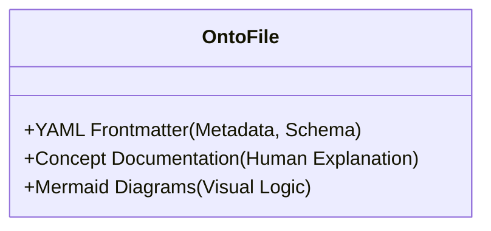
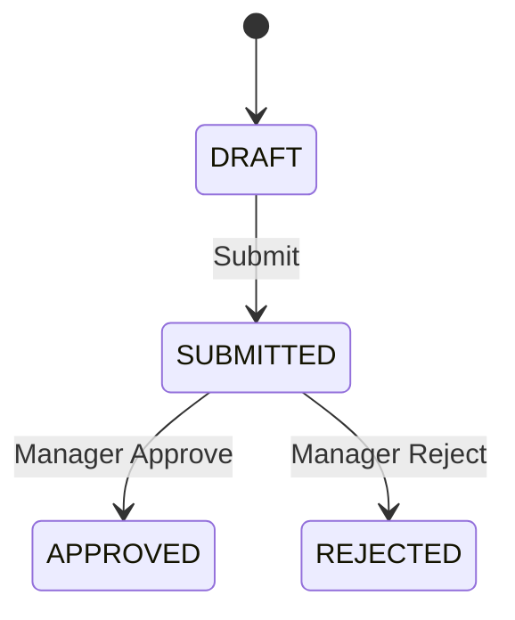

# 08. The Living Spec

In the ODD model, documentation is not an afterthought but a **First-class Citizen**. We call it the **"Living Spec."** This document replaces the roles of traditional BRD, SRS, and Technical Design.

## 1. Structure of a Living Spec

A Living Spec (implemented via `*.onto.md` files) must satisfy two conditions:
1.  **Human-Readable:** Business Analysts and POs can read and understand it to review business requirements.
2.  **Machine-Parseable:** Tools can read it to generate code or validate logic.

### Anatomy of a Structure

An `ontology` file consists of three main parts:



### 1.1 Part 1: The Machine Layer (YAML Frontmatter)
This is the "Hard" part, containing structural data.

```yaml
---
entity: LeaveRequest
classification: TRANSACTION
attributes:
  - name: startDate
    type: date
    required: true
    validation: "must be >= today"
relationships:
  - name: requester
    target: Employee
    cardinality: n-1
states: [ DRAFT, SUBMITTED, APPROVED, REJECTED ]
---
```
*   **Why is this part needed?** So the Compiler can automatically create the `leave_request` DB table and the `validate(LeaveRequest)` API Validator.

### 1.2 Part 2: The Context Layer (Markdown Content)
This is the "Soft" part, explaining the **WHY** and the **Context**.

```markdown
# Leave Request Definition

## Business Context
Leave requests are a critical process for managing absences.
Key rule:
> [!IMPORTANT]
> An employee cannot create two leave requests with overlapping dates.
```
*   **Why is this part needed?** To provide Context for humans (new team members) and for AI (so AI understands complex logic that cannot be expressed in YAML).

### 1.3 Part 3: The Visual Layer (Mermaid)
Visualizing logic instead of using lengthy text.



## 2. Lifecycle of a Living Spec

Unlike a "dead" Word file, the `.onto.md` file participates in the CI/CD lifecycle:

1.  **Draft:** PO/Dev writes the `.onto.md` file on a git branch (`feature/leave-request`).
2.  **Review:** The team reviews this file via a Pull Request (reviewing business logic *before* writing any code).
3.  **Implement:**
    *   Devs use tools to scaffold code from this file.
    *   AI reads this file to write unit tests.
4.  **Verify:** The CI pipeline checks if the actual Code matches the definitions in `.onto.md` (e.g., does the DB Schema have a `startDate` column?).
5.  **Merge:** Once merged into `main`, this document officially becomes the "Truth" of the production system.

## 3. Benefits Over Traditional SRS

| Characteristic | SRS (Word/PDF) | Living Spec (*.onto.md) |
| :--- | :--- | :--- |
| **Location** | Google Drive / SharePoint | Git Repository (beside code) |
| **Format** | Free-form text | Structured Data (YAML) + Text |
| **Updates** | Manual, often forgotten | Mandatory (otherwise CI fails) |
| **Users** | Humans | Humans + Machines (Compiler/AI) |

## Conclusion

The Living Spec transforms documentation from an "administrative burden" into a "technical asset." It is the single bridge that enables the Business Team (who understands requirements) and the Tech Team (who understands code) to speak the same language.

## Related Documents
- **Previous**: [Ontology-Driven Development](./07-concept-odd.md)
- **Next**: [Knowledge Graph for Code](./09-knowledge-graph-for-code.md)
- **Problem Solved**: [Frozen Specs](../02-Pain-Points/05-project-based-workflow-analysis.md)

---

# 08. The Living Spec (Mô hình Đặc tả Sống) (Vietnamese Original)

Trong mô hình ODD, tài liệu không phải là thứ làm sau (afterthought) mà là **First-class Citizen**. Chúng ta gọi nó là **"Living Spec"**. Tài liệu này thay thế vai trò của cả BRD, SRS, và Technical Design truyền thống.

## 1. Cấu trúc của một Living Spec

Một Living Spec (được hiện thực hóa bằng file `*.onto.md`) phải thỏa mãn hai điều kiện:
1.  **Human-Readable:** Business Analyst, PO đọc hiểu được để review nghiệp vụ.
2.  **Machine-Parseable:** Tool đọc được để gen code hoặc validate logic.

### Mẫu cấu trúc chuẩn (Anatomy)

Một file `ontology` gồm 3 phần chính:


### 1.1 Phần 1: The Machine Layer (YAML Frontmatter)
Đây là phần "Cứng", chứa dữ liệu cấu trúc.

```yaml
---
entity: LeaveRequest
classification: TRANSACTION
attributes:
  - name: startDate
    type: date
    required: true
    validation: "must be >= today"
relationships:
  - name: requester
    target: Employee
    cardinality: n-1
states: [ DRAFT, SUBMITTED, APPROVED, REJECTED ]
---
```
*   **Tại sao cần phần này?** Để Compiler có thể tự động tạo ra DB Table `leave_request` và API Validator `validate(LeaveRequest)`.

### 1.2 Phần 2: The Context Layer (Markdown Content)
Đây là phần "Mềm", giải thích **WHY** và **Context**.

```markdown
# Leave Request Definition

## Nghiệp vụ (Business Context)
Yêu cầu nghỉ phép là quy trình quan trọng để quản lý sự vắng mặt.
Quy tắc quan trọng:
> [!IMPORTANT]
> Một nhân viên không thể tạo 2 yêu cầu nghỉ phép trùng ngày nhau.
```
*   **Tại sao cần phần này?** Để cung cấp Context cho con người (người mới vào team) và cho AI (để AI hiểu logic phức tạp không thể diễn tả bằng YAML).

### 1.3 Phần 3: The Visual Layer (Mermaid)
Hình ảnh hóa logic thay vì văn bản dài dòng.


## 2. Vòng đời của Living Spec

Khác với file Word "chết", file `.onto.md` tham gia vào vòng đời CI/CD:

1.  **Draft:** PO/Dev viết file `.onto.md` trên một nhánh git (`feature/leave-request`).
2.  **Review:** Team review file này trên Pull Request (Review logic nghiệp vụ *trước khi* viết dòng code nào).
3.  **Implement:**
    *   Dev dùng Tool để scaffold code từ file này.
    *   AI đọc file này để viết unit test.
4.  **Verify:** CI pipeline kiểm tra xem Code thực tế có khớp với định nghĩa trong `.onto.md` không (ví dụ: DB Schema có cột `startDate` không).
5.  **Merge:** Khi merge vào `main`, tài liệu này chính thức trở thành "Sự thật" của hệ thống production.

## 3. Lợi ích so với SRS truyền thống

| Đặc điểm | SRS (Word/PDF) | Living Spec (*.onto.md) |
| :--- | :--- | :--- |
| **Vị trí** | Google Drive / SharePoint | Git Repository (cạnh code) |
| **Format** | Văn bản tự do | Structured Data (YAML) + Text |
| **Cập nhật** | Thủ công, thường bị quên | Bắt buộc (nếu không CI fail) |
| **Người dùng** | Con người | Con người + Máy (Compiler/AI) |

## Kết luận

Living Spec biến tài liệu từ một "gánh nặng hành chính" thành một "tài sản kỹ thuật" (Technical Asset). Nó là cầu nối duy nhất giúp Team Business (hiểu nghiệp vụ) và Team Tech (hiểu code) nói cùng một ngôn ngữ.

## Related Documents
- **Previous**: [Ontology-Driven Development](./07-concept-odd.md)
- **Next**: [Knowledge Graph for Code](./09-knowledge-graph-for-code.md)
- **Problem Solved**: [Frozen Specs](../02-Pain-Points/05-project-based-workflow-analysis.md)
