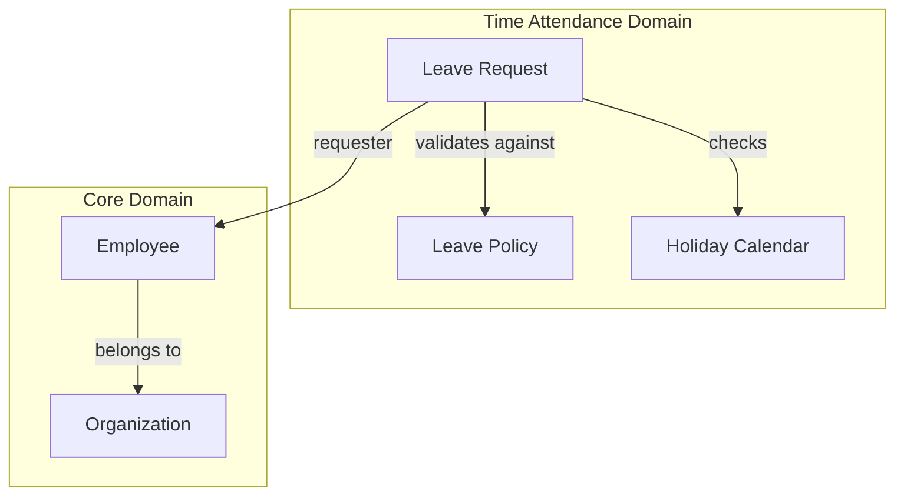

# 09. Knowledge Graph for Code (Đồ thị Tri thức cho Mã nguồn)

> [!NOTE]
> **Mục tiêu**: Hướng dẫn tổ chức các file `*.onto.md` thành một Knowledge Graph để giải quyết vấn đề Knowledge Silos và cung cấp context chính xác cho AI.

Để giải quyết vấn đề **Knowledge Silos** (Ốc đảo tri thức) và giúp AI hiểu toàn bộ hệ thống, chúng ta phải tổ chức các file `*.onto.md` không phải dưới dạng danh sách (list) mà dưới dạng một **Đồ thị (Graph)** được liên kết chặt chẽ.

## 1. Codebase as a Graph

Hãy tưởng tượng thư mục `docs/ontology` của chúng ta giống như một bộ não. Mỗi file là một nơ-ron, và các đường link là dây thần kinh.

### 1.1 The Linking Standard (Wiki-links)
Chúng ta sử dụng chuẩn wiki-link `[[EntityName]]` để tạo kết nối cứng (Hard links) giữa các file.

*   Sai: "See documentation for employee." (Text vô tri, AI không biết tìm ở đâu).
*   Đúng: "This relates to [[Employee]] entity." (Hyperlink, Máy có thể click để đọc tiếp).

### 1.2 Cấu trúc phân cấp (The Taxonomy)

Hệ thống nên được tổ chức theo Domain-Driven Design (DDD):

```
docs/ontology/
├── domain/
│   ├── core/               <-- Domain (Aggregate Root)
│   │   ├── Employee.onto.md
│   │   ├── Department.onto.md
│   ├── time-attendance/
│   │   ├── LeaveRequest.onto.md
│   │   ├── Shift.onto.md
├── workflows/              <-- Business Process
│   ├── onboarding.md       (Links to [[Employee]], [[Contract]])
│   ├── leave-approval.md   (Links to [[LeaveRequest]])
```

## 2. Sức mạnh của Graph đối với AI

Tại sao cấu trúc Graph lại quan trọng trong kỷ nguyên AI? -> **Context Window Construction**.

Khi bạn hỏi AI: *"Hãy viết chức năng Xin nghỉ phép"*.

### Cách cũ (Flat Context):
Bạn phải copy paste toàn bộ folder docs vào prompt. Quá dài, AI bị "loãng" thông tin (Drowning in context).

### Cách ODD (Graph Context):
Tool sẽ thực hiện thuật toán **Graph Traversal**:
1.  Bắt đầu từ nodeId: `LeaveRequest`.
2.  Tìm các node hàng xóm (Neighbor nodes):
    *   `[[Employee]]` (Người xin nghỉ).
    *   `[[LeavePolicy]]` (Chính sách trừ phép).
    *   `[[HolidayCalendar]]` (Lịch nghỉ lễ).
3.  Tool chỉ nạp đúng 4 file này vào Context Window cho AI.

-> **Kết quả:** AI có context cực kỳ cô đọng và chính xác (High Signal-to-Noise Ratio), giúp giảm thiểu Hallucination.

## 3. Visualization (Trực quan hóa)

Nhờ cấu trúc liên kết này, chúng ta có thể dùng tool (như Obsidian, hoặc script visualize riêng) để vẽ ra bản đồ hệ thống.



Nhìn vào đồ thị này, một người mới (Onboarding Member) có thể hiểu ngay: "À, để sửa chức năng Leave Request, tôi có thể sẽ ảnh hưởng đến module Core (Employee)". Điều này giúp đánh giá rủi ro (Impact Analysis) chính xác hơn.

## Kết luận

Xây dựng **Knowledge Graph** không phải là việc làm thêm cho vui. Đó là cách duy nhất để quản lý sự phức tạp (Complexity) khi hệ thống lớn lên.

> [!IMPORTANT]
> - **Với con người**: Giúp điều hướng và hiểu bức tranh toàn cảnh
> - **Với AI**: Giúp cung cấp ngữ cảnh chính xác để sinh code chất lượng cao

## Related Documents
- **Previous**: [The Living Spec](./08-the-living-spec.md)
- **Implementation**: [AI Copilot Strategy](../04-Framework/12-ai-copilot-strategy.md)
- **Problem Solved**: [Knowledge Silos](../02-Pain-Points/04-product-development-pain-points.md)
