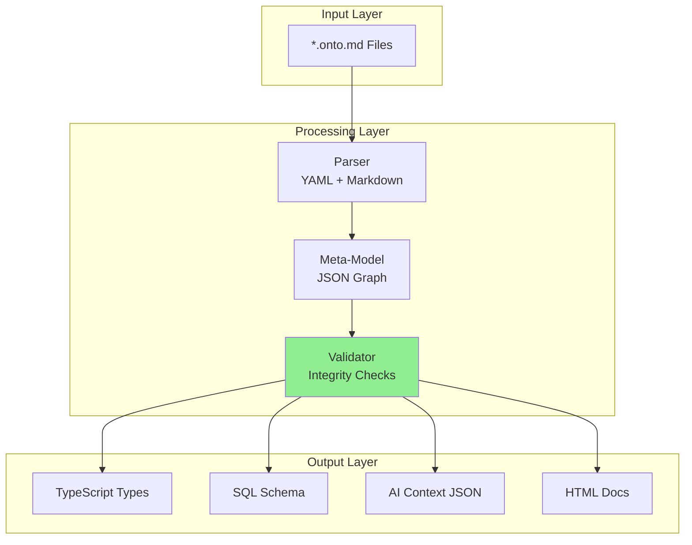
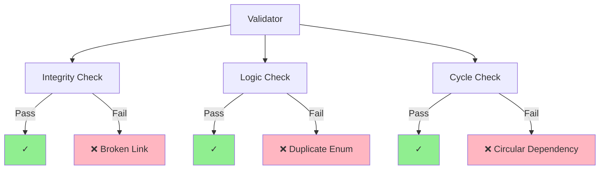

# 10. Architecture: The Ontology Compiler (Cỗ máy biên dịch)

> [!NOTE]
> **Mục tiêu**: Thiết kế kiến trúc kỹ thuật cho công cụ `xtalent-cli` - bộ não trung tâm biến file Markdown thành tài sản kỹ thuật (Code, Schema, AI Context).

## 1. Overview: The Compiler Pipeline

Công cụ này phải giải quyết bài toán: **Biến file Markdown thành Tài sản kỹ thuật (Technical Assets).**



---

## 2. Core Components (Các thành phần cốt lõi)

### 2.1 The Parser (Bộ phân tích cú pháp)

> [!IMPORTANT]
> **Parser** là thành phần đầu tiên, chịu trách nhiệm chuyển đổi từ text sang structured data.

**Input:** Folder `docs/ontology/**/*.md`

**Nhiệm vụ:**
*   Tách biệt `YAML Frontmatter` và `Markdown Content`
*   Parse các khối `mermaid` diagrams
*   Trích xuất các links (wiki-links hoặc markdown links)
*   Phát hiện code blocks và examples

**Output:** Meta-Model (JSON Graph)

**Example Meta-Model:**
```json
{
  "entities": [
    {
      "id": "LeaveRequest",
      "type": "TRANSACTION",
      "attributes": [
        {
          "name": "startDate",
          "type": "date",
          "required": true,
          "validation": "must be >= today"
        }
      ],
      "relationships": [
        {
          "name": "requester",
          "target": "Employee",
          "cardinality": "n-1"
        }
      ],
      "states": ["DRAFT", "SUBMITTED", "APPROVED"]
    }
  ]
}
```

---

### 2.2 The Validator (Bộ kiểm tra)

Đây là "Cảnh sát" của hệ thống. Nếu Validator báo đỏ, CI/CD sẽ chặn lại.



**Validation Rules:**

1.  **Integrity Check:**
    *   Check xem `Employee` có link tới `Department` không?
    *   Phát hiện typo: `Deparment` (sai chính tả)

2.  **Logic Check:**
    *   Check xem `Enum Status` có chứa giá trị duplicate không
    *   Validate data types (date, string, number)

3.  **Cycle Check:**
    *   Phát hiện vòng lặp vô hạn (Circular Dependency)
    *   Example: `A -> B -> C -> A`

**Error Output:**
```
❌ Validation Failed:
  - File: LeaveRequest.onto.md
  - Line: 15
  - Error: Relationship target 'Employe' not found
  - Suggestion: Did you mean 'Employee'?
```

---

### 2.3 The Generators (Bộ sinh mã)

Từ Meta-Model đã clean, chúng ta có thể sinh ra nhiều artifacts:

#### A. Type Definitions (TypeScript/Java/C#)

```typescript
// Auto-generated from LeaveRequest.onto.md
// DO NOT EDIT MANUALLY

export interface LeaveRequest {
  id: string;
  startDate: Date;
  endDate: Date;
  status: 'DRAFT' | 'SUBMITTED' | 'APPROVED' | 'REJECTED';
  requester: Employee;
}

export type LeaveRequestStatus = 
  | 'DRAFT' 
  | 'SUBMITTED' 
  | 'APPROVED' 
  | 'REJECTED';
```

> [!NOTE]
> **Giá trị**: Backend và Frontend dùng chung interface này. Thay đổi MD → Interface đổi → Code lỗi ngay lúc compile (Fail Fast).

#### B. Database Schema (DBML/SQL)

```sql
-- Auto-generated from LeaveRequest.onto.md
-- Generated at: 2026-01-06 16:00:00

CREATE TABLE leave_request (
  id UUID PRIMARY KEY DEFAULT gen_random_uuid(),
  start_date DATE NOT NULL,
  end_date DATE NOT NULL,
  status VARCHAR(20) NOT NULL 
    CHECK (status IN ('DRAFT', 'SUBMITTED', 'APPROVED', 'REJECTED')),
  requester_id UUID NOT NULL 
    REFERENCES employee(id),
  created_at TIMESTAMP DEFAULT NOW(),
  updated_at TIMESTAMP DEFAULT NOW()
);

CREATE INDEX idx_leave_request_status ON leave_request(status);
CREATE INDEX idx_leave_request_requester ON leave_request(requester_id);
```

> [!NOTE]
> **Giá trị**: Database luôn đồng bộ với tài liệu. Schema migration được generate tự động.

#### C. AI Context (JSON/Vector)

Sinh ra các file `.json` rút gọn tối đa để feed cho AI Agent:

```json
{
  "entity": "LeaveRequest",
  "purpose": "Track employee leave requests",
  "key_rules": [
    "startDate must be >= today",
    "Cannot overlap with existing approved leaves",
    "Requires manager approval"
  ],
  "related_entities": ["Employee", "LeavePolicy"],
  "actions": ["Submit", "Approve", "Reject"]
}
```

---

## 3. Technology Choices (Đề xuất công nghệ)

**Language:** NodeJS / TypeScript

**Core Libraries:**
*   `gray-matter`: Parse YAML frontmatter
*   `unified` / `remark`: Parse Markdown AST
*   `zod`: Validate schema
*   `handlebars` / `ejs`: Template engine để sinh code

**CLI Framework:**
*   `commander`: Command-line interface
*   `chalk`: Colored output
*   `ora`: Loading spinners

**Example CLI Usage:**
```bash
# Validate all ontology files
xtalent-cli validate

# Generate TypeScript types
xtalent-cli generate --target typescript --output ./src/types

# Generate SQL schema
xtalent-cli generate --target sql --output ./migrations

# Generate AI context
xtalent-cli generate --target ai-context --output ./ai
```

---

## 4. Key Takeaways (Điểm Chính)

- 🏗️ **Pipeline Architecture**: Parser → Validator → Generator
- ✅ **Fail Fast**: Validation errors block CI/CD
- 🔄 **Multi-target**: One source (MD) → Many outputs (TS, SQL, JSON)
- 🛠️ **Developer-friendly**: Clear error messages with suggestions

> [!IMPORTANT]
> **Kết luận**: Ontology Compiler là trái tim của ODD. Nó biến những quy ước (Convention) thành sự ràng buộc kỹ thuật (Constraint). Thiếu nó, các file Markdown mãi mãi chỉ là văn bản chết.

## Related Documents
- **Concept**: [Ontology-Driven Development](../03-Solution/07-concept-odd.md)
- **Next**: [Developer Workflow](./11-developer-workflow.md)
- **AI Integration**: [AI Copilot Strategy](./12-ai-copilot-strategy.md)
