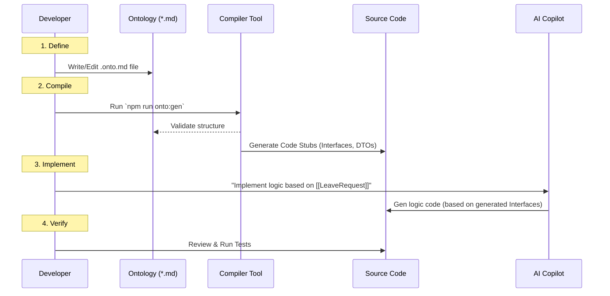
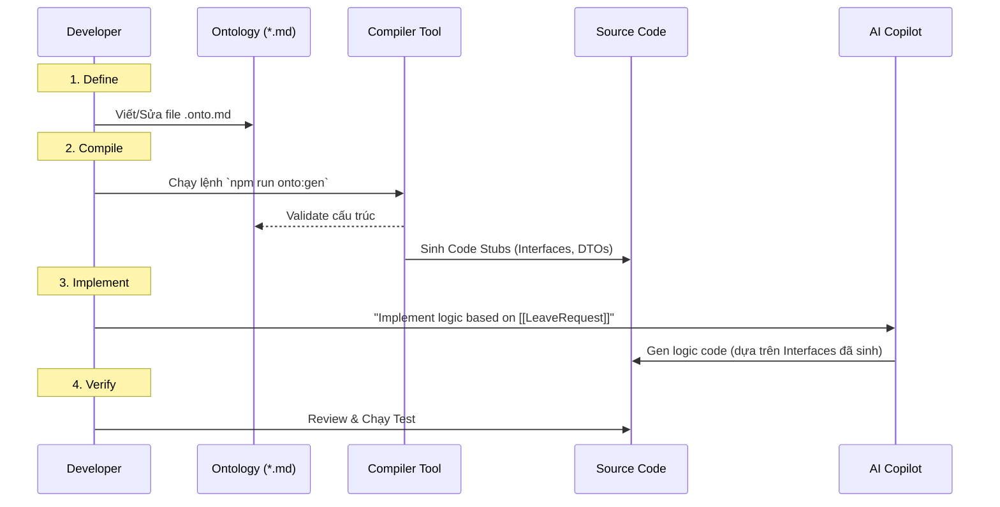

# 11. Developer Workflow

Upon adopting ODD, a developer's daily routine will change significantly. The focus shifts from "Coding" to "Modeling."

## 1. The ODD Cycle

The process consists of 4 steps: **Define -> Compile -> Implement -> Verify**.

### Step-by-Step Detail:

### Step 1: Define (Modeling)
When assigned the task "Add a rejection reason to leave requests":
*   The developer **DOES NOT** open the Code file (`Service.ts`) to make edits.
*   The developer opens `LeaveRequest.onto.md`.
*   Adds the attribute: `rejectionReason` (string, optional).
*   Commits this MD file first.

### Step 2: Compile
*   The developer runs the CLI Tool.
*   The tool automatically updates the `LeaveRequest.ts` file (adding the `rejectionReason` field).
*   At this point, the project might show "red" (Compile Errors) wherever the old LeaveRequest was instantiated. -> **Great Feature**: The Compiler tells you exactly where you need to fix the code to stay in sync with the new business logic.

### Step 3: Implement
*   Use AI Copilot. Since there is a new Type Definition, AI will auto-complete the `rejectionReason` field with extreme precision.
*   The developer writes business logic (if needed) or asks AI: *"Create a validator to ensure rejectionReason is required if status is REJECTED."*

### Step 4: Verify
*   Run Unit Tests.
*   Push code to git. CI/CD will run the Compiler once more to ensure everything matches.

## 2. Cultural Shift

This process requires a change in mindset:

| Old Mindset | ODD Mindset |
| :--- | :--- |
| "Code is the truth." | "Ontology is the truth. Code is just its shadow." |
| "Fix this quickly." (Hotfix in code) | "Update the Model first." (Fix the root) |
| "Documentation comes later." | "Documentation comes first." |

## 3. Best Practices for the Team
1.  **Ontology First Review:** During Code Reviews, the team focuses on reviewing changes in the `.md` files first. If the logic in the MD is correct, the underlying code will mostly be correct as well.
2.  **No Magic Strings:** Never hard-code strings (e.g., "APPROVED") in the code. Enums generated from the Ontology must be used.
3.  **Treat Warnings as Errors:** Do not ignore Validator warnings.

## Conclusion

This workflow might seem more cumbersome (adding the MD writing step), but it completely eliminates **"Guesswork."** Developers always code on a solid foundation (Type-safe, Logic-safe). In the long run, it is many times faster because it reduces time spent on Debugging and Refactoring due to misaligned requirements.

## Related Documents
- **Previous**: [The Compiler Architecture](./10-architecture-the-compiler.md)
- **Next**: [AI Copilot Strategy](./12-ai-copilot-strategy.md)
- **Concept**: [Ontology-Driven Development](../03-Solution/07-concept-odd.md)

---

# 11. Developer Workflow (Quy trình làm việc mới) (Vietnamese Original)

Khi áp dụng ODD, một ngày làm việc của Developer sẽ thay đổi đáng kể. Trọng tâm chuyển dịch từ "Coding" sang "Modeling".

## 1. The ODD Cycle (Vòng lặp ODD)

Quy trình gồm 4 bước: **Define -> Compile -> Implement -> Verify**.

### Chi tiết từng bước:

### Bước 1: Define (Mô hình hóa)
Khi nhận task "Thêm tính năng Lý do từ chối vào đơn nghỉ phép":
*   Dev **KHÔNG** mở file Code (`Service.ts`) để sửa.
*   Dev mở file `LeaveRequest.onto.md`.
*   Thêm attribute: `rejectionReason` (string, optional).
*   Commit file MD này trước.

### Bước 2: Compile (Biên dịch)
*   Dev chạy CLI Tool.
*   Tool sẽ tự động cập nhật file `LeaveRequest.ts` (thêm field `rejectionReason`).
*   Lúc này, project có thể đỏ lòm (Compile Error) ở những chỗ đang khởi tạo LeaveRequest cũ. -> **Tính năng tuyệt vời**: Compiler báo cho bạn biết bạn phải sửa code ở đâu để đồng bộ với nghiệp vụ mới.

### Bước 3: Implement (Thực thi)
*   Sử dụng AI Copilot. Vì đã có Type Definition mới, AI sẽ auto-complete field `rejectionReason` cực chính xác.
*   Dev viết logic business (nếu cần) hoặc nhờ AI viết: *"Create a validator to ensure rejectionReason is required if status is REJECTED."*

### Bước 4: Verify (Kiểm thử)
*   Chạy Unit Test.
*   Push code lên Git. CI/CD sẽ chạy lại Compiler một lần nữa để đảm bảo mọi thứ khớp nhau.

## 2. Cultural Shift (Thay đổi văn hóa)

Quy trình này đòi hỏi sự thay đổi tư duy:

| Tư duy cũ | Tư duy ODD |
| :--- | :--- |
| "Code là chân lý." | "Ontology là chân lý. Code chỉ là cái bóng." |
| "Sửa nhanh cái này đi." (Hotfix vào code) | "Cập nhật Model đi đã." (Sửa gốc) |
| "Tài liệu để sau." | "Tài liệu đi trước." |

## 3. Best Practices cho Team
1.  **Ontology First Review:** Trong các buổi Code Review, team tập trung review sự thay đổi trong file `.md` trước. Nếu Logic trong MD đúng, thì Code bên dưới phần lớn sẽ đúng.
2.  **No Magic Strings:** Không bao giờ hard-code chuỗi (vd: "APPROVED") trong code. Phải dùng Enum sinh ra từ Ontology.
3.  **Treat Warnings as Errors:** Không bỏ qua cảnh báo của Validator.

## Kết luận

Workflow này có vẻ cồng kềnh hơn (thêm bước viết MD), nhưng nó loại bỏ hoàn toàn việc **"Đoán mò"**. Dev luôn code trên một nền tảng chắc chắn (Type-safe, Logic-safe). Về lâu dài, nó nhanh hơn gấp nhiều lần vì giảm thiểu thời gian Debug và Refactor do sai lệch yêu cầu.

## Related Documents
- **Previous**: [The Compiler Architecture](./10-architecture-the-compiler.md)
- **Next**: [AI Copilot Strategy](./12-ai-copilot-strategy.md)
- **Concept**: [Ontology-Driven Development](../03-Solution/07-concept-odd.md)
