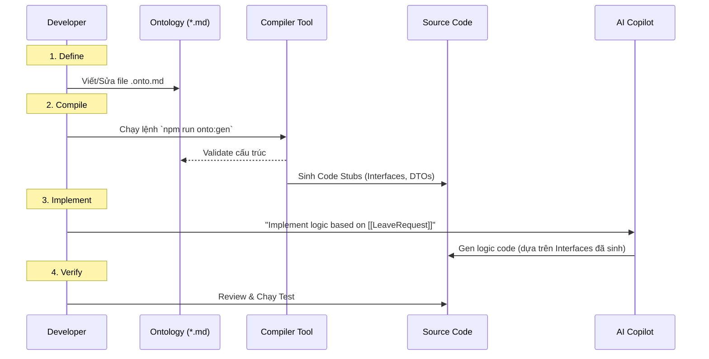

# 11. Developer Workflow (Quy trình làm việc mới)

Khi áp dụng ODD, một ngày làm việc của Developer sẽ thay đổi đáng kể. Trọng tâm chuyển dịch từ "Coding" sang "Modeling".

## 1. The ODD Cycle (Vòng lặp ODD)

Quy trình gồm 4 bước: **Define -> Compile -> Implement -> Verify**.

### Chi tiết từng bước:

### Bước 1: Define (Mô hình hóa)
Khi nhận task "Thêm tính năng Lý do từ chối vào đơn nghỉ phép":
*   Dev **KHÔNG** mở file Code (`Service.ts`) để sửa.
*   Dev mở file `LeaveRequest.onto.md`.
*   Thêm attribute: `rejectionReason` (string, optional).
*   Commit file MD này trước.

### Bước 2: Compile (Biên dịch)
*   Dev chạy CLI Tool.
*   Tool sẽ tự động cập nhật file `LeaveRequest.ts` (thêm field `rejectionReason`).
*   Lúc này, project có thể đỏ lòm (Compile Error) ở những chỗ đang khởi tạo LeaveRequest cũ. -> **Tính năng tuyệt vời**: Compiler báo cho bạn biết bạn phải sửa code ở đâu để đồng bộ với nghiệp vụ mới.

### Bước 3: Implement (Thực thi)
*   Sử dụng AI Copilot. Vì đã có Type Definition mới, AI sẽ auto-complete field `rejectionReason` cực chính xác.
*   Dev viết logic business (nếu cần) hoặc nhờ AI viết: *"Create a validator to ensure rejectionReason is required if status is REJECTED."*

### Bước 4: Verify (Kiểm thử)
*   Chạy Unit Test.
*   Push code lên Git. CI/CD sẽ chạy lại Compiler một lần nữa để đảm bảo mọi thứ khớp nhau.

## 2. Cultural Shift (Thay đổi văn hóa)

Quy trình này đòi hỏi sự thay đổi tư duy:

| Tư duy cũ | Tư duy ODD |
| :--- | :--- |
| "Code là chân lý." | "Ontology là chân lý. Code chỉ là cái bóng." |
| "Sửa nhanh cái này đi." (Hotfix vào code) | "Cập nhật Model đi đã." (Sửa gốc) |
| "Tài liệu để sau." | "Tài liệu đi trước." |

## 3. Best Practices cho Team
1.  **Ontology First Review:** Trong các buổi Code Review, team tập trung review sự thay đổi trong file `.md` trước. Nếu Logic trong MD đúng, thì Code bên dưới phần lớn sẽ đúng.
2.  **No Magic Strings:** Không bao giờ hard-code chuỗi (vd: "APPROVED") trong code. Phải dùng Enum sinh ra từ Ontology.
3.  **Treat Warnings as Errors:** Không bỏ qua cảnh báo của Validator.

## Kết luận

Workflow này có vẻ cồng kềnh hơn (thêm bước viết MD), nhưng nó loại bỏ hoàn toàn việc **"Đoán mò"**. Dev luôn code trên một nền tảng chắc chắn (Type-safe, Logic-safe). Về lâu dài, nó nhanh hơn gấp nhiều lần vì giảm thiểu thời gian Debug và Refactor do sai lệch yêu cầu.

## Related Documents
- **Previous**: [The Compiler Architecture](./10-architecture-the-compiler.md)
- **Next**: [AI Copilot Strategy](./12-ai-copilot-strategy.md)
- **Concept**: [Ontology-Driven Development](../03-Solution/07-concept-odd.md)
