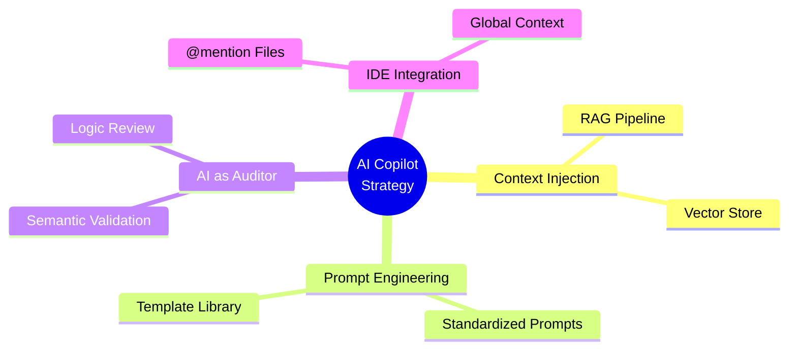
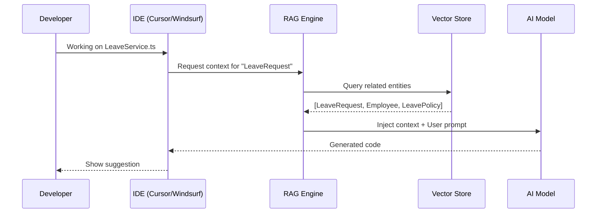

# 12. AI Copilot Strategy

> [!NOTE]
> **Goal**: Design a strategy for integrating AI into the ODD process, transforming AI into a true team developer by providing "Perfect Context" from the Ontology.

## 1. Overview: The Context Challenge

The core value of ODD in the AI era is its ability to provide **Perfect Context**.



---

## 2. Problem: The "Context Injection" Challenge

> [!WARNING]
> AI (GPT-4, Claude) is highly intelligent, but it is like a senior engineer with short-term memory loss. It does not know your business.

**The Dilemma:**
*   If you give it the entire codebase → It becomes overwhelmed (Context Window limit).
*   If you give it too little → It fabricates information (Hallucination).

**Solution:** Give it the **Ontology**—just enough, and exactly right.

---

## 3. Solution 1: RAG Pipeline for Code

We will build a simple yet effective RAG (Retrieval-Augmented Generation) pipeline:



### 3.1 The Vector Store

The Compiler will generate `chunks` from the Ontology:

**Example Chunks:**
```json
// Chunk 1: Entity Definition
{
  "id": "chunk_leave_request_def",
  "entity": "LeaveRequest",
  "content": "LeaveRequest is a TRANSACTION entity...",
  "keywords": ["leave", "request", "absence", "vacation"]
}

// Chunk 2: Actions
{
  "id": "chunk_leave_request_actions",
  "entity": "LeaveRequest",
  "content": "Actions: Submit, Approve, Reject...",
  "keywords": ["submit", "approve", "reject", "workflow"]
}

// Chunk 3: Relationships
{
  "id": "chunk_leave_request_rels",
  "entity": "LeaveRequest",
  "content": "Relationships: requester (Employee), policy (LeavePolicy)...",
  "keywords": ["employee", "policy", "relationship"]
}
```

### 3.2 The IDE Integration

**Scenario:** A developer is coding in `LeaveService.ts`.

**Question:** What context does the Copilot need?
*   ❌ No need to know about `Salary` or `Payroll`.
*   ✅ Needs to know about `LeaveRequest`, `Employee`, and `LeavePolicy`.

**Strategy:**
*   Use the **`@mention`** or **Global Context** features of the IDE.
*   Always include relevant `.onto.md` files in the chat context.

**Example (Cursor IDE):**
```
@LeaveRequest.onto.md @Employee.onto.md

Implement the submit() method for LeaveService. 
Ensure it validates against LeavePolicy rules.
```

---

## 4. Solution 2: Prompt Engineering as Code

We will standardize the prompts used by the team.

### 4.1 Bad Prompt Example

```
❌ "Write an approve request function for me."
```

**Problem:** AI will fabricate the logic:
```typescript
// AI might generate this (WRONG)
function approve(id: string) {
  updateStatus(id, 'OK'); // Wrong status value!
}
```

### 4.2 Good Prompt Example (ODD Standard)

```
✅ "Implement action `Approve` for entity `LeaveRequest`. 
    Use the state transition rules defined in LeaveRequest.onto.md. 
    Ensure strict type checking with generated Interfaces."
```

**Result:** AI generates correct code:
```typescript
// AI generates this (CORRECT)
function approve(request: LeaveRequest): void {
  if (request.status !== 'SUBMITTED') {
    throw new Error('Can only approve SUBMITTED requests');
  }
  request.status = 'APPROVED'; // Correct enum value
  request.approvedAt = new Date();
}
```

### 4.3 Prompt Template Library

Create a library of prompt templates:

```markdown
## Template: Implement Action
Implement action `{ACTION_NAME}` for entity `{ENTITY_NAME}`.
- Follow state transitions in {ENTITY_NAME}.onto.md
- Use generated TypeScript interfaces
- Add validation for business rules
- Write unit tests

## Template: Create Entity
Create a new entity `{ENTITY_NAME}` with:
- Attributes: {ATTRIBUTES_LIST}
- Relationships: {RELATIONSHIPS_LIST}
- Follow the ontology template structure
```

---

## 5. Solution 3: AI as "The Auditor"

Beyond writing code, AI is excellent at verifying the Ontology.

### 5.1 Semantic Validation Mode

```bash
xtalent-cli validate --mode semantic --ai
```

**Process:**
1.  The tool sends the `.md` file to the AI.
2.  Prompt: *"Review this Ontology definition. Are there any logical loopholes?"*
3.  AI responds with warnings.

**Example AI Response:**
```
⚠️ Semantic Warning:
  - File: LeaveRequest.onto.md
  - Issue: You defined `endDate` must be after `startDate`, 
           but you missed the constraint for `half-day` leaves.
  - Suggestion: Add validation rule for half-day leave duration.
```

---

## 6. Key Takeaways

- 🎯 **Perfect Context**: The RAG pipeline provides exactly the necessary context.
- 📝 **Standardized Prompts**: The template library ensures consistency.
- 🛡️ **AI as Guardrails**: The Ontology prevents AI hallucinations.
- 🔍 **AI as Auditor**: AI assists in reviewing semantic logic.

> [!IMPORTANT]
> **Defined Roles**: In ODD, AI does not replace humans in thinking (Defining). Humans own the Ontology. AI is a loyal and accurate Implementation Machine.

## Related Documents
- **Concept**: [Ontology-Driven Development](../03-Solution/07-concept-odd.md)
- **Previous**: [Developer Workflow](./11-developer-workflow.md)
- **Problem Solved**: [AI Era Challenges](../02-Pain-Points/06-ai-era-challenges.md)

---

# 12. AI Copilot Strategy (Chiến lược Cộng sinh với AI) (Vietnamese Original)

> [!NOTE]
> **Mục tiêu**: Thiết kế chiến lược tích hợp AI vào quy trình ODD, biến AI thành Developer thực thụ trong team thông qua việc cung cấp Perfect Context từ Ontology.

## 1. Overview: The Context Challenge

Core value của ODD trong kỷ nguyên AI là khả năng cung cấp **Perfect Context**.


---

## 2. Problem: The "Context Injection" Challenge

> [!WARNING]
> AI (GPT-4, Claude) rất thông minh, nhưng nó giống như một kỹ sư cao cấp bị mất trí nhớ ngắn hạn. Nó không biết Business của bạn.

**The Dilemma:**
*   Nếu bạn đưa nó toàn bộ codebase → Nó bị quá tải (Context Window limit)
*   Nếu bạn đưa nó quá ít → Nó bịa (Hallucination)

**Solution:** Đưa cho nó **Ontology** - vừa đủ, vừa chính xác.

---

## 3. Solution 1: RAG Pipeline for Code

Chúng ta sẽ xây dựng một pipeline RAG (Retrieval-Augmented Generation) đơn giản nhưng hiệu quả:


### 3.1 The Vector Store (Kho tri thức)

Compiler sẽ sinh ra các file `chunk` từ Ontology:

**Example Chunks:**
```json
// Chunk 1: Entity Definition
{
  "id": "chunk_leave_request_def",
  "entity": "LeaveRequest",
  "content": "LeaveRequest is a TRANSACTION entity...",
  "keywords": ["leave", "request", "absence", "vacation"]
}

// Chunk 2: Actions
{
  "id": "chunk_leave_request_actions",
  "entity": "LeaveRequest",
  "content": "Actions: Submit, Approve, Reject...",
  "keywords": ["submit", "approve", "reject", "workflow"]
}

// Chunk 3: Relationships
{
  "id": "chunk_leave_request_rels",
  "entity": "LeaveRequest",
  "content": "Relationships: requester (Employee), policy (LeavePolicy)...",
  "keywords": ["employee", "policy", "relationship"]
}
```

### 3.2 The IDE Integration (Tích hợp IDE)

**Scenario:** Dev đang code ở file `LeaveService.ts`

**Question:** Copilot cần biết context gì?
*   ❌ Không cần biết về `Salary`, `Payroll`
*   ✅ Cần biết về `LeaveRequest`, `Employee`, `LeavePolicy`

**Strategy:**
*   Sử dụng tính năng **`@mention`** hoặc **Global Context** của IDE
*   Luôn include file `.onto.md` liên quan vào chat context

**Example (Cursor IDE):**
```
@LeaveRequest.onto.md @Employee.onto.md

Implement the submit() method for LeaveService. 
Ensure it validates against LeavePolicy rules.
```

---

## 4. Solution 2: Prompt Engineering as Code

Chúng ta sẽ chuẩn hóa các câu lệnh (Prompts) mà team sử dụng.

### 4.1 Bad Prompt Example

```
❌ "Viết hàm approve request cho tao."
```

**Problem:** AI sẽ tự bịa ra logic:
```typescript
// AI might generate this (WRONG)
function approve(id: string) {
  updateStatus(id, 'OK'); // Wrong status value!
}
```

### 4.2 Good Prompt Example (ODD Standard)

```
✅ "Implement action `Approve` for entity `LeaveRequest`. 
   Use the state transition rules defined in LeaveRequest.onto.md. 
   Ensure strict type checking with generated Interfaces."
```

**Result:** AI generates correct code:
```typescript
// AI generates this (CORRECT)
function approve(request: LeaveRequest): void {
  if (request.status !== 'SUBMITTED') {
    throw new Error('Can only approve SUBMITTED requests');
  }
  request.status = 'APPROVED'; // Correct enum value
  request.approvedAt = new Date();
}
```

### 4.3 Prompt Template Library

Tạo một thư viện prompt templates:

```markdown
## Template: Implement Action
Implement action `{ACTION_NAME}` for entity `{ENTITY_NAME}`.
- Follow state transitions in {ENTITY_NAME}.onto.md
- Use generated TypeScript interfaces
- Add validation for business rules
- Write unit tests

## Template: Create Entity
Create a new entity `{ENTITY_NAME}` with:
- Attributes: {ATTRIBUTES_LIST}
- Relationships: {RELATIONSHIPS_LIST}
- Follow the ontology template structure
```

---

## 5. Solution 3: AI as "The Auditor"

Ngoài việc viết code, AI đóng vai trò cực tốt trong việc verify Ontology.

### 5.1 Semantic Validation Mode

```bash
xtalent-cli validate --mode semantic --ai
```

**Process:**
1.  Tool gửi file `.md` cho AI
2.  Prompt: *"Review this Ontology definition. Are there any logical loopholes?"*
3.  AI phản hồi với warnings

**Example AI Response:**
```
⚠️ Semantic Warning:
  - File: LeaveRequest.onto.md
  - Issue: You defined `endDate` must be after `startDate`, 
           but you missed the constraint for `half-day` leaves.
  - Suggestion: Add validation rule for half-day leave duration.
```

---

## 6. Key Takeaways (Điểm Chính)

- 🎯 **Perfect Context**: RAG pipeline cung cấp đúng context cần thiết
- 📝 **Standardized Prompts**: Template library đảm bảo consistency
- 🛡️ **AI as Guardrails**: Ontology ngăn AI hallucinate
- 🔍 **AI as Auditor**: AI giúp review semantic logic

> [!IMPORTANT]
> **Vai trò phân định**: Trong ODD, AI không thay thế con người trong việc tư duy (Define). Con người nắm giữ Ontology. AI là cỗ máy thực thi (Implementation Machine) trung thành và chính xác.

## Related Documents
- **Concept**: [Ontology-Driven Development](../03-Solution/07-concept-odd.md)
- **Previous**: [Developer Workflow](./11-developer-workflow.md)
- **Problem Solved**: [AI Era Challenges](../02-Pain-Points/06-ai-era-challenges.md)
