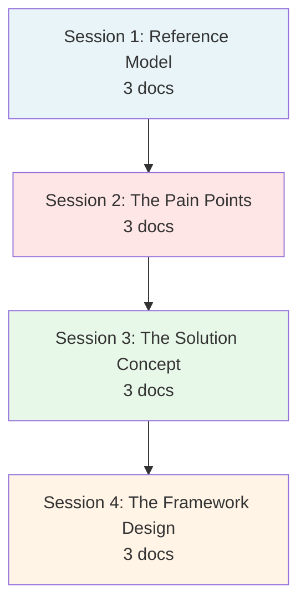
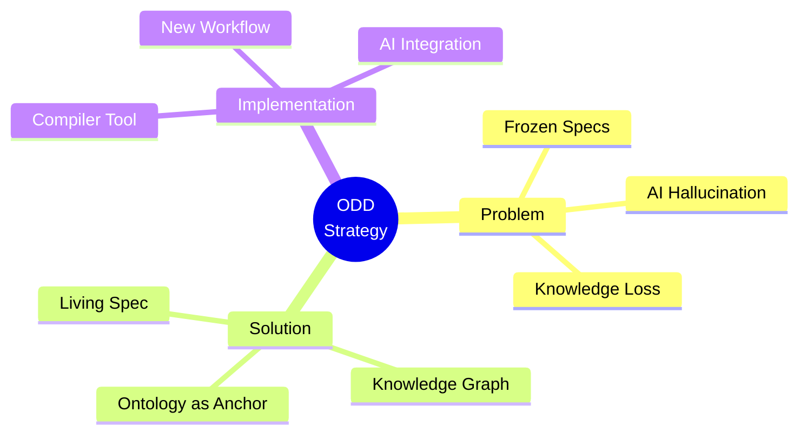

# Research Phase: Ontology-Driven Development Strategy

> [!NOTE]
> **Tổng quan**: Tài liệu này tổng hợp toàn bộ kết quả nghiên cứu trong công cuộc tìm kiếm giải pháp phát triển phần mềm thế hệ mới, giải quyết các pain points cốt tử của ngành Engineering trong kỷ nguyên AI.

Chúng tôi đi từ việc đặt câu hỏi "Tại sao?" (Why), nghiên cứu "Cái gì?" (What), và cuối cùng đề xuất "Làm thế nào?" (How).

---

## 🧭 Navigation Map

Hành trình nghiên cứu được chia thành 4 Sessions với 12 tài liệu:

---

## 📚 Session 1: Reference Model (Mô hình Tham chiếu)

> **Mục tiêu**: Tìm hiểu cách các Tech Giants (Palantir) giải quyết bài toán dữ liệu lớn và phức tạp.

| # | Document | Description |
|---|----------|-------------|
| 01 | [Concept: Ontology](01-Reference/01-concept-ontology.md) | Định nghĩa nền tảng về Ontology và Semantic Layer |
| 02 | [Case Study: Palantir Foundry](01-Reference/02-case-study-palantir-foundry.md) | Phân tích kỹ thuật (Objects, Links, Actions) |
| 03 | [Strategic Value](01-Reference/03-strategic-value.md) | Tại sao mô hình này tạo ra lợi thế cạnh tranh |

**Key Insights:**
- 🏗️ **Trinity Architecture**: Objects + Links + Actions
- 🌐 **Digital Twin**: Hệ thống nói ngôn ngữ Business
- ⚡ **Operational Loop**: Từ "Xem báo cáo" → "Hành động tức thì"

---

## 🌪️ Session 2: The Pain Points (Vấn đề Hiện tại)

> **Mục tiêu**: Nhìn thẳng vào những nỗi đau của quy trình phát triển phần mềm hiện tại.

| # | Document | Description |
|---|----------|-------------|
| 04 | [Product Development Models](02-Pain-Points/04-product-development-pain-points.md) | Sự mâu thuẫn giữa Enterprise (cứng nhắc) và Startup (hỗn loạn) |
| 05 | [Project-Based Workflows](02-Pain-Points/05-project-based-workflow-analysis.md) | "Cái chết" của tài liệu (Frozen Specs) |
| 06 | [The AI Era Challenges](02-Pain-Points/06-ai-era-challenges.md) | Rủi ro mới: Code Bloat, Knowledge Atrophy |

**Key Problems:**
- 🧠 **Bus Factor**: Mất người = Mất tri thức
- 🧊 **Frozen Specs**: Tài liệu chết sau khi viết
- 🤖 **AI Hallucination**: AI bịa đặt nghiệp vụ
- 📈 **Code Bloat**: AI sinh code quá nhiều

---

## 💡 Session 3: The Solution Concept (Giải pháp Đề xuất)

> **Mục tiêu**: Định nghĩa phương pháp luận của chúng ta - Ontology-Driven Development (ODD).

| # | Document | Description |
|---|----------|-------------|
| 07 | [Ontology-Driven Development](03-Solution/07-concept-odd.md) | Định nghĩa ODD: Biến Ontology thành "Source of Truth" |
| 08 | [The Living Spec](03-Solution/08-the-living-spec.md) | Thay thế file Word chết bằng `*.onto.md` sống động |
| 09 | [Knowledge Graph for Code](03-Solution/09-knowledge-graph-for-code.md) | Tổ chức Codebase như một bộ não |

**Core Principles:**
- 📝 **Docs as Code**: Tài liệu nằm trong Repo, tham gia CI/CD
- 🎯 **Semantic First**: Định nghĩa ý nghĩa trước khi viết code
- 🔗 **Knowledge Graph**: Liên kết chặt chẽ giữa các entities

---

## 🛠️ Session 4: The Framework Design (Thiết kế Khung)

> **Mục tiêu**: Chuyển hóa lý thuyết thành công cụ và quy trình cụ thể.

| # | Document | Description |
|---|----------|-------------|
| 10 | [Architecture: The Compiler](04-Framework/10-architecture-the-compiler.md) | Thiết kế công cụ `xtalent-cli` để biên dịch Markdown |
| 11 | [Developer Workflow](04-Framework/11-developer-workflow.md) | Quy trình mới: Define → Compile → Implement → Verify |
| 12 | [AI Copilot Strategy](04-Framework/12-ai-copilot-strategy.md) | Tích hợp AI làm "Auditor" và "Implementer" |

**Implementation Strategy:**
- 🏗️ **Compiler Pipeline**: Parser → Validator → Generator
- ✅ **Fail Fast**: Validation errors block CI/CD
- 🤖 **AI as Tool**: Perfect Context từ Ontology
- 🔄 **Multi-target**: MD → TS + SQL + JSON

---

## 🎯 Kết luận chung

Chúng ta không chọn mua Palantir (đắt đỏ và đóng kín).  
Chúng ta chọn tự xây dựng **"Palantir Lite"** - một hệ sinh thái **Ontology-Driven Development** phù hợp với quy mô và tech stack của mình.

### Key Takeaways

### Next Steps

> [!IMPORTANT]
> **Hành động tiếp theo**: Bắt tay vào xây dựng POC cho `Ontology Compiler` và chuẩn hóa bộ file `*.onto.md` hiện tại.

**Roadmap:**
1. ✅ **Phase 1**: Research & Documentation (Completed)
2. 🔄 **Phase 2**: POC Development
   - Build `xtalent-cli` Parser
   - Implement Validator
   - Create TypeScript Generator
3. 📋 **Phase 3**: Pilot Project
   - Apply ODD to one module (e.g., Leave Management)
   - Measure impact (speed, quality, consistency)
4. 🚀 **Phase 4**: Full Rollout

---

## 📊 Documentation Stats

- **Total Documents**: 12
- **Mermaid Diagrams**: 16+
- **Code Examples**: 30+
- **Cross-references**: Full coverage
- **Language**: Vietnamese (with English technical terms)

---

*Last Updated: 2026-01-06*  
*Status: Research Phase Complete ✅*
