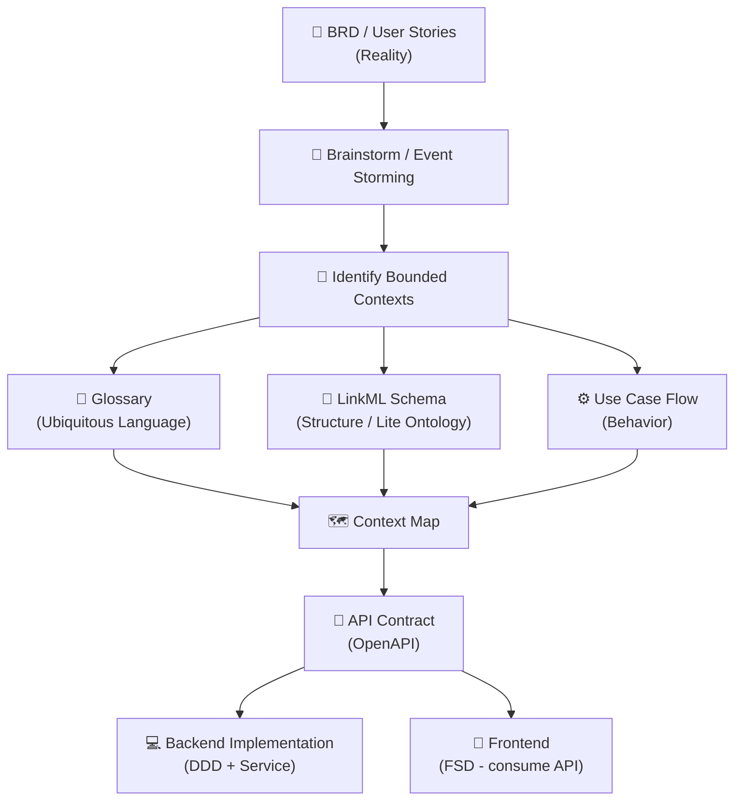

# ODSA — On-Demand Software Architecture Documentation Suite

> **Mục đích:** Tài liệu tổng quan về bộ chuẩn tài liệu ODSA — pipeline phát triển tài liệu cho dự án phần mềm từ business đến code.

---

## 1. ODSA là gì?

**ODSA (On-Demand Software Architecture)** là một bộ chuẩn tài liệu và quy trình giúp các team phần mềm:

- **Hiểu domain** một cách có hệ thống, không bỏ sót
- **Tài liệu hóa** theo pipeline rõ ràng từ business → code
- **Phối hợp** nhất quán giữa BA, Developer, Product và QA
- **Tránh** các anti-pattern phổ biến ("nhảy bước", ambiguity, anemic model)

---

## 2. Tại sao cần ODSA?

### Sai lầm phổ biến ở hầu hết team

```
Reality (BRD) ──── nhảy thẳng ───→ Code
```

**Hệ quả:**
- Model domain bị méo so với thực tế
- Business logic rải rác khắp nơi (service, controller, DB)
- Team dev và business hiểu khác nhau về cùng 1 khái niệm
- Khó maintain, khó onboard người mới

### ODSA giải quyết bằng pipeline có hệ thống

```
Reality → Ontology → DDD Artifacts → API Contract → Code
```

Mỗi bước có artifact rõ ràng, có người phụ trách, có tiêu chí "done".

---

## 3. Bốn tầng tư duy cốt lõi

| Tầng | Câu hỏi | Tính chất |
|------|---------|-----------|
| **Reality** | "Thực tế đang xảy ra gì?" | Khách quan, tự nhiên |
| **Ontology** | "Có những gì? Quan hệ ra sao?" | Conceptual, độc lập tech |
| **DDD Model** | "Biểu diễn trong hệ thống thế nào?" | Technical abstraction |
| **Execution** | "Hệ thống thực thi gì?" | Runtime, implementation |

> **Nguyên tắc vàng:** Mỗi tầng có ngôn ngữ riêng. Sự nhất quán giữa 4 tầng quyết định chất lượng hệ thống.

---

## 4. Pipeline tổng thể



---

## 5. Cấu trúc bộ tài liệu ODSA

| File | Nội dung |
|------|----------|
| [`00-overview.md`](./00-overview.md) | Tổng quan pipeline (file này) |
| [`01-pipeline-master.md`](./01-pipeline-master.md) | Master pipeline — chi tiết từng bước |
| [`02-reality-brd.md`](./02-reality-brd.md) | Chuẩn tài liệu tầng Reality (BRD, User Stories) |
| [`03-bounded-context.md`](./03-bounded-context.md) | Xác định và tài liệu hóa Bounded Context |
| [`04-glossary.md`](./04-glossary.md) | Ubiquitous Language & Glossary chuẩn |
| [`05-ontology-linkml.md`](./05-ontology-linkml.md) | Ontology và LinkML schema chuẩn |
| [`06-flow-behavior.md`](./06-flow-behavior.md) | Use Case Flow và Behavior diagram |
| [`07-api-contract.md`](./07-api-contract.md) | API Contract (OpenAPI) từ domain |
| [`08-collaboration-guide.md`](./08-collaboration-guide.md) | Quy trình phối hợp team |
| `templates/` | Blank templates sử dụng ngay |

---

## 6. Ai đọc tài liệu nào?

| Vai trò | Tài liệu chính | Tài liệu phụ |
|---------|---------------|-------------|
| **BA / Product** | 02, 03, 04 | 01, 06 |
| **Architect / Tech Lead** | 01, 03, 05, 07 | 04, 06 |
| **Developer** | 05, 06, 07 | 03, 04 |
| **QA** | 06, 07 | 04, 02 |
| **Onboarding mới** | 00 → 01 → 03 → 04 | rồi theo vai trò |

---

## 7. Hai chế độ sử dụng

### 7.1 Full Pipeline (hệ thống phức tạp)

Áp dụng khi:
- Domain phức tạp, nhiều bounded context
- Team lớn (5+ người), cần alignment cao
- Long-term project (> 6 tháng)

**Dùng toàn bộ 8 tài liệu.**

### 7.2 Tối giản (Pragmatic — 80% dự án)

```
BRD → Context → Glossary → LinkML → Flow → API Contract → Code
```

Tài liệu tối thiểu:
1. `glossary.md` (per context)
2. `model.linkml.yaml` (per context)
3. `flows/<use-case>.md` (per use case)
4. `context-map.md` (system-level)

---

## 8. Quy ước chung

### Folder structure chuẩn

```
/docs
  00-overview.md
  01-pipeline-master.md
  context-map.md          ← system level
  /ordering               ← một bounded context
    glossary.md
    model.linkml.yaml
    /flows
      place-order.md
      cancel-order.md
  /payment
    glossary.md
    model.linkml.yaml
  /templates
    glossary-template.md
    linkml-template.yaml
    flow-template.md
```

### Ngôn ngữ tài liệu
- **Glossary, Flow, BRD:** Tiếng Việt (business-facing)
- **LinkML schema:** Tiếng Anh (machine-readable)
- **API Contract (OpenAPI):** Tiếng Anh (technical standard)
- **Code comments:** Tiếng Anh

---

*Phiên bản: 1.0 — Ngày tạo: 2026-03-20*
*Nguồn: Tổng hợp từ ODSA discussion notes (note1–note11)*
