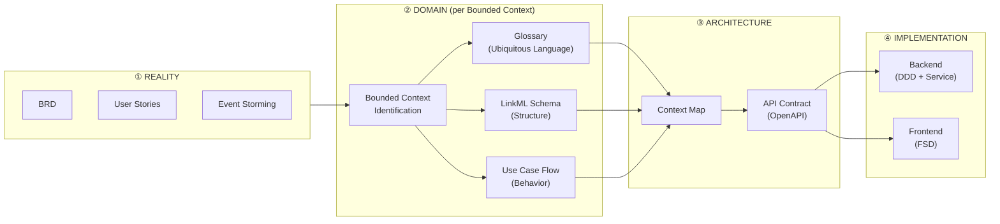

# Pipeline Master — ODSA Full Pipeline Reference

> **Mục đích:** Tài liệu trung tâm mô tả toàn bộ pipeline ODSA. Mọi tài liệu khác đều dẫn về đây.

---

## 1. Pipeline hoàn chỉnh



---

## 2. Chi tiết từng bước

### Bước 1 — Reality: Thu thập yêu cầu

| Thông tin | Nội dung |
|-----------|---------|
| **Input** | Ý kiến stakeholder, business goals |
| **Output** | BRD, User Stories, Event Storming notes |
| **Artifact** | `brd.md`, `user-stories.md` |
| **Tool** | Markdown, Miro/FigJam |
| **Team** | BA, Product Manager |
| **Tài liệu** | → [`02-reality-brd.md`](./02-reality-brd.md) |

**Done khi:** Tất cả business actor, business event chính và business rule cấp cao đã được ghi chép.

---

### Bước 2 — Identify Bounded Contexts

| Thông tin | Nội dung |
|-----------|---------|
| **Input** | BRD, User Stories |
| **Output** | Danh sách bounded contexts, ranh giới rõ ràng |
| **Artifact** | `context-map.md` (phác thảo ban đầu) |
| **Tool** | Mermaid diagram, whiteboard |
| **Team** | Architect, Tech Lead, BA |
| **Tài liệu** | → [`03-bounded-context.md`](./03-bounded-context.md) |

**Done khi:** Mỗi domain concept có đúng 1 "home context" rõ ràng, không bị lẫn lộn giữa các context.

---

### Bước 3 — Glossary (per context)

| Thông tin | Nội dung |
|-----------|---------|
| **Input** | BRD + Bounded context đã xác định |
| **Output** | Glossary.md cho từng context |
| **Artifact** | `<context>/glossary.md` |
| **Tool** | Markdown table |
| **Team** | BA + Dev (together) |
| **Tài liệu** | → [`04-glossary.md`](./04-glossary.md) |

**Done khi:** Mọi term quan trọng trong context đều có definition rõ, không còn ambiguity khi discussion.

---

### Bước 4 — LinkML Schema (per context)

| Thông tin | Nội dung |
|-----------|---------|
| **Input** | Glossary, BRD |
| **Output** | Schema file mô tả entity, relation, constraint |
| **Artifact** | `<context>/model.linkml.yaml` |
| **Tool** | YAML editor, linkml-validate |
| **Team** | Architect / Senior Dev |
| **Tài liệu** | → [`05-ontology-linkml.md`](./05-ontology-linkml.md) |

**Done khi:** Tất cả entity trong glossary được schema hóa với đúng attribute, relation và constraint.

---

### Bước 5 — Use Case Flow (per use case)

| Thông tin | Nội dung |
|-----------|---------|
| **Input** | Glossary, LinkML, User Stories |
| **Output** | Flow document: text steps + sequence diagram |
| **Artifact** | `<context>/flows/<use-case>.md` |
| **Tool** | Markdown + Mermaid sequenceDiagram |
| **Team** | BA + Tech Lead |
| **Tài liệu** | → [`06-flow-behavior.md`](./06-flow-behavior.md) |

**Done khi:** Mỗi happy path và error path chính của use case đều có flow rõ ràng.

---

### Bước 6 — Context Map (system-level)

| Thông tin | Nội dung |
|-----------|---------|
| **Input** | Tất cả bounded contexts đã được define |
| **Output** | Diagram tổng thể các context và cách chúng kết nối |
| **Artifact** | `context-map.md` |
| **Tool** | Mermaid graph |
| **Team** | Architect |
| **Tài liệu** | → [`03-bounded-context.md`](./03-bounded-context.md) |

**Done khi:** Mọi integration point giữa các context đều được ghi rõ (relationship type: upstream/downstream, ACL, etc.).

---

### Bước 7 — API Contract

| Thông tin | Nội dung |
|-----------|---------|
| **Input** | LinkML + Flow (bước 4 + 5) |
| **Output** | OpenAPI spec cho từng context |
| **Artifact** | `<context>/api.openapi.yaml` |
| **Tool** | OpenAPI / Swagger editor |
| **Team** | Tech Lead + Backend Dev |
| **Tài liệu** | → [`07-api-contract.md`](./07-api-contract.md) |

**Done khi:** FE team có thể bắt đầu mock API từ spec mà không cần hỏi BE.

---

### Bước 8 — Implementation

| Thông tin | Nội dung |
|-----------|---------|
| **Input** | LinkML + Flow + API Contract |
| **Output** | Working code |
| **Backend** | DDD structure + Service layer |
| **Frontend** | Feature-Sliced Design consuming API |
| **Team** | Dev team |

**Done khi:** Integration tests pass theo API Contract. Domain logic khớp với Glossary + Flow.

---

## 3. Ma trận Artifact × Team

| Artifact | BA | Architect | Dev | QA |
|----------|:--:|:---------:|:---:|:--:|
| BRD / User Stories | ✏️ | 👓 | 👓 | 👓 |
| Bounded Context | 👓 | ✏️ | 🤝 | — |
| Glossary | ✏️ | 🤝 | ✏️ | 👓 |
| LinkML Schema | — | ✏️ | 🤝 | — |
| Use Case Flow | ✏️ | 🤝 | 👓 | ✏️ |
| Context Map | — | ✏️ | 👓 | — |
| API Contract | — | ✏️ | ✏️ | 👓 |
| Code | — | 👓 | ✏️ | 👓 |

> ✏️ = chủ yếu viết | 🤝 = cùng viết | 👓 = review/đọc | — = không cần trực tiếp

---

## 4. Nguyên tắc cốt lõi

### 4.1 Không nhảy bước

```
❌ BRD → Code           (bỏ qua domain modeling)
❌ BRD → API → Code     (define API trước khi hiểu domain)
✅ BRD → Context → Glossary → LinkML → Flow → API → Code
```

**Hệ quả khi nhảy bước:**
- API bị "CRUD hóa" — không phản ánh business intent
- Entity có quá nhiều trách nhiệm (God Object)
- Business logic nằm ở tầng sai (controller, DB stored proc)

### 4.2 Bounded Context là trục chính

> Mọi artifact đều thuộc về một bounded context. Không có artifact "float" không thuộc context nào.

- 1 Glossary per context
- 1 LinkML file per context  
- N Flow files per context (1 per use case)
- 1 API Contract per context (hoặc per service)

### 4.3 API là projection của domain — không phải ngược lại

```
Domain (LinkML + Flow) ──derives──→ API Contract
                                        │
                          ┌─────────────┴─────────────┐
                          ↓                           ↓
                    Backend impl               Frontend (FSD)
```

API **không** được design trước domain. API **không** được để code quyết định.

### 4.4 Chỉ code là truth cuối cùng — nhưng domain là source

> Code = documentation chính xác nhất về "what the system does"  
> Domain artifacts = documentation chính xác nhất về "what the system should do"

---

## 5. Anti-patterns cần tránh

| Anti-pattern | Dấu hiệu | Fix |
|-------------|---------|-----|
| **God Context** | 1 context có quá nhiều entity, team cứ conflict | Chia nhỏ context theo business capability |
| **Anemic Domain** | Entity chỉ có getter/setter, mọi logic trong Service | Đưa business rule vào Entity (DDD rich model) |
| **CRUD API** | Endpoint là GET/POST/PUT/DELETE theo table name | Design API theo use case: `POST /orders/place`, `POST /orders/cancel` |
| **Ambiguous Glossary** | "Order" không ai define rõ, mỗi người hiểu khác | Viết Glossary trước khi code bất kỳ thứ gì |
| **Schema-less ontology** | Describe domain bằng văn tự do | Dùng LinkML hoặc ít nhất table format có structure |

---

## 6. Khi nào dùng pipeline đầy đủ vs tối giản?

| Tiêu chí | Full Pipeline | Pragmatic (minimal) |
|---------|:-------------:|:-------------------:|
| Team size | > 5 người | 2-5 người |
| Project duration | > 6 tháng | < 6 tháng |
| Domain complexity | Nhiều context, nhiều rule | 1-2 context đơn giản |
| Compliance / Audit | Có yêu cầu | Không |
| Onboarding thường xuyên | Có | Không |

**Minimal stack (đủ cho 80% dự án):**

```
glossary.md + model.linkml.yaml + flows/*.md + context-map.md
```

---

## 7. Checklist trước khi bắt đầu code

- [ ] Bounded context đã được identify và đồng thuận
- [ ] Glossary.md tồn tại cho mỗi context sẽ implement
- [ ] LinkML schema đã validate (chạy `linkml-validate`)
- [ ] Ít nhất 1 flow document tồn tại cho use case chính
- [ ] API Contract đã được review bởi cả FE và BE
- [ ] Context Map thể hiện đúng integration point

---

*→ Bước tiếp theo: Đọc [`02-reality-brd.md`](./02-reality-brd.md) để bắt đầu pipeline*
