# ODSA — Ontology-Driven System Architecture

> **Tổng quan:** Document này giải thích mục tiêu, triết lý cốt lõi, và lý do ra đời của ODSA — một nền tảng phát triển phần mềm lấy Ontology làm trung tâm.

---

## 1. Vấn đề được giải quyết

Trong quy trình phát triển phần mềm truyền thống, knowledge về hệ thống bị phân mảnh qua nhiều nguồn không liên kết:

| Nơi chứa knowledge | Vấn đề |
|---|---|
| PRD / BRD (Word/PDF) | Static text, AI không đọc được semantic |
| DB Schema (SQL) | Chỉ có cấu trúc, mất business meaning |
| Code (Source files) | Chỉ dev đọc được, không có context cao hơn |
| ERD Diagram | Outdated nhanh chóng, không liên kết với doc |
| API Spec (Swagger) | Chỉ mô tả contract, mất intent |

**Hệ quả:**
- AI không hiểu được `status_code` trong DB nghĩa là gì về mặt business
- Knowledge transfer tốn chi phí cao (meetings, docs redundant)
- Cross-module design không nhất quán
- AI orchestration thất bại vì thiếu context

> **Vấn đề gốc rễ:** Không có một **Unified Semantic Model** làm trung tâm.



---

## 2. Tầm nhìn ODSA

ODSA đặt **Ontology làm Single Source of Truth** cho toàn bộ vòng đời sản phẩm:

```text
[Truyền thống]
Idea → Docs → DB schema → API → UI → Operation
       ↑          ↑         ↑     ↑       ↑
   Phân mảnh — Không liên kết — AI mù

[ODSA]
Idea → Ontology → Everything generated from it
          ↑
   Single source of truth cho: design, data, AI, operation
```

Trong ODSA, Ontology không chỉ là domain model — nó trở thành:

- **Domain Design Language:** Diễn đạt business concepts, workflows, rules, relationships
- **Data Blueprint:** Sinh ra DB schema, Graph schema, API schema
- **Development Knowledge Base:** Là tài liệu sống, knowledge graph về hệ thống
- **AI Context Layer:** Cung cấp semantic understanding và reasoning base cho AI Agent
- **Operational Model:** Biểu diễn system state, runtime events, dependencies

---

## 3. Các nguyên tắc cốt lõi

### Principle 1 — Ontology-First

Mọi entity, attribute, relationship, lifecycle, và business rule đều phải được định nghĩa trong Ontology trước khi implement. Không có concept nào chỉ tồn tại trong text document.

### Principle 2 — Executable Knowledge

Tài liệu phải là **executable knowledge**, không phải static text. Mỗi artifact phải:
- Có thể parse được bởi machine
- Sinh ra output có thể deploy
- Được link với nhau có semantic

### Principle 3 — Narrative + Structured

ODSA không bỏ narrative (context và reasoning). Mỗi module phải có cả:
- **Structured artifacts** (LinkML / DBML / OpenAPI) — cho machine
- **Narrative docs** (Markdown) — cho human và AI context

### Principle 4 — AI-Native by Design

Tất cả format sử dụng phải AI-readable (parseable, linkable, semantic). AI Agent phải có thể query knowledge về hệ thống thay vì yêu cầu con người transfer knowledge bằng meeting.

### Principle 5 — Modular & Evolvable

Mỗi business module có ontology, docs, và lifecycle riêng. Ontology là living artifact — tiến hóa cùng với sản phẩm, không bị stale.



---

## 4. Tại sao chọn Property Graph, không phải RDF

Đây là một quyết định kiến trúc quan trọng.

### RDF (Resource Description Framework)

RDF là triple store model: mọi thứ biểu diễn dưới dạng `Subject — Predicate — Object`. RDF sinh ra cho **Formal Logical Reasoning** (description logic, OWL inference) và cross-organization knowledge exchange.

```text
Ví dụ RDF: Worker123 — hasStatus — Active
```

### Property Graph

Property Graph có Node-Edge model với properties gắn trực tiếp vào node/edge. Thiết kế cho **structural và cognitive reasoning** của application.

```text
Ví dụ Property Graph: (:Worker {status: "Active"}) -[:BELONGS_TO]-> (:OrgUnit)
```

### Lý do ODSA chọn Property Graph

| Khía cạnh | RDF | Property Graph |
|---|---|---|
| **Mục đích gốc** | Logic inference, interoperability | Application data structure |
| **Reasoning type** | Logical (theorem proving) | Structural (traversal, retrieval) |
| **AI compatibility** | LLM không dùng OWL inference | LLM dùng context + graph traversal |
| **Phức tạp** | Cao (SPARQL, OWL) | Thấp (Cypher) |
| **Use case của bạn** | ❌ Không cần cross-org exchange | ✅ Closed-world knowledge system |

**Kết luận:** ODSA cần **Cognitive Reasoning** (contextual understanding, semantic navigation, AI retrieval), không cần Logical Reasoning. Property Graph phù hợp hơn RDF cho use case này.

```text
AI hỏi: "Which APIs needed when worker is suspended?"

AI traverse Property Graph:
Worker → Lifecycle → Transition → Event → API

→ Đây là Structural Reasoning, đủ mạnh cho product systems
```

---

## 5. So sánh trực tiếp: Traditional vs ODSA

| Khía cạnh | Truyền thống | ODSA |
|---|---|---|
| Starting point | DB schema | Ontology |
| Documentation | External docs (Word/PDF) | Integrated, machine-readable |
| AI understanding | Weak (no semantic context) | Native (ontology-aware) |
| Cross-module consistency | Khó, manual | Built-in (shared ontology) |
| Knowledge transfer | Manual meetings | Automatic via knowledge graph |
| UI dependency | Bắt buộc | Optional (AI có thể compose) |
| Artifact format | Static text | Executable knowledge |



---

## 6. Pipeline 5 Stages của ODSA

```text
STAGE 1: Idea → Ontology
  → Model business concepts, relationships, workflows, rules

STAGE 2: Ontology → System Design
  → Generate DB schema skeleton, API contract skeleton, event definitions

STAGE 3: Ontology → Knowledge Graph
  → Build semantic graph + Hybrid Memory (graph + vector + FTS)

STAGE 4: Knowledge Graph → AI Integration
  → AI Agent query knowledge, hỗ trợ design/dev/operation

STAGE 5: Continuous Evolution
  → Update ontology, regenerate artifacts, update graph memory
```



---

## 7. Đọc tiếp

- **[02_odds_standard.md](./02_odds_standard.md)** — Cấu trúc tài liệu chuẩn ODDS v1
- **[03_development_workflow.md](./03_development_workflow.md)** — Quy trình làm việc theo ODSA
- **[04_knowledgeos_architecture.md](./04_knowledgeos_architecture.md)** — Kiến trúc KnowledgeOS Platform
