# ODDS — Ontology-Driven Documentation Standard v1

> **Mục tiêu:** Chuẩn hoá cấu trúc tài liệu cho tất cả business module theo tiêu chuẩn ODSA, thay thế PRD / BRD / FSD / SRS rời rạc, tạo ra bộ tài liệu vừa human-readable vừa machine-readable.

---

## 1. Triết lý của ODDS

### Tài liệu truyền thống vs ODDS

| Traditional Artifact | Vấn đề | ODDS Thay thế bằng |
|---|---|---|
| PRD (Word) | Static, AI không parse được | `design/purpose.md` + `design/use_cases.md` |
| BRD (Word) | Không liên kết với code | `design/workflows.md` + `ontology/lifecycle.yaml` |
| FSD/SRS (PDF) | Outdated nhanh, manual | `system/db.dbml` + `system/canonical_api.openapi.yaml` |
| ERD Diagram | Không semantic | `ontology/concepts/` + `system/db.dbml` |
| Data Dictionary | Rời rạc | `ontology/concepts/` (mỗi class = 1 file) |

> **Nguyên tắc cốt lõi:** Tài liệu không mất đi — nó được **chuẩn hoá và liên kết semantic**.

### 4 Nguyên tắc thiết kế ODDS

**1. Concept Granularity**

Chỉ có `ontology/concepts/` được tách nhỏ theo class (1 class = 1 file). Lý do: đây là phần lớn nhất, thay đổi thường xuyên, AI cần chỉnh sửa độc lập.

**2. Sub-module Cohesion**

Các phần còn lại (lifecycle, rules, events, design docs) được gom theo sub-module: **1 sub-module = 1 file**. Tránh fragmentation không cần thiết.

**3. Canonical API Only**

ODDS chỉ mô tả resource APIs và state transition APIs. Không mô tả UI APIs, workflow APIs, hay orchestration APIs.

**4. AI Context Boundaries**

Mỗi file phải: self-contained, ≤ ~800 lines, represent 1 domain context rõ ràng.



---

## 2. Cấu trúc chuẩn của một Module

```text
module_name/
│
├── ontology/
│   ├── concepts/            ← CHỈ folder này granular (1 class = 1 file)
│   │   ├── worker.yaml
│   │   ├── employee.yaml
│   │   └── org_unit.yaml
│   ├── relationships.yaml   ← Tất cả cross-concept relationships
│   ├── lifecycle.yaml       ← Tất cả lifecycle models của module
│   └── rules.yaml           ← Tất cả business rules
│
├── design/                  ← Narrative docs (thay thế PRD/BRD)
│   ├── purpose.md           ← Module overview + business objectives
│   ├── use_cases.md         ← Tất cả use cases
│   ├── workflows.md         ← Tất cả business workflows
│   └── api_intent.md        ← Canonical API intent (không phải spec)
│
├── system/                  ← Implementation skeleton
│   ├── db.dbml              ← Database schema
│   ├── canonical_api.openapi.yaml  ← Canonical resource APIs
│   └── events.yaml          ← Domain event definitions
│
└── governance/
    └── metadata.yaml        ← Version, owner, reviewers, dependencies
```



---

## 3. Chi tiết từng loại tài liệu

### 3.1 `ontology/concepts/` — Entity Definitions

**Format:** LinkML YAML | **Granularity:** 1 file per class

Template:

```yaml
id: odsa.<domain>.concept.<entity_name>
type: concept

name: Worker
description: >
  A person employed within an organization.

attributes:
  id:
    type: string
    identifier: true
    required: true

  full_name:
    type: string

  status:
    type: WorkerStatus

relationships:
  belongs_to:
    target: OrgUnit
    cardinality: many_to_one

lifecycle:
  reference: WorkerLifecycle
```

**Thay thế cho:** Domain glossary, Data dictionary, ERD concept model.

---

### 3.2 `ontology/relationships.yaml` — Cross-Concept Relationships

**Format:** YAML | **Granularity:** 1 file per module

Template:

```yaml
id: odsa.<domain>.relationships

relationships:
  worker_reports_to:
    subject: Worker
    predicate: reports_to
    object: Worker
    description: Defines managerial hierarchy.
    cardinality: many_to_one
```

---

### 3.3 `ontology/lifecycle.yaml` — Lifecycle State Machines

**Format:** YAML | **Granularity:** 1 file per module, contains all lifecycles

Template:

```yaml
id: odsa.<domain>.lifecycle

lifecycles:
  WorkerLifecycle:
    concept: Worker
    initial_state: Draft

    states:
      - Draft
      - Active
      - Suspended
      - Terminated

    transitions:
      - from: Draft
        to: Active
        trigger: ApproveWorker
        event: WorkerActivated

      - from: Active
        to: Suspended
        trigger: SuspendWorker
        event: WorkerSuspended
```

---

### 3.4 `ontology/rules.yaml` — Business Rules

**Format:** YAML | **Granularity:** 1 file per module

Template:

```yaml
id: odsa.<domain>.rules

rules:
  - id: rule_no_reactivate
    description: Terminated worker cannot return to Active state.
    applies_to: Worker
    severity: error

  - id: rule_admin_suspend_only
    description: Only Admin role may suspend a worker.
    applies_to: WorkerLifecycle.SuspendWorker
    severity: error
```

---

### 3.5 `design/purpose.md` — Module Purpose

**Format:** Markdown | **Thay thế:** PRD overview, project charter

Template:

```markdown
# Module Purpose: <Module Name>

## Business Problem
Describe what business problem this module solves.

## Business Objectives
- Objective A
- Objective B

## Scope
### In Scope
- Feature A
- Feature B

### Out of Scope
- Feature C (reason)
```

---

### 3.6 `design/use_cases.md` — Use Cases

**Format:** Markdown | **Thay thế:** PRD feature specs, user stories

Template:

```markdown
# Use Cases: <Module Name>

## UC-01 Create Worker

**Actor:** HR Manager
**Preconditions:** Organization unit must exist
**Steps:**
1. HR Manager submits worker information
2. System validates required fields
3. System creates worker in Draft state
4. System emits WorkerCreated event

**Expected Outcome:** Worker created in Draft state
**Business Rule:** Worker ID must be unique

---

## UC-02 Activate Worker
...
```

---

### 3.7 `design/workflows.md` — Business Workflows

**Format:** Markdown | **Thay thế:** BRD workflow sections, BPMN diagrams

Template:

```markdown
# Workflows: <Module Name>

## Hiring Workflow

**Trigger:** HR Manager initiates hiring
**Actors:** HR Manager, System, Approver

```
Step 1: HR creates worker → Status: Draft
Step 2: Approver reviews → 
  [Approve] → Status: Active → Event: WorkerActivated
  [Reject]  → Worker deleted
```

**Business Rules:**
- All mandatory fields must be filled before submission

---

## Suspension Workflow
...
```

---

### 3.8 `design/api_intent.md` — Canonical API Intent

> **Quan trọng:** File này mô tả **intent** của API, không phải spec kỹ thuật chi tiết (đó là nhiệm vụ của `system/canonical_api.openapi.yaml`).

Template:

```markdown
# Canonical API Intent: <Module Name>

The module must expose resource APIs for:

## Worker Resource

- **Create Worker:** Create a worker record in Draft state
- **Update Worker:** Update worker profile fields
- **Retrieve Worker:** Get worker data by ID
- **Change Worker Status:** Transition worker lifecycle state

Rules:
- All APIs operate on single resource instances
- No orchestration logic in canonical APIs
- State transitions must go through lifecycle rules
```

---

### 3.9 `system/db.dbml` — Database Schema

**Format:** DBML | **Thay thế:** ERD diagrams, data model FSD sections

Template:

```dbml
// <Module Name> — Database Schema

Table worker {
  id varchar [pk, note: 'UUID']
  full_name varchar [not null]
  status varchar [not null, note: 'WorkerStatus enum']
  org_unit_id varchar [ref: > org_unit.id]
  created_at timestamp
  updated_at timestamp
}

Table org_unit {
  id varchar [pk]
  name varchar
}
```

---

### 3.10 `system/canonical_api.openapi.yaml` — Canonical API Spec

> **Quan trọng:** File này CHỈ chứa canonical resource APIs. Không có UI APIs, không có workflow orchestration APIs.

Template:

```yaml
openapi: 3.0.0
info:
  title: <Module Name> Canonical API
  version: 1.0.0

paths:
  /workers:
    post:
      summary: Create Worker Resource
      operationId: createWorker

  /workers/{id}:
    get:
      summary: Retrieve Worker Resource
      operationId: getWorker
    patch:
      summary: Update Worker Resource
      operationId: updateWorker

  /workers/{id}/status:
    patch:
      summary: Change Worker Lifecycle State
      operationId: changeWorkerStatus
```

---

### 3.11 `system/events.yaml` — Domain Events

Template:

```yaml
id: odsa.<domain>.events

events:
  WorkerCreated:
    trigger: createWorker API
    payload:
      - worker_id: string
      - full_name: string
      - created_at: datetime
    affects: WorkerLifecycle (Draft state entry)

  WorkerActivated:
    trigger: WorkerLifecycle.Draft → Active transition
    payload:
      - worker_id: string
      - activated_by: string
      - activated_at: datetime
```

---

### 3.12 `governance/metadata.yaml` — Governance Metadata

Template:

```yaml
module: <module_name>
version: 1.0.0
status: Draft  # Draft | Approved | Deprecated

owner: <Product Owner Name>
reviewers:
  - name: <Architect>
    role: architecture
  - name: <Dev Lead>
    role: system

dependencies:
  - org_structure

changelog:
  - version: 1.0.0
    date: 2026-02-25
    author: <Name>
    notes: Initial draft
```

---

## 4. Naming Conventions

### ID Format

```text
odsa.<domain>.<type>.<name>

Examples:
  odsa.hr.concept.worker
  odsa.hr.lifecycle.worker_lifecycle
  odsa.hr.rule.no_reactivate
```

### File Naming

```text
snake_case.yaml   (ontology files)
snake_case.md     (markdown docs)
```

### Module Naming

```text
hr_core/
payroll/
performance/
```

---

## 5. Review Process

```text
Draft → Domain Review → Architecture Review → Ready for Dev
```

| Stage | Reviewer | Focus |
|---|---|---|
| Domain Review | Product Owner | Ontology + Design docs |
| Architecture Review | System Architect | Lifecycle + APIs |
| Implementation Review | Dev Lead | DB + Events |

---

## 6. Versioning

```text
v1.0 — Concept stable (major ontology design done)
v1.1 — Lifecycle changes (state machine update)
v1.x — Minor attribute/rule changes
v2.0 — Major redesign (breaking changes)
```

Ontology version là nguồn gốc của versioning cho toàn bộ module.
