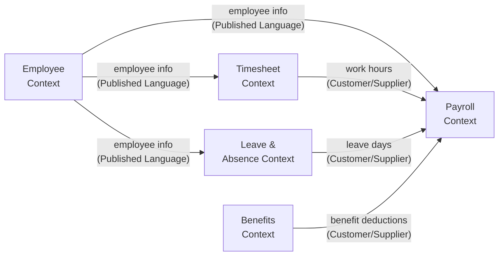

# Bounded Context — Xác định ranh giới domain

> **Vị trí trong pipeline:** Bước 2 — Sau khi có BRD, trước khi viết Glossary/Schema  
> **Mục tiêu:** Xác định các "vùng domain" độc lập, mỗi vùng có ngôn ngữ và model riêng nhất quán

---

## 1. Bounded Context là gì?

> **Bounded Context** = phạm vi mà trong đó một mô hình domain có ý nghĩa rõ ràng và nhất quán.

### Tại sao quan trọng?

Cùng một từ "Order" có thể có nghĩa khác nhau ở hai context:

| | Ordering Context | Shipping Context |
|-|-----------------|-----------------|
| **"Order"** | Đơn hàng đã được customer xác nhận, có sản phẩm và giá | Yêu cầu giao hàng đến địa chỉ X, với trọng lượng Y |
| **Quan tâm đến** | Sản phẩm, giá, discount, customer | Địa chỉ, trọng lượng, carrier, tracking |
| **Không quan tâm** | Chi tiết giao hàng | Giá sản phẩm, discount |

**Nếu không chia context:**
- Entity "Order" bị fat, có 50+ fields
- Team Ordering và team Shipping conflict khi thay đổi
- Model không phản ánh đúng bất kỳ context nào

---

## 2. Ba cách xác định Bounded Context

### Cách 1: Theo Business Capability

Mỗi capability độc lập → 1 context

```
E-commerce:
├── Catalog Management    → Catalog Context
├── Customer Management  → Customer Context
├── Order Management     → Ordering Context
├── Payment Processing   → Payment Context
└── Fulfillment          → Shipping Context
```

### Cách 2: Khi Language khác nhau

Dấu hiệu cần chia context: cùng một term được hiểu khác nhau

**Test nhanh:** Hỏi "Order là gì?" với team Ordering và team Shipping. Nếu 2 team mô tả khác nhau → cần 2 context.

### Cách 3: Khi Business Rules khác nhau

Mỗi nhóm rule cohesive → 1 context

```
Payment context có rule riêng:
- Retry policy
- Fraud detection
- Refund rules

Shipping context có rule riêng:
- Carrier selection
- Delivery SLA
- Return logistics
```

---

## 3. Dấu hiệu chia sai Context

| Dấu hiệu | Vấn đề | Fix |
|---------|---------|-----|
| Entity có > 20 attributes không liên quan | Context quá lớn | Chia nhỏ hơn |
| Glossary có term conflict (cùng tên, khác nghĩa) | Context chồng lấn | Tách rõ ranh giới |
| Two team cần approve cùng 1 entity change | Coupling quá cao | Mỗi team sở hữu 1 context |
| Flow diagram chồng chéo phức tạp, nhiều actor | Context quá nhiều trách nhiệm | Tách theo business capability |
| Schema change của 1 context làm break context khác | Context chưa decoupled | Dùng Anti-Corruption Layer |

---

## 4. Format tài liệu Bounded Context

### 4.1 Context Definition Document

Mỗi context cần có 1 definition document ngắn gọn:

```markdown
# Context: [Tên Context]

## Trách nhiệm
- [Điều context này CHỊU TRÁCH NHIỆM]
- [...]

## Không chịu trách nhiệm
- [Điều context này KHÔNG xử lý — thuộc context khác]
- [...]

## Core Entities (trong context này)
| Entity | Định nghĩa trong context này |
|--------|----------------------------|
| Order  | Đơn hàng đã confirm, có line items và tổng giá |
| ...    | ...                         |

## Integration Points
- Nhận event từ: [Context X] — event: [EventName]
- Gửi event đến: [Context Y] — event: [EventName]
- Gọi API của: [Context Z] — endpoint: [...]

## Team Owner
- Team: [Team Name]
- Tech Lead: [Name]
```

---

### 4.2 Context Map

**Scope:** System-level — vẽ tất cả context và mối quan hệ

**Tool:** Mermaid diagram trong `context-map.md`

```markdown
# Context Map

## Diagram

graph LR
    Catalog -->|product info| Ordering
    Customer -->|customer info| Ordering
    Ordering -->|order placed| Payment
    Ordering -->|order confirmed| Shipping
    Payment -->|payment result| Ordering
    Shipping -->|delivery status| Ordering

## Relationship Types

| Relationship | Type | Mô tả |
|-------------|------|-------|
| Catalog → Ordering | Published Language | Ordering consume Product schema từ Catalog |
| Ordering → Payment | Customer/Supplier | Ordering là upstream, Payment conformist |
| Ordering ↔ Shipping | Partnership | Hai team cộng tác, protocol được negotiate |
```

**Các loại quan hệ Context Map (DDD):**

| Type | Khi nào dùng |
|------|-------------|
| **Shared Kernel** | 2 context chia sẻ một phần model, cần coordinate khi thay đổi |
| **Customer/Supplier** | Upstream cung cấp, downstream consume — downstream không control spec |
| **Conformist** | Downstream hoàn toàn adopt model của upstream |
| **Anti-Corruption Layer (ACL)** | Downstream dịch model của upstream → không bị "ô nhiễm" |
| **Published Language** | Upstream publish schema chuẩn (như OpenAPI), downstream consume |
| **Partnership** | 2 team coordinate pipeline với nhau |

---

## 5. Folder Structure chuẩn

```
/docs
  context-map.md              ← system-level, mô tả tất cả context
  /ordering                   ← 1 folder per context
    _context.md               ← context definition (trách nhiệm, boundary)
    glossary.md
    model.linkml.yaml
    /flows
      place-order.md
      cancel-order.md
  /payment
    _context.md
    glossary.md
    model.linkml.yaml
    /flows
      process-payment.md
      refund.md
  /shipping
    _context.md
    glossary.md
    model.linkml.yaml
```

---

## 6. Bounded Context vs Module kỹ thuật

> Context là **business boundary**, không phải technical grouping.

| | Bounded Context | Module/Package kỹ thuật |
|-|----------------|------------------------|
| **Quyết định bởi** | Domain logic | Developer |
| **Thay đổi khi** | Business thay đổi | Refactor kỹ thuật |
| **Map 1-1 với service?** | Không bắt buộc | Có thể |
| **Có thể là** | Monolith module | Hoặc microservice |

**Ví dụ mapping:**

```
Ordering Context → có thể implement thành:
  - 1 microservice (order-service)
  - hoặc 1 module trong monolith (com.company.app.ordering)
  - hoặc 1 bounded context trong modular monolith
```

Quyết định deploy (monolith vs micro) là **độc lập** với quyết định domain boundary.

---

## 7. Checklist "Done" cho Bounded Context

- [ ] Tất cả context đã được **đặt tên** và có `_context.md`
- [ ] Trách nhiệm và ranh giới của mỗi context đã rõ (**không overlap**)
- [ ] Tất cả **integration point** giữa context đã được ghi vào context-map.md
- [ ] **Relationship type** (Customer/Supplier, ACL, etc.) đã được xác định
- [ ] Team owner của mỗi context đã được assign
- [ ] Team **đồng thuận** về cách chia context (không còn ambiguity)

---

## 8. Ví dụ hoàn chỉnh: HCM System



---

*→ Bước tiếp theo: [`04-glossary.md`](./04-glossary.md) — Viết Glossary cho mỗi context*
