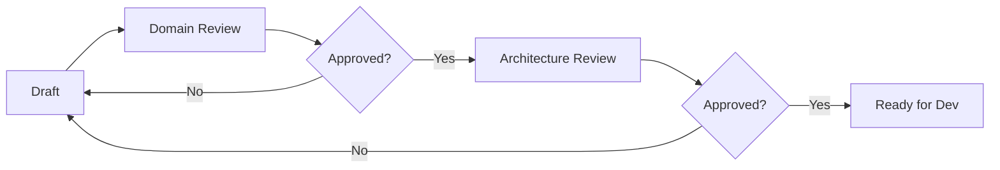

# Quy trình Phát triển theo ODSA

> **Mục tiêu:** Mô tả workflow thực tế cho từng vai trò trong team khi áp dụng phương pháp ODSA và tiêu chuẩn ODDS, tích hợp KnowledgeOS làm nền tảng knowledge.

---

## 1. Sự dịch chuyển vai trò

ODSA không thay thế con người — nó thay đổi **những gì** mỗi người làm.

### Business Analyst / Product Owner

| Trước (ODSA) | Sau (ODSA) |
|---|---|
| Viết PRD / BRD bằng Word | Viết `design/purpose.md` + `design/use_cases.md` |
| Vẽ BPMN diagrams | Viết `design/workflows.md` |
| Mô tả data model bằng text | Cộng tác viết `ontology/concepts/` |
| Tổ chức knowledge transfer meetings | AI Agent query knowledge graph |

**Vai trò mới:** BA trở thành **Semantic Designer** — người định nghĩa business concepts và workflows trong format có thể đọc bởi cả human lẫn AI.

### Developer

| Trước (ODSA) | Sau (ODSA) |
|---|---|
| Đọc 100 trang PRD để hiểu requirements | Query KnowledgeOS qua AI Agent |
| Tự thiết kế DB schema từ đầu | Dựa trên `system/db.dbml` skeleton |
| Tự thiết kế API từ đầu | Implement từ `system/canonical_api.openapi.yaml` |
| Hỏi BA/PM để hiểu business logic | Hỏi AI Agent với context từ knowledge graph |

**Vai trò mới:** Developer là **Knowledge Consumer** — làm việc dựa trên knowledge graph thay vì documents rời rạc.

### System Architect

| Trước (ODSA) | Sau (ODSA) |
|---|---|
| Review Word documents | Review LinkML ontology + DBML + OpenAPI |
| Approve design bằng email | Approve qua governance review flow |
| Cross-module design check bằng meeting | Query knowledge graph để xem relationships |



---

## 2. Workflow theo Phase dự án

### Phase 1 — Product Design (Domain Ontology)

**Người thực hiện:** BA + Product Owner (+ Architect review)

**Công việc thực tế:**

```text
1. Tạo folder structure cho module
2. Viết ontology/concepts/<entity>.yaml cho mỗi entity
3. Viết ontology/relationships.yaml
4. Viết ontology/lifecycle.yaml
5. Viết ontology/rules.yaml
6. Viết design/purpose.md
7. Viết design/use_cases.md
8. Viết design/workflows.md
9. Viết design/api_intent.md
10. Submit governance/metadata.yaml với status: Draft
```

**Output:** Module ontology + narrative docs hoàn chỉnh

**Trigger bước tiếp theo:** Architect review + approve (status: Approved)

---

### Phase 2 — System Design (Skeleton Generation)

**Người thực hiện:** Architect + Dev Lead

**Công việc thực tế:**

```text
1. Từ ontology/concepts/ → viết system/db.dbml skeleton
2. Từ design/api_intent.md → viết system/canonical_api.openapi.yaml
3. Từ ontology/lifecycle.yaml → viết system/events.yaml
4. Ingest tất cả artifacts vào KnowledgeOS
5. Update governance/metadata.yaml: status: Ready for Dev
```

> **Lưu ý:** Dev team vẫn **tự implement** logic. Skeleton chỉ là implementation guidance, không phải auto-generated code.

---

### Phase 3 — Development (AI-Assisted)

**Người thực hiện:** Developer

**Công việc thực tế:**

```text
1. Query KnowledgeOS để hiểu business rules và relationships
2. Implement DB tables từ db.dbml skeleton
3. Implement API endpoints từ canonical_api.openapi.yaml
4. Implement domain events từ events.yaml
5. Implement business rules từ ontology/rules.yaml
```

**Sử dụng AI Agent trong development:**

| Câu hỏi dev hỏi AI | AI trả lời dựa trên |
|---|---|
| "Validate worker create request thế nào?" | `ontology/rules.yaml` |
| "Khi suspend worker phải emit event gì?" | `system/events.yaml` + `ontology/lifecycle.yaml` |
| "Worker relate với entity nào khác?" | `ontology/relationships.yaml` |
| "API /workers/{id}/status làm gì?" | `design/api_intent.md` + `system/canonical_api.openapi.yaml` |

---

### Phase 4 — Continuous Evolution (Living Ontology)

**Người thực hiện:** Cả team

Khi business requirements thay đổi:

```text
1. Cập nhật ontology/concepts/ hoặc lifecycle.yaml hoặc rules.yaml
2. Update governance/metadata.yaml với changelog entry
3. Re-ingest vào KnowledgeOS (pipeline tự động update)
4. AI Agent tự động có context mới
5. Generate artifact mới nếu cần (DBML, OpenAPI)
```

> **Nguyên tắc:** Ontology là **living artifact**, không bao giờ outdated vì nó là source of truth.



---

## 3. Daily Workflow Map

### 🧑‍💼 Business Analyst — Daily Tasks

```text
Sáng:
  - Review ontology PR từ team
  - Refine use_cases.md dựa trên feedback từ dev

Khi có requirement mới:
  - Tạo concept YAML mới hoặc update existing
  - Viết/update design docs
  - Submit PR → request Domain Review

Khi cần cross-module info:
  - Query KnowledgeOS: "What concepts does Payroll depend on from HR?"
```

### 🧑‍💻 Developer — Daily Tasks

```text
Khi bắt đầu feature:
  1. Mở KnowledgeOS / dùng AI Agent để query context
  2. Hỏi: "Show me the Worker concept and all its relationships"
  3. Hỏi: "What APIs does this module expose?"
  4. Implement dựa trên knowledge graph response

Khi gặp business logic unclear:
  - Query KnowledgeOS thay vì hỏi BA trực tiếp
  - Nếu vẫn không rõ → BA update ontology → auto sync
```

### 🏗️ System Architect — Review Flow

```text
Domain Review:
  - Review ontology/concepts/ có model đúng domain không
  - Review relationships.yaml không có circular deps
  - Review lifecycle.yaml có valid state machine không

Architecture Review:
  - Review canonical_api.openapi.yaml có đúng REST resource model
  - Review db.dbml có match với ontology không
  - Review events.yaml đủ payload cho downstream consumers
```

---

## 4. Ingest Pipeline — Semantic CI/CD

KnowledgeOS cần được cập nhật mỗi khi có thay đổi ontology. Đây là "Semantic CI/CD".

### Trigger

Git push vào repo chứa:

```text
<module>/ontology/
<module>/design/
<module>/system/
```

### Pipeline Steps

```text
1. Validate LinkML (linkml validate)
2. Parse concepts → Concept nodes vào Property Graph
3. Parse lifecycle → State/Transition nodes
4. Parse rules → Constraint nodes
5. Parse Markdown docs → Chunks → Embeddings → Vector store (FTS5)
6. Parse DBML → Table/Column nodes, link với Concept nodes
7. Parse OpenAPI → APIEndpoint nodes
8. AI Agent context updated automatically
```

### Kết quả

Sau khi pipeline chạy xong, AI Agent có thể:
- Traverse: `Worker → Lifecycle → Transition → Event → API`
- Search: "Tìm tất cả documents liên quan đến worker suspension"
- Infer: "Những module nào phụ thuộc vào Worker concept?"

---

## 5. Review và Approval Process



### Review Checklist

**Domain Review (BA/PO):**
- [ ] Tất cả entities có description rõ ràng
- [ ] Relationships phản ánh đúng business rules
- [ ] Lifecycle states cover tất cả business scenarios
- [ ] Use cases đầy đủ và accurate

**Architecture Review:**
- [ ] Canonical API design theo REST resource model
- [ ] DB schema phản ánh đúng ontology
- [ ] Events có đủ payload cho downstream consumers
- [ ] Không có circular dependencies giữa modules

---

## 6. Git Repository Structure

```text
product_repo/
├── modules/
│   ├── hr_core/
│   │   ├── ontology/
│   │   ├── design/
│   │   ├── system/
│   │   └── governance/
│   ├── payroll/
│   └── ...
├── shared/
│   └── shared_concepts.yaml  ← Cross-module shared entities
└── .knowledgeos.yaml          ← KnowledgeOS ingest config
```

### Branch Strategy

```text
main          ← approved, production-ready ontology
develop       ← integration branch
feature/<name> ← individual module/concept work
```

---

## 7. Anti-patterns cần tránh

| Anti-pattern | Vấn đề | Cách đúng |
|---|---|---|
| Viết PRD Word rồi mới viết ontology | Duplicate effort | Bắt đầu bằng ontology |
| Business rule chỉ trong code | AI không biết | Đưa vào `ontology/rules.yaml` |
| API spec không match canonical_api.yaml | Inconsistency | canonical_api.yaml là source of truth |
| Cập nhật DB mà không update DBML | Outdated artifacts | DBML phải luôn sync với DB |
| Skip governance/metadata.yaml | Không audit trail | Mandatory cho mọi module |
