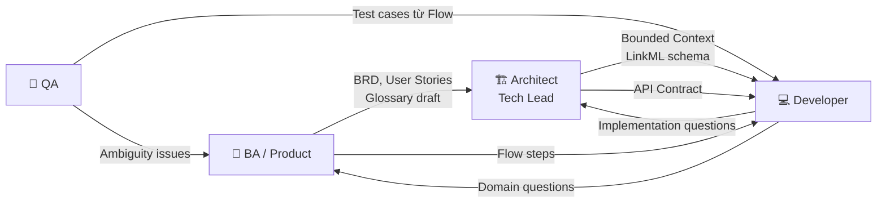

# Collaboration Guide — Quy trình phối hợp team

> **Mục đích:** Hướng dẫn cụ thể về cách các team (BA, Architect, Dev, QA) phối hợp trong pipeline ODSA

---

## 1. Tổng quan phối hợp



---

## 2. Ma trận RACI chi tiết

| Artifact | BA | Architect | Dev | QA | Note |
|---------|:--:|:---------:|:---:|:--:|------|
| BRD | **R/A** | C | I | I | BA tạo, Arch review |
| User Stories | **R/A** | C | C | C | Cả team contribute |
| Bounded Context | C | **R/A** | C | — | Arch decide |
| Glossary | **R/A** | C | C | I | BA+Dev cùng refine |
| LinkML Schema | — | **R/A** | C | — | Arch lead, Dev review |
| Use Case Flow | **R/A** | C | I | C | BA viết, QA verify |
| Context Map | I | **R/A** | I | — | Arch sở hữu |
| API Contract | — | **R/A** | C | I | Tech-driven, input từ flow |
| Code | — | C | **R/A** | I | Dev sở hữu |
| Test Cases | C | — | C | **R/A** | Derived từ Flow |

> **R** = Responsible (thực hiện) | **A** = Accountable (chịu trách nhiệm cuối) | **C** = Consulted | **I** = Informed

---

## 3. Entry/Exit Criteria mỗi bước

### Bước 1: Reality (BRD)
| | Tiêu chí |
|-|---------|
| **Có thể bắt đầu khi** | Có stakeholder sẵn sàng phỏng vấn |
| **Xong khi** | Tất cả actor, event, rule đã được capture; stakeholder sign-off; hot spots được ghi |
| **Ai sign-off** | BA + PO/Stakeholder |

### Bước 2: Bounded Context
| | Tiêu chí |
|-|---------|
| **Có thể bắt đầu khi** | BRD draft đã xong, ít nhất 70% |
| **Xong khi** | Mọi domain term có "home context"; team đồng thuận ranh giới; không còn conflict |
| **Ai sign-off** | Architect + BA |

### Bước 3: Glossary
| | Tiêu chí |
|-|---------|
| **Có thể bắt đầu khi** | Bounded context đã identify |
| **Xong khi** | Tất cả entity, event, command chính đã define; không còn `❓`; Both BA và Dev đồng ý |
| **Ai sign-off** | BA + Tech Lead |

### Bước 4: LinkML
| | Tiêu chí |
|-|---------|
| **Có thể bắt đầu khi** | Glossary đã sign-off |
| **Xong khi** | `linkml-validate` pass; tất cả entity có class; cardinality constraint đúng |
| **Ai sign-off** | Architect |

### Bước 5: Flow
| | Tiêu chí |
|-|---------|
| **Có thể bắt đầu khi** | Glossary xong (không cần đợi LinkML) |
| **Xong khi** | Happy path và major error paths documented; QA confirm đủ để viết test case |
| **Ai sign-off** | BA + QA |

### Bước 6: API Contract
| | Tiêu chí |
|-|---------|
| **Có thể bắt đầu khi** | LinkML + Flow đều xong |
| **Xong khi** | FE có thể mock API; BE confirm schema implementable |
| **Ai sign-off** | Tech Lead (cả FE và BE) |

---

## 4. Handoff Protocol

### Handoff là gì?
Khi 1 artifact được chuyển từ team này sang team khác, cần:
1. **Thông báo** qua slack/jira
2. **Review session** (nếu phức tạp) hoặc async review (nếu đơn giản)
3. **Approved** bởi người nhận trước khi bước tiếp theo bắt đầu

### Handoff checklist per artifact

```markdown
## Handoff: Glossary → LinkML (BA → Architect)

Checklist:
- [ ] Glossary file tồn tại tại đúng path: /<context>/glossary.md
- [ ] Không còn `❓` unresolved
- [ ] Tất cả entity có definition và phần "Khác với"
- [ ] Status lifecycle đã được mô tả
- [ ] BA đã sign-off

Ghi chú cho Architect:
- Nhớ check: [Tên entity] có ambiguity ở [field X]
- Rule [Y] cần implement thành constraint trong LinkML
```

---

## 5. Quy trình họp chuẩn

### 5.1 Kickoff Session (Bước 1 - Reality)
- **Ai tham gia:** BA, Architect, Tech Lead, Stakeholder
- **Thời gian:** 1-2 giờ
- **Output:** BRD draft, danh sách hot spots
- **Format:** Workshop, whiteboard (digital hoặc physical)

### 5.2 Domain Discovery Workshop (Bước 1-2)
- **Ai tham gia:** BA, Architect, Lead Dev
- **Thời gian:** 2-4 giờ (Event Storming)
- **Output:** Event list, context draft
- **Format:** Sticky notes / Miro board

### 5.3 Glossary Review (Bước 3)
- **Ai tham gia:** BA + Full dev team
- **Thời gian:** 30-60 phút
- **Output:** Glossary approved
- **Format:** Walk-through từng term, mọi người có quyền question

### 5.4 Schema Review (Bước 4)
- **Ai tham gia:** Architect + Senior Dev
- **Thời gian:** 30-45 phút
- **Output:** LinkML approved
- **Format:** Code review style (diff review)

### 5.5 API Contract Review (Bước 6)
- **Ai tham gia:** BE Tech Lead + FE Tech Lead + BA
- **Thời gian:** 1 giờ
- **Output:** API Contract approved
- **Format:** Walk-through từng endpoint theo use case

---

## 6. Full Pipeline vs Pragmatic Mode

### Full Pipeline — khi nào?
- Project duration > 6 tháng
- Team > 5 người
- Domain phức tạp, nhiều context (> 3)
- Có compliance/audit requirement
- Nhiều bounded context integration

→ Dùng tất cả 8 tài liệu + tất cả review session

### Pragmatic Mode — khi nào?
- Sprint mới, feature nhỏ trong hệ thống hiện có
- Team đã familiar với domain
- Scope rõ ràng, ít context mới

→ Minimum viable docs:

```
1. [ ] Glossary update (nếu có term mới)
2. [ ] LinkML update (nếu có entity mới)
3. [ ] Flow document (cho use case mới)
4. [ ] API Contract update
```

Không cần: BRD đầy đủ, Context Map update (nếu không có context mới)

---

## 7. Convention đặt tên file

```
/docs
  00-overview.md
  01-pipeline-master.md
  context-map.md

  /<context-name>/                    ← lowercase, kebab-case
    _context.md                       ← context definition
    glossary.md                       ← Ubiquitous Language
    model.linkml.yaml                 ← LinkML schema
    api.openapi.yaml                  ← API Contract
    /flows/
      <verb>-<noun>.md               ← e.g., place-order.md, cancel-order.md

  /templates/
    glossary-template.md
    linkml-template.yaml
    flow-template.md
    context-template.md
```

---

## 8. Troubleshooting — Những vấn đề phổ biến

| Vấn đề | Nguyên nhân | Giải pháp |
|--------|------------|-----------|
| Dev và BA disagree về definition | Glossary chưa được review đủ | Tổ chức Glossary review session, có Architect làm moderator |
| LinkML conflict với business rule trong Glossary | Viết LinkML trước khi Glossary xong | Luôn đợi Glossary sign-off trước |
| API design bị CRUD | Dev define API từ DB table | Review lại Flow, derive API từ use case thay vì từ table |
| Flow document quá dài, không ai đọc | Nhồi nhiều use case vào 1 file | 1 file = 1 use case, tách sub-flow nếu cần |
| Team mới không biết bắt đầu từ đâu | Thiếu onboarding | Đọc 00-overview.md → 01-pipeline-master.md theo thứ tự |

---

*→ Xem các templates tại: [`/templates/`](./templates/)*
