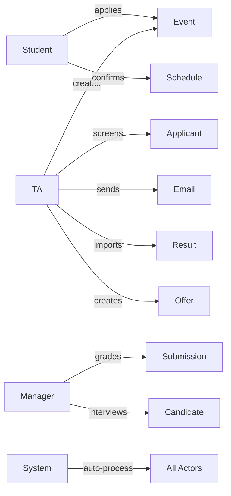

# BRD — ATS Fresher Module

> **Version:** 1.0
> **Last updated:** 2026-03-20
> **Authors:** BA Team + Tech Lead
> **Status:** DRAFT
> **Source Document:** `ATS_Flow Fresher (Sent) _ Internal (1).md`

---

## 1. Business Context

### Organization

| Attribute | Value |
|-----------|-------|
| **Department** | Human Resources |
| **Business Unit** | Talent Acquisition (TA) |
| **Geographic Scope** | Vietnam (Hanoi, Ho Chi Minh City, Binh Duong) |
| **Primary Users** | TA Team, Hiring Managers, Students |

### Current State

#### Problem Statement

Quy trình tuyển dụng Fresher hiện tại được quản lý thủ công qua nhiều vòng (Screening → Online Test → Onsite Test → Interview → Offer) với các vấn đề sau:

**1. Quản lý Event & Request tuyển dụng rời rạc:**
- Không có cơ chế mapping rõ ràng giữa Event Fresher và các Request tuyển dụng
- Khó track được Request nào đang được tuyển qua Event nào
- Không kiểm soát được việc post Job lên Career Site sau khi map Event

**2. Processing thủ công nhiều công đoạn:**
- TA phải gửi mail thủ công cho từng vòng (mời test, mời interview, thank you)
- Manual scheduling cho Onsite Test và Interview (chia ca, booking phòng)
- Import/export kết quả chấm điểm từ Excel qua hệ thống
- Manual check-in cho ứng viên tại sự kiện

**3. Không có central tracking cho candidate journey:**
- Khó xem ứng viên đang ở vòng nào, đã qua những vòng gì
- Không track được conversion rate qua các vòng
- Khó phát hiện ứng viên duplicate (nhiều account cho cùng 1 người)

**4. Candidate experience không nhất quán:**
- Mỗi Event có quy trình khác nhau (có Event có Online Test, Event khác skip)
- Template email không đồng bộ theo stage
- Không có self-service cho ứng viên confirm lịch

#### Business Impact

| Impact Area | Current State | Cost/Issue |
|-------------|---------------|------------|
| **TA Overhead** | Manual processing cho mỗi Event | 20-30 giờ/Event |
| **Duplicate Candidates** | Không detect được | 5-10% applications trùng |
| **Scheduling Errors** | Manual chia ca, booking | 10-15% slots bị overbooked |
| **Email Consistency** | Manual send, không track được | 20% emails sai template |
| **Check-in Experience** | Manual search & confirm | 2-3 phút/application |
| **Result Tracking** | Excel-based grading | 10% data entry errors |

#### Current Process Flow

```
┌─────────────┐     ┌─────────────┐     ┌─────────────┐
│   TA tạo    │────>│  Student    │────>│  Screening  │
│   Event     │     │  Apply      │     │   Review    │
└─────────────┘     └─────────────┘     └─────────────┘
                                               │
                    ┌──────────────────────────┘
                    v
┌─────────────┐     ┌─────────────┐     ┌─────────────┐
│    Offer    │<────│  Interview  │<────│  Onsite     │
│   Letter    │     │   Round     │     │    Test     │
└─────────────┘     └─────────────┘     └─────────────┘
```

### Why Now

#### Trigger Event

- **Headcount Growth:** Công ty đang mở rộng với số lượng lớn Fresher cần tuyển mỗi quý
- **Multiple Events:** 5-10 Fresher Events được tổ chức mỗi tháng cao điểm
- **Scale Requirement:** Cần xử lý 500-1000 applications/Event mà không tăng headcount TA

#### Urgency

- **Mùa tuyển dụng Fresher:** Các sự kiện Fresher tập trung vào Q2-Q3 hàng năm
- **Competitive Pressure:** Các công ty đối thủ đang tự động hóa quy trình tuyển dụng
- **Candidate Expectations:** Ứng viên mong đợi trải nghiệm chuyên nghiệp, nhanh chóng

#### Cost of Delay

| Delay Period | Impact |
|--------------|--------|
| **1 tháng** | 2-3 Events bị delay, ~500 applications xử lý manual |
| **1 quý** | Mất mùa tuyển dụng chính, ~2000 applications manual |
| **6 tháng** | Candidate experience giảm, employer brand ảnh hưởng |

**Estimated Cost:** ~100M VND/quý cho TA overtime + opportunity cost từ missed hires

---

## 2. Business Objectives

| ID | Objective | Current | Target | Timeline |
|----|-----------|---------|--------|----------|
| **BO-001** | Reduce TA administrative overhead per Event | 20-30 giờ/Event | <5 giờ/Event | Q2 2026 |
| **BO-002** | Reduce duplicate candidate applications | 5-10% duplicates | <1% duplicates | Q2 2026 |
| **BO-003** | Reduce scheduling errors for Onsite/Interview | 10-15% errors | <2% errors | Q2 2026 |
| **BO-004** | Improve email template consistency | 80% consistency | 100% consistency | Q2 2026 |
| **BO-005** | Reduce check-in time per candidate | 2-3 phút | <30 giây | Q2 2026 |
| **BO-006** | Reduce data entry errors for grading results | 10% errors | <1% errors | Q2 2026 |
| **BO-007** | Enable self-service for candidate schedule confirmation | 0% self-service | 100% self-service | Q2 2026 |
| **BO-008** | Improve candidate visibility through pipeline | Not available | Real-time visibility | Q2 2026 |
| **BO-009** | Support flexible Event workflows (skip rounds) | Fixed workflow | Configurable per Event | Q2 2026 |
| **BO-010** | Enable bulk actions for TA (send mail, move rounds) | Manual per candidate | Bulk up to 100 candidates | Q2 2026 |

---

## 3. Business Actors

| Actor | Role | Frequency | Permissions/Responsibilities |
|-------|------|-----------|------------------------------|
| **TA (Talent Acquisition)** | Event organizer, process administrator | Daily | - Tạo Event Fresher và mapping Request<br>- Thiết lập workflow (skip rounds)<br>- Review & Screening applications<br>- Tạo Assignment/Online Test<br>- Gửi mail mời Test/Interview<br>- Setup ca thi, booking phòng<br>- Check-in ứng viên<br>- Import kết quả chấm<br>- Tạo Offer Letter<br>- Bulk actions (send mail, move rounds) |
| **Student** | Applicant for Fresher Event | Per Event | - Apply vào Event (chọn Track)<br>- Trả lời bộ câu hỏi<br>- Nộp Assignment online<br>- Confirm tham gia Test/Interview<br>- Check-in onsite<br>- Phản hồi Offer (Accept/Reject) |
| **Manager (Hiring Manager)** | Interviewer, grader | Per Event | - Chấm Assignment/Online Test<br>- Chấm Onsite Test<br>- Phỏng vấn Interview round<br>- Đề xuất Pass/Fail/Offer |
| **System** | Automated processor | Continuous | - Auto gen SBD khi đến vòng Onsite<br>- Auto gửi mail theo schedule<br>- Auto chia ca theo rule<br>- Auto detect duplicate (SĐT + StudentID)<br>- Auto tạo Candidate RR khi Pass Screening<br>- Auto complete task khi TA import result |
| **HR Admin** | Policy administrator | Weekly | - Manage Questionnaire templates<br>- Manage Email templates<br>- View reports & analytics |

### Actor Relationships



---

## 4. Business Rules

### Validation Rules

| ID | Rule | Description |
|----|------|-------------|
| **BR-VAL-001** | Event Program Eligibility | Chỉ Event thuộc Program "Fresher" mới được map Request tuyển dụng |
| **BR-VAL-002** | Request Type Validation | Chỉ Request loại "Fresher" mới được map vào Event |
| **BR-VAL-003** | Request Status Validation | Chỉ Request đã được approve (hoàn tất) mới được map vào Event |
| **BR-VAL-004** | Single Track Application | Mỗi Student chỉ được apply 1 Track/Event |
| **BR-VAL-005** | Event Application Window | Student chỉ được apply khi Event đang trong thời gian hiệu lực |
| **BR-VAL-006** | Duplicate Application Prevention | Student không được apply cùng 1 Event nhiều lần |
| **BR-VAL-007** | Assignment Submission Deadline | Student chỉ được nộp bài trước deadline |
| **BR-VAL-008** | File Format Validation | File nộp Assignment phải đúng format (Word/PDF/Excel/PPT) |
| **BR-VAL-009** | File Size Validation | File nộp Assignment phải ≤ 10MB |
| **BR-VAL-010** | Schedule Confirmation Deadline | Student chỉ được confirm trước hạn chót |
| **BR-VAL-011** | Single Schedule Change | Student chỉ được đổi lịch 1 lần |
| **BR-VAL-012** | Offer Response Validation | Student chỉ được chọn Accept hoặc Reject (không có Negotiate) |

### Authorization Rules

| ID | Rule | Description |
|----|------|-------------|
| **BR-AUTH-001** | Event Creation | Chỉ TA mới có quyền tạo Event Fresher |
| **BR-AUTH-002** | Request Mapping | Chỉ TA mới có quyền mapping Request vào Event |
| **BR-AUTH-003** | Screening Decision | Chỉ TA mới có quyền quyết định Pass/Fail Screening |
| **BR-AUTH-004** | Assignment Grading | Chỉ Manager được TA phân công mới chấm được Assignment |
| **BR-AUTH-005** | Onsite Test Grading | Chỉ Manager được TA phân công mới chấm được Onsite Test |
| **BR-AUTH-006** | Interview Grading | Chỉ Interviewer trong ca mới chấm được Interview |
| **BR-AUTH-007** | Result Import | Chỉ TA mới có quyền import kết quả hàng loạt |
| **BR-AUTH-008** | Offer Creation | Chỉ TA mới có quyền tạo Offer Letter |
| **BR-AUTH-009** | Bulk Actions | Chỉ TA mới có quyền thực hiện bulk actions |
| **BR-AUTH-010** | Duplicate Resolution | Chỉ TA mới có quyền resolve duplicate (remove/replace) |
| **BR-AUTH-011** | Unmap Request | Chỉ TA mới có quyền unmap Request (khi chưa có Student apply) |

### Calculation Rules

| ID | Rule | Description |
|----|------|-------------|
| **BR-CALC-001** | SBD Generation | Số báo danh được gen tự động khi Student vào vòng Onsite Test |
| **BR-CALC-002** | Auto Slot Allocation | Hệ thống tự chia đều Student vào các ca theo rule: slots = ceil(students / ca_count) |
| **BR-CALC-003** | Duplicate Detection | Duplicate được detect khi trùng SĐT HOẶC trùng StudentID |
| **BR-CALC-004** | Candidate RR Creation | Candidate RR được auto tạo khi Student Pass Screening |
| **BR-CALC-005** | Task Auto-Complete | Task của Manager được auto complete khi TA import kết quả |

### Constraint Rules

| ID | Rule | Description |
|----|------|-------------|
| **BR-CONST-001** | Event-Request Mapping | Một Request chỉ được map 1 Event duy nhất |
| **BR-CONST-002** | Post Job Restriction | Request đã map Event không được post lên Career Site |
| **BR-CONST-003** | Unmap Restriction | Không được unmap Request nếu đã có Student apply |
| **BR-CONST-004** | Add Mapping Restriction | Không được add mapping Request sau khi Event đã publish lên CS |
| **BR-CONST-005** | Screening Fail Handling | Student Fail Screening không tạo Candidate RR |
| **BR-CONST-006** | Failed Applicant Display | Student Fail vẫn hiển thị trong Applicant list với Result = Failed |
| **BR-CONST-007** | Interviewer Visibility | Interviewer chỉ thấy Candidate được phân công |
| **BR-CONST-008** | Grader Visibility | Manager chỉ thấy Student được giao chấm |
| **BR-CONST-009** | Thank You Letter Limit | Chỉ được gửi Thank You Letter 1 lần cho 1 Candidate/Stage |
| **BR-CONST-010** | Schedule Change Limit | Student chỉ được đổi lịch 1 lần, lần sau chỉ còn Yes/No |
| **BR-CONST-011** | Interviewer Schedule Lock | Interviewer không được request đổi lịch một khi đã chốt |
| **BR-CONST-012** | Visual Feedback for Failed | Row của Failed/Rejected candidates được dimmed nhưng vẫn checkbox được |
| **BR-CONST-013** | Bulk Action Confirmation | Khi chọn mixed list (Pass + Fail), hệ thống hiển thị confirmation modal và auto skip Fail |
| **BR-CONST-014** | Dynamic Column Display | Column hiển thị theo Field/Question của Event, mặc định ẩn bộ câu hỏi |
| **BR-CONST-015** | File Preview | Preview từng file riêng lẻ cho Assignment submission |

### Compliance Rules

| ID | Rule | Description |
|----|------|-------------|
| **BR-COMP-001** | Audit Trail | Tất cả transactions phải được log với timestamp và actor |
| **BR-COMP-002** | Email Notification | Ứng viên phải nhận email confirmation cho tất cả actions (apply, submit, schedule, result) |
| **BR-COMP-003** | Data Retention | Dữ liệu ứng viên được lưu tối thiểu 2 năm theo chính sách công ty |
| **BR-COMP-004** | PDPL Compliance | Hệ thống phải comply Vietnam PDPL cho personal data của ứng viên |
| **BR-COMP-005** | Template Consistency | Email templates phải đồng bộ theo stage (Screening Fail vs Interview Fail có template khác nhau) |
| **BR-COMP-006** | Report Generation | Hệ thống phải generate reports cho tất cả Events |

---

## 5. Out of Scope

The following items are **explicitly NOT** included in this project:

### Features Not Included

- **Job Post tự động lên Career Site:** Request mapping vào Event không post tự động lên CS
- **Online Interview tích hợp video call:** Chỉ hỗ trợ link third-party (Zoom/Google Meet)
- **Mobile app:** Web-responsive only cho Phase 1
- **Candidate self-service profile updates:** Ứng viên không tự update được profile
- **Advanced analytics dashboard:** Chỉ basic reports, không có predictive analytics
- **Integration với assessment tools third-party:** Không tích hợp với HackerRank, CodeSignal, etc.

### Integrations Not Included

- **Google Calendar/Outlook auto booking:** Room booking manual (gõ tay phòng)
- **HRIS integration:** Không sync employee data từ HRIS
- **Payroll system integration:** Không export data sang payroll
- **Background check integration:** Không tích hợp với dịch vụ background verification
- **SMS gateway integration:** Chỉ gửi email, không gửi SMS

### User Groups Not Included

- **Interns:** Leave tracked manually by HR
- **Contractors:** Được xử lý qua separate vendor system
- **Overseas candidates:** Chỉ apply cho Vietnam-based events

### Features Deferred to Phase 2+

- **Candidate portal self-service:** Ứng viên tự track status online
- **Interviewer portal:** Interviewer tự xem schedule và chấm điểm trực tiếp
- **Advanced duplicate detection:** AI-based matching (ngoài SĐT + StudentID)
- **Automated offer negotiation:** Workflow cho Negotiate option
- **Multi-language support:** Chỉ tiếng Việt cho Phase 1

---

## 6. Assumptions & Dependencies

### Assumptions

| ID | Assumption | Impact if False | Validation Needed |
|----|------------|-----------------|-------------------|
| **A-001** | Tất cả ứng viên có email hợp lệ | Không gửi được thông báo | Verify khi apply |
| **A-002** | Tất cả TA có thể truy cập hệ thống | TA không thể processing | IT access audit |
| **A-003** | Tất cả Managers có thể truy cập hệ thống để chấm | Managers không chấm được | IT access audit |
| **A-004** | Questionnaire templates đã có sẵn trong hệ thống | Không tạo được bộ câu hỏi | HR confirm |
| **A-005** | Email templates đã được approve bởi HR/Communications | Emails không đúng brand | HR confirm |
| **A-006** | Career Site integration đã tồn tại và hoạt động | Applications không vào được ATS | IT confirm |
| **A-007** | SĐT và StudentID là đủ để detect duplicate | False positives/negatives trong duplicate detection | BA confirm với nghiệp vụ |
| **A-008** | Một Request chỉ cần map 1 Event là đủ | Requirement không được fulfill nếu cần nhiều Events | BA confirm |
| **A-009** | Program "Fresher" là program chính cho events này | Events khác không áp dụng được rules | HR confirm |
| **A-010** | Room booking manual là acceptable cho Phase 1 | Overhead cho TA nếu cần auto booking | TA confirm |

### Dependencies

| ID | Dependency | Owner | Due Date | Status |
|----|------------|-------|----------|--------|
| **D-001** | Career Site API specification cho Event listing | IT Integration Team | 2026-04-01 | Open |
| **D-002** | Email template approvals từ HR/Communications | HR Director | 2026-03-25 | Open |
| **D-003** | Questionnaire templates từ BA | BA Team | 2026-03-25 | Open |
| **D-004** | Request tuyển dụng data model | IT Data Team | 2026-03-20 | In Progress |
| **D-005** | Program mapping configuration (Fresher, Job Fair, etc.) | HR Admin | 2026-03-25 | Open |
| **D-006** | File storage configuration cho attachments | IT Infrastructure | 2026-04-05 | Open |
| **D-007** | Email server configuration | IT Infrastructure | 2026-03-30 | In Progress |
| **D-008** | Candidate RR data model specification | IT Data Team | 2026-03-22 | Open |
| **D-009** | Bulk action requirements chi tiết | BA Team | 2026-03-28 | Open |
| **D-010** | Report templates từ nghiệp vụ | HR/TA | 2026-04-10 | Open |

### External System Dependencies

```
┌─────────────────┐     ┌─────────────────┐     ┌─────────────────┐
│  Career Site    │────>│  ATS Fresher    │────>│  Email Server   │
│  (applications) │     │     Module      │     │ (notifications) │
└─────────────────┘     └─────────────────┘     └─────────────────┘
                               │
                               v
                        ┌─────────────────┐
                        │  File Storage   │
                        │  (attachments)  │
                        └─────────────────┘
```

### Technical Dependencies

| Technology | Purpose | Version/Provider |
|------------|---------|------------------|
| **Database** | Lưu trữ applications, events, results | PostgreSQL 15+ |
| **File Storage** | Lưu CV, attachments, submissions | AWS S3 / MinIO |
| **Email Service** | Gửi email notifications | SMTP / SendGrid |
| **Backend Framework** | API implementation | Node.js / .NET |
| **Frontend** | TA portal, Student portal | React / Vue.js |

---

## Review Notes

| Date | Comment | Author | Status |
|------|---------|--------|--------|
| 2026-03-20 | Initial draft created | AI Assistant | OPEN |
| | | | |
| | | | |
| | | | |

---

## Appendix A: Event Flow Types

### Fresher Event Flows

```
Flow 1: Full Pipeline
Screening → Online Test (n) → Onsite Test (n) → Interview (n) → Offer

Flow 2: Skip Online Test
Screening → Onsite Test (n) → Interview (n) → Offer

Flow 3: Skip Tests
Screening → Interview (n) → Offer
```

### Non-Fresher Event Flows (Job Fair, Uniweek)

```
Flow 1: Screening Only
Screening → Done

Flow 2: Check-in Only
Screening → Mời check-in → Check-in → Done
```

**Note:** `(n)` = có thể có nhiều rounds cùng loại

---

## Appendix B: Bulk Actions Specification

### Visual Feedback Rules

| Condition | Visual State | Checkbox State |
|-----------|--------------|----------------|
| Status = Pass | Normal | Enabled |
| Status = Fail/Rejected | Dimmed (mờ nhẹ) | Enabled |
| Status = Pending | Normal | Enabled |

### Confirmation Modal

Khi TA chọn danh sách hỗn hợp (Pass + Fail) và bấm nút action (Send Mail, Move to Next Round):

```
┌─────────────────────────────────────────────────────────┐
│  Confirmation                                           │
├─────────────────────────────────────────────────────────┤
│  Bạn đang thực hiện gửi đề test/mời interview cho       │
│  15 ứng viên đã chọn.                                   │
│                                                         │
│  ⚠️ Hệ thống phát hiện 03 ứng viên không đủ điều kiện   │
│     (Status = Fail/Rejected). Những ứng viên này sẽ    │
│     tự động bị loại bỏ khỏi danh sách gửi.             │
│                                                         │
│  ✅ Ready to Send (12):                                 │
│     - Nguyen Van A                                      │
│     - Tran Thi B                                        │
│     - ...                                               │
│                                                         │
│  ⚠️ Skipped (03):                                       │
│     - Le Van C (Status: Fail)                           │
│     - Pham Thi D (Status: Rejected)                     │
│     - ...                                               │
│                                                         │
│  [Cancel]  [Confirm & Send (12)]                        │
└─────────────────────────────────────────────────────────┘
```

---

## Appendix C: Dynamic Column Specification

### Default Column Configuration

| Column Group | Columns | Default Visibility |
|--------------|---------|-------------------|
| **Core Info** | Name, Email, SĐT, Student ID | Always visible |
| **Application** | Apply Date, Track, Status | Always visible |
| **Documents** | CV, Attach File | Hidden (hiển thị nếu có data) |
| **Event Fields** | Dynamic fields từ Event config | Hidden (TA toggle) |
| **Questions** | Bộ câu hỏi theo Track | Hidden (filter theo Track) |

### Filter Behavior

| Filter Type | Behavior |
|-------------|----------|
| **Filter theo Track** | Hiển thị bộ câu hỏi của Track đó |
| **Filter theo Stage/Round** | Hiển thị applications trong stage đó |
| **Filter theo Result** | Hiển thị applications với result đó |
| **Filter theo Event Field** | Hiển thị column field đó nếu chưa hiển thị |

---

## Document History

| Version | Date | Author | Changes |
|---------|------|--------|---------|
| 1.0 | 2026-03-20 | AI Assistant | Initial draft |
| | | | |
