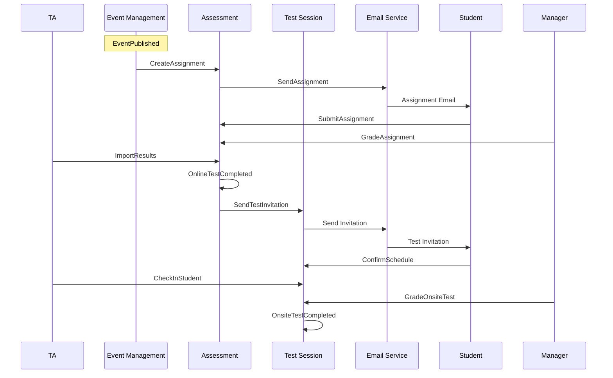
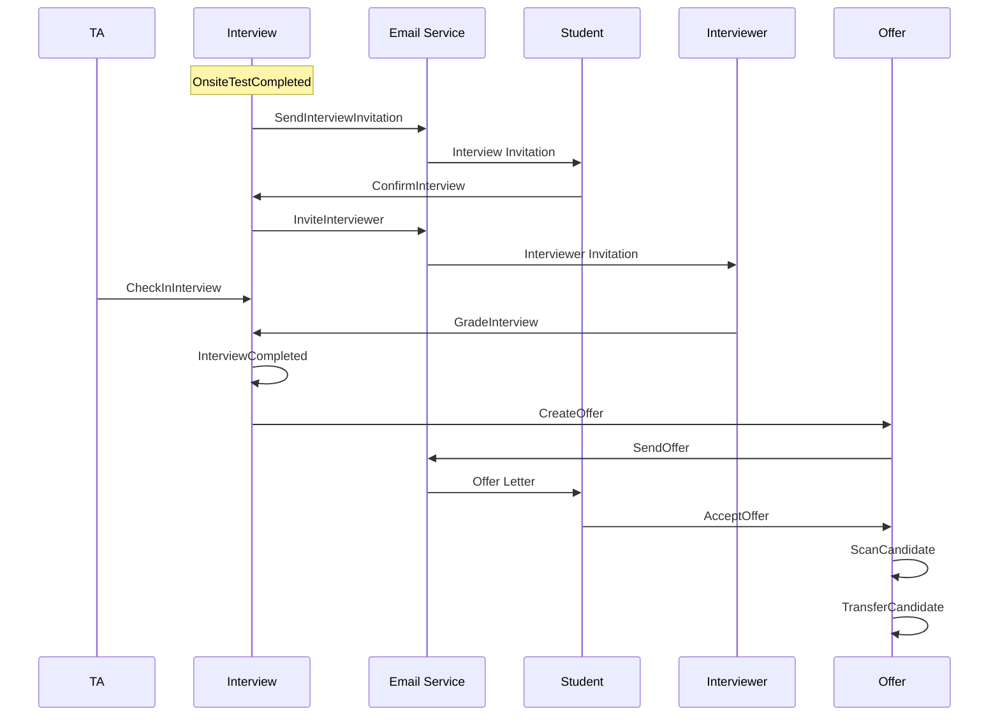

# Context Map — ATS Fresher Module

> **Version:** 1.0
> **Last Updated:** 2026-03-20
> **Source Documents:** `2.event-storming/event-storming-summary.md`, `3.interview/stakeholder-interview-p0-hotspots.md`

---

## System Overview

**ATS Fresher** — Applicant Tracking System for Fresher Recruitment

| Attribute | Value |
|-----------|-------|
| **System Name** | ATS Fresher Module |
| **Business Capability** | Fresher recruitment automation |
| **Primary Users** | TA Team, Hiring Managers, Students |
| **Contexts Identified** | 7 bounded contexts |

---

## L1 Context Map (System-Level)

```mermaid
graph LR
    subgraph EM[Event Management]
        EM1[Event]
        EM2[RequestMapping]
        EM3[Workflow]
    end

    subgraph APP[Application]
        APP1[Application]
        APP2[Duplicate]
    end

    subgraph SCR[Screening]
        SCR1[Screening]
        SCR2[CandidateRR]
    end

    subgraph ASSESS[Assessment]
        ASSESS1[Assignment]
        ASSESS2[Submission]
        ASSESS3[Grading]
    end

    subgraph TEST[Test Session]
        TEST1[TestSlot]
        TEST2[Schedule]
        TEST3[CheckIn]
    end

    subgraph INT[Interview]
        INT1[InterviewSlot]
        INT2[InterviewGrading]
    end

    subgraph OFFER[Offer]
        OFFER1[Offer]
        OFFER2[CandidateTransfer]
    end

    EM -->|"EventPublished"| APP
    APP -->|"ApplicationSubmitted"| SCR
    SCR -->|"ScreeningPass"| ASSESS
    ASSESS -->|"OnlineTestCompleted"| TEST
    TEST -->|"OnsiteTestCompleted"| INT
    INT -->|"InterviewCompleted"| OFFER
    OFFER -.->|"ReofferRequest"| EM
```

---

## Context Descriptions

| Context ID | Context Name | Responsibility | Team Owner (Suggested) |
|------------|--------------|----------------|------------------------|
| **ATS.EM** | Event Management | Tạo và config Event Fresher, mapping Request, workflow setup | TA Operations |
| **ATS.APP** | Application | Nhận và quản lý applications, duplicate detection | TA Operations |
| **ATS.SCR** | Screening | Screening decisions, Candidate RR creation | TA Operations |
| **ATS.ASSESS** | Assessment | Assignment/Online Test creation, submission, grading | TA + Hiring Manager |
| **ATS.TEST** | Test Session | Onsite Test session management, scheduling, check-in | TA Operations |
| **ATS.INT** | Interview | Interview session management, grading | Hiring Manager + TA |
| **ATS.OFFER** | Offer | Offer Letter creation, Candidate transfer to CnB | TA + HR |

---

## Integration Points

| # | Upstream | Downstream | Integration Type | Relationship | Events/APIs |
|---|----------|------------|------------------|--------------|-------------|
| I01 | Event Management | Application | Event | Published Language | `EventPublished` |
| I02 | Application | Screening | Event | Customer/Supplier | `ApplicationSubmitted` |
| I03 | Screening | Assessment | Event | Customer/Supplier | `ScreeningPass` |
| I04 | Assessment | Test Session | Event | Customer/Supplier | `OnlineTestCompleted` |
| I05 | Test Session | Interview | Event | Customer/Supplier | `OnsiteTestCompleted` |
| I06 | Interview | Offer | Event | Customer/Supplier | `InterviewCompleted` |
| I07 | Offer | Event Management | Command | Feedback | `ReofferRequest` |
| I08 | Event Management | Application | Command | ACL | `GetEventConfig` |
| I09 | Assessment | Email Service | ACL | Open Host Service | `SendAssignment`, `SendReminder` |
| I10 | Test Session | Email Service | ACL | Open Host Service | `SendTestInvitation` |
| I11 | Interview | Email Service | ACL | Open Host Service | `SendInterviewInvitation`, `InviteInterviewer` |
| I12 | Offer | Email Service | ACL | Open Host Service | `SendOffer`, `SendOfferReminder` |
| I13 | Offer | CnB System | ACL | Anti-Corruption Layer | `TransferCandidate` |

---

## L2 Detailed Context Maps

### Assessment + Test Session Flow

### Interview + Offer Flow

---

## Context Relationships Detail

### R01: Event Management → Application

| Attribute | Value |
|-----------|-------|
| **Relationship Type** | Published Language |
| **Direction** | Event Management publishes, Application consumes |
| **Events** | `EventCreated`, `EventPublished`, `RequestMapped`, `WorkflowConfigured` |
| **Data Contract** | Event ID, Program Type, Track List, Application Window, Required Fields |
| **ACL Required?** | No — Application uses Event Management's model directly |

### R02: Application → Screening

| Attribute | Value |
|-----------|-------|
| **Relationship Type** | Customer/Supplier (Screening = Customer) |
| **Direction** | Screening consumes Application events |
| **Events** | `ApplicationSubmitted`, `DuplicateDetected`, `ApplicationReviewed` |
| **Data Contract** | Application ID, Student ID, Track, Form Fields, Question Answers, Attachments |
| **ACL Required?** | No |

### R03: Screening → Assessment

| Attribute | Value |
|-----------|-------|
| **Relationship Type** | Customer/Supplier (Assessment = Customer) |
| **Direction** | Assessment consumes Screening events |
| **Events** | `ScreeningCompleted (Pass)`, `CandidateRRCreated` |
| **Data Contract** | Candidate RR ID, Application ID, Student ID, Track, Screening Result |
| **ACL Required?** | No |

### R04: Assessment → Test Session

| Attribute | Value |
|-----------|-------|
| **Relationship Type** | Customer/Supplier (Test Session = Customer) |
| **Direction** | Test Session consumes Assessment events |
| **Events** | `OnlineTestCompleted`, `ResultsImported` |
| **Data Contract** | Student IDs, Assessment Results, Pass/Fail List |
| **ACL Required?** | No |

### R05: Test Session → Interview

| Attribute | Value |
|-----------|-------|
| **Relationship Type** | Customer/Supplier (Interview = Customer) |
| **Direction** | Interview consumes Test Session events |
| **Events** | `OnsiteTestCompleted`, `OnsiteTestGraded` |
| **Data Contract** | Student IDs, Onsite Test Results, Pass/Fail List |
| **ACL Required?** | No |

### R06: Interview → Offer

| Attribute | Value |
|-----------|-------|
| **Relationship Type** | Customer/Supplier (Offer = Customer) |
| **Direction** | Offer consumes Interview events |
| **Events** | `InterviewCompleted`, `InterviewGraded` |
| **Data Contract** | Student IDs, Interview Results, Offer Recommendations |
| **ACL Required?** | No |

### R07: Offer → Event Management

| Attribute | Value |
|-----------|-------|
| **Relationship Type** | Feedback (Offer offers ReofferRequest) |
| **Direction** | Offer requests Event Management to re-open Event |
| **Commands** | `ReofferRequest` |
| **Data Contract** | Event ID, Candidate ID, Re-offer Reason |
| **ACL Required?** | No — simple command |

### R08: All Contexts → Email Service

| Attribute | Value |
|-----------|-------|
| **Relationship Type** | Open Host Service |
| **Direction** | All contexts consume Email Service |
| **Events/Commands** | `SendEmail`, `SendReminder`, `SendBulkEmail` |
| **Data Contract** | Recipient List, Template ID, Template Data, Schedule |
| **ACL Required?** | **Yes** — each context has different email templates/data |

### R09: Offer → CnB System

| Attribute | Value |
|-----------|-------|
| **Relationship Type** | Anti-Corruption Layer |
| **Direction** | Offer pushes to CnB System |
| **Events/Commands** | `TransferCandidate` |
| **Data Contract** | Candidate Data, Offer Details, Documents |
| **ACL Required?** | **Yes** — CnB System có model khác, cần translation layer |

---

## Configurable Integration Parameters

Từ interview session (P0 Hot Spots resolved):

| Parameter | Context | Configurable Options |
|-----------|---------|---------------------|
| **Auto-allocate Slot** | Test Session / Interview | FCFS with Time Window (configurable: 24h, 2 retries, notify TA) |
| **Re-offer Policy** | Offer | Configurable次数, workflow-based approval, auto-remind |
| **Email Retry Policy** | Email Service | Hybrid A+B+C+D via rules engine (configurable per email type) |
| **Offer Deadline** | Offer | Auto-Expire + Remind + Grace Period → Auto-Reject (configurable timing) |

---

## Anti-Patterns Check

| Anti-Pattern | Status | Evidence |
|--------------|--------|----------|
| **God Context** | ✅ NOT DETECTED | 7 contexts, avg 6-8 entities each |
| **Anemic Domain** | ⚠️ NEEDS VERIFICATION | Will verify in ontology phase |
| **Context Overlap** | ✅ RESOLVED | Clear boundaries, no term conflicts |
| **Shared Nothing** | ✅ NOT DETECTED | Explicit integrations defined |

---

## Next Steps

1. **Create Context Definition Documents** — One `_context.md` per context
2. **Define Ubiquitous Language** — Per-context glossaries
3. **Build Ontology** — LinkML schemas per context
4. **Implement Integration Contracts** — API/Event schemas

---

## Document History

| Version | Date | Author | Changes |
|---------|------|--------|---------|
| 1.0 | 2026-03-20 | AI Assistant | Initial context map from Event Storming |
