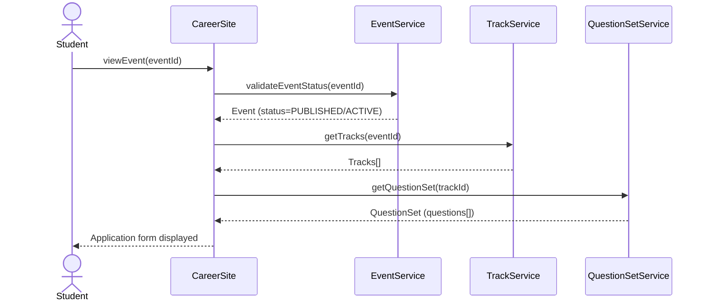
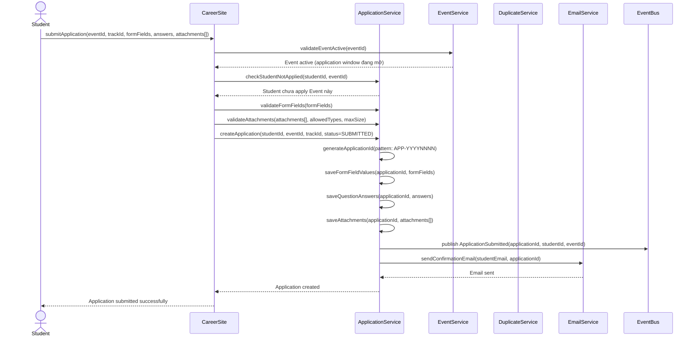
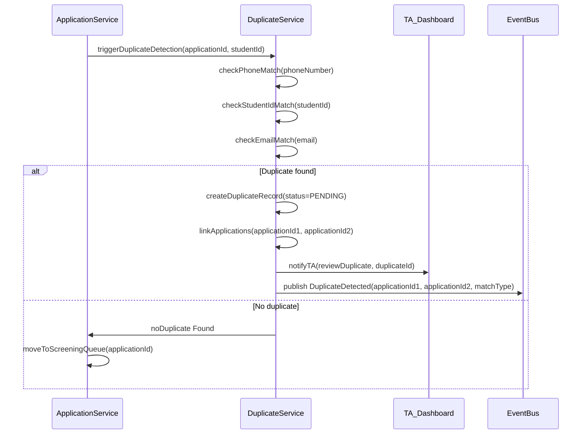

# Flow: Submit Application

> **Context:** Application
> **Actor:** Student (Candidate)
> **Trigger:** Student submit đơn apply vào Event/Track

---

## Preconditions

- Event tồn tại với status = PUBLISHED hoặc ACTIVE
- Application window đang mở (startDate ≤ now ≤ endDate)
- Student đã đăng ký account và có student_id
- Student chưa apply Event này (BR-APP-003)
- Student chưa apply Track khác cùng Event (BR-APP-002)

---

## Happy Path

### Phase 1: Student Điền Application Form

1. Student mở Career Site, tìm Event đang nhận applications
2. Student click "Apply Now" vào Event mong muốn
3. System validate: Event.status = PUBLISHED/ACTIVE, application window đang mở
4. System hiển thị application form với:
   - Personal information (pre-filled từ Student profile: name, email, phone, university, major, GPA)
   - Form fields động (tùy Event config: expected_salary, availability, etc.)
   - QuestionSet của Track đã chọn (các câu hỏi bắt buộc)
   - Attachment upload section (CV, certificates, transcripts, portfolio)
5. Student điền thông tin vào form fields
6. Student trả lời các questions trong QuestionSet
7. Student upload attachments (CV, certificates, etc.)
8. Student click "Preview" để xem lại thông tin

### Sequence Diagram (Fill Application Form)

---

### Phase 2: Student Submit Application

9. Student click "Submit Application"
10. System validate trước khi submit:
    - Event đang active (BR-APP-001)
    - Student chưa apply Event này (BR-APP-003)
    - Student chưa apply Track khác cùng Event (BR-APP-002)
    - Form fields đầy đủ (bắt buộc)
    - Attachments đúng format (PDF, Word, Image) và size ≤ max_file_size (BR-APP-006, BR-APP-007)
11. System tạo Application với:
    - application_id (pattern: APP-YYYYNNNN)
    - student_id
    - event_id
    - track_id
    - status = SUBMITTED
    - submitted_at = timestamp
12. System lưu FormFieldValues (nếu có)
13. System lưu QuestionAnswers (câu trả lời cho questions)
14. System lưu Attachments metadata (file_id, file_name, file_type, file_size)
15. System publish event `ApplicationSubmitted`
16. System gửi confirmation email cho Student
17. System hiển thị application confirmation page

### Sequence Diagram (Submit Application)

---

### Phase 3: Duplicate Detection (Auto)

18. System auto-trigger duplicate detection sau khi Application submitted
19. System check duplicate theo:
    - Phone number match (SĐT trùng)
    - Student ID match (student_id trùng)
    - Email match (email trùng)
20. Nếu phát hiện duplicate:
    - System tạo Duplicate record với status = PENDING
    - System link các applications trùng (application_id1, application_id2)
    - System notify TA review duplicate
21. Nếu không có duplicate:
    - System chuyển Application sang Screening queue
    - TA có thể bắt đầu screening

### Sequence Diagram (Duplicate Detection)

---

## Error Paths

### Case: Event đã hết hạn (Application Window Closed)

**Điều kiện:** now > endDate hoặc Event.status != PUBLISHED/ACTIVE

**Xử lý:**
- System reject ngay ở bước validateEventActive
- Hiển thị: "Event đã hết hạn nhận applications (endDate: [endDate])"
- Application KHÔNG được tạo
- Student thấy thông báo Event closed
- Gợi ý: "Vui lòng tìm Event khác đang nhận applications"

---

### Case: Student đã apply Event này rồi

**Điều kiện:** Student đã có application với status = SUBMITTED/SCREENING/TEST/INTERVIEW cho Event này

**Xử lý:**
- System reject ở bước checkStudentNotApplied
- Hiển thị: "Bạn đã apply Event này trước đó (application_id: [APP-XXXX])"
- Application thứ 2 KHÔNG được tạo
- BR-APP-003 được enforce
- Gợi ý: "Vui lòng kiểm tra trạng thái application cũ trước khi apply lại"

---

### Case: Student đã apply Track khác cùng Event

**Điều kiện:** Student đã có application cho Track khác trong cùng Event

**Xử lý:**
- System reject ở bước validate
- Hiển thị: "Bạn đã apply Track khác trong Event này (track_id: [TRK-XXXX])"
- BR-APP-002 được enforce
- Application KHÔNG được tạo
- Gợi ý: "Mỗi Student chỉ được apply 1 Track/Event"

---

### Case: Attachments sai format hoặc vượt quá size limit

**Điều kiện:** File type không đúng allowed_types (PDF, Word, Image) hoặc file_size > max_file_size (default: 10MB)

**Xử lý:**
- System reject ở bước validateAttachments
- Hiển thị lỗi chi tiết:
  - "File '[file_name]' có định dạng không được chấp nhận. Chỉ chấp nhận: PDF, DOCX, PNG, JPG"
  - "File '[file_name]' có kích thước [size] vượt quá [max_size]. Vui lòng compress file"
- Application KHÔNG được tạo
- Student phải upload lại file đúng format/size

---

### Case: Form fields thiếu thông tin bắt buộc

**Điều kiện:** Required form fields không được điền (expected_salary, availability, etc.)

**Xử lý:**
- System reject ở bước validateFormFields
- Highlight các fields bị thiếu với error message inline
- Hiển thị: "Vui lòng điền đầy đủ thông tin bắt buộc (marked with *)"
- Application KHÔNG được tạo
- Student phải điền đầy đủ trước khi submit lại

---

### Case: Duplicate Detected

**Điều kiện:** System phát hiện applications trùng theo SĐT, Student ID, hoặc Email

**Xử lý:**
- System tạo Duplicate record với status = PENDING
- Link các applications trùng nhau
- Notify TA review duplicate
- Application vẫn tồn tại với status = SUBMITTED, nhưng bị hold cho đến khi TA resolve
- TA có 3 options:
  - RESOLVED: Merge applications hoặc remove duplicate
  - IGNORED: Không phải duplicate, cho phép cả 2 applications tiếp tục
  - REJECTED: Reject application trùng
- Student nhận notification nếu application bị reject do duplicate

---

## Retry Policy

### Case: Email Confirmation Failure

**Điều kiện:** Email service không gửi được confirmation email

**Xử lý:**
- System retry với Fixed Delay:
  - 3 attempts, 2 seconds delay giữa mỗi attempt
- Sau max retries vẫn failure:
  - Log error với student email info
  - Notify TA_ADMIN via in-app notification
  - Continue flow (email là side effect, không block application creation)
  - Application vẫn được tạo với status = SUBMITTED

### Case: File Storage Upload Failure

**Điều kiện:** File storage service không upload được attachments

**Xử lý:**
- System retry theo Exponential Backoff Policy:
  - Attempt 1: Immediate retry (500ms delay)
  - Attempt 2: Exponential backoff (2 seconds)
  - Attempt 3: Final attempt (10 seconds)
- Sau max retries vẫn failure:
  - Hiển thị lỗi: "Upload file thất bại. Vui lòng thử lại."
  - Application KHÔNG được tạo
  - Log error với file metadata
  - Student có thể retry submit

---

## Postconditions (Happy Path)

- Application tồn tại với status = SUBMITTED, submitted_at = timestamp
- application_id được generate (pattern: APP-YYYYNNNN)
- FormFieldValues được lưu cho Application
- QuestionAnswers được lưu cho Application
- Attachments metadata được lưu (file_id, file_name, file_type, file_size)
- Event `ApplicationSubmitted` được publish (cho Screening Context consume)
- Student nhận confirmation email với application_id
- TA thấy application mới trong screening queue
- Duplicate detection được trigger (nếu có duplicate, TA được notify)

---

## Business Rules áp dụng

- **BR-APP-001**: Chỉ được apply khi Event đang active (startDate ≤ now ≤ endDate)
- **BR-APP-002**: Student chỉ được apply 1 Track/Event
- **BR-APP-003**: Student không được apply cùng 1 Event nhiều lần
- **BR-APP-004**: Duplicate detection dựa trên SĐT HOẶC StudentID match
- **BR-APP-005**: Application phải có đầy đủ form fields bắt buộc
- **BR-APP-006**: Attachments phải đúng format cho phép (PDF, Word, Image)
- **BR-APP-007**: File size tối đa cho attachments (configurable, default: 10MB)

---

## Edge Cases

| Edge Case | Xử lý |
|-----------|-------|
| Guest checkout (không đăng ký) | Student phải tạo account trước khi submit để có student_id |
| Duplicate theo email | Match theo email thay vì SĐT/StudentID, duplicate record created |
| File attachment > 10MB | Reject upload với error message chi tiết |
| Student submit 2 applications cùng Event | Hệ thống reject application thứ 2 (BR-APP-003) |
| Event hết hạn trong khi Student đang điền form | Show error "Event đã đóng nhận applications" ở server-side validation |
| Student withdraw application rồi apply lại | Allowed nếu Event còn active, application mới được tạo |

---

## Configurable Parameters

| Parameter | Default | Range | Description |
|-----------|---------|-------|-------------|
| `allowed_attachment_types` | [PDF, DOCX, DOC, PNG, JPG, JPEG] | Array | File types được chấp nhận |
| `max_file_size_mb` | 10 | 1-50 MB | File size tối đa cho attachments |
| `max_attachments_per_application` | 5 | 1-10 | Số attachments tối đa |
| `required_form_fields` | [expected_salary, availability] | Array | Form fields bắt buộc (configurable per Event) |
| `duplicate_match_email` | false | boolean | Match duplicate theo email (default: false, chỉ match SĐT/StudentID) |
| `allow_application_update_after_submit` | false | boolean | Cho phép Student update application sau khi submit (configurable per Event) |
| `confirmation_email_enabled` | true | boolean | Enable confirmation email sau khi submit |

---

## Notes

- **Application ID Pattern:** `APP-YYYYNNNN` (e.g., APP-20260001) — auto-generated khi submit
- **Duplicate Detection:** Trigger auto sau khi submit, match theo SĐT HOẶC StudentID (email optional)
- **Form Fields:** Dynamic per Event config — required/optional fields tùy Event
- **QuestionSet:** Per Track — mỗi Track có bộ câu hỏi riêng
- **Attachments:** Student upload CV, certificates, transcripts, portfolio — không cần zip, multiple files allowed
- **Application Withdraw:** Student có thể withdraw application trước khi Screening bắt đầu (status = WITHDRAWN)
