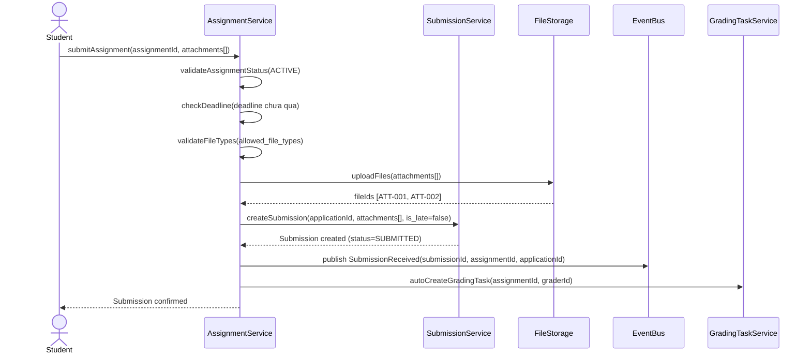

# Flow: Submit Assignment (Online Test)

> **Context:** Assessment
> **Actor:** Student (Candidate)
> **Trigger:** Student submit bài qua link Assignment (TestGorilla, Google Form, etc.)

---

## Preconditions

- Assignment tồn tại với status = ACTIVE
- CandidateRR tồn tại với current_stage = ONLINE_TEST
- Assignment.deadline chưa qua (hoặc trong grace period)
- Student đã nhận được Assignment link qua email

---

## Happy Path

### Steps

1. Student nhận email Assignment link từ System
2. Student click link, mở Assignment page
3. Student xem thông tin Assignment (title, deadline, allowed file types)
4. Student upload attachments (PDF, DOCX, etc. — không cần zip)
5. Student click "Submit"
6. System validate:
   - Assignment.status = ACTIVE
   - Deadline chưa qua (hoặc trong grace period)
   - File types đúng format cho phép
   - File size ≤ max_file_size (configurable, default 10MB)
7. System tạo Submission record với status = SUBMITTED
8. System set is_late = false (nếu trước deadline)
9. System publish event `SubmissionReceived`
10. System hiển thị confirmation cho Student
11. TA nhận notification có submission mới
12. System auto tạo GradingTask (nếu chưa tồn tại)

### Sequence Diagram

---

## Error Paths

### Case: Submission qua deadline (Late Submission)

**Điều kiện:** Student submit sau deadline (nhưng trong grace period)

**Xử lý:**
- System vẫn accept submission
- Set is_late = true
- Hiển thị warning: "Bài nộp muộn — có thể bị penalty"
- Submission vẫn được tạo với status = LATE
- Grader thấy flag is_late khi chấm

### Case: File type sai format

**Điều kiện:** Student upload file không đúng format (e.g., .exe, .zip khi không cho phép)

**Xử lý:**
- System reject upload ngay ở client-side
- Hiển thị lỗi: "File type không được chấp nhận. Chỉ chấp nhận: PDF, DOCX, PPT"
- Submission KHÔNG được tạo
- Student phải upload lại file đúng format

### Case: File size vượt quá limit

**Điều kiện:** File size > max_file_size (default 10MB)

**Xử lý:**
- System reject upload
- Hiển thị lỗi: "File size vượt quá 10MB. Vui lòng giảm kích thước file"
- Gợi ý: Compress PDF, chia nhỏ file
- Submission KHÔNG được tạo

### Case: Grader không phải Manager được phân công

**Điều kiện:** Grader attempt complete grading nhưng không nằm trong grader_id của GradingTask

**Xử lý:**
- System reject grading attempt
- Hiển thị: "Bạn không được phân công chấm submission này"
- Log security event
- Notify TA nếu có attempt không authorized

---

## Alternative Path: Resubmission

**Điều kiện:** Student muốn nộp lại bài (trước deadline, configurable 1 lần)

### Steps

1. Student đã submit 1 lần (Submission.status = SUBMITTED)
2. Student click "Resubmit" (nếu enabled)
3. System check:
   - Deadline chưa qua
   - resubmit_count < max_resubmissions (default: 1)
4. Student upload attachments mới
5. System update Submission:
   - attachments = mới
   - submitted_at = mới
   - resubmit_count += 1
   - status = RESUBMITTED
6. System đánh dấu submission cũ (không xóa)
7. Grader chỉ thấy submission mới nhất khi chấm

---

## Postconditions (Happy Path)

- Submission tồn tại với status = SUBMITTED, is_late = false
- Attachments được lưu trong FileStorage với IDs [ATT-001, ATT-002]
- GradingTask được tạo (hoặc update) với submissions[] includes mới submission
- TA thấy submission mới trong dashboard
- Student nhận email confirmation đã nộp bài thành công

---

## Business Rules áp dụng

- **BR-ASM-001**: Chỉ Managers được TA phân công mới chấm được Assignment
- **BR-ASM-002**: Assignment phải có link làm bài hợp lệ (Google Form, TestGorilla, etc.)
- **BR-ASM-003**: File submission phải đúng format (Word/PDF/Excel/PPT)
- **BR-ASM-004**: Submission chỉ được nộp trước deadline (configurable grace period)
- **BR-ASM-005**: Student được nộp nhiều file (không cần zip)
- **BR-GRD-001**: Score phải trong khoảng 0-100
- **BR-GRD-002**: PassFail = PASS khi score >= threshold (configurable per Event)
- **BR-GTK-001**: GradingTask auto-complete khi TA import kết quả chấm hàng loạt

---

## Retry Policy

### Case: FileStorage upload failure

**Điều kiện:** File storage service không upload được file

**Xử lý:**
- System retry với Exponential Backoff:
  - Attempt 1: 500ms delay
  - Attempt 2: 2s delay
  - Attempt 3: 10s delay
- Sau max retries vẫn failure:
  - Hiển thị lỗi: "Upload file thất bại. Vui lòng thử lại."
  - Submission KHÔNG được tạo
  - Log error với file metadata

---

## Edge Cases

| Edge Case | Handling |
|-----------|----------|
| Student nộp bài nhiều lần (resubmit) | Chỉ nhận submission cuối cùng (hoặc configurable) — SubmissionStatus = RESUBMITTED |
| Deadline qua trong khi Student đang submit | System check ở server-side, reject nếu đã qua (không trong grace period) |
| Assignment bị hủy khi Student đang fill | Hiển thị: "Assignment đã đóng. Vui lòng liên hệ TA." |
| GradingTask đã tồn tại khi submission mới tạo | Update GradingTask.submissions[] thêm submission mới |
| TA import kết quả khi GradingTask đang chấm | Auto-complete task, override kết quả cũ (BRS-GTK-001) |

---

## Configurable Parameters

| Parameter | Default | Range | Description |
|-----------|---------|-------|-------------|
| `allowed_file_types` | [PDF, DOCX, PPT, XLSX] | Array | File types được chấp nhận |
| `max_file_size` | 10MB | 1-50MB | Maximum file size |
| `multiple_files_allowed` | true | boolean | Cho phép nộp nhiều files |
| `grace_period_minutes` | 0 | 0-1440 | Grace period sau deadline (phút) |
| `max_resubmissions` | 1 | 0-3 | Số lần nộp lại tối đa |
| `blind_grading_enabled` | true | boolean | Ẩn PII với Graders |

---

## Notes

- **Blind Grading:** Configurable per Event — khi enabled, Graders không thấy thông tin cá nhân (tên, email, university)
- **Late Flag:** is_late được set dựa trên submitted_at vs deadline (với grace period consideration)
- **Audit Trail:** Tất cả submissions được log với submitted_at, attachments[], is_late flag
