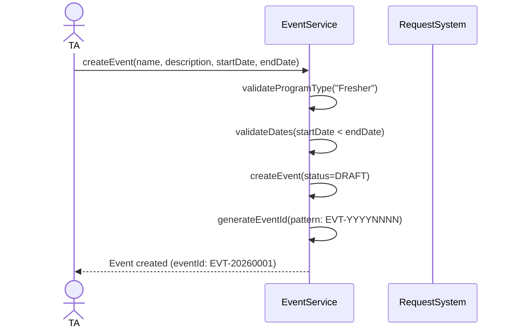
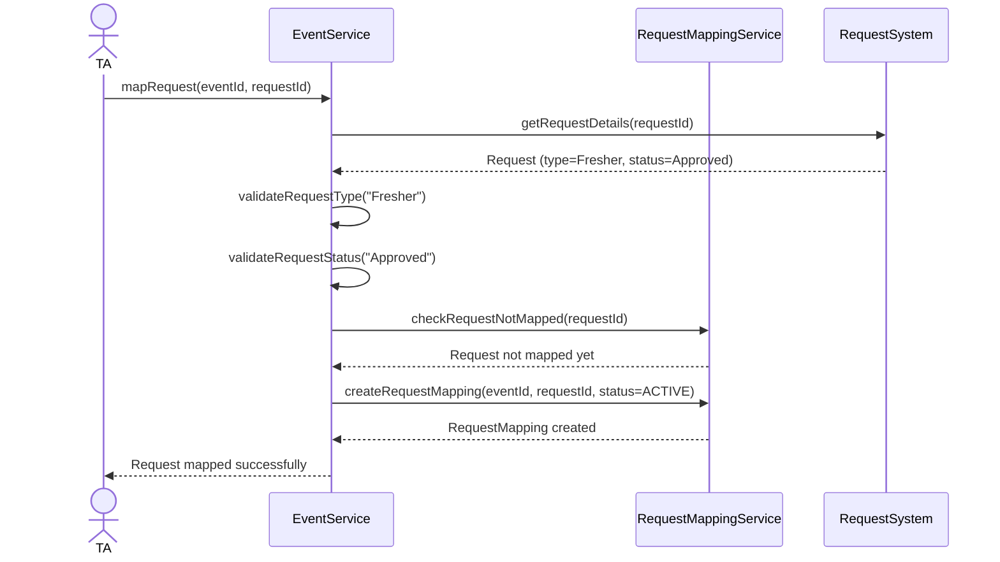
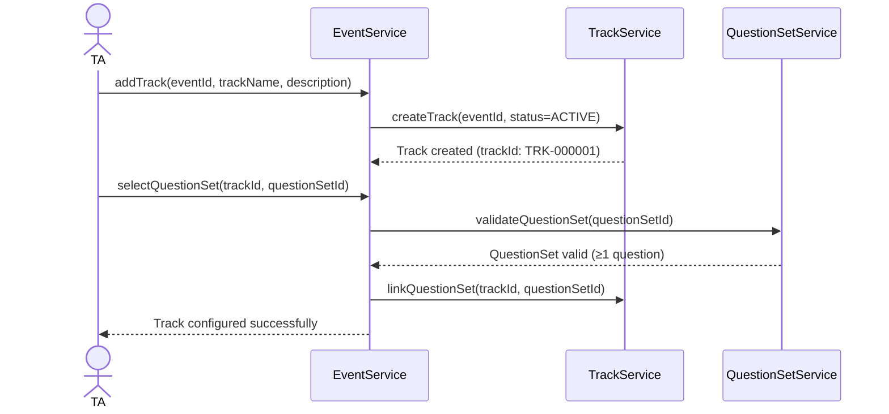
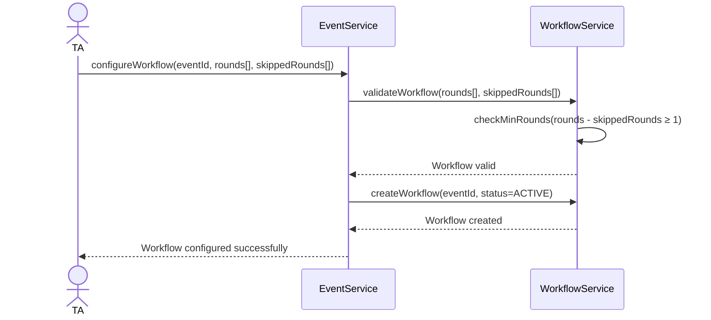
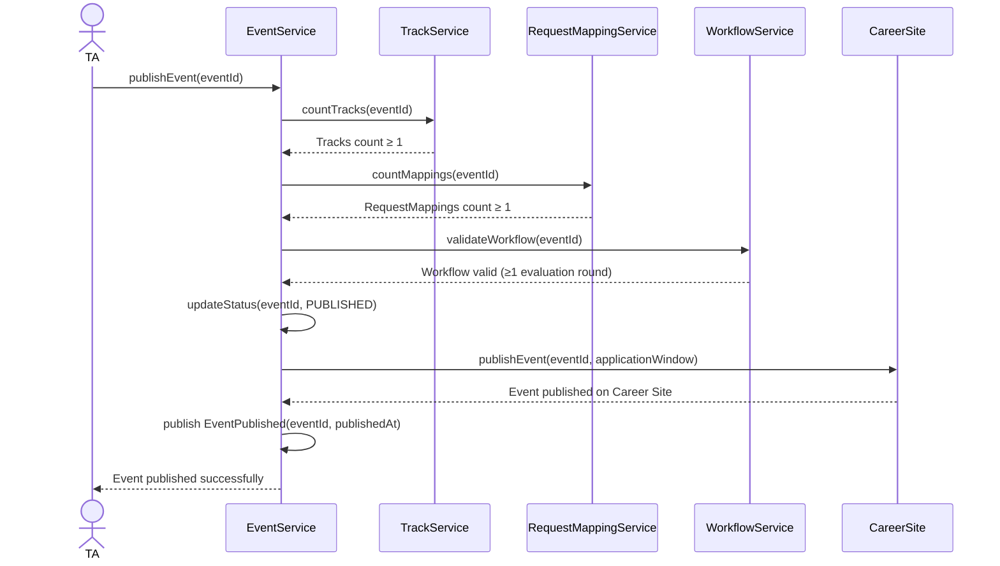

# Flow: Create and Publish Event

> **Context:** Event Management
> **Actor:** TA (Talent Acquisition)
> **Trigger:** TA tạo Event Fresher mới từ dashboard

---

## Preconditions

- TA có quyền tạo Event (TA_ADMIN/TA_MANAGER role)
- Program type = "Fresher" (chỉ Fresher events được tạo trong system này)
- Request system available (để map Requests sau)

---

## Happy Path

### Phase 1: Create Event

1. TA mở Event Management dashboard
2. TA click "Create New Event"
3. System hiển thị Create Event form với:
   - event_name (required)
   - description (required)
   - program_type (auto-filled = "Fresher")
   - start_date, end_date (application window)
   - location (optional)
4. TA fill thông tin, click "Save"
5. System validate: program_type = "Fresher", dates hợp lệ (start_date < end_date)
6. System tạo Event với status = DRAFT
7. System generate event_id (pattern: EVT-YYYYNNNN)
8. System hiển thị Event detail page cho TA tiếp tục config

### Sequence Diagram (Create Event)

---

### Phase 2: Map Request(s)

9. TA click "Map Request" trong Event config page
10. TA chọn Request từ danh sách available Requests (type = "Fresher", status = "Approved", chưa map Event khác)
11. System validate: Request type = "Fresher", Request status = "Approved", Request chưa map Event khác
12. System tạo RequestMapping với status = ACTIVE
13. System hiển thị mapping confirmation
14. TA có thể map thêm Requests (không giới hạn số lượng)

### Sequence Diagram (Map Request)

---

### Phase 3: Add Tracks & Configure QuestionSets

15. TA click "Add Track"
16. TA điền track information:
    - track_name (required)
    - description (required)
    - positions (optional)
17. System tạo Track với status = ACTIVE
18. TA chọn QuestionSet cho Track từ thư viện có sẵn
19. System validate: QuestionSet tồn tại, có ít nhất 1 question
20. System link QuestionSet với Track
21. TA có thể add thêm Tracks (không giới hạn)

### Sequence Diagram (Add Track & Configure Questions)

---

### Phase 4: Configure Workflow

22. TA click "Configure Workflow"
23. TA chọn các vòng tuyển dụng từ danh sách:
    - Screening (required)
    - Online Test / Onsite Test (ít nhất 1 trong 2)
    - Interview (required)
    - Offer (required)
24. TA có thể skip một số vòng (configurable, phải có ít nhất 1 vòng đánh giá)
25. System validate: Workflow có ít nhất 1 vòng đánh giá (Test hoặc Interview)
26. System tạo Workflow với status = ACTIVE
27. System hiển thị workflow preview cho TA confirm

### Sequence Diagram (Configure Workflow)

---

### Phase 5: Publish Event

28. TA review toàn bộ config (Event info, Requests mapped, Tracks, QuestionSets, Workflow)
29. TA click "Publish"
30. System validate trước khi publish:
    - Event có ít nhất 1 Track
    - Event có ít nhất 1 Request mapped
    - Workflow hợp lệ (≥1 vòng đánh giá)
31. System update Event.status = PUBLISHED
32. System publish event `EventPublished` lên Career Site
33. System mở application window (nếu start_date ≤ now)
34. TA nhận confirmation Event đã publish thành công

### Sequence Diagram (Publish Event)

---

## Error Paths

### Case: Event.create() — Program type không phải Fresher

**Điều kiện:** program_type != "Fresher" (ví dụ: "Experienced", "Intern")

**Xử lý:**
- System reject ngay ở bước validate
- Hiển thị: "Chỉ Event thuộc Program 'Fresher' mới được tạo trong system này"
- Event KHÔNG được tạo
- TA được redirect về dashboard với gợi ý: "Vui lòng chọn Program type = Fresher"

---

### Case: MapRequest — Request không hợp lệ

**Điều kiện:** Request type != "Fresher" hoặc Request status != "Approved" hoặc Request đã map Event khác

**Xử lý:**
- System reject ở bước validate
- Hiển thị lỗi cụ thể:
  - "Request type phải là 'Fresher'" (nếu type sai)
  - "Request phải ở trạng thái 'Approved'" (nếu status = PENDING/DRAFT)
  - "Request đã được map vào Event [EVT-XXXX]" (nếu đã map)
- RequestMapping KHÔNG được tạo
- TA phải chọn Request khác hoặc liên hệ Request Owner

---

### Case: PublishEvent — Thiếu Track

**Điều kiện:** Event chưa có Track nào (tracks count = 0)

**Xử lý:**
- System reject ở bước validate trước khi publish
- Hiển thị: "Event phải có ít nhất 1 Track trước khi publish"
- Gợi ý: "Vui lòng add Track với thông tin chi tiết"
- Event.status vẫn = DRAFT
- TA phải add ít nhất 1 Track trước khi publish lại

---

### Case: PublishEvent — Chưa map Request

**Điều kiện:** Event chưa map Request nào (request_mappings count = 0)

**Xử lý:**
- System reject ở bước validate
- Hiển thị: "Event phải map ít nhất 1 Request trước khi publish"
- Gợi ý: "Vui lòng map Request từ danh sách available Requests"
- Event.status vẫn = DRAFT
- TA phải map ít nhất 1 Request trước khi publish lại

---

### Case: PublishEvent — Workflow không hợp lệ

**Điều kiện:** Workflow chưa có vòng đánh giá nào (test_count + interview_count = 0)

**Xử lý:**
- System reject ở bước validateWorkflow
- Hiển thị: "Workflow phải có ít nhất 1 vòng đánh giá (Test hoặc Interview)"
- Gợi ý: "Vui lòng configure workflow với Screening + Online Test/Onsite Test + Interview"
- Event.status vẫn = DRAFT
- TA phải configure workflow hợp lệ trước khi publish lại

---

### Case: PublishEvent — Event đã publish rồi

**Điều kiện:** Event.status = PUBLISHED (TA click Publish lần 2)

**Xử lý:**
- System detect status != DRAFT
- Hiển thị: "Event đã được publish trước đó (published_at: [timestamp])"
- Không thực hiện publish lại
- Gợi ý: "Vui lòng sử dụng chức năng 'Update Event Config' nếu cần thay đổi"
- Lưu ý: Không được add/remove Requests sau khi publish (BR-EM-006)

---

## Retry Policy

### Case: Career Site Publish Timeout

**Điều kiện:** Career Site API không response trong 5 seconds

**Xử lý:**
- System retry theo Exponential Backoff Policy:
  - Attempt 1: Immediate retry (500ms delay)
  - Attempt 2: Exponential backoff (2 seconds)
  - Attempt 3: Final attempt (10 seconds)
- Sau max retries vẫn failure:
  - Update Event.status = DRAFT (chưa publish)
  - Notify TA: "Không thể publish lên Career Site — vui lòng thử lại sau"
  - Log error với Career Site API endpoint
  - Queue cho manual review (TA có thể retry manually)

---

## Postconditions (Happy Path)

- Event tồn tại với status = PUBLISHED, published_at = timestamp
- Event có ít nhất 1 Track (status = ACTIVE)
- Event có ít nhất 1 RequestMapping (status = ACTIVE)
- Workflow tồn tại với status = ACTIVE, rounds[] đã config
- QuestionSet được link với Track tương ứng
- Event được hiển thị trên Career Site với application window rõ ràng
- Event `EventPublished` được publish (cho Application Context consume)
- TA nhận confirmation với eventId, published_at, application_window

---

## Business Rules áp dụng

- **BR-EM-001**: Chỉ Event thuộc Program "Fresher" mới được map Request tuyển dụng
- **BR-EM-002**: Chỉ Request type "Fresher" và status "Approved" mới được map
- **BR-EM-003**: Request đã map Event không được post lên Career Site
- **BR-EM-004**: Một Request chỉ được map 1 Event duy nhất
- **BR-EM-005**: Không được unmap Request nếu đã có Student apply
- **BR-EM-006**: Không được add mapping Request sau khi Event đã publish
- **BR-EM-007**: Workflow phải có ít nhất 1 vòng đánh giá (Test hoặc Interview)

---

## Edge Cases

| Edge Case | Xử lý |
|-----------|-------|
| TA tạo Event nhưng không publish | Event.status vẫn = DRAFT, TA có thể save và publish sau |
| TA add Track nhưng không configure QuestionSet | Warning hiển thị, nhưng vẫn cho phép (QuestionSet có thể configure sau) |
| TA map Request rồi unmap trước khi publish | Allowed (chưa có Student apply), RequestMapping.status = INACTIVE |
| Career Site unavailable khi publish | Retry policy áp dụng, Event.status không đổi cho đến khi publish thành công |
| TA configure workflow rồi change trước khi publish | Allowed (workflow chưa active), nhưng phải đảm bảo ≥1 vòng đánh giá |

---

## Configurable Parameters

| Parameter | Default | Range | Description |
|-----------|---------|-------|-------------|
| `min_tracks` | 1 | 1-10 | Số Track tối thiểu trước khi publish |
| `min_request_mappings` | 1 | 1-N | Số Request mapping tối thiểu trước khi publish |
| `min_workflow_rounds` | 1 | 1-5 | Số vòng đánh giá tối thiểu trong workflow |
| `allow_workflow_change_after_publish` | false | boolean | Cho phép thay đổi workflow sau khi publish (default: false) |
| `allow_add_request_after_publish` | false | boolean | Cho phép add Request sau khi publish (default: false) |
| `career_site_timeout_seconds` | 5 | 3-30 | Timeout cho Career Site API call |
| `career_site_retry_attempts` | 3 | 1-5 | Số lần retry Career Site publish |

---

## Notes

- **Event ID Pattern:** `EVT-YYYYNNNN` (e.g., EVT-20260001) — auto-generated khi tạo Event
- **Track ID Pattern:** `TRK-YYYYNNN` — auto-generated khi add Track
- **RequestMapping:** Chỉ允许 map Request type "Fresher" và status "Approved" — BR-EM-002 enforce
- **Workflow Configuration:** Phải có ít nhất Screening + (Online Test hoặc Onsite Test) + Interview + Offer
- **Career Site Integration:** Event được publish lên Career Site để Students có thể apply
- **Application Window:** start_date đến end_date — System auto mở/đóng nhận applications theo window
