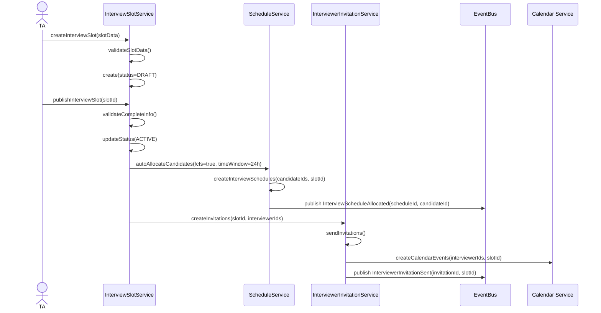
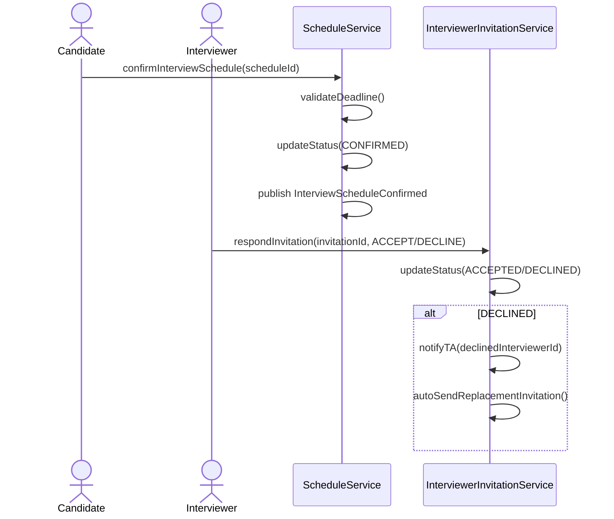
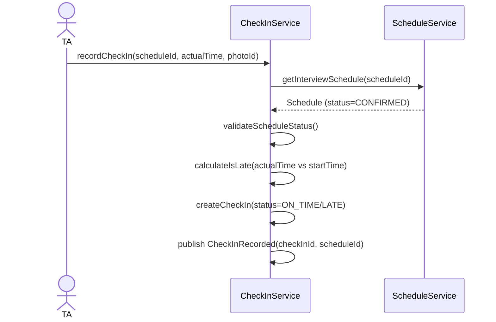
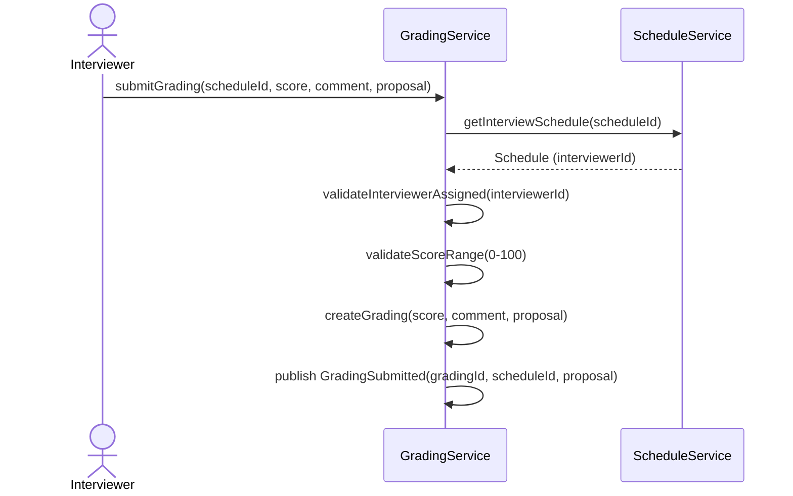

# Flow: Schedule & Conduct Interview

> **Context:** Interview
> **Actor:** TA (Talent Acquisition)
> **Trigger:** TA tạo InterviewSlot sau khi Candidates pass Onsite Test

---

## Preconditions

- Candidates tồn tại với current_stage = INTERVIEW (đã pass Onsite Test)
- InterviewSlot được tạo với thông tin đầy đủ (ngày giờ, format, interviewers)
- Interviewers được chỉ định (Managers có quyền phỏng vấn)
- Calendar integration enabled (optional)

---

## Happy Path

### Phase 1: Create & Publish InterviewSlot

1. TA tạo InterviewSlot mới:
   - interview_date, start_time, end_time
   - format (ONLINE/OFFLINE/HYBRID)
   - interview_link (nếu ONLINE) hoặc location (nếu OFFLINE)
   - interviewers[] (danh sách Manager IDs)
   - max_capacity
2. System validate: Event đã publish, TA có quyền tạo
3. System tạo InterviewSlot với status = DRAFT
4. TA click "Publish"
5. System validate: InterviewSlot có đủ thông tin
6. System update InterviewSlot.status = ACTIVE
7. System auto-allocate Candidates vào InterviewSlot (FCFS + Time Window)
8. System tạo InterviewSchedule cho mỗi Candidate
9. System gửi email confirm cho Candidates với confirm deadline (24h)
10. System tạo InterviewerInvitation cho mỗi interviewer
11. System gửi invitation email cho Interviewers
12. System tạo calendar events cho Interviewers (nếu enabled)

### Sequence Diagram (Create & Publish)

---

### Phase 2: Candidate Confirm & Interviewer Accept

13. Candidate nhận email với slot info + confirm link
14. Candidate click confirm link
15. System validate: Schedule.status = PENDING, deadline chưa qua
16. System update InterviewSchedule.status = CONFIRMED
17. System publish event `InterviewScheduleConfirmed`
18. Interviewers nhận invitation email
19. Interviewer click "Accept" hoặc "Decline"
20. System update InterviewerInvitation.status = ACCEPTED/DECLINED
21. Nếu DECLINED: System notify TA, auto-send invitation cho interviewer thay thế

### Sequence Diagram (Confirm & Accept)

---

### Phase 3: Conduct Interview & Check-in

22. Đến interview_date + start_time: System update InterviewSlot.status = IN_PROGRESS
23. Candidate đến phòng phỏng vấn (hoặc join link)
24. TA/Candidate thực hiện check-in
25. System validate: InterviewSchedule.status = CONFIRMED
26. System tạo CheckIn record với:
    - actual_time
    - is_late flag (so với start_time + grace_period)
    - late_reason (nếu is_late = true)
    - optional photo_id
27. System update CheckIn.status = ON_TIME/LATE/ABSENT
28. Interviewer tiến hành phỏng vấn Candidates được phân công

### Sequence Diagram (Check-in)

---

### Phase 4: Submit Grading

29. Interviewer hoàn thành phỏng vấn
30. Interviewer submit Grading cho mỗi Candidate:
    - score (0-100)
    - comment
    - proposal (OFFER/REJECT/NEED_DISCUSSION)
31. System validate: Interviewer được phân công cho Candidate này
32. System validate: Score trong khoảng 0-100
33. System tạo Grading record
34. System publish event `GradingSubmitted`
35. TA nhận notification grading đã submit

### Sequence Diagram (Submit Grading)

---

## Error Paths

### Case: Candidate không confirm trong Time Window

**Điều kiện:** Confirm deadline qua mà Candidate không confirm

**Xử lý:**
- System auto retry allocate (max 2 lần)
- Mỗi lần retry: Release slot, allocate cho next candidate
- Sau 2 lần vẫn không confirm:
  - Notify TA manual assign
  - InterviewSchedule.status = CANCELLED

### Case: Candidate đổi lịch lần 2

**Điều kiện:** Candidate đã đổi lịch 1 lần (change_count = 1), muốn đổi lần 2

**Xử lý:**
- System check: change_count >= max_changes
- Hiển thị: "Bạn đã đổi lịch 1 lần. Lần này chỉ còn Yes/No options"
- Candidate KHÔNG được tự chọn slot
- TA nhận request, manual xử lý

### Case: Interviewer decline invitation

**Điều kiện:** Interviewer click "Decline" invitation

**Xử lý:**
- System update InterviewerInvitation.status = DECLINED
- System notify TA: "Interviewer [ID] declined"
- System auto-send invitation cho interviewer thay thế (nếu configured)
- InterviewSlot.interviewers[] updated

### Case: Interviewer không submit grading

**Điều kiện:** Interview đã xong nhưng Interviewer chưa submit grading

**Xử lý:**
- System auto-send reminder (configurable timing: 24h sau interview)
- Sau reminder vẫn không submit:
  - Notify TA: "Grading chưa submit cho Candidate [ID]"
  - TA có thể manually update grading hoặc reassign

### Case: Grading proposal = NEED_DISCUSSION

**Điều kiện:** Interviewer submit với proposal = NEED_DISCUSSION

**Xử lý:**
- System update Grading.proposal = NEED_DISCUSSION
- TA nhận notification
- TA tổ chức discussion meeting trước khi quyết định OFFER/REJECT
- Sau discussion: TA update proposal = OFFER hoặc REJECT

---

## Postconditions (Happy Path)

- InterviewSlot.status = COMPLETED (tất cả Candidates đã interview + grading)
- InterviewSchedule.status = COMPLETED cho mỗi Candidate
- CheckIn tồn tại cho mỗi Candidate với status = ON_TIME/LATE
- Grading tồn tại cho mỗi Candidate với score, comment, proposal
- Candidates với proposal = OFFER chuyển sang Offer Context
- Candidates với proposal = REJECT → CandidateRR.status = REJECTED

---

## Business Rules áp dụng

- **BR-ISLOT-001**: Interviewer chỉ thấy Candidates được phân công (không thấy tất cả)
- **BR-ISLOT-002**: Interviewer không được request đổi lịch (chỉ TA mới được)
- **BR-ISLOT-003**: Auto-allocate với FCFS + Time Window (configurable)
- **BR-ISLOT-004**: Time Window để confirm slot (default: 24h, configurable 1-72h)
- **BR-ISLOT-005**: Notify TA khi auto-allocate thành công (configurable)
- **BR-ISCH-001**: Candidate chỉ được đổi lịch 1 lần (lần thứ 2 chỉ còn Yes/No options)
- **BR-IINV-001**: Calendar event tự động tạo cho Interviewers (optional integration)
- **BR-ICI-001**: Check-in muộn vẫn cho phép với lý do
- **BR-IGRD-001**: Interviewer chỉ submit grading cho Candidates được phân công
- **BR-IGRD-002**: Grading có thể update trước khi TA review (configurable deadline)

---

## Configurable Parameters

| Parameter | Default | Range | Description |
|-----------|---------|-------|-------------|
| `time_window_hours` | 24 | 1-72 | Thời gian confirm slot (giờ) |
| `max_retry` | 2 | 0-5 | Số lần retry auto-allocate |
| `grace_period_minutes` | 15 | 0-60 | Grace period cho check-in muộn |
| `calendar_integration_enabled` | false | boolean | Tạo calendar events cho Interviewers |
| `blind_interview_enabled` | false | boolean | Ẩn PII với Interviewers |
| `max_schedule_changes` | 1 | 0-3 | Số lần đổi lịch tối đa |
| `grading_reminder_hours` | 24 | 1-72 | Thời gian gửi reminder grading chưa submit |
| `grading_update_deadline_hours` | 24 | 1-72 | Deadline để update grading sau submit |

---

## Edge Cases

| Edge Case | Handling |
|-----------|----------|
| Candidate NO_SHOW (không check-in) | InterviewSchedule.status = NO_SHOW, configurable cho phỏng vấn lại |
| InterviewSlot hết chỗ | Auto-allocate failed, notify TA manual assign |
| Interviewer không đến | TA manual reassign interviewer, reschedule nếu cần |
| Online link expired | TA update interview_link, resend cho Candidates |
| Grading submission conflict (2 interviewers cho 1 Candidate) | System accept tất cả gradings, TA average score hoặc chọn final |

---

## Notes

- **Interview Formats:** ONLINE (video call), OFFLINE (tại văn phòng), HYBRID (cả hai)
- **Blind Interview:** Configurable — ẩn PII (tên, gender, university) cho fair hiring
- **Grading Proposal:** OFFER → Offer Context, REJECT → Failed, NEED_DISCUSSION → TA discussion
