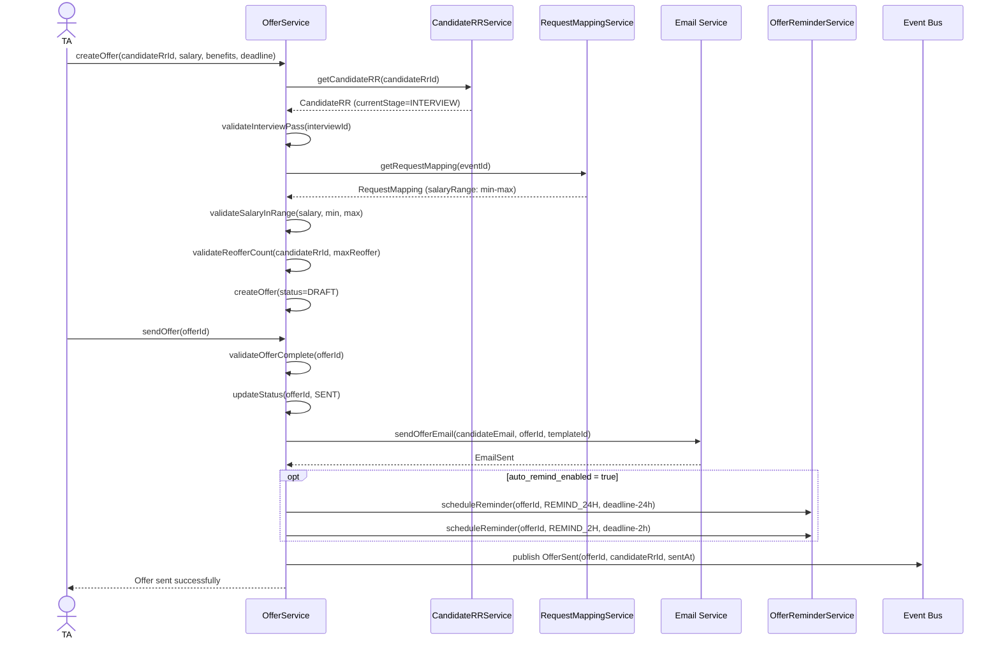
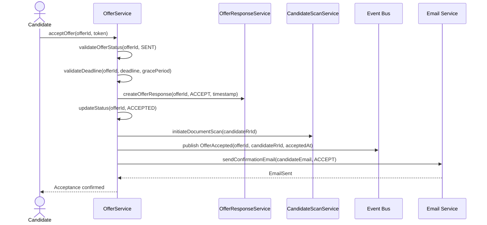
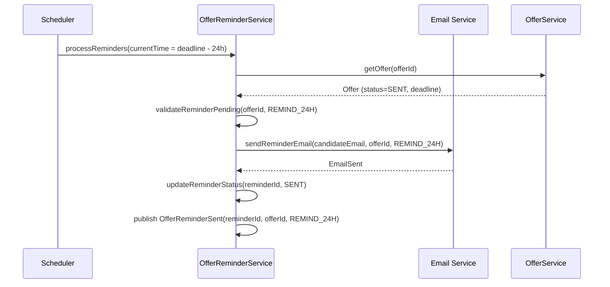
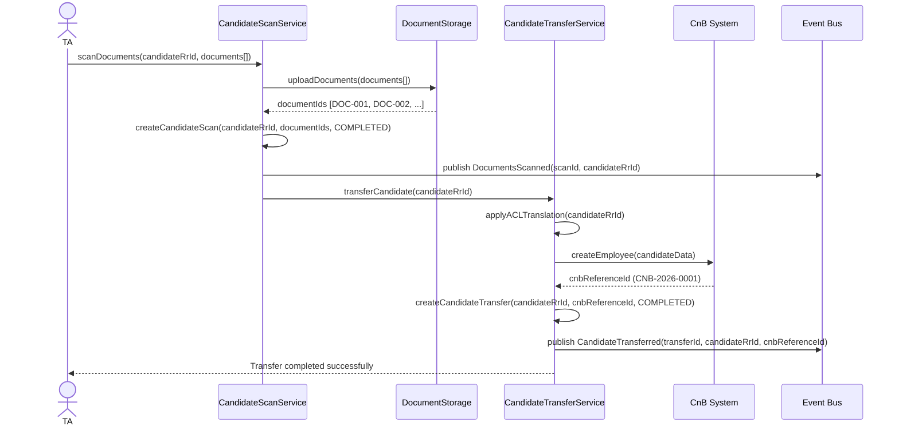

# Flow: Create and Send Offer

> **Context:** Offer
> **Actor:** TA (Talent Acquisition)
> **Trigger:** TA tạo Offer cho Candidate sau khi Pass Interview

---

## Preconditions

- CandidateRR tồn tại với current_stage = INTERVIEW
- Interview.result = PASS (Grading.proposal = OFFER)
- RequestMapping tồn tại cho Event (salary range min-max)
- TA có quyền tạo Offer (TA_ADMIN/TA_MANAGER hoặc được phân công)
- Offer chưa tồn tại cho Candidate này (reoffer_count < max)

---

## Happy Path

### Phase 1: Create & Send Offer

1. TA mở Candidate detail page (từ Interview result hoặc Request dashboard)
2. TA click "Create Offer"
3. System validate: CandidateRR.current_stage = INTERVIEW, Interview.result = PASS
4. System validate: RequestMapping exists (salary trong range min-max)
5. System validate: reoffer_count < max_reoffer (default: 2)
6. System hiển thị Create Offer form với:
   - salary (pre-filled từ Request range hoặc template)
   - benefits (pre-filled từ template)
   - deadline (default: 7-14 ngày từ now, configurable)
   - template_id (dropdown từ Offer Template Library)
7. TA fill thông tin, click "Save as Draft"
8. System tạo Offer với status = DRAFT
9. TA review Offer, click "Send"
10. System validate: Offer có đầy đủ salary, benefits, deadline
11. System update Offer.status = SENT
12. System gửi Offer email cho Candidate với:
    - Offer letter (PDF attachment)
    - Accept/Reject link (unique token)
    - Deadline reminder (deadline date + time)
13. System tạo OfferReminder (nếu auto_remind_enabled = true):
    - REMIND_24H reminder (scheduled_at = deadline - 24h)
    - REMIND_2H reminder (scheduled_at = deadline - 2h)
14. System publish event `OfferSent`
15. TA nhận confirmation Offer đã gửi thành công

### Sequence Diagram (Create & Send Offer)

---

### Phase 2: Student Accept/Reject Offer

16. Candidate nhận Offer email với Accept/Reject link
17. Candidate click Accept hoặc Reject link
18. System validate: Offer.status = SENT, chưa qua deadline (+ grace period)
19. System tạo OfferResponse với:
    - response = ACCEPT/REJECT
    - response_at = timestamp
    - created_by = Candidate
20. System update Offer.status = ACCEPTED/REJECTED
21. System publish event `OfferAccepted` hoặc `OfferRejected`
22. System gửi confirmation email cho Candidate
23. TA nhận notification Offer response

### Sequence Diagram (Accept/Reject Offer)

---

### Phase 3: Auto-Remind (Trước Deadline)

24. Đến remind_timing_24h (deadline - 24h): System gửi REMIND_24H email
25. System update OfferReminder.status = SENT
26. Đến remind_timing_2h (deadline - 2h): System gửi REMIND_2H email
27. System update OfferReminder.status = SENT
28. System publish event `OfferReminderSent`

### Sequence Diagram (Auto-Remind)

---

### Phase 4: Scan Documents & Transfer to CnB

29. Sau khi Offer.status = ACCEPTED: TA tiến hành scan documents
30. TA upload documents (CMND, bằng cấp, hồ sơ sức khỏe)
31. System tạo CandidateScan với:
    - documents[] = list document IDs
    - status = COMPLETED
    - scanned_at = timestamp
    - scanned_by = TA
32. System publish event `DocumentsScanned`
33. System tự động transfer Candidate sang CnB:
    - ACL translation applied (Candidate → Employee model)
    - cnb_reference_id generated (pattern: CNB-YYYY-NNNN)
34. System tạo CandidateTransfer với status = COMPLETED
35. System publish event `CandidateTransferred`
36. TA nhận confirmation Candidate đã transfer sang CnB

### Sequence Diagram (Scan & Transfer)

---

## Error Paths

### Case: Offer.create() — Candidate chưa Pass Interview

**Điều kiện:** CandidateRR.current_stage != INTERVIEW hoặc Interview.result != PASS

**Xử lý:**
- System reject ngay ở bước validate
- Hiển thị: "Candidate chưa đạt Interview (current_stage = [value], interview_result = [value])"
- Offer KHÔNG được tạo
- TA được redirect về Interview result page

---

### Case: Offer.create() — Salary ngoài Request range

**Điều kiện:** salary < request_salary_min hoặc salary > request_salary_max

**Xử lý:**
- System reject ở bước validate SalaryInRange
- Hiển thị: "Salary đề xuất ([salary]) ngoài Request range ([min]-[max])"
- Gợi ý: "Vui lòng điều chỉnh salary trong khoảng cho phép hoặc liên hệ Request Owner để điều chỉnh Request"
- Offer KHÔNG được tạo
- TA phải điều chỉnh salary hoặc liên hệ Request Owner

---

### Case: Offer.create() — Re-offer quá max count

**Điều kiện:** reoffer_count >= max_reoffer (default: 2)

**Xử lý:**
- System reject ở bước validateReofferCount
- Hiển thị: "Candidate đã re-offer [reoffer_count] lần (max: [max_reoffer])"
- Offer KHÔNG được tạo
- Notify TA_ADMIN: "Re-offer limit reached for Candidate [CRR-XXXX]"
- TA phải liên hệ TA_ADMIN để xử lý ngoại lệ

---

### Case: OfferResponse — Candidate response sau deadline

**Điều kiện:** Candidate click Accept/Reject sau deadline (không trong grace period)

**Xử lý:**
- System validate: currentTime > deadline + grace_period
- System reject response
- Hiển thị: "Offer đã hết hạn phản hồi (deadline: [deadline], grace period: [grace_period]h)"
- OfferResponse KHÔNG được tạo
- Offer.status vẫn = SENT (hoặc đã = EXPIRED nếu auto-expire đã chạy)
- Candidate thấy thông báo Offer expired

---

### Case: OfferReminder — Email gửi thất bại

**Điều kiện:** Email service trả về error (timeout, 503, invalid email)

**Xử lý:**
- System retry với Fixed Delay: 3 attempts, 2 seconds delay
- Sau max retries vẫn failure:
  - Update OfferReminder.status = FAILED
  - Notify TA_ADMIN via in-app notification: "Reminder gửi thất bại cho Offer [OFR-XXXX]"
  - Log error với candidate email info
  - Continue flow (reminder là side effect, không block chính)

---

### Case: CandidateTransfer — ACL translation failed

**Điều kiện:** CnB system trả về error (schema mismatch, validation failed)

**Xử lý:**
- System update CandidateTransfer.status = FAILED
- System retry với Exponential Backoff:
  - Attempt 1: 500ms delay
  - Attempt 2: 2s delay
  - Attempt 3: 10s delay
- Sau max retries vẫn failure:
  - Update CandidateTransfer.status = RETRY
  - Queue cho manual review
  - Notify TA_ADMIN + IT Integration: "Transfer sang CnB failed cho Candidate [CRR-XXXX]"
  - Log chi tiết lỗi ACL translation

---

### Case: DocumentsScanned — Candidate từ chối scan

**Điều kiện:** Candidate không cung cấp documents (CMND, bằng cấp) sau khi Accept Offer

**Xử lý:**
- Update CandidateScan.status = IN_PROGRESS (chưa complete)
- System auto-send reminder (configurable, default: 24h/lần, max 3 lần)
- Sau max reminders vẫn không scan:
  - Notify TA: "Candidate chưa scan documents cho Offer [OFR-XXXX]"
  - TA liên hệ Candidate để hoàn thành
  - Offer.status vẫn = ACCEPTED (không block)
  - CandidateTransfer bị block (không thể transfer khi chưa scan)

---

## Retry Policy

### Case: Email Service Timeout

**Điều kiện:** Email service không response trong 5 seconds

**Xử lý:**
- System retry theo Exponential Backoff Policy:
  - Attempt 1: Immediate retry (500ms delay)
  - Attempt 2: Exponential backoff (2 seconds)
  - Attempt 3: Final attempt (10 seconds)
- Sau max retries vẫn failure:
  - Update status = FAILED (OfferSent hoặc OfferReminderSent)
  - Notify TA_ADMIN via in-app notification
  - Queue cho manual review (gửi email thủ công)
  - Log error với email metadata

### Case: CnB System Unavailable

**Điều kiện:** CnB REST API returns 503 Service Unavailable

**Xử lý:**
- System retry với Fixed Delay:
  - 3 attempts, 5 seconds delay giữa mỗi attempt
- Sau max retries vẫn failure:
  - Update CandidateTransfer.status = RETRY
  - Queue cho background job retry sau 30 phút
  - Notify IT Integration: "CnB system unavailable"
  - Continue flow (transfer là side effect, không block Offer.status)

---

## Postconditions (Happy Path)

- Offer tồn tại với status = ACCEPTED
- OfferResponse tồn tại với response = ACCEPT, response_at = timestamp
- CandidateScan tồn tại với status = COMPLETED, documents[] lưu trữ
- CandidateTransfer tồn tại với status = COMPLETED, cnb_reference_id generated
- OfferReminder tồn tại (nếu enabled) với status = SENT cho REMIND_24H và REMIND_2H
- Offer.status → SENT → ACCEPTED → (DocumentsScanned) → (CandidateTransferred) → HIRED
- Candidate nhận email confirmation với Accept/Reject link
- TA nhận notification Offer response
- Event `OfferSent`, `OfferAccepted`, `DocumentsScanned`, `CandidateTransferred` được publish

---

## Business Rules áp dụng

- **BR-OFR-001**: Offer chỉ được tạo cho Candidates Pass Interview (CandidateRR.current_stage = INTERVIEW, Interview.result = PASS)
- **BR-OFR-002**: Offer phải matching với Request đã map trong Event (salary trong range min-max)
- **BR-OFR-004**: Auto-Expire khi deadline qua (status = EXPIRED, không phải REJECT)
- **BR-OFR-011**: Student chỉ có Accept/Reject options (không Negotiate)
- **BR-OREM-001**: Auto-remind 24h + 2h trước deadline (configurable timing)
- **BR-OFRSP-001**: OfferResponse chỉ có ACCEPT/REJECT options (không có NEGOTIATE)
- **BR-OTRF-001**: Transfer chỉ được thực hiện sau khi Accept Offer (Offer.status = ACCEPTED)
- **BR-OTRF-002**: Transfer cần ACL để translate sang CnB model (Anti-Corruption Layer)
- **BR-OSCN-001**: Scan chỉ được thực hiện sau khi Accept Offer (Offer.status = ACCEPTED)

---

## Edge Cases

| Edge Case | Xử lý |
|-----------|-------|
| Candidate không phản hồi trước deadline | Auto-Expire (EXPIRED status), grace period cho TA reactivate |
| Candidate không phản hồi sau grace period | Auto-Reject (CANCELLED status), CandidateRR.status = REJECTED |
| Candidate muốn negotiate salary | Không hỗ trợ — chỉ Accept/Reject, TA tạo Offer mới nếu cần |
| Reminder gửi thất bại | Retry logic với max 3 lần, notify TA nếu vẫn failed |
| Documents scan thiếu | Status = IN_PROGRESS, cho phép scan bổ sung |
| Transfer sang CnB failed | Status = FAILED, retry với exponential backoff |
| Offer tạo nhầm (salary wrong) | TA cancel Offer, tạo Offer mới với reoffer_count += 1 |
| Candidate rút lui sau Accept | Offer.status = ACCEPTED, CandidateRR.status = WITHDRAWN |
| Re-offer quá max count | Reject CreateOffer command, notify TA_ADMIN |

---

## Configurable Parameters

| Parameter | Default | Range | Description |
|-----------|---------|-------|-------------|
| `auto_remind_enabled` | true | boolean | Enable auto-remind 24h + 2h trước deadline |
| `remind_timing_24h` | 1440 (24h) | 0-1440 phút | Thời gian remind 24h trước deadline |
| `remind_timing_2h` | 120 (2h) | 0-120 phút | Thời gian remind 2h trước deadline |
| `grace_period_hours` | 48 | 0-168 giờ | Grace period sau deadline trước auto-reject |
| `auto_reject_enabled` | true | boolean | Auto reject sau grace period nếu TA không action |
| `reoffer_count` | 1-2 | 0-3 | Số lần re-offer tối đa cho 1 Candidate |
| `offer_deadline_days` | 7-14 | 1-30 ngày | Default deadline cho Offer (từ ngày tạo) |

---

## Notes

- **Offer Template Library:** Pre-defined templates (TMPL-JUNIOR, TMPL-SENIOR, TMPL-INTERN) với salary range và benefits chuẩn
- **CnB Reference ID:** Pattern `CNB-YYYY-NNNN` (e.g., CNB-2026-0001) — auto-generated khi transfer thành công
- **ACL Translation:** Auto translation từ Candidate model → Employee model, với error handling cho schema mismatch
- **Grace Period:** Default 24-48h, configurable per Event — cho phép TA reactivate Offer sau deadline
- **Document Scan:** Bắt buộc trước khi transfer sang CnB — CMND, bằng cấp, hồ sơ sức khỏe (configurable per Event)
