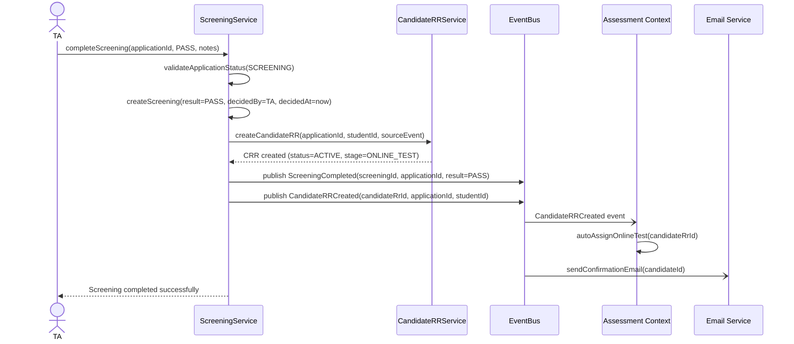
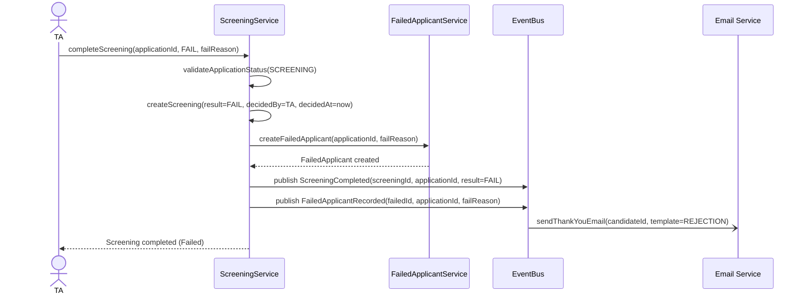

# Flow: Complete Screening

> **Context:** Screening
> **Actor:** TA (Talent Acquisition)
> **Trigger:** TA click "Complete Screening" trên application detail page

---

## Preconditions

- Application tồn tại với status = SCREENING
- TA có quyền screening (được phân công hoặc có role TA_ADMIN/TA_MANAGER)
- Application đã qua Duplicate check (Duplicate.status = RESOLVED hoặc IGNORED)
- CandidateRR chưa tồn tại cho application này

---

## Happy Path

### Steps

1. TA mở danh sách Applications cần screening
2. TA chọn 1 application, xem thông tin (CV, answers, attachments)
3. TA click "Complete Screening"
4. System hiển thị modal với 2 options: PASS hoặc FAIL
5. TA chọn PASS, optional notes
6. TA click "Confirm"
7. System validate: Application.status = SCREENING
8. System tạo Screening record với result = PASS
9. System auto tạo CandidateRR (status = ACTIVE, current_stage = ONLINE_TEST)
10. System publish event `ScreeningCompleted`
11. System publish event `CandidateRRCreated`
12. Assessment Context nhận event, auto assign Online Test cho Candidate
13. System hiển thị confirmation cho TA
14. Candidate nhận email thông báo qua vòng Screening

### Sequence Diagram

---

## Error Paths

### Case: Application đã qua vòng Screening

**Điều kiện:** Application.status != SCREENING (đã qua TEST, INTERVIEW, OFFER)

**Xử lý:**
- System từ chối ngay ở bước validate
- Hiển thị lỗi: "Application đã qua vòng Screening, không thể cập nhật"
- Screening KHÔNG được tạo
- TA phải liên hệ Admin để xử lý ngoại lệ

### Case: CandidateRR đã tồn tại

**Điều kiện:** Student đã có CandidateRR từ trước (apply nhiều lần)

**Xử lý:**
- System detect duplicate CandidateRR
- KHÔNG tạo CandidateRR mới
- Hiển thị warning cho TA: "Candidate đã có RR từ trước (CRR-XXXX), cập nhật current_stage nếu cần"
- TA có thể merge hoặc update existing CandidateRR

### Case: TA không có quyền screening

**Điều kiện:** TA không được phân công hoặc không có role required

**Xử lý:**
- System reject ở bước authentication/authorization
- Hiển thị: "Bạn không có quyền thực hiện screening cho application này"
- Log security event
- Notify TA_ADMIN nếu có attempt không authorized

---

## Alternative Path: Screening = FAIL

### Steps

1. TA chọn FAIL thay vì PASS
2. System yêu cầu chọn fail_reason (dropdown):
   - INSUFFICIENT_SKILLS
   - CULTURE_MISMATCH
   - EXPERIENCE_GAP
   - OTHER
3. System yêu cầu confirm before submit
4. TA click "Confirm"
5. System tạo Screening record với result = FAIL
6. System auto tạo FailedApplicant record
7. System publish event `ScreeningCompleted`
8. System publish event `FailedApplicantRecorded`
9. System auto gửi Thank You email cho Candidate
10. Application.status = REJECTED

### Sequence Diagram (Fail Path)

---

## Postconditions (Happy Path — PASS)

- Screening tồn tại với result = PASS, decided_by = TA-ID, decided_at = timestamp
- CandidateRR tồn tại với status = ACTIVE, current_stage = ONLINE_TEST
- Application.status = TEST (auto update)
- Online Test được auto-assign cho Candidate trong Assessment Context
- Candidate nhận email thông báo qua vòng
- TA thấy confirmation với CandidateRR ID mới

---

## Business Rules áp dụng

- **BR-SCR-001**: Auto tạo Candidate RR khi Screening = Pass
- **BR-SCR-002**: KHÔNG tạo Candidate RR khi Screening = Fail
- **BR-SCR-003**: Screening result có thể update trước khi Application qua vòng sau
- **BR-SCR-004**: Chỉ TA được phân quyền mới được thực hiện Screening
- **BR-SCR-005**: FailedApplicant chỉ được tạo khi Screening = Fail

---

## Retry Policy

### Case: Email Service failure

**Điều kiện:** Email service không gửi được confirmation email

**Xử lý:**
- System retry với Fixed Delay: 3 attempts, 2 seconds delay
- Sau max retries vẫn failure:
  - Log error với candidate email info
  - Notify TA_ADMIN via in-app notification
  - Continue flow (email là side effect, không block chính)

---

## Edge Cases

| Edge Case | Handling |
|-----------|----------|
| TA chọn nhầm PASS thay vì FAIL | Allow UpdateScreening command trước khi candidate qua vòng sau |
| CandidateRR created nhưng event publish failed | System retry publish event, đảm bảo eventual consistency |
| FailedApplicant created nhưng thank_you_sent failed | Flag thank_you_sent = false, scheduled job retry sau |
| Duplicate Application (2 applications cho 1 Student) | Screening chỉ thực hiện sau khi Duplicate.status = RESOLVED |

---

## Notes

- **Time-box:** Screening nên hoàn thành trong 2-5 phút per application
- **Audit Trail:** Tất cả screening decisions được log với decided_by, decided_at, notes
- **Blind Screening:** Configurable để ẩn PII (tên, gender, university) cho fair hiring
