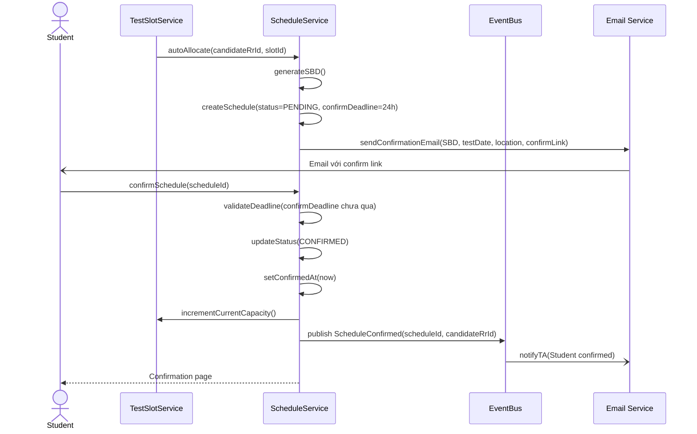
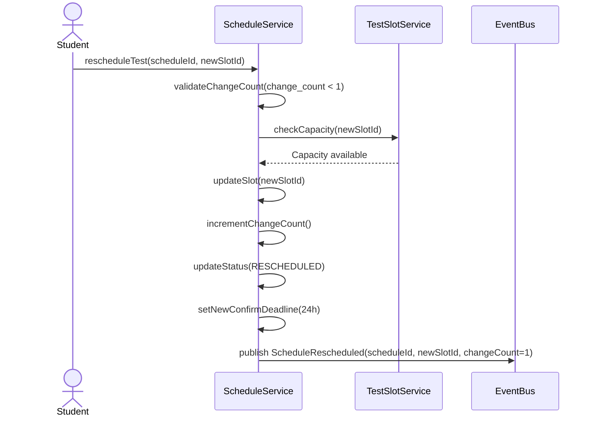

# Flow: Confirm Test Schedule (Onsite Test)

> **Context:** Test Session
> **Actor:** Student (Candidate)
> **Trigger:** Student confirm tham gia Test Session sau khi được auto-allocate vào TestSlot

---

## Preconditions

- TestSlot tồn tại với status = ACTIVE
- Schedule được auto-allocate cho Student (status = PENDING)
- Confirm deadline chưa qua (default: 24h từ khi allocate)
- Student nhận được email thông báo schedule với confirm link

---

## Happy Path

### Steps

1. System auto-allocate Student vào TestSlot (FCFS + Time Window)
2. System auto-gen SBD (Số Báo Danh) cho Student
3. System gửi email cho Student với:
   - TestSlot thông tin (ngày giờ, địa điểm, room)
   - SBD đã gen
   - Confirm deadline (24h từ khi gửi)
   - Confirm link
4. Student click confirm link
5. System validate:
   - Schedule.status = PENDING
   - Confirm deadline chưa qua
   - change_count < max_changes (default: 1)
6. System update Schedule.status = CONFIRMED
7. System set confirmed_at = now
8. System increment TestSlot.current_capacity
9. System publish event `ScheduleConfirmed`
10. TA nhận notification Student đã confirm
11. System hiển thị confirmation cho Student

### Sequence Diagram

---

## Error Paths

### Case: Student không confirm trong Time Window

**Điều kiện:** Confirm deadline qua mà Student không confirm

**Xử lý:**
- System auto retry allocate (max 2 lần)
- Lần 1: Release slot, allocate cho next candidate trong queue
- Lần 2: Release slot, allocate cho next candidate
- Sau 2 lần vẫn không confirm:
  - TestSlot.current_capacity không tăng
  - Notify TA: "Student không confirm — cần manual assign"
  - Schedule.status = CANCELLED

### Case: Student đổi lịch lần 2 (Reschedule lần 2)

**Điều kiện:** Student đã đổi lịch 1 lần (change_count = 1), muốn đổi lần 2

**Xử lý:**
- System check: change_count >= max_changes
- Hiển thị: "Bạn đã đổi lịch 1 lần. Lần này chỉ còn Yes/No options"
- Student KHÔNG được tự chọn slot
- TA nhận request, manual xử lý với 2 options:
  - Yes: TA manual assign slot mới
  - No: Student không tham gia

### Case: TestSlot hết chỗ (Capacity full)

**Điều kiện:** TestSlot.current_capacity >= TestSlot.max_capacity

**Xử lý:**
- Auto-allocate failed
- System notify TA: "TestSlot hết chỗ — cần manual assign"
- TA có 2 options:
  - Tăng max_capacity của TestSlot
  - Tạo TestSlot mới
- Student được alloc vào TestSlot khác hoặc waitlist

---

## Alternative Path: Reschedule Test (Lần 1)

**Điều kiện:** Student muốn đổi lịch (change_count = 0)

### Steps

1. Student click "Đổi lịch" trong email/page
2. System check: change_count < 1
3. System hiển thị danh sách TestSlots còn chỗ
4. Student chọn slot mới
5. System update Schedule:
   - slot_id = mới
   - change_count += 1
   - status = RESCHEDULED
   - confirmDeadline mới (24h)
6. System gửi email confirm reschedule
7. Student confirm slot mới
8. System update Schedule.status = CONFIRMED

### Sequence Diagram (Reschedule)

---

## Postconditions (Happy Path)

- Schedule tồn tại với status = CONFIRMED, confirmed_at = timestamp
- SBD đã gen và hiển thị cho Student (pattern: SBD-YYYYNNNN)
- TestSlot.current_capacity += 1
- Student nhận email confirmation với SBD, test date, location, room
- TA thấy schedule confirm trong dashboard

---

## Business Rules áp dụng

- **BR-TSLOT-001**: Auto gen SBD khi Student được chia vào slot
- **BR-TSLOT-002**: Student chỉ được đổi lịch 1 lần (lần thứ 2 chỉ còn Yes/No options)
- **BR-TSLOT-003**: Auto allocate slots theo FCFS với Time Window (configurable)
- **BR-TSLOT-004**: Time Window để confirm slot (default: 24h, configurable 1-72h)
- **BR-TSLOT-005**: Notify TA khi auto-allocate thành công (configurable)
- **BR-TSLOT-006**: Photo capture khi check-in không bắt buộc (configurable)
- **BR-TSLOT-007**: Grace period cho check-in muộn (default: 15 phút)
- **BR-TSCH-001**: Chỉ Managers được phân công mới chấm được Onsite Test

---

## Retry Policy

### Case: Email Service failure

**Điều kiện:** Email service không gửi được confirmation email

**Xử lý:**
- System retry với Fixed Delay: 3 attempts, 2 seconds delay
- Sau max retries vẫn failure:
  - Log error với student email
  - Notify TA_ADMIN via in-app notification
  - Continue flow (email là side effect)

### Case: Auto-allocate retry

**Điều kiện:** Student không confirm trong time window

**Xử lý:**
- System retry allocate cho next candidate:
  - Attempt 1: Release slot, allocate next candidate (wait 24h)
  - Attempt 2: Release slot, allocate next candidate (wait 24h)
- Sau 2 lần vẫn không confirm:
  - Notify TA manual assign
  - Schedule.status = CANCELLED

---

## Edge Cases

| Edge Case | Handling |
|-----------|----------|
| Student confirm sau deadline | System reject, schedule = CANCELLED, slot released |
| SBD gen trùng | System check uniqueness, re-gen nếu duplicate (hiếm) |
| Student đến nhầm location | TA check-in từ chối, redirect đúng location nếu có thể |
| Check-in muộn quá grace period | CheckIn.status = VERY_LATE, không cho thi |
| Photo capture required nhưng Student từ chối | Configurable: cho phép thi hay reject |
| Grader không phải Manager được phân công | Reject grading attempt (BR-TSCH-001) |

---

## Configurable Parameters

| Parameter | Default | Range | Description |
|-----------|---------|-------|-------------|
| `time_window_hours` | 24 | 1-72 | Thời gian confirm slot (giờ) |
| `max_retry` | 2 | 0-5 | Số lần retry auto-allocate |
| `grace_period_minutes` | 15 | 0-60 | Grace period cho check-in muộn |
| `photo_capture_required` | false | boolean | Bắt buộc chụp ảnh khi check-in |
| `blind_grading_enabled` | true | boolean | Ẩn PII với Graders |
| `max_schedule_changes` | 1 | 0-3 | Số lần đổi lịch tối đa |

---

## Notes

- **SBD Generation:** Pattern `SBD-YYYYNNNN` (e.g., SBD-20260001) — auto-gen khi allocate
- **FCFS Allocation:** First-Come-First-Served với Time Window — candidate apply sớm được allocate sớm
- **Blind Grading:** Configurable per Event — Graders không thấy thông tin cá nhân khi chấm
