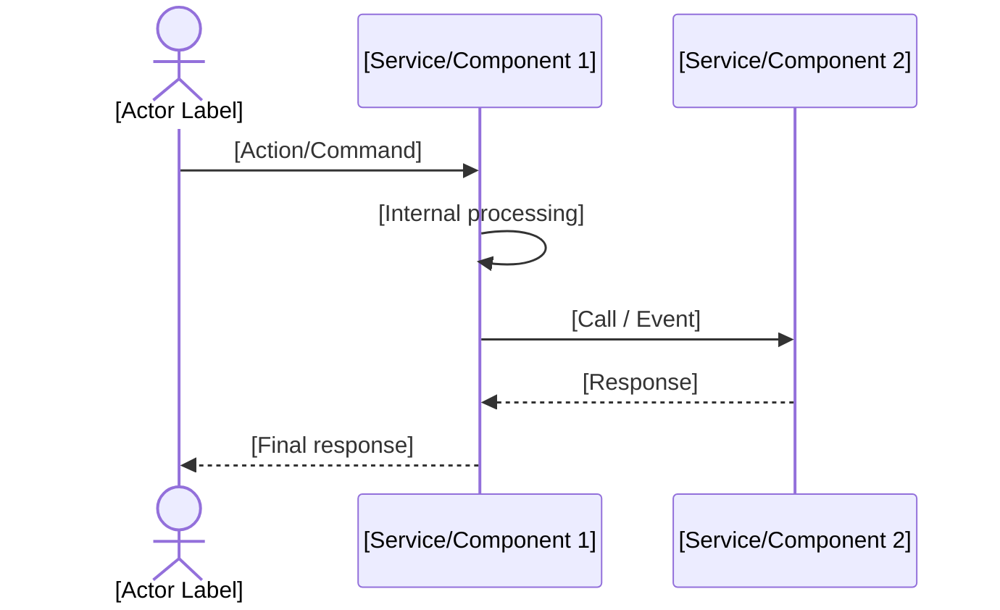

# Flow Template — Use Case

> **Hướng dẫn:** Copy file này vào `/<context>/flows/<verb>-<noun>.md`

---

# Flow: [Use Case Name]

> **Context:** [Bounded Context Name]  
> **Actor:** [Ai khởi động flow — e.g., Customer, Manager, System (scheduler)]  
> **Trigger:** [Điều gì dẫn đến flow này — e.g., "User bấm nút X", "Cron job chạy lúc 00:00"]  
> **Last updated:** YYYY-MM-DD

---

## Preconditions

> Những điều PHẢI ĐÚNG trước khi flow bắt đầu. Nếu sai → flow không được kích hoạt.

- [ ] [Điều kiện 1 — e.g., User đã đăng nhập]
- [ ] [Điều kiện 2 — e.g., Entity X tồn tại và ở status Y]
- [ ] [...]

---

## Happy Path

### Steps

> Mô tả step-by-step theo ngôn ngữ business (không phải code).  
> Format: [Actor] → [Action] → [Result]

1. [Actor] [action]
2. System [response/validation]
3. System [side effect — e.g., tạo entity, gửi event]
4. [...]

### Sequence Diagram

---

## Error Paths

> Mỗi error case cần: điều kiện kích hoạt, system response, user experience.

### ❌ Case: [Tên error — e.g., Insufficient Balance]

**Điều kiện:** [Khi nào xảy ra]  
**System xử lý:** [System làm gì — e.g., rollback, ghi log, gửi notification]  
**User thấy:** [Thông báo lỗi cụ thể]

---

### ❌ Case: [Tên error 2]

**Điều kiện:**  
**System xử lý:**  
**User thấy:**

---

## Postconditions (Happy Path)

> Trạng thái sau khi flow kết thúc thành công.

- [Entity X] đã ở status [Y]
- [Side effect]: [e.g., Email đã được gửi, Event đã được published]
- [Business invariant]: [Rule nào đang được bảo đảm]

---

## Business Rules áp dụng

> Reference đến rules trong Glossary của context này.

- **BR-[CTX]-001:** [Mô tả ngắn]
- **BR-[CTX]-002:** [Mô tả ngắn]

---

## Notes / Assumptions

> Ghi chú thêm nếu có điểm cần chú ý đặc biệt.

- ❓ [Điểm chưa rõ cần confirm] — Assigned to: [Name]
- 💡 [Assumption đang dùng]
