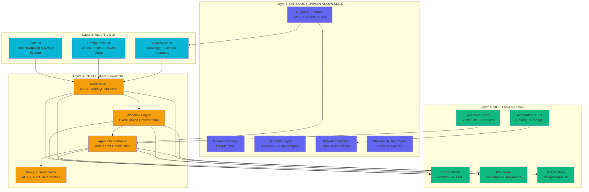
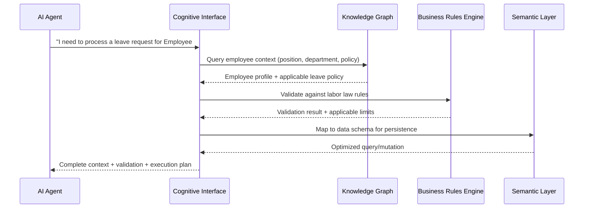
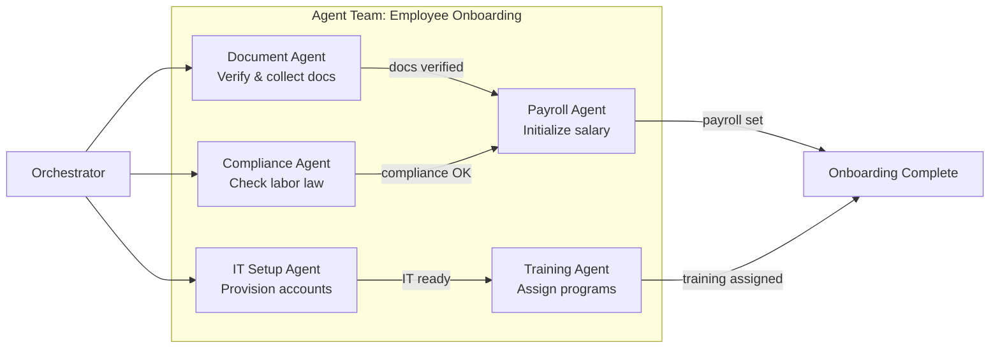

# xTalent: The Self-Evolving HCM Platform

> **Vision Statement**: xTalent is a next-generation Human Capital Management solution built on the Self-Evolving Platform (SEP) architecture — designed to continuously learn, adapt, and evolve alongside your organization in the age of AI Agents.

---

## 1. Executive Summary

### The Challenge

Enterprise HR software is broken. Traditional HCM systems are rigid, configuration-heavy, and fail to keep pace with the speed of regulatory change, workforce transformation, and business evolution. Organizations spend **60-70% of their IT budget** maintaining legacy systems rather than innovating.

### The Opportunity

The convergence of **Agentic AI, Knowledge Graphs, and Generative UI** creates a once-in-a-decade opportunity to reimagine enterprise HR. We are entering the **Era of Cognitive Autonomy** — where software systems can understand business context, reason about complex processes, and evolve without constant human reprogramming.

### Our Answer: xTalent on SEP

xTalent is not just another HCM suite. It is an **HCM platform built on a Self-Evolving Platform (SEP)** — a four-layer architecture that enables:

| Capability | Description |
|:---|:---|
| **Self-Understanding** | AI Agents comprehend HR processes like a domain expert (SME) through an Ontology-Driven Knowledge Layer |
| **Self-Adapting UI** | Interfaces generate themselves in real-time based on user intent — from fixed professional screens to AI-generated views |
| **Self-Orchestrating Logic** | Multi-agent workflows coordinate across HR functions automatically — onboarding, payroll, compliance, performance |
| **Self-Managing Data** | A multi-modal data architecture that grows organically — from structured ACID databases to AI-native vector stores |

### Key Value Propositions

- **55% improvement** in operational efficiency through AI agent automation
- **3.5x ROI** on every dollar invested in agentic AI
- **Sub-5-minute deployment** of new features through configurable workflows
- **Zero-hallucination HR decisions** grounded in verified enterprise ontology

---

## 2. Market Context: The Era of Cognitive Autonomy

### 2.1 The AI Landscape in 2026

The technology market in 2026 is no longer debating whether AI works — it is focused on **how AI becomes inseparable from enterprise architecture**. The shift from "AI as a tool" to "AI as a colleague" is accelerating:

| Market Indicator | Value | Source |
|:---|:---|:---|
| Enterprise applications with agentic capabilities | **40%** | Gartner 2026 |
| Global Agentic Commerce revenue | **$3-5 Trillion** | CDO Times |
| Daily work decisions made autonomously by AI | **15%** | Deloitte |
| Average return per $1 invested in Agentic AI | **$3.50** | Neurons Lab |
| Potential economic value from AI automation in US (by 2030) | **$2.9 Trillion** | McKinsey |

### 2.2 The Agentic Divide

A stark **"Agentic Divide"** is emerging between two classes of organizations:

- **The 6% Leaders**: Companies rewiring their entire operating model around AI agents — achieving 200-2000% productivity gains in complex workflows
- **The 94% Laggards**: Organizations still treating AI as an add-on layer, struggling with 95% pilot failure rates

### 2.3 Why HCM is Ripe for Disruption

Human Capital Management is uniquely suited for the Self-Evolving Platform approach:

| HCM Pain Point | SEP Solution |
|:---|:---|
| Complex, jurisdiction-specific labor regulations | Ontology-encoded compliance rules with automatic updates |
| High-touch, multi-step HR processes (onboarding, offboarding) | Multi-agent workflow orchestration |
| Diverse stakeholder interfaces (employee, manager, HR, C-suite) | Adaptive UI that morphs per user role and intent |
| Sensitive PII data requiring strict governance | Multi-modal data with built-in audit and lineage |
| Constant organizational restructuring | Self-evolving rules and process adaptation |

---

## 3. Vision: xTalent on the Self-Evolving Platform

### 3.1 From HCM Suite → HCM Platform → Self-Evolving HCM

```
Traditional HCM    →    Cloud HCM Suite    →    xTalent SEP
━━━━━━━━━━━━━━━       ━━━━━━━━━━━━━━━━       ━━━━━━━━━━━━━━━
Static screens         Configurable UI         Adaptive + Generative UI
Hardcoded rules        Business rules engine   Ontology-driven intelligence
Manual processes       Workflow automation      Multi-agent orchestration
Single database        Cloud database           Multi-modal data fabric
```

### 3.2 The Operating Model

xTalent introduces a new operating paradigm: **Human + Agent Workforce**.

- **Humans** define strategic objectives, ethical guardrails, and organizational culture
- **AI Agents** execute operational processes, analyze data patterns, and generate insights
- **The Platform** continuously evolves by learning from every interaction, regulation change, and organizational shift

### 3.3 Core Design Principles

1. **Ontology-First**: Every business concept is semantically modeled before any code is written
2. **Intent-Over-Configuration**: Users express what they want, not how to get it
3. **Evolution-by-Design**: The architecture expects and accommodates change as a first-class concern
4. **Deterministic Governance**: AI operates within hard-coded boundaries that cannot be bypassed
5. **Human-on-the-Loop**: Humans supervise and guide, not micromanage

---

## 4. The Four-Layer Architecture

xTalent is built on a **four-layer architecture** that separates concerns while enabling each layer to evolve independently. The layers communicate through well-defined protocols and contracts.

### Architecture Overview



---

### 4.1 Layer 1: Ontology-Driven Knowledge Layer

> **Purpose**: The "semantic brain" of the enterprise — enabling AI Agents to understand HR domain as deeply as a subject matter expert.

This is the **most critical layer** of the architecture. Without it, AI agents are just surface-level automation tools. With it, they become domain-aware, context-sensitive decision-making partners.

#### Components

| Component | Technology | Description |
|:---|:---|:---|
| **Domain Ontology** | LinkML / OWL | Formal model of all HR entities, attributes, relationships, and constraints. Covers: Employee, Position, Department, Contract, Leave Policy, Payroll Rule, Benefit Plan, Competency Framework, etc. |
| **Semantic Layer** | Custom mapping engine | Bridges the gap between business terminology and technical data schemas. Allows queries in business language (e.g., "active employees in probation") that translate to optimized SQL/GraphQL |
| **Knowledge Graph** | Neo4j / SurrealDB | Stores and traverses complex relationships: Employee → Position → Department → Cost Center → Legal Entity. Enables multi-hop reasoning for GraphRAG |
| **Business Rules Engine** | Deterministic engine | Encodes non-negotiable policies: labor law thresholds, tax brackets, approval chains, data privacy rules. These are hard guardrails that AI cannot bypass |
| **Cognitive Interface** | MCP + Custom Protocol | "SME-as-a-Service" — API layer that exposes ontology knowledge to any AI Agent. Any agent can query: "What are the mandatory fields for an employment contract in Vietnam?" |

#### How It Works



#### Why This Matters for HCM

Traditional HCM systems embed business knowledge in application code — making it invisible to AI, hard to change, and impossible to audit. By externalizing knowledge into an ontology:

- **AI Agents understand context**: Not just data, but meaning and relationships
- **Rules are transparent**: Every business rule is auditable, versionable, and testable
- **Change is cheap**: Updating a leave policy means editing an ontology node, not rewriting code
- **Zero hallucination**: AI decisions are grounded in verified, enterprise-specific facts

---

### 4.2 Layer 2: Adaptive UI Layer

> **Purpose**: Deliver the right interface to the right user at the right time — from stable professional screens to AI-generated on-demand views.

The UI layer operates on a **three-tier model** that balances consistency with flexibility:

#### Sub-Layer Architecture

| Sub-Layer | Responsibility | Built By | Coverage |
|:---|:---|:---|:---|
| **Core UI (Fixed)** | Navigation, layout system, design tokens, brand identity, settings pages | Developers | ~30% of screens |
| **Configurable UI (Template-Driven)** | List pages, detail views, forms, dashboards — driven by JSON/Markdown config | Developers + Admins | ~60% of screens |
| **Generative UI (Flex / A2UI)** | On-demand interfaces generated by AI Agents based on user intent | AI Agents | ~10% of screens (long-tail) |

#### The A2UI Protocol Integration

xTalent's Generative UI layer adopts Google's **A2UI (Agent-to-User Interface)** protocol:

1. **Agent receives user intent**: "Show me employees whose contracts expire this quarter"
2. **Agent creates a Blueprint**: JSON specification referencing pre-approved UI component catalog
3. **Frontend renders natively**: Blueprint maps to xTalent's component library — ensuring brand consistency
4. **Progressive rendering**: Users see the UI being assembled in real-time via AG-UI streaming events

| Protocol | Role in xTalent |
|:---|:---|
| **A2UI** | Defines UI structure — what components to show and how |
| **AG-UI** | Event transport — real-time bidirectional state sync |
| **MCP** | Data access — agents query backend tools/data sources |

#### Key Benefit: The 30-60-10 Model

- **Core UI (30%)**: Developers invest heavily in quality, accessibility, and performance for core screens
- **Configurable UI (60%)**: 90% of customer requirements are met through JSON configuration — no code deployment needed
- **Generative UI (10%)**: Handles unpredictable, long-tail requests that would otherwise require custom development

---

### 4.3 Layer 3: Intelligent Backend Layer

> **Purpose**: Process business logic through a combination of traditional APIs, configurable workflows, and coordinated AI agents.

#### Sub-Layer Architecture

| Sub-Layer | Technology | Description |
|:---|:---|:---|
| **Headless API** | REST / GraphQL | Stateless, idempotent CRUD operations serving all clients (web, mobile, agents). Every function exposed as an API for maximum composability |
| **Workflow Engine** | Event-driven orchestration | Low-code workflow designer for HR processes: approval chains, onboarding sequences, payroll calculations. Customers modify processes without code changes |
| **Agent Orchestration** | LangGraph / Multi-Agent Framework | Coordination layer for specialized AI agents: Recruitment Agent, Compliance Agent, Payroll Agent, Analytics Agent. Agents collaborate like a team |
| **Policy & Governance** | Runtime guardrails | RBAC for agents (each agent has a specific identity and permission set), comprehensive audit logging, kill switches for high-risk actions, Human-in-the-Loop (HITL) gates |

#### Workflow Engine: The Customization Weapon

The Workflow Engine is xTalent's primary mechanism for rapid customization:

```
Customer Request: "We need a 3-level approval for leave > 5 days"
━━━━━━━━━━━━━━━━━━━━━━━━━━━━━━━━━━━━━━━━━━━━━━━━━━━━━━
Traditional HCM:  → Code change → Testing → 2-week release cycle
xTalent SEP:      → Configure workflow node → Deploy instantly
```

#### Agent Orchestration: Multi-Agent HR Operations



---

### 4.4 Layer 4: Multi-Modal Data Layer

> **Purpose**: Provide the right data storage paradigm for every type of data — from strict transactional records to flexible AI-native stores.

#### Sub-Layer Architecture

| Sub-Layer | Technology | Data Types | Characteristics |
|:---|:---|:---|:---|
| **Core RDBMS** | PostgreSQL / MySQL | Employee records, payroll transactions, contracts, attendance | ACID-compliant, strict schema, full audit trail |
| **Flex Store** | SurrealDB / MongoDB | Custom fields, extended attributes, client-specific configs, dynamic forms | Schema-on-read, flexible extension without migration |
| **Graph Store** | Neo4j / SurrealDB | Organization charts, skill maps, career paths, knowledge graph | Relationship-first, multi-hop traversal, GraphRAG support |
| **Metadata & Audit** | Data Catalog + Lineage | Data dictionary, schema docs, AI decision audit logs, transformation lineage | Every AI decision is traceable back to its source |
| **AI-Native Store** | Vector DB + Feature Store | Embeddings, semantic search indexes, ML features, agent memory | Optimized for inference, similarity search, RAG |

#### Why Multi-Modal Matters for HCM

HR data is inherently diverse:

- **Structured**: Employee ID, salary, start date → **Core RDBMS**
- **Semi-structured**: Custom employee fields, survey responses → **Flex Store**
- **Relational**: Reporting chains, mentor networks, project teams → **Graph Store**
- **Regulatory**: Who approved what, when, and why → **Metadata & Audit**
- **Semantic**: Resume parsing, skill matching, policy Q&A → **AI-Native Store**

A single-database approach forces painful compromises. The multi-modal architecture lets each data type live in its optimal storage engine.

#### Metadata & Audit: The Compliance Imperative

For HCM/HR applications, the Metadata & Audit layer is **non-negotiable**:

- **Labor Law Compliance**: Every payroll calculation must be traceable
- **Data Privacy**: GDPR/PDPA-like regulations require data lineage
- **AI Transparency**: When an agent recommends a promotion, the reasoning chain must be auditable
- **Schema Evolution**: As ontology evolves, metadata tracks what changed and why

---

## 5. xTalent Capabilities on SEP

### 5.1 Use Case: Self-Evolving Onboarding

**Traditional Approach**: Fixed onboarding checklist, manual document collection, separate IT ticketing, compliance team reviews each case.

**xTalent SEP Approach**:

| Step | What Happens | Layer Involved |
|:---|:---|:---|
| 1. HR initiates onboarding | System queries ontology for applicable onboarding flow based on position, department, and jurisdiction | Ontology Layer |
| 2. Document collection | Document Agent automatically sends requests, validates uploads using AI vision, and flags missing items | Backend (Agent) |
| 3. Compliance check | Compliance Agent cross-references employment terms against jurisdiction-specific labor law rules | Ontology + Backend |
| 4. IT provisioning | IT Setup Agent provisions email, access badges, and software licenses through MCP tool connections | Backend (Workflow) |
| 5. Adaptive UI | Employee sees a personalized onboarding dashboard — showing only their relevant tasks and progress | Adaptive UI |
| 6. Learning & Evolution | System learns from each onboarding — optimizes timing, identifies bottleneck steps, suggests improvements | All Layers |

**Impact**: Onboarding time reduced from **2 weeks → 2 days**. Zero compliance gaps.

### 5.2 Use Case: AI-Driven Performance Review

**Traditional Approach**: Annual forms, subjective scoring, manager bias, no data-driven insights.

**xTalent SEP Approach**:

1. **Continuous data collection**: Attendance patterns, project contributions, peer feedback, skill development — all feed into Knowledge Graph
2. **Agent-powered analysis**: Performance Agent synthesizes data, identifies trends, and generates draft reviews grounded in ontology-defined competency frameworks
3. **Manager review via Generative UI**: Manager says "Show me performance summary for my team" → AI generates a comparative dashboard with key metrics
4. **Calibration with guardrails**: Business Rules Engine ensures fairness metrics are met (no single bias factor exceeds threshold)

### 5.3 Use Case: Adaptive Payroll Compliance

Payroll is one of the most regulation-sensitive areas in HR. xTalent handles it through:

1. **Ontology-encoded tax rules**: Every jurisdiction's tax brackets, social insurance rates, and deduction rules are modeled in the ontology
2. **Automatic rule updates**: When regulations change, only the ontology needs updating — no code changes
3. **Agent-verified calculations**: Payroll Agent runs calculations AND verification in parallel, cross-checking against Business Rules Engine
4. **Complete audit trail**: Every calculation step is logged in Metadata & Audit layer with full lineage

### 5.4 Use Case: Intent-Based HR Analytics

**Employee asks**: "How many vacation days do I have left?"
**Manager asks**: "Show me attrition risk for my department"
**CHRO asks**: "What's our total headcount cost by region with YoY comparison?"

Each query triggers the same flow:
1. **Intent parsing** → Cognitive Interface identifies query type and required data
2. **Ontology grounding** → Semantic Layer maps business terms to data schemas
3. **UI generation** → Generative UI creates the optimal visualization for the response
4. **Governance check** → Policy layer ensures data access is appropriate for the requester's role

---

## 6. Implementation Roadmap: Three Phases

### Phase 1: Foundation (Months 1-6)

**Objective**: Build the semantic brain and establish the platform foundation.

| Workstream | Deliverables |
|:---|:---|
| **Ontology Design** | Core HR domain ontology (Employee, Position, Department, Contract, Policy) in LinkML |
| **Knowledge Graph** | Initial graph with organizational structure, employee relationships |
| **Core APIs** | Headless REST/GraphQL APIs for CRUD operations |
| **Core UI** | Navigation framework, design system, component library |
| **Data Layer** | Core RDBMS + Flex Store setup with Metadata & Audit foundation |

**Success Metric**: Single source of truth established. Core HCM operations running on platform.

### Phase 2: Intelligence (Months 7-12)

**Objective**: Activate the agent layer and configurable workflows.

| Workstream | Deliverables |
|:---|:---|
| **Workflow Engine** | Visual workflow designer for HR processes |
| **Agent Framework** | First agent team: Onboarding Agent, Compliance Agent, Payroll Agent |
| **Configurable UI** | JSON-driven list/detail/form pages covering 60% of screens |
| **Graph Store** | Full Knowledge Graph with GraphRAG capabilities |
| **AI-Native Store** | Vector DB for semantic search (employee profiles, policies) |

**Success Metric**: Agent-assisted workflows handling 40%+ of routine HR operations.

### Phase 3: Evolution (Months 13-18)

**Objective**: Unlock self-evolution and generative capabilities.

| Workstream | Deliverables |
|:---|:---|
| **Generative UI** | A2UI integration — agent-created interfaces for long-tail requests |
| **Multi-Agent Orchestration** | Cross-functional agent teams with autonomous collaboration |
| **Self-Optimization** | MAPE-K feedback loops for continuous platform improvement |
| **Advanced Analytics** | Predictive HR insights (attrition risk, talent gap analysis) |
| **Evolution Engine** | Rules/workflow auto-suggestion based on usage patterns |

**Success Metric**: Platform demonstrably improves itself — new capabilities deployed with minimal human intervention.

---

## 7. ROI & Strategic Value

### Quantified Benefits

| Metric | Expected Impact | Timeline |
|:---|:---|:---|
| Operational efficiency | **+55%** through AI agent automation | Phase 2-3 |
| Financial process costs | **-35% to -50%** reduction | Phase 2 |
| Knowledge worker productivity | **+25% to +40%** capacity freed | Phase 2-3 |
| Time-to-value for new features | **< 5 minutes** through workflows | Phase 2 |
| Customer retention | **2x** through adaptive experience | Phase 3 |
| Onboarding time | **-80%** reduction (2 weeks → 2 days) | Phase 2 |

### Competitive Advantages

| Traditional HCM Vendors | xTalent SEP |
|:---|:---|
| Configuration-heavy, consultant-dependent | Self-configuring through AI and workflows |
| Annual release cycles | Continuous evolution |
| One-size-fits-all UI | Adaptive UI that learns from each user |
| Siloed modules | Unified ontology connecting all domains |
| Opaque AI (black box) | Transparent, auditable AI grounded in ontology |
| Lock-in through complexity | Open protocols (A2UI, AG-UI, MCP) |

---

## 8. Governance, Security & Trust

### 8.1 Agentic Governance Framework

Every AI Agent in xTalent operates under strict governance:

| Governance Aspect | Mechanism |
|:---|:---|
| **Identity** | Each agent has a unique NHI (Non-Human Identity) with specific permissions |
| **Lifecycle** | Formal approval → deployment → monitoring → retirement process |
| **Audit Trail** | Every agent action logged with reasoning chain, decision context, and outcome |
| **Guardrails** | Business Rules Engine prevents agents from violating regulatory constraints |
| **Kill Switch** | Immediate shutdown capability for any agent showing anomalous behavior |
| **HITL Gates** | High-risk actions (termination, salary changes, compliance overrides) require human approval |

### 8.2 Security Architecture: Defense-in-Depth

```
Layer 1: AI Identity Gateways        → Authenticate & authorize each agent/workflow
Layer 2: Runtime Monitoring           → Detect drift, anomalies, injection attempts  
Layer 3: Persistence Boundary         → Protect agent memory from poisoning
Layer 4: Action Guards                → Block dangerous operations without HITL approval
Layer 5: Data-Level Encryption        → End-to-end encryption for PII/sensitive HR data
```

### 8.3 The VIRF Framework for Trustworthy AI

xTalent adopts the **Verifiable Iterative Refinement Framework (VIRF)** — a hybrid neuro-symbolic architecture:

- **System 1 (LLM Planner)**: Fast, creative — proposes actions and interfaces
- **System 2 (Logic Verifier)**: Slow, rigorous — checks proposals against ontology and business rules
- **Result**: 0% dangerous actions while maintaining highest task completion rates

### 8.4 Human-on-the-Loop Philosophy

xTalent follows the "Human-on-the-Loop" model:
- **Humans define**: Strategic objectives, ethical boundaries, organizational culture
- **AI executes**: Operational processes, data analysis, routine decisions
- **Platform ensures**: Every AI action is traceable, explainable, and reversible

---

## 9. Technology Stack Summary

| Layer | Core Technologies | Protocols |
|:---|:---|:---|
| **Ontology** | LinkML, OWL, Neo4j, SurrealDB | GraphRAG, SPARQL |
| **UI** | React/Next.js, Design System, Markdown-driven configs | A2UI, AG-UI, MCP |
| **Backend** | Node.js/Python, Workflow Engine, LangGraph | REST, GraphQL, Event-Driven |
| **Data** | PostgreSQL, MongoDB/SurrealDB, Vector DB | ACID, Schema-on-read, Embedding APIs |
| **AI/ML** | LLM (Multi-model), LangGraph, Custom Agents | MCP, A2A, VIRF |
| **Infrastructure** | Kubernetes, CI/CD, Observability | MAPE-K feedback loop |

---

## 10. Conclusion

xTalent on the Self-Evolving Platform represents a **paradigm shift** in Human Capital Management:

1. **From static software to living systems** — software that understands, learns, and evolves
2. **From configuration to conversation** — users express intent, not technical specifications
3. **From siloed data to unified knowledge** — an ontology-driven semantic brain connecting everything
4. **From manual compliance to automatic governance** — regulations encoded in the platform's DNA
5. **From vendor lock-in to open evolution** — built on open protocols (A2UI, AG-UI, MCP) for ecosystem interoperability

The organizations that embrace this vision will not merely survive the Agentic revolution — they will **lead it**, creating competitive advantages that compound over time as their systems continuously evolve and improve.

**xTalent is not just the future of HCM. It is the future of enterprise software.**

---

*Document Version: 1.0 | Date: March 2026 | Classification: Strategic Vision*
