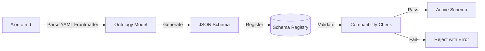
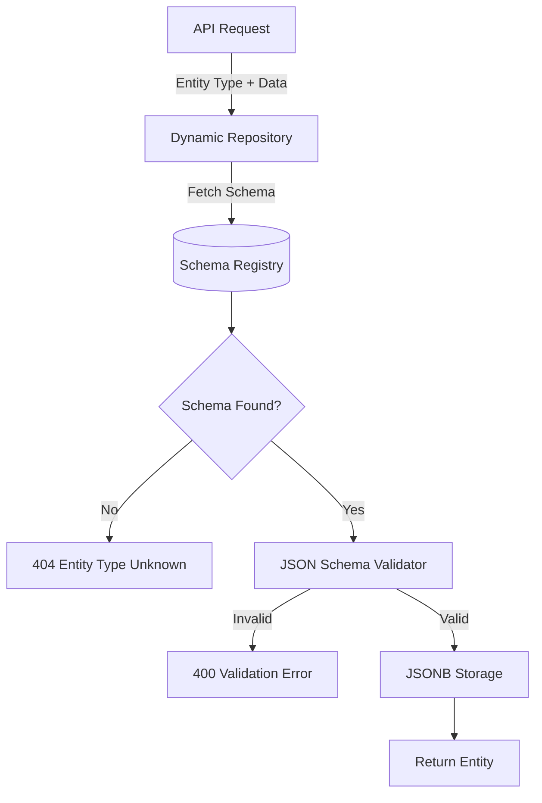
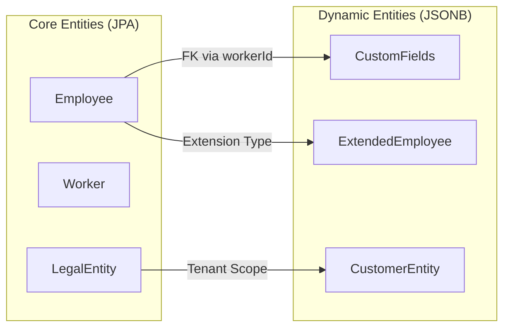
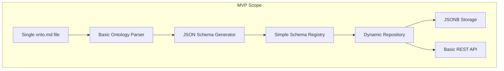

# Architecture Overview: Dynamic Entity Definition System

> **Version**: 1.0 (MVP)  
> **Status**: Draft  
> **Last Updated**: 2026-01-21

---

## 1. Executive Summary

This document describes a 3-layer architecture for dynamic entity definition, adapted from Palantir Foundry's ontology-first approach to fit xTalent HCM's technical stack.

### Core Principle

> **Document-First, Schema-Second, Storage-Third**
> 
> Entities are defined in human-readable Axiom Codex documents (*.onto.md), parsed into JSON Schema for validation, and stored in PostgreSQL JSONB for flexibility.

---

## 2. Architecture Layers

```
┌─────────────────────────────────────────────────────────────────────────┐
│                    LAYER 1: SEMANTIC (Ontology Definition)               │
│  ┌───────────────┐    ┌───────────────┐    ┌───────────────┐            │
│  │  Axiom Codex  │ ─→ │   Ontology    │ ─→ │  JSON Schema  │            │
│  │  *.onto.md    │    │    Parser     │    │   Registry    │            │
│  └───────────────┘    └───────────────┘    └───────────────┘            │
│         ↑                                         ↓                      │
│    Human-Authored                           Machine-Validated            │
└─────────────────────────────────────────────────────────────────────────┘
                                    │
                                    │ Schema Definition
                                    ▼
┌─────────────────────────────────────────────────────────────────────────┐
│                    LAYER 2: KINETIC (Data Integration)                   │
│  ┌───────────────┐    ┌───────────────┐    ┌───────────────┐            │
│  │  Spring Data  │ ─→ │   Dynamic     │ ─→ │  PostgreSQL   │            │
│  │ Abstractions  │    │  Repository   │    │  JSONB Store  │            │
│  └───────────────┘    └───────────────┘    └───────────────┘            │
│         ↑                     ↓                    ↓                     │
│    Type-Safe API        Validation          GIN Indexing                 │
└─────────────────────────────────────────────────────────────────────────┘
                                    │
                                    │ Validated Data
                                    ▼
┌─────────────────────────────────────────────────────────────────────────┐
│                    LAYER 3: DYNAMIC (Runtime Behavior)                   │
│  ┌───────────────┐    ┌───────────────┐    ┌───────────────┐            │
│  │   REST API    │ ─→ │   GraphQL     │ ─→ │    Event      │            │
│  │   Generator   │    │   Auto-Gen    │    │   Publisher   │            │
│  └───────────────┘    └───────────────┘    └───────────────┘            │
│         ↓                     ↓                    ↓                     │
│    OpenAPI Spec        Query Interface       Domain Events               │
└─────────────────────────────────────────────────────────────────────────┘
```

---

## 3. Layer Details

### 3.1 Semantic Layer (Ontology Definition)

**Purpose**: Define entities in human-readable format, generate machine-validated schemas.

#### Components

| Component | Responsibility | Technology |
|-----------|----------------|------------|
| **Ontology Documents** | Source of truth for entity definitions | Axiom Codex *.onto.md (YAML + Markdown) |
| **Ontology Parser** | Parse *.onto.md → Internal Model | Java, SnakeYAML |
| **JSON Schema Generator** | Convert Internal Model → JSON Schema | everit-json-schema or networknt |
| **Schema Registry** | Store, version, and validate schemas | PostgreSQL table |

#### Data Flow



#### Ontology Model (Internal)

```java
public class OntologyModel {
    private String entity;          // Entity name
    private String domain;          // Domain classification
    private String module;          // Module code (CO, TR, TA, PR)
    private String version;         // Semantic version
    private EntityClassification classification;
    private List<Attribute> attributes;
    private List<Relationship> relationships;
    private Lifecycle lifecycle;
    private List<Policy> policies;
}

public class Attribute {
    private String name;
    private String type;            // string, date, enum, etc.
    private boolean required;
    private boolean unique;
    private String format;          // e.g., "EMP-XXXX"
    private List<String> values;    // For enums
    private String description;
}
```

---

### 3.2 Kinetic Layer (Data Integration)

**Purpose**: Connect schema definitions to actual data storage with validation.

#### Components

| Component | Responsibility | Technology |
|-----------|----------------|------------|
| **Dynamic Repository** | CRUD operations for dynamic entities | Spring Data JPA + Custom |
| **Data Validator** | Validate data against JSON Schema | everit-json-schema |
| **JSONB Store** | Flexible storage for entity data | PostgreSQL JSONB |
| **Migration Engine** | Handle schema evolution | Custom or Flyway extension |

#### Data Flow



#### Dynamic Repository Interface

```java
public interface DynamicEntityRepository<T> {
    
    // CRUD Operations
    T save(String entityType, Map<String, Object> data);
    Optional<T> findById(String entityType, UUID id);
    List<T> findAll(String entityType, Pageable pageable);
    void deleteById(String entityType, UUID id);
    
    // Query Operations
    List<T> findByField(String entityType, String field, Object value);
    List<T> query(String entityType, JsonQuery query);
    
    // Schema Operations
    JsonSchema getSchema(String entityType);
    boolean validateData(String entityType, Map<String, Object> data);
}
```

---

### 3.3 Dynamic Layer (Runtime Behavior)

**Purpose**: Auto-generate APIs and enable runtime interaction with dynamic entities.

#### Components

| Component | Responsibility | Technology |
|-----------|----------------|------------|
| **REST API Generator** | Generate CRUD endpoints per entity type | Spring WebMVC + Dynamic Routes |
| **GraphQL Generator** | Auto-generate GraphQL schema | graphql-java + runtime schema |
| **Event Publisher** | Publish domain events for entity changes | Spring Events / Kafka |
| **Action Engine** | Execute business actions on entities | Custom workflow engine |

#### Auto-Generated API Example

For entity type `CustomEmployee`:

```
POST   /api/v1/entities/custom-employee          # Create
GET    /api/v1/entities/custom-employee          # List
GET    /api/v1/entities/custom-employee/{id}     # Get by ID
PUT    /api/v1/entities/custom-employee/{id}     # Update
DELETE /api/v1/entities/custom-employee/{id}     # Delete
POST   /api/v1/entities/custom-employee/query    # Query by fields
```

---

## 4. Comparison: Palantir vs xTalent Adaptation

| Palantir Foundry | xTalent Adaptation | Notes |
|------------------|-------------------|-------|
| Ontology Manager UI | Axiom Codex *.onto.md files | Document-first approach |
| Pipeline Builder | Ontology Parser | Simpler, file-based |
| Object Storage | PostgreSQL JSONB | Relational DB benefits |
| Spark for analytics | SQL/JPQL queries | Familiar to team |
| Workshop/Slate | Future: Low-code UI | Deferred to Phase 2 |
| Actions Engine | Spring Events | Lightweight alternative |

---

## 5. Integration Points

### 5.1 With Existing xTalent Entities



**Hybrid Strategy**:
- Core entities remain in JPA for performance and type safety
- Custom/extension entities use JSONB for flexibility
- Relationships via foreign keys (UUID references)

### 5.2 With Axiom Codex Methodology

| Axiom Codex Pillar | Integration |
|--------------------|-------------|
| **Ontology (onto.md)** | Direct input - parsed for schema generation |
| **Business Rules (brs.md)** | Referenced for validation policies |
| **Features (feat.md)** | Defines user journeys using dynamic entities |
| **Flows (flow.md)** | Orchestrates actions on dynamic entities |
| **APIs (api.md)** | Auto-generated from dynamic repository |

---

## 6. MVP Scope vs Full Build

### MVP Scope (Phase 1)



### Full Build (Phase 2+)

| Feature | MVP | Full Build |
|---------|-----|------------|
| onto.md parsing | ✅ Basic | ✅ Full with relationships |
| JSON Schema generation | ✅ Attributes only | ✅ Full validation rules |
| Schema Registry | ✅ File/DB based | ✅ Versioned with compatibility |
| Dynamic Repository | ✅ Basic CRUD | ✅ Complex queries |
| API Generation | ✅ REST only | ✅ REST + GraphQL |
| Multi-tenancy | ❌ | ✅ Tenant-isolated schemas |
| UI for entity design | ❌ | ✅ Low-code editor |
| Schema migration | ❌ | ✅ Automatic migration |

---

## 7. Key Design Decisions

### Decision 1: Hybrid Storage (JPA + JSONB)

**Decision**: Core entities in JPA, extensions in JSONB.

**Rationale**:
- JPA provides type safety and optimized queries for core domain
- JSONB provides flexibility for customer customization
- Avoids "big bang" migration risk

**Trade-off**: Complexity of managing two storage patterns.

### Decision 2: PostgreSQL-based Schema Registry

**Decision**: Store schemas in PostgreSQL table, not external service.

**Rationale**:
- Simpler infrastructure (no additional service)
- Atomic transactions with data
- Sufficient for MVP scale

**Trade-off**: Less feature-rich than Confluent Schema Registry.

### Decision 3: File-based Ontology Source

**Decision**: *.onto.md files as source of truth, not UI.

**Rationale**:
- Aligns with Axiom Codex methodology
- Version control via Git
- Human-readable documentation

**Trade-off**: Business users need technical support initially (UI planned for Phase 2).

---

## 8. Risk Mitigation

| Risk | Mitigation |
|------|------------|
| onto.md parsing accuracy | Technical spike to validate >80% accuracy |
| JSONB performance | Benchmark at 100k records, use GIN indexes |
| Schema evolution conflicts | Implement compatibility checks, backward-only changes |
| Team learning curve | Allocate training time, start with simple entities |
| Scope creep | Clearly defined MVP boundaries |

---

## See Also

- [Technology Stack](technology-stack.md) - Detailed technology decisions
- [Database Design](database-design.md) - JSONB schema and indexing
- [Axiom Integration](axiom-integration.md) - onto.md parsing rules
- [Validation Plan](../validation-plan.md) - Test plan and success criteria
