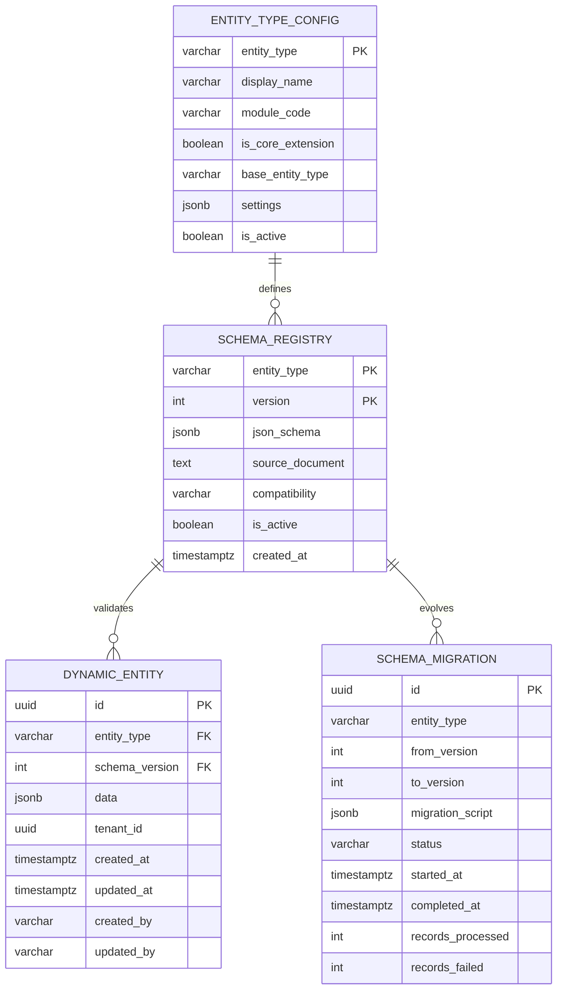

# Database Design: Dynamic Entity Definition System

> **Version**: 1.0 (MVP)  
> **Status**: Draft  
> **Last Updated**: 2026-01-21

---

## 1. Overview

This document describes the database schema design for storing dynamic entities using PostgreSQL JSONB.

### Design Principles

1. **Hybrid Storage**: Core entities in traditional tables, dynamic entities in JSONB
2. **Schema Validation**: All JSONB data validated against registered schemas
3. **Tenant Isolation**: Multi-tenancy support built into design
4. **Performance**: Strategic indexing for common query patterns
5. **Auditability**: Full audit trail for data changes

---

## 2. Schema Diagram



---

## 3. Table Definitions

### 3.1 Schema Registry

Stores JSON Schema definitions for each entity type and version.

```sql
CREATE TABLE schema_registry (
    entity_type VARCHAR(100) NOT NULL,
    version INTEGER NOT NULL,
    json_schema JSONB NOT NULL,
    source_document TEXT,                    -- Reference to *.onto.md file
    compatibility VARCHAR(20) DEFAULT 'BACKWARD',
    is_active BOOLEAN DEFAULT true,
    created_at TIMESTAMPTZ DEFAULT NOW(),
    created_by VARCHAR(100),
    
    PRIMARY KEY (entity_type, version),
    
    CONSTRAINT chk_compatibility CHECK (
        compatibility IN ('BACKWARD', 'FORWARD', 'FULL', 'NONE')
    )
);

-- Index for finding latest active schema
CREATE INDEX idx_sr_active ON schema_registry(entity_type, is_active) 
    WHERE is_active = true;

-- Index for compatibility queries
CREATE INDEX idx_sr_compat ON schema_registry(entity_type, compatibility);

COMMENT ON TABLE schema_registry IS 'Stores JSON Schema definitions for dynamic entity types';
COMMENT ON COLUMN schema_registry.source_document IS 'Path to the Axiom Codex onto.md source file';
COMMENT ON COLUMN schema_registry.compatibility IS 'Schema evolution compatibility mode';
```

### 3.2 Dynamic Entity

Main storage table for dynamic entity instances.

```sql
CREATE TABLE dynamic_entity (
    id UUID PRIMARY KEY DEFAULT gen_random_uuid(),
    entity_type VARCHAR(100) NOT NULL,
    schema_version INTEGER NOT NULL,
    data JSONB NOT NULL,
    tenant_id UUID,                          -- For multi-tenancy
    created_at TIMESTAMPTZ DEFAULT NOW(),
    updated_at TIMESTAMPTZ DEFAULT NOW(),
    created_by VARCHAR(100),
    updated_by VARCHAR(100),
    
    -- Foreign key to schema registry
    CONSTRAINT fk_schema FOREIGN KEY (entity_type, schema_version) 
        REFERENCES schema_registry(entity_type, version),
        
    -- Ensure data is not null
    CONSTRAINT chk_data_not_empty CHECK (data IS NOT NULL AND data != '{}')
);

-- B-tree indexes for common filters
CREATE INDEX idx_de_entity_type ON dynamic_entity(entity_type);
CREATE INDEX idx_de_tenant ON dynamic_entity(tenant_id);
CREATE INDEX idx_de_created ON dynamic_entity(created_at DESC);
CREATE INDEX idx_de_updated ON dynamic_entity(updated_at DESC);

-- Composite index for tenant + entity type queries
CREATE INDEX idx_de_tenant_type ON dynamic_entity(tenant_id, entity_type);

-- GIN index for JSONB content search
CREATE INDEX idx_de_data_gin ON dynamic_entity USING GIN (data);

-- GIN index with jsonb_path_ops for containment queries (smaller, faster)
CREATE INDEX idx_de_data_path ON dynamic_entity USING GIN (data jsonb_path_ops);

-- Trigger for updated_at
CREATE OR REPLACE FUNCTION update_timestamp()
RETURNS TRIGGER AS $$
BEGIN
    NEW.updated_at = NOW();
    RETURN NEW;
END;
$$ LANGUAGE plpgsql;

CREATE TRIGGER trg_de_updated
    BEFORE UPDATE ON dynamic_entity
    FOR EACH ROW
    EXECUTE FUNCTION update_timestamp();

COMMENT ON TABLE dynamic_entity IS 'Stores instances of dynamic entities as JSONB documents';
COMMENT ON COLUMN dynamic_entity.data IS 'Entity data as JSONB, validated against schema_registry';
```

### 3.3 Entity Type Configuration

Configuration and metadata for entity types.

```sql
CREATE TABLE entity_type_config (
    entity_type VARCHAR(100) PRIMARY KEY,
    display_name VARCHAR(200) NOT NULL,
    module_code VARCHAR(10),                 -- CO, TA, TR, PR
    is_core_extension BOOLEAN DEFAULT false, -- Extends core JPA entity?
    base_entity_type VARCHAR(100),           -- If extension, what core entity?
    settings JSONB DEFAULT '{}',             -- Type-specific settings
    is_active BOOLEAN DEFAULT true,
    created_at TIMESTAMPTZ DEFAULT NOW(),
    updated_at TIMESTAMPTZ DEFAULT NOW(),
    
    CONSTRAINT chk_module_code CHECK (
        module_code IN ('CO', 'TA', 'TR', 'PR', 'SYS')
    )
);

COMMENT ON TABLE entity_type_config IS 'Configuration and metadata for dynamic entity types';
COMMENT ON COLUMN entity_type_config.is_core_extension IS 'True if this extends a core JPA entity';
COMMENT ON COLUMN entity_type_config.base_entity_type IS 'Core entity table name if extension';
```

### 3.4 Schema Migration Tracking

Tracks schema evolution and data migrations.

```sql
CREATE TABLE schema_migration (
    id UUID PRIMARY KEY DEFAULT gen_random_uuid(),
    entity_type VARCHAR(100) NOT NULL,
    from_version INTEGER NOT NULL,
    to_version INTEGER NOT NULL,
    migration_script JSONB,                  -- Migration rules/transformations
    status VARCHAR(20) DEFAULT 'PENDING',
    started_at TIMESTAMPTZ,
    completed_at TIMESTAMPTZ,
    records_processed INTEGER DEFAULT 0,
    records_failed INTEGER DEFAULT 0,
    error_log TEXT,
    created_by VARCHAR(100),
    
    CONSTRAINT chk_status CHECK (
        status IN ('PENDING', 'IN_PROGRESS', 'COMPLETED', 'FAILED', 'ROLLED_BACK')
    ),
    CONSTRAINT chk_version_order CHECK (to_version > from_version)
);

CREATE INDEX idx_sm_entity_status ON schema_migration(entity_type, status);

COMMENT ON TABLE schema_migration IS 'Tracks schema evolution migrations';
```

---

## 4. Indexing Strategy

### 4.1 GIN Index Explanation

PostgreSQL GIN (Generalized Inverted Index) supports JSONB queries efficiently:

```sql
-- Default GIN: Supports @>, ?, ?|, ?& operators
CREATE INDEX idx_gin ON dynamic_entity USING GIN (data);

-- jsonb_path_ops: Smaller, faster for @> (containment) only
CREATE INDEX idx_path ON dynamic_entity USING GIN (data jsonb_path_ops);
```

**When to use which**:
- Use default GIN for general JSONB queries
- Use `jsonb_path_ops` when only using `@>` containment

### 4.2 Expression Indexes

For frequently filtered JSONB fields, create expression indexes:

```sql
-- Index on specific JSONB field (cast to text)
CREATE INDEX idx_de_status ON dynamic_entity((data->>'statusCode'));

-- Index on nested field
CREATE INDEX idx_de_employee_class ON dynamic_entity((data->'classification'->>'employeeClass'));

-- Partial index for active records only
CREATE INDEX idx_de_active ON dynamic_entity(entity_type, (data->>'statusCode')) 
    WHERE data->>'statusCode' = 'ACTIVE';
```

### 4.3 Index Sizing Estimate

| Index Type | Overhead | Use Case |
|------------|----------|----------|
| B-tree | ~1-3% of data | Equality, range, sorting |
| GIN (default) | ~20-50% of JSONB size | General JSONB queries |
| GIN (jsonb_path_ops) | ~10-30% of JSONB size | Containment only |
| Expression | Depends on expression | Specific field queries |

---

## 5. Query Patterns

### 5.1 Basic CRUD

```sql
-- Create
INSERT INTO dynamic_entity (entity_type, schema_version, data, tenant_id, created_by)
VALUES ('ExtendedEmployee', 1, '{"employeeId": "EMP-001", "customField": "value"}', 
        'tenant-uuid', 'system');

-- Read by ID
SELECT * FROM dynamic_entity WHERE id = 'entity-uuid';

-- Update
UPDATE dynamic_entity 
SET data = data || '{"customField": "newValue"}', updated_by = 'user'
WHERE id = 'entity-uuid';

-- Delete
DELETE FROM dynamic_entity WHERE id = 'entity-uuid';
```

### 5.2 JSONB Query Operators

```sql
-- Containment: Find where data contains specified key-value
SELECT * FROM dynamic_entity 
WHERE entity_type = 'Employee' 
AND data @> '{"statusCode": "ACTIVE"}';

-- Key existence: Find records with specific key
SELECT * FROM dynamic_entity 
WHERE data ? 'customField';

-- Extract and filter: Get specific field value
SELECT * FROM dynamic_entity 
WHERE data->>'employeeClass' = 'PERMANENT';

-- Array containment
SELECT * FROM dynamic_entity 
WHERE data->'tags' ? 'management';

-- JSON path query (PostgreSQL 12+)
SELECT * FROM dynamic_entity 
WHERE jsonb_path_exists(data, '$.assignments[*] ? (@.isPrimary == true)');
```

### 5.3 Aggregation Queries

```sql
-- Count by status
SELECT data->>'statusCode' as status, COUNT(*)
FROM dynamic_entity
WHERE entity_type = 'Employee'
GROUP BY data->>'statusCode';

-- Distinct values for a field
SELECT DISTINCT data->>'employeeClass' 
FROM dynamic_entity 
WHERE entity_type = 'Employee';
```

### 5.4 Join with Core Tables

```sql
-- Join dynamic extension with core Employee
SELECT e.*, de.data as custom_fields
FROM employee e
LEFT JOIN dynamic_entity de ON de.data->>'employeeId' = e.id::text
    AND de.entity_type = 'EmployeeExtension'
WHERE e.status_code = 'ACTIVE';
```

---

## 6. Schema Evolution

### 6.1 Compatibility Rules

| Mode | Can Add Field | Can Remove Field | Can Change Type |
|------|---------------|------------------|-----------------|
| **BACKWARD** | ✅ (optional) | ❌ | ❌ |
| **FORWARD** | ❌ | ✅ | ❌ |
| **FULL** | ✅ (optional) | ❌ | ❌ |
| **NONE** | ✅ | ✅ | ✅ |

**Recommendation**: Use BACKWARD compatibility (new schema can read old data).

### 6.2 Adding New Field

```sql
-- 1. Register new schema version
INSERT INTO schema_registry (entity_type, version, json_schema, compatibility)
VALUES ('Employee', 2, '{...new schema with optional field...}', 'BACKWARD');

-- 2. Mark old version inactive
UPDATE schema_registry 
SET is_active = false 
WHERE entity_type = 'Employee' AND version = 1;

-- 3. Update new entities to use new version
-- Existing data remains valid (field is optional)
```

### 6.3 Migrating Existing Data

```sql
-- Update all existing records to add default value for new field
UPDATE dynamic_entity 
SET data = data || '{"newField": "defaultValue"}',
    schema_version = 2
WHERE entity_type = 'Employee' 
AND schema_version = 1;
```

---

## 7. Performance Benchmarks

### 7.1 Expected Metrics

| Operation | Data Size | Expected Latency |
|-----------|-----------|------------------|
| Insert single | - | <10ms |
| Get by ID | - | <5ms |
| List (page 100) | 1M rows | <50ms |
| JSONB @> query | 100k rows | <50ms |
| JSONB @> query | 1M rows | <200ms |
| Full table scan | 1M rows | 5-30s |

### 7.2 Benchmark Queries

```sql
-- Benchmark 1: Insert performance
EXPLAIN (ANALYZE, BUFFERS) 
INSERT INTO dynamic_entity (entity_type, schema_version, data)
VALUES ('Test', 1, '{"field": "value"}');

-- Benchmark 2: GIN index lookup
EXPLAIN (ANALYZE, BUFFERS)
SELECT * FROM dynamic_entity 
WHERE entity_type = 'Employee' 
AND data @> '{"statusCode": "ACTIVE"}';

-- Benchmark 3: Expression index lookup
EXPLAIN (ANALYZE, BUFFERS)
SELECT * FROM dynamic_entity 
WHERE data->>'statusCode' = 'ACTIVE';
```

---

## 8. Storage Considerations

### 8.1 TOAST Behavior

PostgreSQL stores large values (>2KB) in TOAST tables:

| JSONB Size | Storage | Performance Impact |
|------------|---------|-------------------|
| <2KB | Inline | ✅ Optimal |
| 2KB-8KB | Compressed TOAST | ⚠️ Slight overhead |
| >8KB | TOAST chunks | ❌ Significant overhead |

**Recommendation**: Keep JSONB documents small. Extract large text fields.

### 8.2 Compression

```sql
-- Check TOAST strategy
SELECT relname, reloptions 
FROM pg_class 
WHERE relname = 'dynamic_entity';

-- Set compression for data column
ALTER TABLE dynamic_entity 
ALTER COLUMN data SET STORAGE EXTENDED;
```

### 8.3 Size Estimation

For 1 million dynamic entities:
- Average JSONB size: 1KB
- Data: ~1GB
- GIN index: ~300MB-500MB
- B-tree indexes: ~50MB
- **Total estimate**: ~1.5-2GB

---

## 9. Backup and Recovery

### 9.1 Backup Strategy

```bash
# Full backup including JSONB data
pg_dump -Fc -t dynamic_entity -t schema_registry xtalent > backup.dump

# Restore
pg_restore -d xtalent backup.dump
```

### 9.2 Point-in-Time Recovery

Ensure WAL archiving is enabled for point-in-time recovery of JSONB data.

---

## 10. Future Considerations

### 10.1 Partitioning (Phase 2)

```sql
-- Partition by entity_type for very large datasets
CREATE TABLE dynamic_entity (
    ...
) PARTITION BY LIST (entity_type);

CREATE TABLE dynamic_entity_employee PARTITION OF dynamic_entity
    FOR VALUES IN ('Employee', 'EmployeeExtension');
```

### 10.2 Full-Text Search

```sql
-- Add tsvector for full-text search on JSONB
ALTER TABLE dynamic_entity ADD COLUMN search_vector tsvector 
    GENERATED ALWAYS AS (to_tsvector('english', data::text)) STORED;

CREATE INDEX idx_de_search ON dynamic_entity USING GIN (search_vector);
```

---

## See Also

- [Architecture Overview](architecture-overview.md) - System architecture
- [Technology Stack](technology-stack.md) - Libraries and configuration
- [Axiom Integration](axiom-integration.md) - onto.md parsing rules
