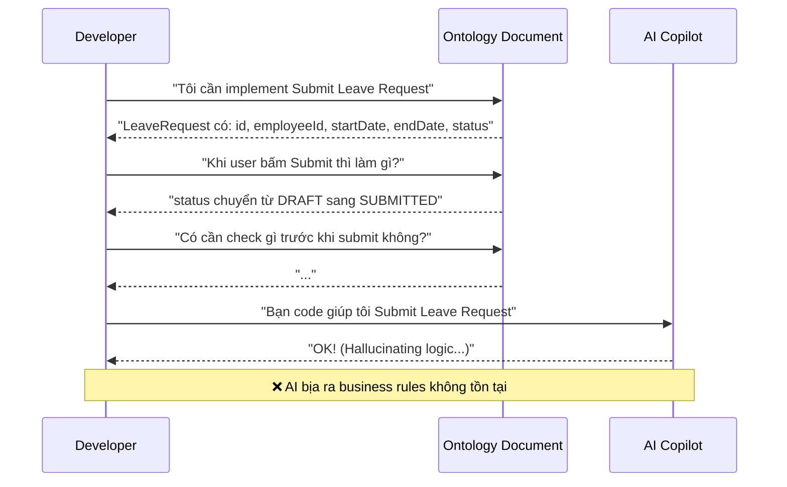
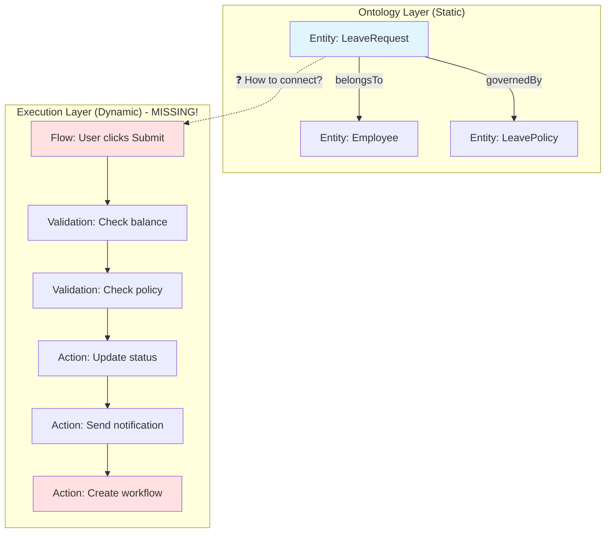
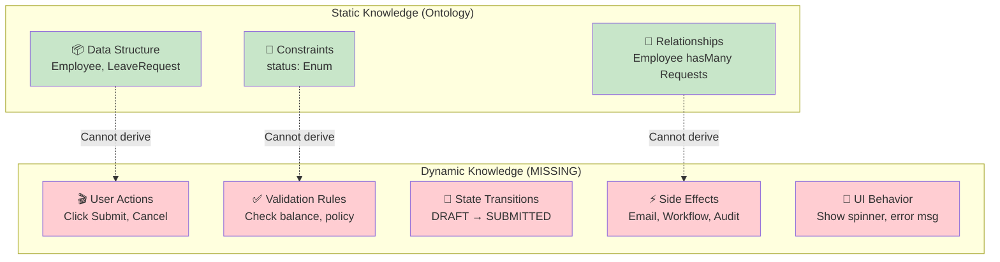
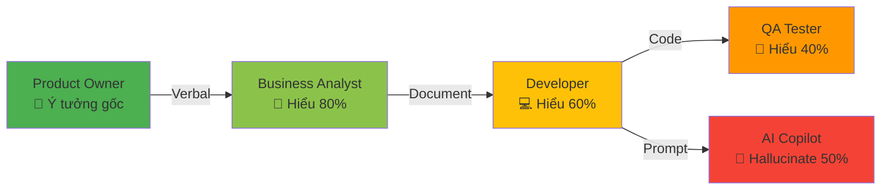
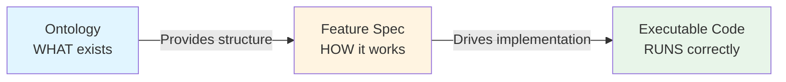

# 13. The Execution Gap: "Static Data" vs "Dynamic Flow"

> [!NOTE]
> **Mục tiêu**: Phân tích hạn chế cốt tử của Ontology thuần túy - nó giỏi định nghĩa "Dữ liệu là gì" nhưng yếu trong việc mô tả "Hệ thống chạy như thế nào".

## Overview

Sau khi hoàn thành Phase 1 (ODD Framework), chúng ta đã có một hệ thống Ontology hoàn chỉnh mô tả cấu trúc dữ liệu của toàn bộ ứng dụng HCM. Tuy nhiên, khi bắt tay vào implementation, một khoảng trống lớn xuất hiện: **Ontology chỉ nói "CÁI GÌ" (WHAT) nhưng không nói "LÀM SAO" (HOW)**.

Đây chính là **Execution Gap** - rào cản lớn nhất giữa thiết kế và triển khai trong kỷ nguyên AI-assisted development.

## 1. The "Ontology is Blind" Paradox

### 1.1. The Conversation That Never Works

Hãy xem xét một cuộc đối thoại điển hình giữa Developer và Ontology:



### 1.2. What Ontology Knows vs What Code Needs



**Vấn đề cốt lõi**: Ontology định nghĩa **Nouns** (danh từ), nhưng code cần **Verbs** (động từ).

## 2. Deep Dive: Missing Pieces of the Dynamic Layer

### 2.1. The Five Dimensions of Execution

| Dimension | Ontology Provides | Code Needs | Gap Impact |
|-----------|-------------------|------------|------------|
| **1. Temporal Order** | Entities exist | Steps execute in sequence | ❌ Dev không biết thứ tự thực hiện |
| **2. Conditional Logic** | Attributes exist | Rules determine flow | ❌ AI hallucinate business rules |
| **3. User Interaction** | Data structure | UI behavior & feedback | ❌ UX inconsistent across features |
| **4. Error Handling** | Data constraints | Error messages & recovery | ❌ Poor user experience |
| **5. Side Effects** | Relationships | Cascading actions | ❌ Missing critical workflows |

### 2.2. Concrete Example: Submit Leave Request

Hãy xem một ví dụ thực tế để thấy rõ khoảng trống này:

#### What Ontology Says:
```yaml
# leave-request.onto.md
entity: LeaveRequest
attributes:
  - id: UUID
  - employeeId: UUID
  - startDate: Date
  - endDate: Date
  - status: Enum[DRAFT, SUBMITTED, APPROVED, REJECTED]
  - leaveTypeId: UUID

relationships:
  - belongsTo: Employee
  - hasType: LeaveType
```

#### What Developer Needs to Know:
```typescript
// ❓ Questions Ontology Cannot Answer:

// 1. TEMPORAL ORDER
async function submitLeaveRequest(requestId: string) {
  // Step 1: Validate what first?
  // Step 2: Then what?
  // Step 3: In which order?
}

// 2. CONDITIONAL LOGIC
// ❓ When can user submit?
// - Check probation period?
// - Check leave balance?
// - Check blackout dates?
// - Check manager availability?

// 3. ERROR HANDLING
// ❓ What error messages to show?
// - "Insufficient balance" or "Not enough leave days"?
// - Show in popup or inline?
// - Allow partial submit?

// 4. SIDE EFFECTS
// ❓ What happens after status changes?
// - Send email to manager?
// - Create approval workflow?
// - Update calendar?
// - Notify team members?
```

### 2.3. The Comparison Matrix



## 3. The "Telephone Game" Returns

### 3.1. The Broken Communication Chain

Khi thiếu tài liệu về Dynamic Layer, thông tin bị méo mó qua mỗi khâu:



### 3.2. Real-World Consequences

> [!WARNING]
> **Case Study: Leave Request Feature**
> 
> - **PO Intent**: "User phải báo trước 7 ngày nếu nghỉ > 3 ngày"
> - **BA Document**: "Minimum notice period: 7 days for long leave"
> - **Dev Implementation**: `if (duration > 3) { minNoticeDays = 7 }`
> - **QA Test**: Chỉ test case `duration = 4`, bỏ qua edge case `duration = 3`
> - **AI Suggestion**: "Add validation: `startDate >= today + 7`" (Sai! Không check duration)
> - **Production Bug**: User nghỉ 1 ngày vẫn bị yêu cầu báo trước 7 ngày

### 3.3. The Cost of Ambiguity

| Stakeholder | Time Wasted | Root Cause |
|-------------|-------------|------------|
| **Developer** | 2 hours debugging | Không rõ business rule |
| **QA** | 1 hour writing wrong test | Không có spec chi tiết |
| **Product Owner** | 3 hours in meetings | Giải thích lại logic |
| **AI Copilot** | ∞ | Hallucinate vì thiếu context |
| **Total** | **6+ hours per feature** | **No Dynamic Specification** |

## 4. Why This Matters in the AI Era

### 4.1. AI Amplifies the Gap

Trong thời đại trước AI, Developer có thể "hỏi lại" PO khi gặp mơ hồ. Nhưng với AI Copilot:

```mermaid
graph TD
    subgraph "Traditional Development"
        T1[Dev reads Ontology]
        T2[Dev confused]
        T3[Dev asks PO]
        T4[PO clarifies]
        T5[Dev codes correctly]
        
        T1 --> T2 --> T3 --> T4 --> T5
    end
    
    subgraph "AI-Assisted Development"
        A1[AI reads Ontology]
        A2[AI confused]
        A3[AI hallucinates logic]
        A4[Dev accepts AI code]
        A5[Bug in production]
        
        A1 --> A2 --> A3 --> A4 --> A5
    end
    
    style T5 fill:#4caf50
    style A5 fill:#f44336
```



### 4.2. The Hallucination Problem

AI models are trained on "average" code patterns. Without explicit specification:
- AI assumes "standard" validation rules
- AI generates "common" error messages
- AI creates "typical" workflows

**But your business is NOT average!**

## 5. The Solution: Feature Specification Layer

> [!IMPORTANT]
> **Conclusion**: Ontology là ĐIỀU KIỆN CẦN, nhưng chưa ĐỦ. 
> 
> Chúng ta cần một layer tiếp theo để "thổi hồn" vào các Entity tĩnh lặng đó. Layer đó chính là **Feature Specification** - nơi định nghĩa:
> - ✅ **Temporal Order**: Steps execute in which sequence?
> - ✅ **Conditional Logic**: What rules govern the flow?
> - ✅ **User Interaction**: How does UI respond?
> - ✅ **Error Handling**: What messages to show when?
> - ✅ **Side Effects**: What cascading actions trigger?

### The Vision



## Key Takeaways

1. **Ontology ≠ Specification**: Ontology mô tả cấu trúc, Specification mô tả hành vi
2. **Static ≠ Dynamic**: Cần cả hai để có hệ thống hoàn chỉnh
3. **AI needs explicit context**: Không có Spec chi tiết = AI hallucinate
4. **The gap is expensive**: 6+ hours lãng phí mỗi feature vì thiếu tài liệu động

## Related Documents
- **Next**: [The Prompt Context Bottleneck](./14-prompt-context-bottleneck.md) - Tại sao RAG không đủ
- **Solution**: [The Feature Standard](../06-Feature-Standard/15-feature-spec-design.md) - Chuẩn Feature Spec mới
