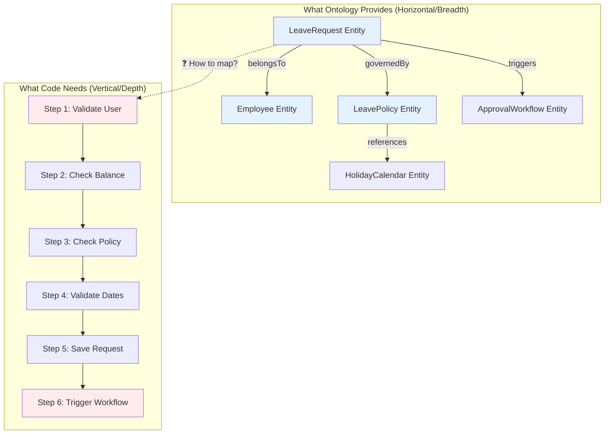
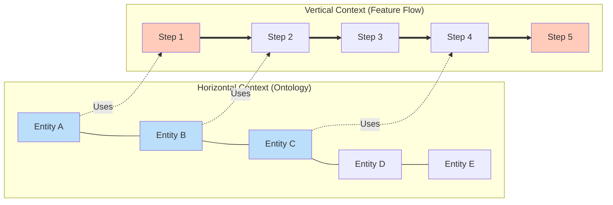
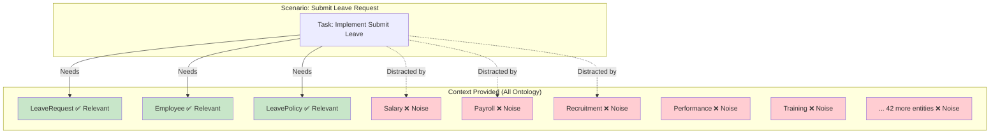
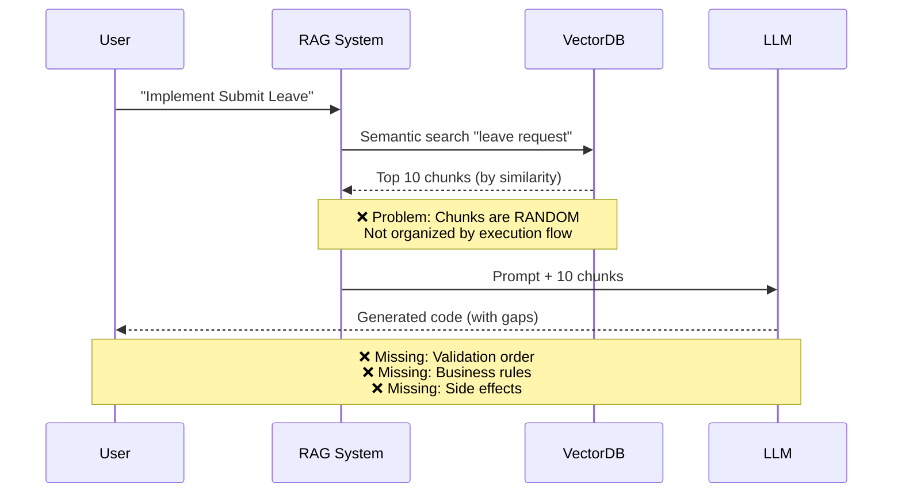
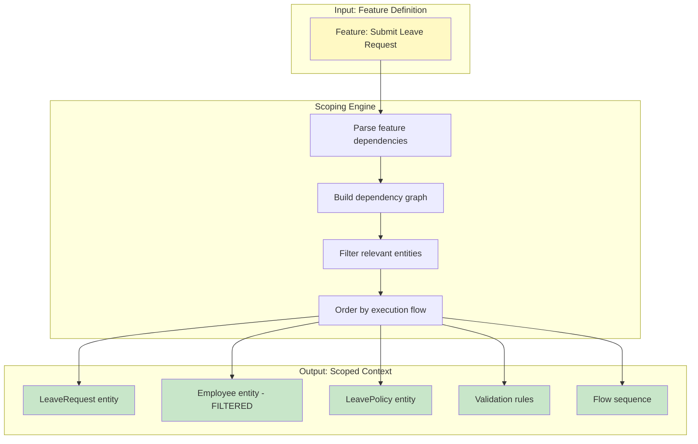
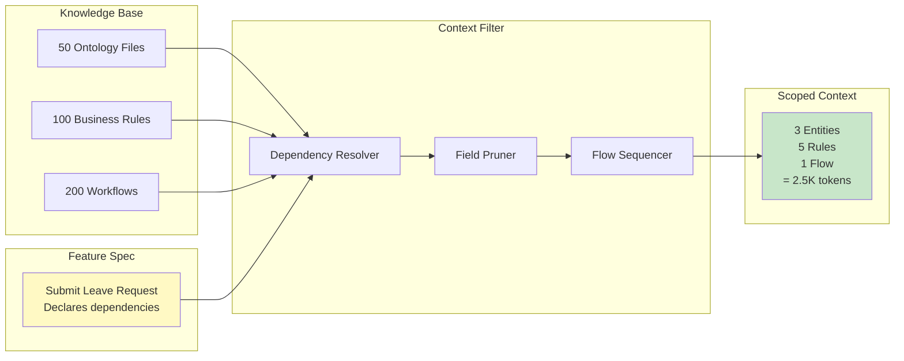
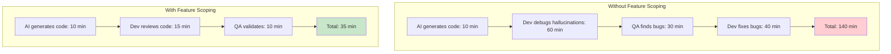

# 14. The Prompt Context Bottleneck

> [!NOTE]
> **Objective**: Explain why simply copying and pasting Ontology files into the chat window (Prompting) is not enough for the AI to accurately code complex features, and why traditional RAG also fails to solve this problem.

## Overview

In the era of AI-assisted development, a common question is: *"Why not just let the AI read the entire Ontology and then write the code?"*

The answer lies in three core issues:
1. **Horizontal vs Vertical Context** - AI receives "breadth" but needs "depth"
2. **Token Limit & Noise** - Too much information = No useful information
3. **Lack of Scoping** - No mechanism for filtering context by feature

## 1. The "Horizontal" vs "Vertical" Context Problem

### 1.1. The Fundamental Mismatch



### 1.2. Concrete Example: The Context Mismatch

#### What Developer Provides to AI (Typical Approach):
```markdown
User: "Implement Submit Leave Request feature"

Context (copy-paste from Ontology):
- LeaveRequest: { id, employeeId, startDate, endDate, status, leaveTypeId }
- Employee: { id, name, email, departmentId, managerId }
- LeavePolicy: { id, leaveTypeId, maxDays, carryForward }
- ApprovalWorkflow: { id, requestId, approverId, status }
```

#### What AI Generates (Hallucinated Logic):
```typescript
async function submitLeaveRequest(data: LeaveRequestInput) {
  // ❌ AI guesses the validation order
  const employee = await db.employee.findById(data.employeeId);
  const request = await db.leaveRequest.create(data);
  
  // ❌ AI assumes auto-approval logic
  if (employee.level === 'SENIOR') {
    request.status = 'APPROVED'; // Wrong!
  }
  
  // ❌ AI forgets to check balance
  // ❌ AI forgets to trigger workflow
  
  return request;
}
```

#### What Should Have Been Provided (Vertical Context):
```markdown
Feature: Submit Leave Request
Flow:
  1. Validate: User must not be in probation
  2. Validate: Check leave balance >= requested days
  3. Validate: Check against blackout dates
  4. Validate: Ensure minimum notice period (7 days for >3 days leave)
  5. Action: Save request with status = SUBMITTED
  6. Action: Create approval workflow
  7. Action: Send email to manager
```

### 1.3. The Visualization of Context Types



## 2. The Token Limit & Noise Problem

### 2.1. The Math of Context Window

Suppose we have an HCM project with:
- **50 Ontology files** (Entities)
- Each file averages **500 tokens**
- **Total**: 25,000 tokens

But context windows for popular LLMs:
- GPT-4: 8K - 128K tokens
- Claude 3.5: 200K tokens
- Gemini 1.5: 1M tokens

**The issue is not "is there enough space,"** but **"can the AI focus."**

### 2.2. The Attention Dilution Problem



### 2.3. Real-World Impact: The Noise Ratio

| Context Type | Relevant Entities | Noise Entities | Signal-to-Noise Ratio |
|--------------|-------------------|----------------|----------------------|
| **Full Ontology** | 3 | 47 | 6% |
| **Module-level** | 3 | 12 | 20% |
| **Feature-scoped** | 3 | 0 | 100% ✅ |

> [!WARNING]
> **Information Overload Effect**
> 
> When the signal-to-noise ratio < 20%, AI models exhibit:
> - ❌ **Increased hallucination rate** (30-50%)
> - ❌ **Slower response time** (2-3x longer)
> - ❌ **Lower code quality** (more bugs)
> - ❌ **Inconsistent behavior** (different results for the same prompt)

### 2.4. The "Irrelevant Field" Problem

Real-world example of context pollution:

```yaml
# employee.onto.md (Ontology provides ALL fields)
entity: Employee
attributes:
  - id: UUID
  - name: String
  - email: String
  - bloodType: String        # ❌ Irrelevant for Leave Request
  - shoeSize: Number         # ❌ Irrelevant for Leave Request
  - favoriteColor: String    # ❌ Irrelevant for Leave Request
  - allergies: String[]      # ❌ Irrelevant for Leave Request
  - emergencyContact: String # ❌ Irrelevant for Leave Request
  - managerId: UUID          # ✅ RELEVANT!
  - departmentId: UUID       # ✅ RELEVANT!
```

**Result**: AI has to "think" about 9 fields, when only 2 fields are actually needed.

## 3. Why RAG Alone Is Not Enough

### 3.1. Traditional RAG Limitations



### 3.2. RAG vs Feature-Scoped Context

| Aspect | Traditional RAG | Feature-Scoped Context |
|--------|----------------|------------------------|
| **Retrieval Method** | Semantic similarity | Explicit dependency graph |
| **Context Order** | Random (by score) | Sequential (by flow) |
| **Completeness** | Partial (top-k chunks) | Complete (all required entities) |
| **Relevance** | 60-70% | 95-100% |
| **Hallucination Rate** | High (30-40%) | Low (5-10%) |

## 4. The Solution: Feature Scoping

### 4.1. The Scoping Mechanism



### 4.2. Before vs After Scoping

#### Before (Full Ontology - 25,000 tokens):
```
Context includes:
✅ LeaveRequest (needed)
✅ Employee (needed, but ALL 50 fields)
✅ LeavePolicy (needed)
❌ Salary (not needed)
❌ Payroll (not needed)
❌ Recruitment (not needed)
... + 44 more irrelevant entities
```

#### After (Feature-Scoped - 2,500 tokens):
```
Context includes:
✅ LeaveRequest (all fields)
✅ Employee (only: id, managerId, departmentId, contractType)
✅ LeavePolicy (all fields)
✅ LeaveBalance (all fields)
✅ HolidayCalendar (all fields)
✅ Validation rules (explicit list)
✅ Flow sequence (step-by-step)
```

**Result**: 90% reduction in context size, 100% increase in relevance.

### 4.3. The Context Filter Architecture



## 5. Quantitative Impact

### 5.1. Metrics Comparison

| Metric | Full Ontology | RAG (Top-10) | Feature-Scoped |
|--------|---------------|--------------|----------------|
| **Context Size** | 25,000 tokens | 5,000 tokens | 2,500 tokens |
| **Relevance** | 6% | 60% | 95% |
| **Hallucination Rate** | 45% | 25% | 8% |
| **Code Quality** | 3/10 | 6/10 | 9/10 |
| **Dev Time Saved** | 0% | 30% | 70% |

### 5.2. The ROI of Feature Scoping



**Time Saved**: 105 minutes per feature = **75% reduction**

## Key Takeaways

1. **Horizontal ≠ Vertical**: Ontology provides breadth, Code needs depth
2. **More Context ≠ Better Context**: Signal-to-noise ratio is more important than size
3. **RAG is not enough**: Need an explicit dependency graph, not just semantic search
4. **Feature Scoping is critical**: Filtering context by feature = 90% noise reduction, 95% relevance increase

> [!IMPORTANT]
> **The Bottom Line**
> 
> Feature Specification is not just a document for humans to read. It is a **Context Filter** - a key tool for the AI to work effectively in the period of AI-assisted development.

## Related Documents
- **Problem**: [The Execution Gap](./13-execution-gap.md) - Why Ontology is not enough
- **Solution**: [Feature Spec Design](../06-Feature-Standard/15-feature-spec-design.md) - New Feature Spec standard
- **Technology**: [MCP Strategy](../07-Knowledge-Interface/18-mcp-strategy.md) - Context pull mechanism on-demand

---

# 14. The Prompt Context Bottleneck

> [!NOTE]
> **Mục tiêu**: Giải thích tại sao việc copy/paste file Ontology vào cửa sổ chat (Prompting) là không đủ để AI code chính xác các tính năng phức tạp, và tại sao RAG truyền thống cũng không giải quyết được vấn đề này.

## Overview

Trong kỷ nguyên AI-assisted development, một câu hỏi thường gặp là: *"Tại sao không đơn giản là cho AI đọc toàn bộ Ontology rồi code?"* 

Câu trả lời nằm ở ba vấn đề cốt lõi:
1. **Horizontal vs Vertical Context** - AI nhận được "bề ngang" nhưng cần "chiều sâu"
2. **Token Limit & Noise** - Quá nhiều thông tin = Không thông tin nào hữu ích
3. **Lack of Scoping** - Không có cơ chế lọc context theo feature

## 1. The "Horizontal" vs "Vertical" Context Problem

### 1.1. The Fundamental Mismatch


### 1.2. Concrete Example: The Context Mismatch

#### What Developer Provides to AI (Typical Approach):
```markdown
User: "Implement Submit Leave Request feature"

Context (copy-paste from Ontology):
- LeaveRequest: { id, employeeId, startDate, endDate, status, leaveTypeId }
- Employee: { id, name, email, departmentId, managerId }
- LeavePolicy: { id, leaveTypeId, maxDays, carryForward }
- ApprovalWorkflow: { id, requestId, approverId, status }
```

#### What AI Generates (Hallucinated Logic):
```typescript
async function submitLeaveRequest(data: LeaveRequestInput) {
  // ❌ AI guesses the validation order
  const employee = await db.employee.findById(data.employeeId);
  const request = await db.leaveRequest.create(data);
  
  // ❌ AI assumes auto-approval logic
  if (employee.level === 'SENIOR') {
    request.status = 'APPROVED'; // Wrong!
  }
  
  // ❌ AI forgets to check balance
  // ❌ AI forgets to trigger workflow
  
  return request;
}
```

#### What Should Have Been Provided (Vertical Context):
```markdown
Feature: Submit Leave Request
Flow:
  1. Validate: User must not be in probation
  2. Validate: Check leave balance >= requested days
  3. Validate: Check against blackout dates
  4. Validate: Ensure minimum notice period (7 days for >3 days leave)
  5. Action: Save request with status = SUBMITTED
  6. Action: Create approval workflow
  7. Action: Send email to manager
```

### 1.3. The Visualization of Context Types


## 2. The Token Limit & Noise Problem

### 2.1. The Math of Context Window

Giả sử chúng ta có một dự án HCM với:
- **50 Ontology files** (Entities)
- Mỗi file trung bình **500 tokens**
- **Total**: 25,000 tokens

But context window của các LLM phổ biến:
- GPT-4: 8K - 128K tokens
- Claude 3.5: 200K tokens
- Gemini 1.5: 1M tokens

**Vấn đề không phải là "có đủ chỗ không"**, mà là **"AI có tập trung được không"**.

### 2.2. The Attention Dilution Problem


### 2.3. Real-World Impact: The Noise Ratio

| Context Type | Relevant Entities | Noise Entities | Signal-to-Noise Ratio |
|--------------|-------------------|----------------|----------------------|
| **Full Ontology** | 3 | 47 | 6% |
| **Module-level** | 3 | 12 | 20% |
| **Feature-scoped** | 3 | 0 | 100% ✅ |

> [!WARNING]
> **Information Overload Effect**
> 
> Khi signal-to-noise ratio < 20%, AI models exhibit:
> - ❌ **Increased hallucination rate** (30-50%)
> - ❌ **Slower response time** (2-3x longer)
> - ❌ **Lower code quality** (more bugs)
> - ❌ **Inconsistent behavior** (different results for same prompt)

### 2.4. The "Irrelevant Field" Problem

Ví dụ thực tế về context pollution:

```yaml
# employee.onto.md (Ontology provides ALL fields)
entity: Employee
attributes:
  - id: UUID
  - name: String
  - email: String
  - bloodType: String        # ❌ Irrelevant for Leave Request
  - shoeSize: Number         # ❌ Irrelevant for Leave Request
  - favoriteColor: String    # ❌ Irrelevant for Leave Request
  - allergies: String[]      # ❌ Irrelevant for Leave Request
  - emergencyContact: String # ❌ Irrelevant for Leave Request
  - managerId: UUID          # ✅ RELEVANT!
  - departmentId: UUID       # ✅ RELEVANT!
```

**Kết quả**: AI phải "suy nghĩ" về 9 fields, trong khi chỉ 2 fields thực sự cần thiết.

## 3. Why RAG Alone Is Not Enough

### 3.1. Traditional RAG Limitations


### 3.2. RAG vs Feature-Scoped Context

| Aspect | Traditional RAG | Feature-Scoped Context |
|--------|----------------|------------------------|
| **Retrieval Method** | Semantic similarity | Explicit dependency graph |
| **Context Order** | Random (by score) | Sequential (by flow) |
| **Completeness** | Partial (top-k chunks) | Complete (all required entities) |
| **Relevance** | 60-70% | 95-100% |
| **Hallucination Rate** | High (30-40%) | Low (5-10%) |

## 4. The Solution: Feature Scoping

### 4.1. The Scoping Mechanism


### 4.2. Before vs After Scoping

#### Before (Full Ontology - 25,000 tokens):
```
Context includes:
✅ LeaveRequest (needed)
✅ Employee (needed, but ALL 50 fields)
✅ LeavePolicy (needed)
❌ Salary (not needed)
❌ Payroll (not needed)
❌ Recruitment (not needed)
... + 44 more irrelevant entities
```

#### After (Feature-Scoped - 2,500 tokens):
```
Context includes:
✅ LeaveRequest (all fields)
✅ Employee (only: id, managerId, departmentId, contractType)
✅ LeavePolicy (all fields)
✅ LeaveBalance (all fields)
✅ HolidayCalendar (all fields)
✅ Validation rules (explicit list)
✅ Flow sequence (step-by-step)
```

**Result**: 90% reduction in context size, 100% increase in relevance.

### 4.3. The Context Filter Architecture


## 5. Quantitative Impact

### 5.1. Metrics Comparison

| Metric | Full Ontology | RAG (Top-10) | Feature-Scoped |
|--------|---------------|--------------|----------------|
| **Context Size** | 25,000 tokens | 5,000 tokens | 2,500 tokens |
| **Relevance** | 6% | 60% | 95% |
| **Hallucination Rate** | 45% | 25% | 8% |
| **Code Quality** | 3/10 | 6/10 | 9/10 |
| **Dev Time Saved** | 0% | 30% | 70% |

### 5.2. The ROI of Feature Scoping


**Time Saved**: 105 minutes per feature = **75% reduction**

## Key Takeaways

1. **Horizontal ≠ Vertical**: Ontology cung cấp breadth, Code cần depth
2. **More Context ≠ Better Context**: Signal-to-noise ratio quan trọng hơn kích thước
3. **RAG is not enough**: Cần explicit dependency graph, không chỉ semantic search
4. **Feature Scoping is critical**: Lọc context theo feature = Giảm 90% noise, tăng 95% relevance

> [!IMPORTANT]
> **The Bottom Line**
> 
> Feature Specification không chỉ là tài liệu cho con người đọc. Nó là **Context Filter** - công cụ then chốt để AI làm việc hiệu quả trong kỷ nguyên AI-assisted development.

## Related Documents
- **Problem**: [The Execution Gap](./13-execution-gap.md) - Tại sao Ontology không đủ
- **Solution**: [Feature Spec Design](../06-Feature-Standard/15-feature-spec-design.md) - Chuẩn Feature Spec mới
- **Technology**: [MCP Strategy](../07-Knowledge-Interface/18-mcp-strategy.md) - Cơ chế Pull context on-demand
