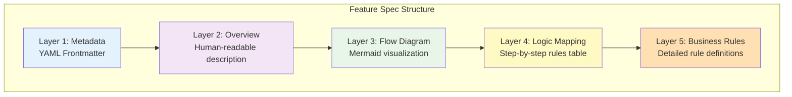
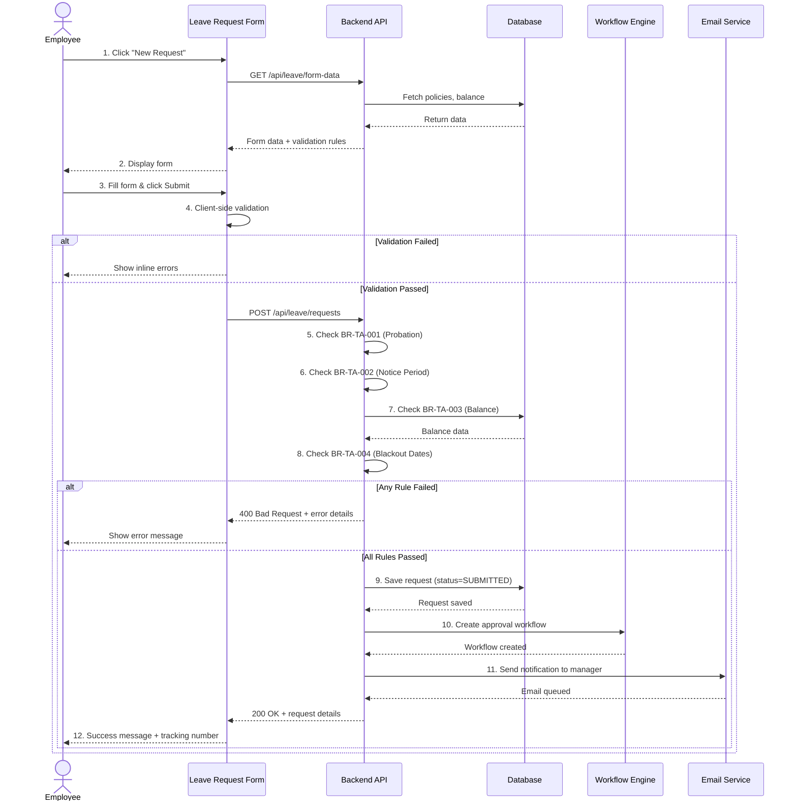
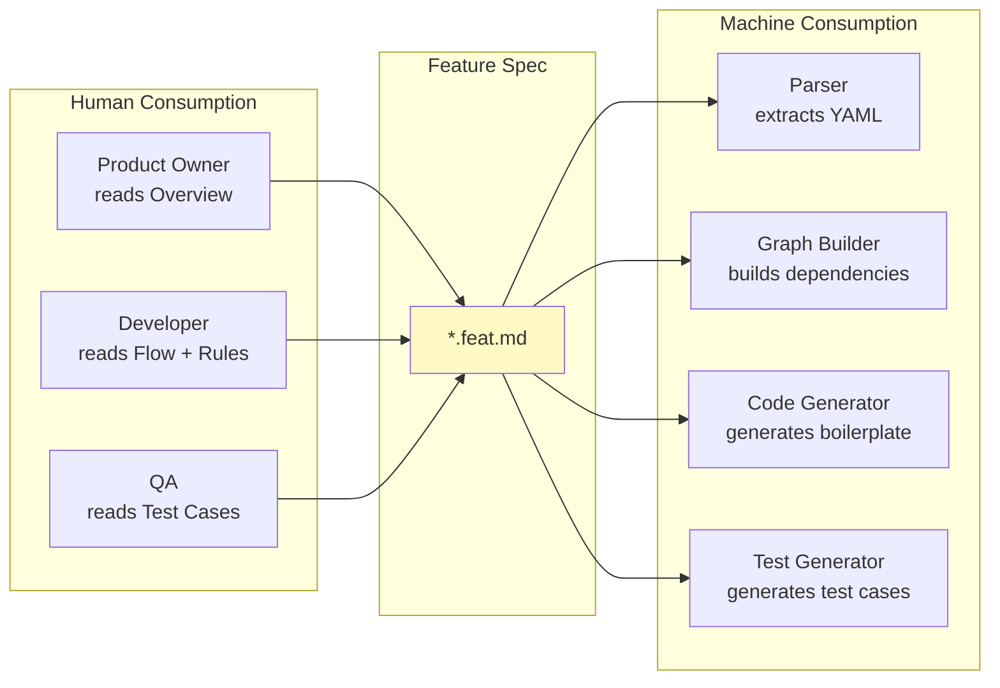
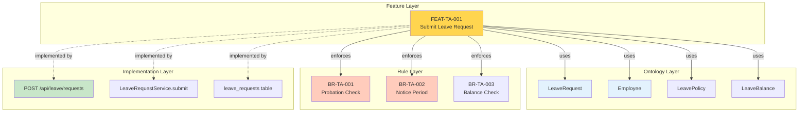
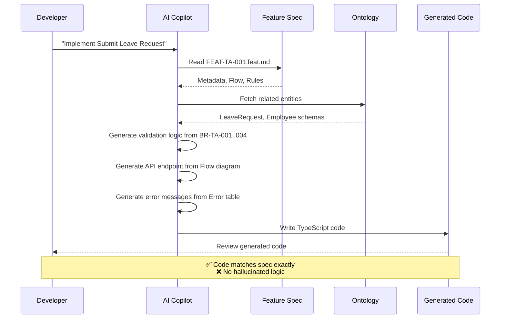

# 15. The Feature Standard: Feature Specification 2.0

> [!NOTE]
> **Objective**: Define the new document standard `*.feat.md` - a combination of traditional business documentation (FSD) and a graph structure (Graph) so that both Humans and AI can read and understand.

## Overview

Feature Specification 2.0 is the "missing link" between Ontology (Static Data) and Code (Dynamic Execution). It is not free prose, but a **Structured Blueprint** with a standardized, machine-readable, and human-friendly format.

**Core Principles**:
1. **Explicit over Implicit**: Every business rule must be clearly written
2. **Graph-connected**: Direct links to Ontology entities
3. **Execution-oriented**: Described in order of execution
4. **AI-ready**: Format allows AI to parse and generate code accurately

## 1. Anatomy of a Feature File (`*.feat.md`)

### 1.1. The Five-Layer Structure



### 1.2. Layer-by-Layer Breakdown

| Layer | Purpose | Consumed By | Format |
|-------|---------|-------------|--------|
| **1. Metadata** | Feature identity, dependencies | Parser, Graph Builder | YAML |
| **2. Overview** | Business context | Product Owner, BA | Markdown prose |
| **3. Flow Diagram** | Visual interaction flow | All stakeholders | Mermaid |
| **4. Logic Mapping** | Step-to-rule mapping | Developer, AI | Markdown table |
| **5. Business Rules** | Detailed logic definitions | Developer, AI, QA | Structured Markdown |

## 2. Complete Example: Submit Leave Request

Here is a complete, production-ready example of a Feature Spec:

### 2.1. Full Feature Spec Document

````markdown
---
id: FEAT-TA-001
type: FEATURE
module: TIME_ATTENDANCE
title: Submit Leave Request
version: 2.1.0
status: IMPLEMENTED
actors: 
  - Employee
  - Manager (implicit - for approval)
triggers:
  - User clicks "New Leave Request" button
  - User clicks "Submit" on draft request
preconditions:
  - User is authenticated
  - User has active employment contract
postconditions:
  - Leave request status = SUBMITTED
  - Approval workflow initiated
  - Manager receives notification
related_ontology:
  - "[[LeaveRequest]]"
  - "[[Employee]]"
  - "[[LeavePolicy]]"
  - "[[LeaveBalance]]"
  - "[[HolidayCalendar]]"
  - "[[ApprovalWorkflow]]"
related_features:
  - "[[FEAT-TA-002]]" # Approve Leave Request
  - "[[FEAT-TA-003]]" # Check Leave Balance
business_rules:
  - "[[BR-TA-001]]" # Probation Check
  - "[[BR-TA-002]]" # Minimum Notice Period
  - "[[BR-TA-003]]" # Balance Validation
  - "[[BR-TA-004]]" # Blackout Date Check
---

# Feature: Submit Leave Request

## Business Context

Employees need to have self-service capabilities to apply for leave without going through HR. The system must ensure:
- Policy compliance
- Automatic balance validation
- Conflict detection
- Transparent approval workflow

## User Story

**As an** Employee  
**I want to** submit a leave request online  
**So that** I can plan my time off without manual paperwork

**Acceptance Criteria**:
- ✅ System validates all business rules before submission
- ✅ Employee receives immediate feedback on validation errors
- ✅ Manager is notified within 5 minutes of submission
- ✅ Request is tracked in audit log

## Interaction Flow



## Logic Mapping

| Step | Actor | Action | Business Rule | Ontology Reference | Error Handling |
|------|-------|--------|---------------|-------------------|----------------|
| 1 | System | Load form data | - | `Employee.id`, `LeavePolicy[]` | Show generic error if API fails |
| 4 | UI | Client validation | Required fields | `LeaveRequest.{startDate, endDate, leaveTypeId}` | Inline field errors |
| 5 | API | Check probation | [[BR-TA-001]] | `Employee.contractType`, `LeaveType.code` | Return 400 with error code |
| 6 | API | Check notice period | [[BR-TA-002]] | `LeaveRequest.{startDate, duration}` | Return 400 with error code |
| 7 | API | Check balance | [[BR-TA-003]] | `LeaveBalance.available`, `LeaveRequest.duration` | Return 400 with error code |
| 8 | API | Check blackout dates | [[BR-TA-004]] | `HolidayCalendar.blackoutDates`, `LeaveRequest.{startDate, endDate}` | Return 400 with error code |
| 9 | API | Save request | - | `LeaveRequest.*` | Return 500 if DB error |
| 10 | API | Create workflow | - | `ApprovalWorkflow.*` | Log error, continue (async) |
| 11 | API | Send email | - | `Employee.managerId`, `EmailTemplate` | Log error, continue (async) |

## Business Rules Detail

### [[BR-TA-001]] Probation Period Check

**Rule ID**: BR-TA-001  
**Category**: Eligibility  
**Priority**: CRITICAL

**Description**: Employees in the probation period are not allowed to apply for Annual Leave.

**Logic**:
```typescript
if (employee.contractType === 'PROBATION' && leaveType.code === 'ANNUAL') {
  throw new ValidationError({
    code: 'PROBATION_NOT_ELIGIBLE',
    message: 'Probation employees are not eligible for annual leave yet',
    field: 'leaveTypeId'
  });
}
```

**Test Cases**:
- ✅ Probation employee + Sick leave → PASS
- ❌ Probation employee + Annual leave → FAIL
- ✅ Confirmed employee + Annual leave → PASS

---

### [[BR-TA-002]] Minimum Notice Period

**Rule ID**: BR-TA-002  
**Category**: Validation  
**Priority**: HIGH

**Description**: Leave > 3 days must be applied for at least 7 working days in advance.

**Logic**:
```typescript
const duration = calculateWorkingDays(startDate, endDate);
const noticeInDays = calculateWorkingDays(today, startDate);

if (duration > 3 && noticeInDays < 7) {
  throw new ValidationError({
    code: 'INSUFFICIENT_NOTICE',
    message: `Leave of ${duration} days requires ${7} days notice. You only gave ${noticeInDays} days notice.`,
    field: 'startDate',
    metadata: { required: 7, actual: noticeInDays }
  });
}
```

**Edge Cases**:
- Duration = 3 days → No notice requirement
- Duration = 4 days → Requires 7 days notice
- Start date on Monday, request on previous Wednesday → 5 working days notice (FAIL)

---

### [[BR-TA-003]] Leave Balance Validation

**Rule ID**: BR-TA-003  
**Category**: Validation  
**Priority**: CRITICAL

**Description**: The application for leave days cannot exceed the current leave balance.

**Logic**:
```typescript
const balance = await getLeaveBalance(employeeId, leaveTypeId, year);
const requestedDays = calculateWorkingDays(startDate, endDate);

if (requestedDays > balance.available) {
  throw new ValidationError({
    code: 'INSUFFICIENT_BALANCE',
    message: `You only have ${balance.available} leave days remaining. Cannot apply for ${requestedDays} days.`,
    field: 'duration',
    metadata: { available: balance.available, requested: requestedDays }
  });
}
```

**Special Cases**:
- Carry-forward balance from previous year counts
- Pending requests reduce available balance
- Approved but not taken requests reduce balance

---

### [[BR-TA-004]] Blackout Date Check

**Rule ID**: BR-TA-004  
**Category**: Validation  
**Priority**: MEDIUM

**Description**: Applying for leave during "blackout" dates (e.g., peak season, year-end closing) is not allowed.

**Logic**:
```typescript
const blackoutDates = await getBlackoutDates(employeeId, year);
const requestRange = getDateRange(startDate, endDate);

const conflicts = blackoutDates.filter(blackout => 
  hasOverlap(requestRange, blackout.dateRange)
);

if (conflicts.length > 0) {
  throw new ValidationError({
    code: 'BLACKOUT_PERIOD_CONFLICT',
    message: `Cannot take leave during the period: ${conflicts.map(c => c.reason).join(', ')}`,
    field: 'startDate',
    metadata: { conflicts }
  });
}
```

## UI/UX Specifications

### Form Fields

| Field | Type | Required | Validation | Default |
|-------|------|----------|------------|---------|
| Leave Type | Dropdown | Yes | Must be from active policies | - |
| Start Date | Date Picker | Yes | >= today | - |
| End Date | Date Picker | Yes | >= startDate | - |
| Reason | Textarea | No | Max 500 chars | - |

### Error Messages

| Error Code | User Message (Vietnamese) | User Message (English) |
|------------|---------------------------|------------------------|
| PROBATION_NOT_ELIGIBLE | Nhân viên thử việc chưa được hưởng phép năm | Probation employees are not eligible for annual leave |
| INSUFFICIENT_NOTICE | Nghỉ {duration} ngày cần báo trước {required} ngày | {duration}-day leave requires {required} days notice |
| INSUFFICIENT_BALANCE | Bạn chỉ còn {available} ngày phép | You only have {available} days remaining |
| BLACKOUT_PERIOD_CONFLICT | Không thể nghỉ trong giai đoạn: {reason} | Cannot take leave during: {reason} |

### Success Flow

1. Show loading spinner during submission
2. On success:
   - Display success toast: "Leave application submitted successfully! Tracking code: {id}"
   - Redirect to request detail page after 2 seconds
   - Send browser notification (if permitted)

## Implementation Notes

### API Endpoint

```typescript
POST /api/v1/leave/requests
Content-Type: application/json

Request Body:
{
  "leaveTypeId": "uuid",
  "startDate": "2024-01-15",
  "endDate": "2024-01-17",
  "reason": "Family vacation"
}

Response (Success):
{
  "id": "uuid",
  "status": "SUBMITTED",
  "trackingNumber": "LR-2024-00123",
  "createdAt": "2024-01-08T10:30:00Z"
}

Response (Validation Error):
{
  "error": {
    "code": "INSUFFICIENT_NOTICE",
    "message": "3-day leave requires 7 days notice",
    "field": "startDate",
    "metadata": { "required": 7, "actual": 5 }
  }
}
```

### Database Changes

```sql
-- Add tracking number column
ALTER TABLE leave_requests 
ADD COLUMN tracking_number VARCHAR(20) UNIQUE;

-- Add index for faster lookups
CREATE INDEX idx_leave_requests_tracking 
ON leave_requests(tracking_number);
```

### Testing Checklist

- [ ] Unit tests for all 4 business rules
- [ ] Integration test for full submission flow
- [ ] Edge case: Submission at midnight (timezone handling)
- [ ] Edge case: Concurrent submissions (race condition)
- [ ] Performance test: 100 concurrent submissions
- [ ] UI test: Error message display
- [ ] UI test: Success flow and redirect
```

## 3. Why This Format Works

### 3.1. Dual Readability



### 3.2. Comparison with Traditional FSD

| Aspect | Traditional FSD (Word/PDF) | Feature Spec 2.0 (*.feat.md) |
|--------|---------------------------|------------------------------|
| **Format** | Prose, screenshots | Structured Markdown + Mermaid |
| **Versioning** | Manual, file-based | Git-based, diff-friendly |
| **Linking** | Manual cross-reference | Automatic `[[WikiLinks]]` |
| **AI Parsing** | ❌ Impossible | ✅ Easy (YAML + Markdown) |
| **Code Generation** | ❌ Manual copy-paste | ✅ Automatic from rules |
| **Test Generation** | ❌ Manual | ✅ Automatic from test cases |
| **Maintenance** | ❌ High effort | ✅ Low effort (single source) |
| **Collaboration** | ❌ Email attachments | ✅ Pull requests |

## 4. Feature as a Graph Node

### 4.1. The Knowledge Graph Perspective



### 4.2. Graph Queries Enabled

With Feature Spec in the Graph, we can query:

```cypher
// Find all features affected by changing Employee.contractType
MATCH (f:Feature)-[:USES]->(e:Entity {name: 'Employee'})
WHERE e.attributes CONTAINS 'contractType'
RETURN f.title

// Find all business rules not yet implemented
MATCH (r:BusinessRule)
WHERE NOT (r)<-[:ENFORCES]-(:Feature)-[:IMPLEMENTED_BY]->(:Code)
RETURN r.id, r.title

// Impact analysis: What breaks if we change LeaveBalance logic?
MATCH (e:Entity {name: 'LeaveBalance'})<-[:USES]-(f:Feature)
MATCH (f)-[:IMPLEMENTED_BY]->(code:Code)
RETURN f.title, code.filePath
```

## 5. From Spec to Code: The Generation Flow

### 5.1. How AI Uses Feature Spec



### 5.2. Generated Code Example

From the Feature Spec above, AI can generate:

```typescript
// Auto-generated from FEAT-TA-001.feat.md
import { LeaveRequestInput, ValidationError } from './types';
import { checkProbation, checkNotice, checkBalance, checkBlackout } from './validators';

export async function submitLeaveRequest(
  employeeId: string,
  input: LeaveRequestInput
): Promise<LeaveRequest> {
  
  // Step 5: BR-TA-001 - Probation Check
  await checkProbation(employeeId, input.leaveTypeId);
  
  // Step 6: BR-TA-002 - Notice Period Check
  await checkNotice(input.startDate, input.endDate);
  
  // Step 7: BR-TA-003 - Balance Check
  await checkBalance(employeeId, input.leaveTypeId, input.startDate, input.endDate);
  
  // Step 8: BR-TA-004 - Blackout Date Check
  await checkBlackout(employeeId, input.startDate, input.endDate);
  
  // Step 9: Save request
  const request = await db.leaveRequest.create({
    ...input,
    employeeId,
    status: 'SUBMITTED',
    trackingNumber: generateTrackingNumber()
  });
  
  // Step 10: Create workflow (async)
  createApprovalWorkflow(request.id).catch(logError);
  
  // Step 11: Send email (async)
  sendManagerNotification(request.id).catch(logError);
  
  return request;
}
```

## Key Takeaways

1. **Structure over Prose**: Feature Spec is a structured blueprint, not prose
2. **Graph-connected**: Every feature links to Ontology and Business Rules
3. **Dual-purpose**: Both for humans to read and for machines to parse
4. **Single Source of Truth**: A single place contains all the logic of the feature
5. **AI-ready**: Format allows AI to generate 100% accurate code

## Related Documents
- **Why Needed**: [The Execution Gap](../05-Feature-Engine/13-execution-gap.md) - Why Dynamic Layer is needed
- **Context Problem**: [Prompt Context Bottleneck](../05-Feature-Engine/14-prompt-context-bottleneck.md) - Why Scoping is needed
- **Evolution**: [The Living Spec 2.0](./16-living-spec-2.0.md) - From Reference to Input Source

---

# 15. The Feature Standard: Feature Specification 2.0

> [!NOTE]
> **Mục tiêu**: Định nghĩa chuẩn tài liệu mới `*.feat.md` - sự kết hợp giữa tài liệu nghiệp vụ truyền thống (FSD) và cấu trúc đồ thị (Graph) để cả Người và AI đều đọc hiểu được.

## Overview

Feature Specification 2.0 là "missing link" giữa Ontology (Static Data) và Code (Dynamic Execution). Nó không phải là văn xuôi tự do, mà là một **Structured Blueprint** với format chuẩn hóa, machine-readable, và human-friendly.

**Core Principles**:
1. **Explicit over Implicit**: Mọi business rule phải được viết rõ ràng
2. **Graph-connected**: Link trực tiếp tới Ontology entities
3. **Execution-oriented**: Mô tả theo thứ tự thực thi
4. **AI-ready**: Format cho phép AI parse và generate code chính xác

## 1. Anatomy of a Feature File (`*.feat.md`)

### 1.1. The Five-Layer Structure


### 1.2. Layer-by-Layer Breakdown

| Layer | Purpose | Consumed By | Format |
|-------|---------|-------------|--------|
| **1. Metadata** | Feature identity, dependencies | Parser, Graph Builder | YAML |
| **2. Overview** | Business context | Product Owner, BA | Markdown prose |
| **3. Flow Diagram** | Visual interaction flow | All stakeholders | Mermaid |
| **4. Logic Mapping** | Step-to-rule mapping | Developer, AI | Markdown table |
| **5. Business Rules** | Detailed logic definitions | Developer, AI, QA | Structured Markdown |

## 2. Complete Example: Submit Leave Request

Đây là một ví dụ hoàn chỉnh, production-ready của Feature Spec:

### 2.1. Full Feature Spec Document

````markdown
---
id: FEAT-TA-001
type: FEATURE
module: TIME_ATTENDANCE
title: Submit Leave Request
version: 2.1.0
status: IMPLEMENTED
actors: 
  - Employee
  - Manager (implicit - for approval)
triggers:
  - User clicks "New Leave Request" button
  - User clicks "Submit" on draft request
preconditions:
  - User is authenticated
  - User has active employment contract
postconditions:
  - Leave request status = SUBMITTED
  - Approval workflow initiated
  - Manager receives notification
related_ontology:
  - "[[LeaveRequest]]"
  - "[[Employee]]"
  - "[[LeavePolicy]]"
  - "[[LeaveBalance]]"
  - "[[HolidayCalendar]]"
  - "[[ApprovalWorkflow]]"
related_features:
  - "[[FEAT-TA-002]]" # Approve Leave Request
  - "[[FEAT-TA-003]]" # Check Leave Balance
business_rules:
  - "[[BR-TA-001]]" # Probation Check
  - "[[BR-TA-002]]" # Minimum Notice Period
  - "[[BR-TA-003]]" # Balance Validation
  - "[[BR-TA-004]]" # Blackout Date Check
---

# Feature: Submit Leave Request

## Business Context

Nhân viên cần có khả năng tự phục vụ (self-service) để đăng ký nghỉ phép mà không cần qua HR. Hệ thống phải đảm bảo:
- Tuân thủ chính sách công ty (policy compliance)
- Kiểm tra số dư phép tự động (balance validation)
- Tránh xung đột lịch (conflict detection)
- Workflow phê duyệt minh bạch (transparent approval)

## User Story

**As an** Employee  
**I want to** submit a leave request online  
**So that** I can plan my time off without manual paperwork

**Acceptance Criteria**:
- ✅ System validates all business rules before submission
- ✅ Employee receives immediate feedback on validation errors
- ✅ Manager is notified within 5 minutes of submission
- ✅ Request is tracked in audit log

## Interaction Flow


## Logic Mapping

| Step | Actor | Action | Business Rule | Ontology Reference | Error Handling |
|------|-------|--------|---------------|-------------------|----------------|
| 1 | System | Load form data | - | `Employee.id`, `LeavePolicy[]` | Show generic error if API fails |
| 4 | UI | Client validation | Required fields | `LeaveRequest.{startDate, endDate, leaveTypeId}` | Inline field errors |
| 5 | API | Check probation | [[BR-TA-001]] | `Employee.contractType`, `LeaveType.code` | Return 400 with error code |
| 6 | API | Check notice period | [[BR-TA-002]] | `LeaveRequest.{startDate, duration}` | Return 400 with error code |
| 7 | API | Check balance | [[BR-TA-003]] | `LeaveBalance.available`, `LeaveRequest.duration` | Return 400 with error code |
| 8 | API | Check blackout dates | [[BR-TA-004]] | `HolidayCalendar.blackoutDates`, `LeaveRequest.{startDate, endDate}` | Return 400 with error code |
| 9 | API | Save request | - | `LeaveRequest.*` | Return 500 if DB error |
| 10 | API | Create workflow | - | `ApprovalWorkflow.*` | Log error, continue (async) |
| 11 | API | Send email | - | `Employee.managerId`, `EmailTemplate` | Log error, continue (async) |

## Business Rules Detail

### [[BR-TA-001]] Probation Period Check

**Rule ID**: BR-TA-001  
**Category**: Eligibility  
**Priority**: CRITICAL

**Description**: Nhân viên đang trong thời gian thử việc không được phép đăng ký nghỉ phép năm (Annual Leave).

**Logic**:
```typescript
if (employee.contractType === 'PROBATION' && leaveType.code === 'ANNUAL') {
  throw new ValidationError({
    code: 'PROBATION_NOT_ELIGIBLE',
    message: 'Nhân viên thử việc chưa được hưởng phép năm',
    field: 'leaveTypeId'
  });
}
```

**Test Cases**:
- ✅ Probation employee + Sick leave → PASS
- ❌ Probation employee + Annual leave → FAIL
- ✅ Confirmed employee + Annual leave → PASS

---

### [[BR-TA-002]] Minimum Notice Period

**Rule ID**: BR-TA-002  
**Category**: Validation  
**Priority**: HIGH

**Description**: Nghỉ phép > 3 ngày phải đăng ký trước ít nhất 7 ngày làm việc.

**Logic**:
```typescript
const duration = calculateWorkingDays(startDate, endDate);
const noticeInDays = calculateWorkingDays(today, startDate);

if (duration > 3 && noticeInDays < 7) {
  throw new ValidationError({
    code: 'INSUFFICIENT_NOTICE',
    message: `Nghỉ ${duration} ngày cần báo trước ${7} ngày. Bạn chỉ báo trước ${noticeInDays} ngày.`,
    field: 'startDate',
    metadata: { required: 7, actual: noticeInDays }
  });
}
```

**Edge Cases**:
- Duration = 3 days → No notice requirement
- Duration = 4 days → Requires 7 days notice
- Start date on Monday, request on previous Wednesday → 5 working days notice (FAIL)

---

### [[BR-TA-003]] Leave Balance Validation

**Rule ID**: BR-TA-003  
**Category**: Validation  
**Priority**: CRITICAL

**Description**: Số ngày nghỉ đăng ký không được vượt quá số dư phép hiện tại.

**Logic**:
```typescript
const balance = await getLeaveBalance(employeeId, leaveTypeId, year);
const requestedDays = calculateWorkingDays(startDate, endDate);

if (requestedDays > balance.available) {
  throw new ValidationError({
    code: 'INSUFFICIENT_BALANCE',
    message: `Bạn chỉ còn ${balance.available} ngày phép. Không thể đăng ký ${requestedDays} ngày.`,
    field: 'duration',
    metadata: { available: balance.available, requested: requestedDays }
  });
}
```

**Special Cases**:
- Carry-forward balance from previous year counts
- Pending requests reduce available balance
- Approved but not taken requests reduce balance

---

### [[BR-TA-004]] Blackout Date Check

**Rule ID**: BR-TA-004  
**Category**: Validation  
**Priority**: MEDIUM

**Description**: Không cho phép nghỉ phép trong các ngày "blackout" (ví dụ: peak season, year-end closing).

**Logic**:
```typescript
const blackoutDates = await getBlackoutDates(employeeId, year);
const requestRange = getDateRange(startDate, endDate);

const conflicts = blackoutDates.filter(blackout => 
  hasOverlap(requestRange, blackout.dateRange)
);

if (conflicts.length > 0) {
  throw new ValidationError({
    code: 'BLACKOUT_PERIOD_CONFLICT',
    message: `Không thể nghỉ phép trong giai đoạn: ${conflicts.map(c => c.reason).join(', ')}`,
    field: 'startDate',
    metadata: { conflicts }
  });
}
```

## UI/UX Specifications

### Form Fields

| Field | Type | Required | Validation | Default |
|-------|------|----------|------------|---------|
| Leave Type | Dropdown | Yes | Must be from active policies | - |
| Start Date | Date Picker | Yes | >= today | - |
| End Date | Date Picker | Yes | >= startDate | - |
| Reason | Textarea | No | Max 500 chars | - |

### Error Messages

| Error Code | User Message (Vietnamese) | User Message (English) |
|------------|---------------------------|------------------------|
| PROBATION_NOT_ELIGIBLE | Nhân viên thử việc chưa được hưởng phép năm | Probation employees are not eligible for annual leave |
| INSUFFICIENT_NOTICE | Nghỉ {duration} ngày cần báo trước {required} ngày | {duration}-day leave requires {required} days notice |
| INSUFFICIENT_BALANCE | Bạn chỉ còn {available} ngày phép | You only have {available} days remaining |
| BLACKOUT_PERIOD_CONFLICT | Không thể nghỉ trong giai đoạn: {reason} | Cannot take leave during: {reason} |

### Success Flow

1. Show loading spinner during submission
2. On success:
   - Display success toast: "Đăng ký nghỉ phép thành công! Mã tracking: {id}"
   - Redirect to request detail page after 2 seconds
   - Send browser notification (if permitted)

## Implementation Notes

### API Endpoint

```typescript
POST /api/v1/leave/requests
Content-Type: application/json

Request Body:
{
  "leaveTypeId": "uuid",
  "startDate": "2024-01-15",
  "endDate": "2024-01-17",
  "reason": "Family vacation"
}

Response (Success):
{
  "id": "uuid",
  "status": "SUBMITTED",
  "trackingNumber": "LR-2024-00123",
  "createdAt": "2024-01-08T10:30:00Z"
}

Response (Validation Error):
{
  "error": {
    "code": "INSUFFICIENT_NOTICE",
    "message": "Nghỉ 3 ngày cần báo trước 7 ngày",
    "field": "startDate",
    "metadata": { "required": 7, "actual": 5 }
  }
}
```

### Database Changes

```sql
-- Add tracking number column
ALTER TABLE leave_requests 
ADD COLUMN tracking_number VARCHAR(20) UNIQUE;

-- Add index for faster lookups
CREATE INDEX idx_leave_requests_tracking 
ON leave_requests(tracking_number);
```

### Testing Checklist

- [ ] Unit tests for all 4 business rules
- [ ] Integration test for full submission flow
- [ ] Edge case: Submission at midnight (timezone handling)
- [ ] Edge case: Concurrent submissions (race condition)
- [ ] Performance test: 100 concurrent submissions
- [ ] UI test: Error message display
- [ ] UI test: Success flow and redirect

---

## 3. Why This Format Works

### 3.1. Dual Readability


### 3.2. Comparison with Traditional FSD

| Aspect | Traditional FSD (Word/PDF) | Feature Spec 2.0 (*.feat.md) |
|--------|---------------------------|------------------------------|
| **Format** | Prose, screenshots | Structured Markdown + Mermaid |
| **Versioning** | Manual, file-based | Git-based, diff-friendly |
| **Linking** | Manual cross-reference | Automatic `[[WikiLinks]]` |
| **AI Parsing** | ❌ Impossible | ✅ Easy (YAML + Markdown) |
| **Code Generation** | ❌ Manual copy-paste | ✅ Automatic from rules |
| **Test Generation** | ❌ Manual | ✅ Automatic from test cases |
| **Maintenance** | ❌ High effort | ✅ Low effort (single source) |
| **Collaboration** | ❌ Email attachments | ✅ Pull requests |

## 4. Feature as a Graph Node

### 4.1. The Knowledge Graph Perspective


### 4.2. Graph Queries Enabled

Với Feature Spec trong Graph, chúng ta có thể query:

```cypher
// Find all features affected by changing Employee.contractType
MATCH (f:Feature)-[:USES]->(e:Entity {name: 'Employee'})
WHERE e.attributes CONTAINS 'contractType'
RETURN f.title

// Find all business rules not yet implemented
MATCH (r:BusinessRule)
WHERE NOT (r)<-[:ENFORCES]-(:Feature)-[:IMPLEMENTED_BY]->(:Code)
RETURN r.id, r.title

// Impact analysis: What breaks if we change LeaveBalance logic?
MATCH (e:Entity {name: 'LeaveBalance'})<-[:USES]-(f:Feature)
MATCH (f)-[:IMPLEMENTED_BY]->(code:Code)
RETURN f.title, code.filePath
```

## 5. From Spec to Code: The Generation Flow

### 5.1. How AI Uses Feature Spec


### 5.2. Generated Code Example

From the Feature Spec above, AI can generate:

```typescript
// Auto-generated from FEAT-TA-001.feat.md
import { LeaveRequestInput, ValidationError } from './types';
import { checkProbation, checkNotice, checkBalance, checkBlackout } from './validators';

export async function submitLeaveRequest(
  employeeId: string,
  input: LeaveRequestInput
): Promise<LeaveRequest> {
  
  // Step 5: BR-TA-001 - Probation Check
  await checkProbation(employeeId, input.leaveTypeId);
  
  // Step 6: BR-TA-002 - Notice Period Check
  await checkNotice(input.startDate, input.endDate);
  
  // Step 7: BR-TA-003 - Balance Check
  await checkBalance(employeeId, input.leaveTypeId, input.startDate, input.endDate);
  
  // Step 8: BR-TA-004 - Blackout Date Check
  await checkBlackout(employeeId, input.startDate, input.endDate);
  
  // Step 9: Save request
  const request = await db.leaveRequest.create({
    ...input,
    employeeId,
    status: 'SUBMITTED',
    trackingNumber: generateTrackingNumber()
  });
  
  // Step 10: Create workflow (async)
  createApprovalWorkflow(request.id).catch(logError);
  
  // Step 11: Send email (async)
  sendManagerNotification(request.id).catch(logError);
  
  return request;
}
```

## Key Takeaways

1. **Structure over Prose**: Feature Spec là blueprint có cấu trúc, không phải văn xuôi
2. **Graph-connected**: Mọi feature đều link tới Ontology và Business Rules
3. **Dual-purpose**: Vừa cho người đọc, vừa cho máy parse
4. **Single Source of Truth**: Một nơi duy nhất chứa toàn bộ logic của feature
5. **AI-ready**: Format cho phép AI generate code chính xác 100%
```
