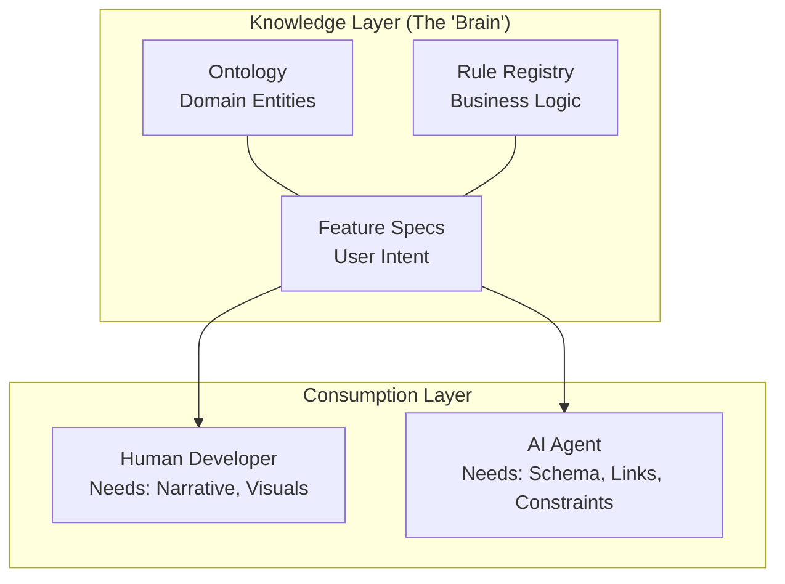

# Modern Feature Architecture: Bridging Human & AI

> [!NOTE]
> This document analyzes the "Feature Spec 2.0" approach within the context of modern software engineering trends (DDD, BDD, Docs-as-Code) and AI-driven development.

## 1. The Paradigm Shift: From "Documents" to "Knowledge Graph"

Traditionally, specifications were **static documents** (Word, PDF, Confluence) meant only for humans. In the AI era, specifications must be **dynamic data structures** that serve as the "Prompt Context" for LLMs.

Your proposed structure (`*.feat.md` + Ontology) aligns perfectly with this shift. Here is the conceptual model:



### Why this is "Modern"?
1.  **Docs-as-Code**: Located in Git, versioned with code, reviewable via PRs.
2.  **Semantic Linking**: Uses `[[WikiLinks]]` to create a traversable graph, not just isolated pages.
3.  **Structured Data**: YAML frontmatter allows the spec to be queried like a database (e.g., "Find all features using *LeaveBalance*").

## 2. Structural Requirements for Dual Readability

To check "Human vs. AI" readability, we evaluate the `*.feat.md` structure against cognitive needs.

### For Humans (The "Soft" Context)
Humans rely on **narrative** and **visualization** to build a mental model.
- **Overview/Context**: "Why are we building this?" (Business Value).
- **Visuals**: Mermaid diagrams (Flow, Sequence, State) are critical because humans process images 60,000x faster than text.
- **UI Sketches**: Concrete visualization of the end state.

### For AI (The "Hard" Context)
AI relies on **symbols** and **constraints** to generate correct code.
- **Explicit Links**: `[[User]]`, `[[LeaveRequest]]`. Ambiguity is the enemy of code generation.
- **Atomic Rules**: `BR-001` must be self-contained logic, not hidden in a paragraph.
- **Pre/Post-conditions**: These map directly to "Arrange" and "Assert" steps in test generation.

### The "Feature Spec 2.0" Validation
Your structure covers both correctly:
- ✅ **Human**: Overview, User Story, Mermaid Diagrams.
- ✅ **AI**: YAML Metadata, Requirements Matrix (Table), Business Rules links.

## 3. Forming the Knowledge Layer (Ontology + FR + BR)

You asked: *"How to ensure enough information to form a knowledge layer?"*

The key is **Granularity** and **Connectivity**. A robust Knowledge Graph requires three distinct node types:

### Node Type A: Ontology (The "Nouns")
- **Definition**: What things exist? (Employee, LeaveRequest, Salary).
- **AI Use**: Providing the **Type Definitions** (TypeScript interfaces, SQL schemas).
- **Location**: `00-ontology/**/*.onto.md`.

### Node Type B: Business Rules (The "Constraints")
- **Definition**: What is allowed? (Probation check, Overtime limit).
- **AI Use**: Generating **Validation Logic** (if/else blocks, validators).
- **Location**: `02-spec/BR/*.brs.md`.
- **CRITICAL**: Rules must be *reusable*. `BR-TA-001` (Probation Check) might be used in "Submit Leave" AND "Calculate Bonus".

### Node Type C: Features (The "Verbs")
- **Definition**: How do Nouns interact under Constraints to achieve a Goal?
- **AI Use**: Generating **Control Flow** (Service methods, API endpoints).
- **Location**: `02-spec/features/**/*.feat.md`.

### The "Sufficient Information" Test
To know if your Spec has "enough info", ask these 3 questions:
1.  **Can I generate the Database Schema?** (Yes, if Ontology is complete).
2.  **Can I generate the Edge Cases?** (Yes, if Business Rules are atomic and prioritized).
3.  **Can I generate the End-to-End Test?** (Yes, if Triggers (When) and Postconditions (Then) are explicit).

## 4. Recommendations for Improvement

While your research is excellent, consider strengthening these areas:

### 4.1. The "Data Contract" Section
Explicitly define the Data Payload for the feature.
- **Input**: `{ userId, type, dates }`
- **Output**: `{ requestId, status }`
*Why?* AI struggles to guess API contracts from prose. A JSON Schema or Typescript Interface block in the spec improves accuracy.

### 4.2. Acceptance Criteria as Gherkin (Optional)
Currently, you have "✅ Criterion 1".
Consider structured Gherkin *if* you want automated BDD:
```gherkin
Given User is on Probation
When they submit Annual Leave
Then validation error "PROBATION_NOT_ELIGIBLE" is shown
```
*Why?* This can be directly compiled into Playwright/Cypress tests.

### 4.3. "Shadow" Logic
Be careful of logic hiding in the "Flow Diagram" but not in "Business Rules".
- **Rule**: If a diamond shape `<Decision>` appears in Mermaid, it **MUST** map to a `[[BR-XXX]]`.
- Don't let logic exist only in the diagram.

## Conclusion

Your `feature-spec-design.md` is **Production Ready**. It follows the best practices of Modern Software Engineering:
1.  **Decoupling** Domain (Ontology) from Behavior (Feature).
2.  **Structuring** Unstructured Data (Markdown + YAML).
3.  **Embracing** "Docs as Code".

It provides a complete "Context Window" for an AI to act as a full-stack developer (Schema -> Logic -> UI).

---

# Modern Feature Architecture: Bridging Human & AI

> [!NOTE]
> This document analyzes the "Feature Spec 2.0" approach within the context of modern software engineering trends (DDD, BDD, Docs-as-Code) and AI-driven development.

## 1. The Paradigm Shift: From "Documents" to "Knowledge Graph"

Traditionally, specifications were **static documents** (Word, PDF, Confluence) meant only for humans. In the AI era, specifications must be **dynamic data structures** that serve as the "Prompt Context" for LLMs.

Your proposed structure (`*.feat.md` + Ontology) aligns perfectly with this shift. Here is the conceptual model:


### Why this is "Modern"?
1.  **Docs-as-Code**: Located in Git, versioned with code, reviewable via PRs.
2.  **Semantic Linking**: Uses `[[WikiLinks]]` to create a traversable graph, not just isolated pages.
3.  **Structured Data**: YAML frontmatter allows the spec to be queried like a database (e.g., "Find all features using *LeaveBalance*").

## 2. Structural Requirements for Dual Readability

To check "Human vs. AI" readability, we evaluate the `*.feat.md` structure against cognitive needs.

### For Humans (The "Soft" Context)
Humans rely on **narrative** and **visualization** to build a mental model.
- **Overview/Context**: "Why are we building this?" (Business Value).
- **Visuals**: Mermaid diagrams (Flow, Sequence, State) are critical because humans process images 60,000x faster than text.
- **UI Sketches**: Concrete visualization of the end state.

### For AI (The "Hard" Context)
AI relies on **symbols** and **constraints** to generate correct code.
- **Explicit Links**: `[[User]]`, `[[LeaveRequest]]`. Ambiguity is the enemy of code generation.
- **Atomic Rules**: `BR-001` must be self-contained logic, not hidden in a paragraph.
- **Pre/Post-conditions**: These map directly to "Arrange" and "Assert" steps in test generation.

### The "Feature Spec 2.0" Validation
Your structure covers both correctly:
- ✅ **Human**: Overview, User Story, Mermaid Diagrams.
- ✅ **AI**: YAML Metadata, Requirements Matrix (Table), Business Rules links.

## 3. Forming the Knowledge Layer (Ontology + FR + BR)

You asked: *"How to ensure enough information to form a knowledge layer?"*

The key is **Granularity** and **Connectivity**. A robust Knowledge Graph requires three distinct node types:

### Node Type A: Ontology (The "Nouns")
- **Definition**: What things exist? (Employee, LeaveRequest, Salary).
- **AI Use**: Providing the **Type Definitions** (TypeScript interfaces, SQL schemas).
- **Location**: `00-ontology/**/*.onto.md`.

### Node Type B: Business Rules (The "Constraints")
- **Definition**: What is allowed? (Probation check, Overtime limit).
- **AI Use**: Generating **Validation Logic** (if/else blocks, validators).
- **Location**: `02-spec/BR/*.brs.md`.
- **CRITICAL**: Rules must be *reusable*. `BR-TA-001` (Probation Check) might be used in "Submit Leave" AND "Calculate Bonus".

### Node Type C: Features (The "Verbs")
- **Definition**: How do Nouns interact under Constraints to achieve a Goal?
- **AI Use**: Generating **Control Flow** (Service methods, API endpoints).
- **Location**: `02-spec/features/**/*.feat.md`.

### The "Sufficient Information" Test
To know if your Spec has "enough info", ask these 3 questions:
1.  **Can I generate the Database Schema?** (Yes, if Ontology is complete).
2.  **Can I generate the Edge Cases?** (Yes, if Business Rules are atomic and prioritized).
3.  **Can I generate the End-to-End Test?** (Yes, if Triggers (When) and Postconditions (Then) are explicit).

## 4. Recommendations for Improvement

While your research is excellent, consider strengthening these areas:

### 4.1. The "Data Contract" Section
Explicitly define the Data Payload for the feature.
- **Input**: `{ userId, type, dates }`
- **Output**: `{ requestId, status }`
*Why?* AI struggles to guess API contracts from prose. A JSON Schema or Typescript Interface block in the spec improves accuracy.

### 4.2. Acceptance Criteria as Gherkin (Optional)
Currently, you have "✅ Criterion 1".
Consider structured Gherkin *if* you want automated BDD:
```gherkin
Given User is on Probation
When they submit Annual Leave
Then validation error "PROBATION_NOT_ELIGIBLE" is shown
```
*Why?* This can be directly compiled into Playwright/Cypress tests.

### 4.3. "Shadow" Logic
Be careful of logic hiding in the "Flow Diagram" but not in "Business Rules".
- **Rule**: If a diamond shape `<Decision>` appears in Mermaid, it **MUST** map to a `[[BR-XXX]]`.
- Don't let logic exist only in the diagram.

## Conclusion

Your `feature-spec-design.md` is **Production Ready**. It follows the best practices of Modern Software Engineering:
1.  **Decoupling** Domain (Ontology) from Behavior (Feature).
2.  **Structuring** Unstructured Data (Markdown + YAML).
3.  **Embracing** "Docs as Code".

It provides a complete "Context Window" for an AI to act as a full-stack developer (Schema -> Logic -> UI).
