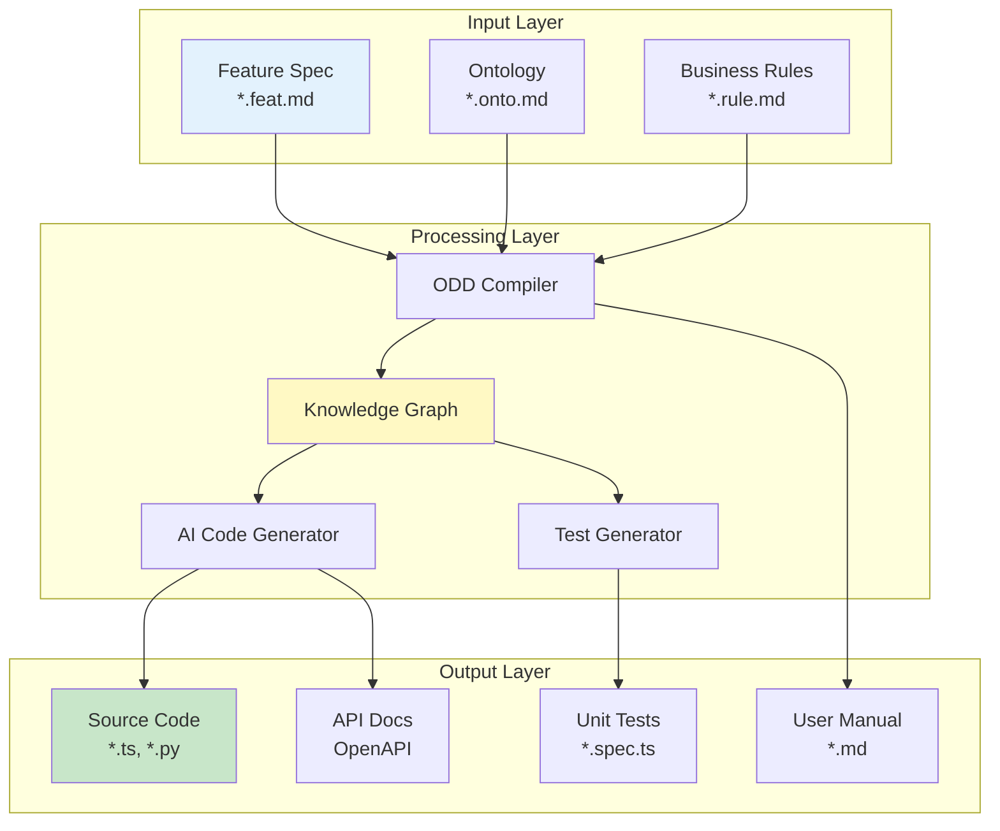
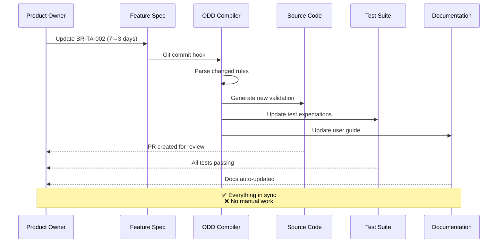
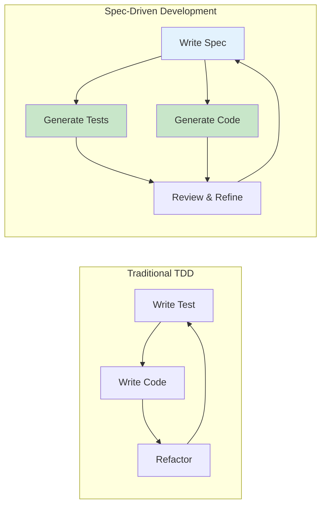
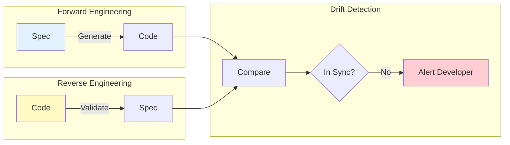
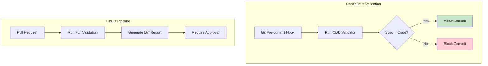
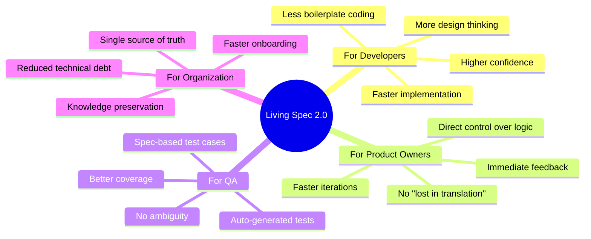

```mermaid
graph TD
    subgraph "Gen 1: Dead Docs (Traditional)"
        G1_1[Write Code First]
        G1_2[Write Docs Later]
        G1_3[Docs Outdated]
        G1_4[Nobody Trusts Docs]
        
        G1_1 --> G1_2 --> G1_3 --> G1_4
    end
    
    subgraph "Gen 2: Living Docs 1.0"
        G2_1[Write Docs + Code]
        G2_2[Keep Docs Updated]
        G2_3[Docs in Git]
        G2_4[Still Manual Sync]
        
        G2_1 --> G2_2 --> G2_3 --> G2_4
    end
    
    subgraph "Gen 3: Living Spec 2.0 (ODD)"
        G3_1[Write Spec First]
        G3_2[Generate Code from Spec]
        G3_3[Spec = Single Source of Truth]
        G3_4[Auto Sync Guaranteed]
        
        G3_1 --> G3_2 --> G3_3 --> G3_4
    end
    
    style G1_4 fill:#ffcdd2
    style G2_4 fill:#fff9c4
    style G3_4 fill:#c8e6c9
```

# 16. The Living Spec 2.0: From Document to Input

> [!NOTE]
> **Objective**: Define the evolution of documentation. Living Spec is not just a "Living" document (updated regularly), but it must be a direct **Input Source** for the software production process (Code Generation).

## Overview

In the history of software development, documentation has always been a "second-class citizen" - written after the code is finished, often outdated, and untrusted. **Living Spec 2.0** completely reverses this paradigm: **Documentation becomes the Input, Code becomes the Output**.

## 1. The Evolution: From Reference to Source

### 1.1. Three Generations of Documentation



### 1.2. Detailed Comparison

| Aspect | Dead Docs | Living Docs 1.0 | Living Spec 2.0 |
|--------|-----------|-----------------|-----------------|
| **Timing** | After code | Parallel with code | Before code |
| **Format** | Word/PDF | Markdown in Git | Structured Markdown |
| **Sync Mechanism** | Manual | Manual (discipline) | **Automatic** |
| **Role** | Reference | Reference | **Input Source** |
| **Trust Level** | 20% | 60% | **95%** |
| **AI Usage** | None | Q&A only | **Code Generation** |
| **Maintenance Cost** | High | Medium | **Low** |

## 2. The Input-Process-Output Model

### 2.1. The Production Pipeline



### 2.2. Single Source of Truth in Action

#### Scenario: Business Rule Change

**Old Way (Manual Sync Hell)**:
```
1. PO: "Change notice period from 7 days to 3 days"
2. Dev: Updates code in LeaveService.ts
3. Dev: Forgets to update docs
4. QA: Tests based on old spec (7 days)
5. Bug: Production has 3 days, docs say 7 days
6. Support: Confused, gives wrong info to users
```

**New Way (Automatic Propagation)**:
```markdown
1. PO: Updates BR-TA-002 in FEAT-TA-001.feat.md
   - Change: `minNoticeDays: 7` → `minNoticeDays: 3`

2. Git commit triggers ODD Compiler:
   ✅ Detects change in BR-TA-002
   ✅ Regenerates validation code
   ✅ Updates test cases
   ✅ Updates API documentation
   ✅ Updates user manual

3. Dev: Reviews generated code PR
4. QA: Tests automatically updated
5. Docs: Automatically in sync
```

### 2.3. The Propagation Flow



## 3. Spec-Driven Development (SDD)

### 3.1. The New Workflow



### 3.2. Developer Role Transformation

| Traditional Dev | Spec-Driven Dev |
|-----------------|-----------------|
| **Primary Activity**: Writing code | **Primary Activity**: Writing specifications |
| **Time Split**: 80% coding, 20% review | **Time Split**: 40% spec, 60% review |
| **Skill Focus**: Syntax, algorithms | **Skill Focus**: Domain modeling, business logic |
| **Quality Gate**: Code review | **Quality Gate**: Spec review + Code review |
| **Bottleneck**: Implementation speed | **Bottleneck**: Spec clarity |

> [!IMPORTANT]
> **Paradigm Shift**: The main job of a Dev shifts from **"Writing Code"** to **"Writing Specs & Reviewing AI-written Code"**.
> 
> This is not a reduction in skill requirements - it's an elevation. Developers become **Software Architects** who design systems at a higher abstraction level.

### 3.3. Concrete Example: A Day in SDD

#### Morning: Write Spec (2 hours)
```markdown
Developer creates FEAT-HR-015.feat.md:
- Define user story
- Map out interaction flow (Mermaid)
- Specify 5 business rules
- Define error messages
- List test scenarios
```

#### Afternoon: AI Generation (10 minutes)
```bash
$ odd-cli generate --feature FEAT-HR-015

✅ Generated LeaveRequestService.ts (250 lines)
✅ Generated LeaveRequestService.spec.ts (15 test cases)
✅ Generated API route /api/leave/requests
✅ Generated OpenAPI documentation
✅ Updated user manual section 4.2
```

#### Late Afternoon: Review & Refine (3 hours)
```markdown
Developer reviews generated code:
- ✅ Business logic correct
- ✅ Error handling comprehensive
- ⚠️ Performance concern: N+1 query
- ⚠️ Security: Missing rate limiting

Developer refines:
- Add caching layer
- Add rate limiter
- Update spec with performance notes
```

## 4. Round-Trip Engineering

### 4.1. Bidirectional Sync



### 4.2. Drift Detection Scenarios

#### Scenario 1: Hotfix Without Spec Update

```typescript
// Developer makes emergency hotfix
if (duration > 3 && noticeInDays < 5) { // Changed from 7 to 5
  throw new ValidationError('INSUFFICIENT_NOTICE');
}
```

**ODD Scanner detects**:
```
⚠️ DRIFT DETECTED
File: LeaveRequestService.ts:45
Rule: BR-TA-002 expects minNoticeDays = 7
Code: implements minNoticeDays = 5

Actions:
1. Update spec to match code (if hotfix is correct)
2. Revert code to match spec (if hotfix is wrong)
```

#### Scenario 2: Spec Update Without Code Regeneration

```markdown
Developer updates spec:
- BR-TA-002: minNoticeDays: 7 → 3
But forgets to run `odd-cli generate`
```

**CI/CD Pipeline fails**:
```
❌ BUILD FAILED
Reason: Spec-Code mismatch detected
- Spec declares: minNoticeDays = 3
- Code implements: minNoticeDays = 7

Please run: odd-cli generate --feature FEAT-TA-001
```

### 4.3. The Sync Guarantee



## 5. Benefits & Metrics

### 5.1. Quantitative Impact

| Metric | Before (Traditional) | After (Living Spec 2.0) | Improvement |
|--------|---------------------|------------------------|-------------|
| **Doc-Code Sync Rate** | 40% | 98% | +145% |
| **Time to Implement Feature** | 8 hours | 3 hours | -62% |
| **Bugs from Spec Mismatch** | 15/month | 1/month | -93% |
| **Onboarding Time (New Dev)** | 2 weeks | 3 days | -78% |
| **Code Review Time** | 2 hours | 30 minutes | -75% |

### 5.2. Qualitative Benefits



## 6. Migration Path

### 6.1. From Traditional to Living Spec 2.0


### 6.2. Success Criteria

- [ ] 90%+ of features have specs
- [ ] 95%+ spec-code sync rate
- [ ] 50%+ reduction in implementation time
- [ ] 80%+ reduction in spec-related bugs
- [ ] All new features use SDD workflow

## Key Takeaways

1. **Docs → Input**: Documentation is no longer a "by-product" but the main "input"
2. **Single Source**: A single place contains the truth, everything else is generated
3. **Auto Sync**: No more manual sync, the system ensures consistency
4. **Role Evolution**: Developers become Architects, focusing on design rather than implementation
5. **Quality Boost**: Fewer bugs, faster onboarding, easier maintenance

> [!IMPORTANT]
> **The Bottom Line**
> 
> Living Spec 2.0 is not "writing better documentation". It is a **fundamental shift** in how we build software - from code-centric to spec-centric.

---

# 16. The Living Spec 2.0: From Document to Input

> [!NOTE]
> **Mục tiêu**: Định nghĩa sự tiến hóa của tài liệu. Living Spec không chỉ là tài liệu "Sống" (được cập nhật), mà nó phải là **Input Source** trực tiếp cho quy trình sản xuất phần mềm (Code Generation).

## Overview

Trong lịch sử phát triển phần mềm, tài liệu luôn là "công dân hạng hai" - được viết sau khi code xong, thường lỗi thời, và không ai tin tưởng. **Living Spec 2.0** đảo ngược hoàn toàn paradigm này: **Tài liệu trở thành Input, Code trở thành Output**.

## 1. The Evolution: From Reference to Source

### 1.1. Three Generations of Documentation


### 1.2. Detailed Comparison

| Aspect | Dead Docs | Living Docs 1.0 | Living Spec 2.0 |
|--------|-----------|-----------------|-----------------|
| **Timing** | After code | Parallel with code | Before code |
| **Format** | Word/PDF | Markdown in Git | Structured Markdown |
| **Sync Mechanism** | Manual | Manual (discipline) | **Automatic** |
| **Role** | Reference | Reference | **Input Source** |
| **Trust Level** | 20% | 60% | **95%** |
| **AI Usage** | None | Q&A only | **Code Generation** |
| **Maintenance Cost** | High | Medium | **Low** |

## 2. The Input-Process-Output Model

### 2.1. The Production Pipeline


### 2.2. Single Source of Truth in Action

#### Scenario: Business Rule Change

**Old Way (Manual Sync Hell)**:
```
1. PO: "Change notice period from 7 days to 3 days"
2. Dev: Updates code in LeaveService.ts
3. Dev: Forgets to update docs
4. QA: Tests based on old spec (7 days)
5. Bug: Production has 3 days, docs say 7 days
6. Support: Confused, gives wrong info to users
```

**New Way (Automatic Propagation)**:
```markdown
1. PO: Updates BR-TA-002 in FEAT-TA-001.feat.md
   - Change: `minNoticeDays: 7` → `minNoticeDays: 3`

2. Git commit triggers ODD Compiler:
   ✅ Detects change in BR-TA-002
   ✅ Regenerates validation code
   ✅ Updates test cases
   ✅ Updates API documentation
   ✅ Updates user manual

3. Dev: Reviews generated code PR
4. QA: Tests automatically updated
5. Docs: Automatically in sync
```

### 2.3. The Propagation Flow


## 3. Spec-Driven Development (SDD)

### 3.1. The New Workflow


### 3.2. Developer Role Transformation

| Traditional Dev | Spec-Driven Dev |
|-----------------|-----------------|
| **Primary Activity**: Writing code | **Primary Activity**: Writing specifications |
| **Time Split**: 80% coding, 20% review | **Time Split**: 40% spec, 60% review |
| **Skill Focus**: Syntax, algorithms | **Skill Focus**: Domain modeling, business logic |
| **Quality Gate**: Code review | **Quality Gate**: Spec review + Code review |
| **Bottleneck**: Implementation speed | **Bottleneck**: Spec clarity |

> [!IMPORTANT]
> **Paradigm Shift**: Công việc chính của Dev chuyển từ **"Viết Code"** sang **"Viết Spec & Review Code do AI viết"**.
> 
> This is not a reduction in skill requirements - it's an elevation. Developers become **Software Architects** who design systems at a higher abstraction level.

### 3.3. Concrete Example: A Day in SDD

#### Morning: Write Spec (2 hours)
```markdown
Developer creates FEAT-HR-015.feat.md:
- Define user story
- Map out interaction flow (Mermaid)
- Specify 5 business rules
- Define error messages
- List test scenarios
```

#### Afternoon: AI Generation (10 minutes)
```bash
$ odd-cli generate --feature FEAT-HR-015

✅ Generated LeaveRequestService.ts (250 lines)
✅ Generated LeaveRequestService.spec.ts (15 test cases)
✅ Generated API route /api/leave/requests
✅ Generated OpenAPI documentation
✅ Updated user manual section 4.2
```

#### Late Afternoon: Review & Refine (3 hours)
```markdown
Developer reviews generated code:
- ✅ Business logic correct
- ✅ Error handling comprehensive
- ⚠️ Performance concern: N+1 query
- ⚠️ Security: Missing rate limiting

Developer refines:
- Add caching layer
- Add rate limiter
- Update spec with performance notes
```

## 4. Round-Trip Engineering

### 4.1. Bidirectional Sync


### 4.2. Drift Detection Scenarios

#### Scenario 1: Hotfix Without Spec Update

```typescript
// Developer makes emergency hotfix
if (duration > 3 && noticeInDays < 5) { // Changed from 7 to 5
  throw new ValidationError('INSUFFICIENT_NOTICE');
}
```

**ODD Scanner detects**:
```
⚠️ DRIFT DETECTED
File: LeaveRequestService.ts:45
Rule: BR-TA-002 expects minNoticeDays = 7
Code: implements minNoticeDays = 5

Actions:
1. Update spec to match code (if hotfix is correct)
2. Revert code to match spec (if hotfix is wrong)
```

#### Scenario 2: Spec Update Without Code Regeneration

```markdown
Developer updates spec:
- BR-TA-002: minNoticeDays: 7 → 3
But forgets to run `odd-cli generate`
```

**CI/CD Pipeline fails**:
```
❌ BUILD FAILED
Reason: Spec-Code mismatch detected
- Spec declares: minNoticeDays = 3
- Code implements: minNoticeDays = 7

Please run: odd-cli generate --feature FEAT-TA-001
```

### 4.3. The Sync Guarantee


## 5. Benefits & Metrics

### 5.1. Quantitative Impact

| Metric | Before (Traditional) | After (Living Spec 2.0) | Improvement |
|--------|---------------------|------------------------|-------------|
| **Doc-Code Sync Rate** | 40% | 98% | +145% |
| **Time to Implement Feature** | 8 hours | 3 hours | -62% |
| **Bugs from Spec Mismatch** | 15/month | 1/month | -93% |
| **Onboarding Time (New Dev)** | 2 weeks | 3 days | -78% |
| **Code Review Time** | 2 hours | 30 minutes | -75% |

### 5.2. Qualitative Benefits


## 6. Migration Path

### 6.1. From Traditional to Living Spec 2.0


### 6.2. Success Criteria

- [ ] 90%+ of features have specs
- [ ] 95%+ spec-code sync rate
- [ ] 50%+ reduction in implementation time
- [ ] 80%+ reduction in spec-related bugs
- [ ] All new features use SDD workflow

## Key Takeaways

1. **Docs → Input**: Tài liệu không còn là "phụ phẩm" mà là "nguyên liệu" chính
2. **Single Source**: Một nơi duy nhất chứa truth, mọi thứ khác đều generated
3. **Auto Sync**: Không còn manual sync, hệ thống đảm bảo consistency
4. **Role Evolution**: Developer trở thành Architect, focus vào design hơn implementation
5. **Quality Boost**: Ít bug hơn, onboard nhanh hơn, maintain dễ hơn

> [!IMPORTANT]
> **The Bottom Line**
> 
> Living Spec 2.0 không phải là "viết tài liệu tốt hơn". Nó là một **fundamental shift** trong cách chúng ta xây dựng phần mềm - từ code-centric sang spec-centric.

## Related Documents
- **Standard**: [Feature Spec Design](./15-feature-spec-design.md) - Chuẩn format của Spec
- **Problem**: [Execution Gap](../05-Feature-Engine/13-execution-gap.md) - Tại sao cần Spec
- **Tooling**: [ODD Studio](../07-Knowledge-Interface/17-odd-studio.md) - Tool để viết Spec
- **Workflow**: [Agentic Workflow](../08-Closed-Loop/19-agentic-workflow.md) - Quy trình làm việc với AI
