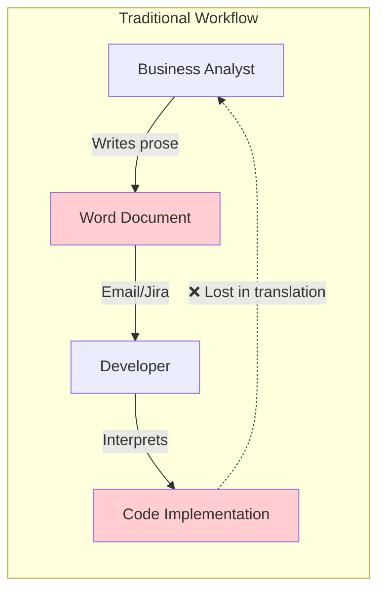
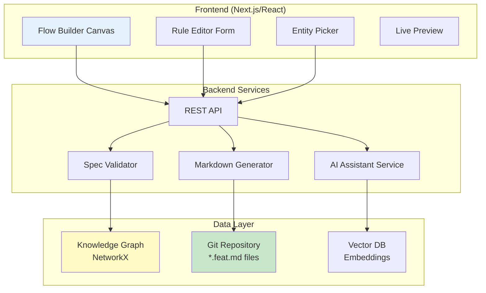
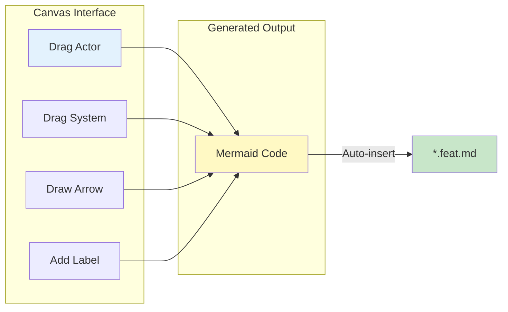
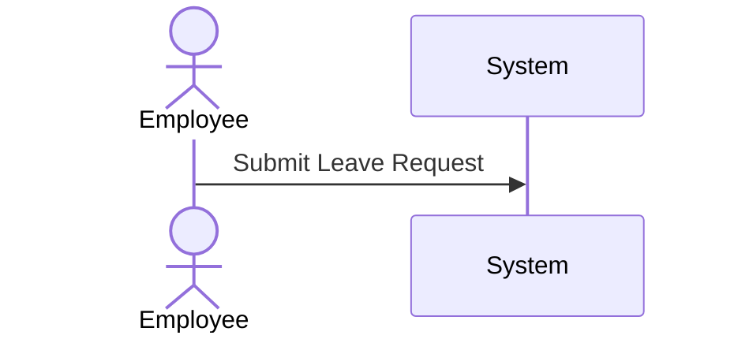
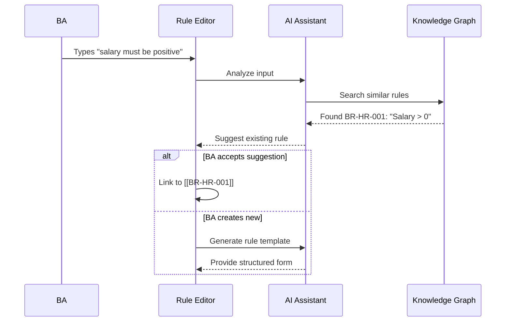
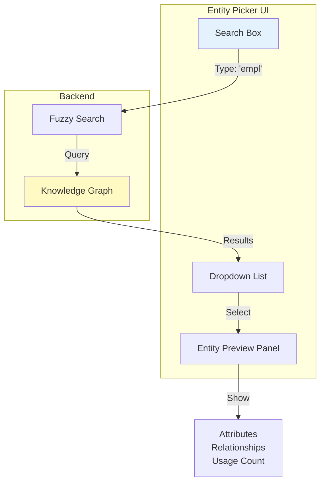
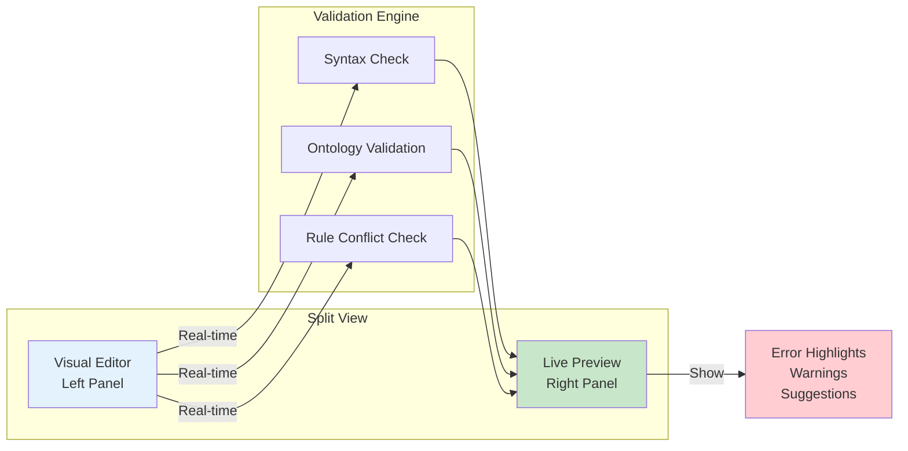
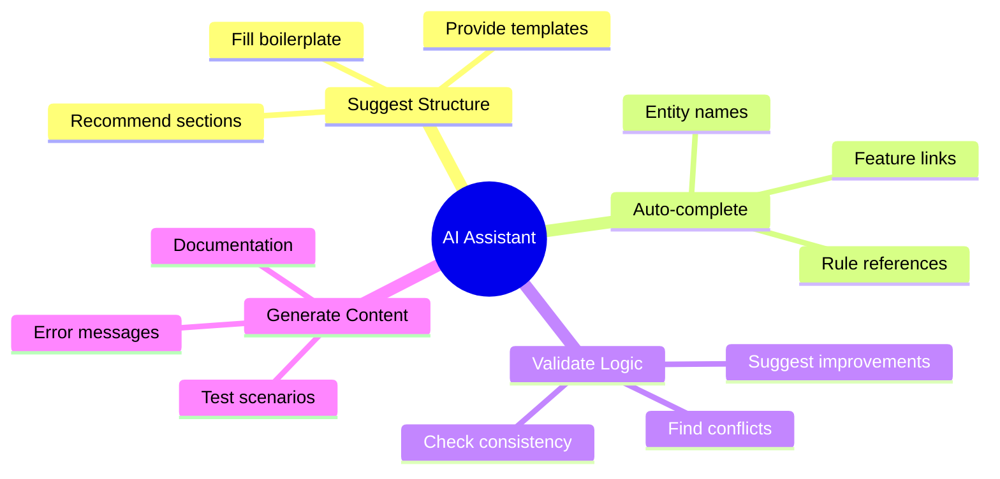
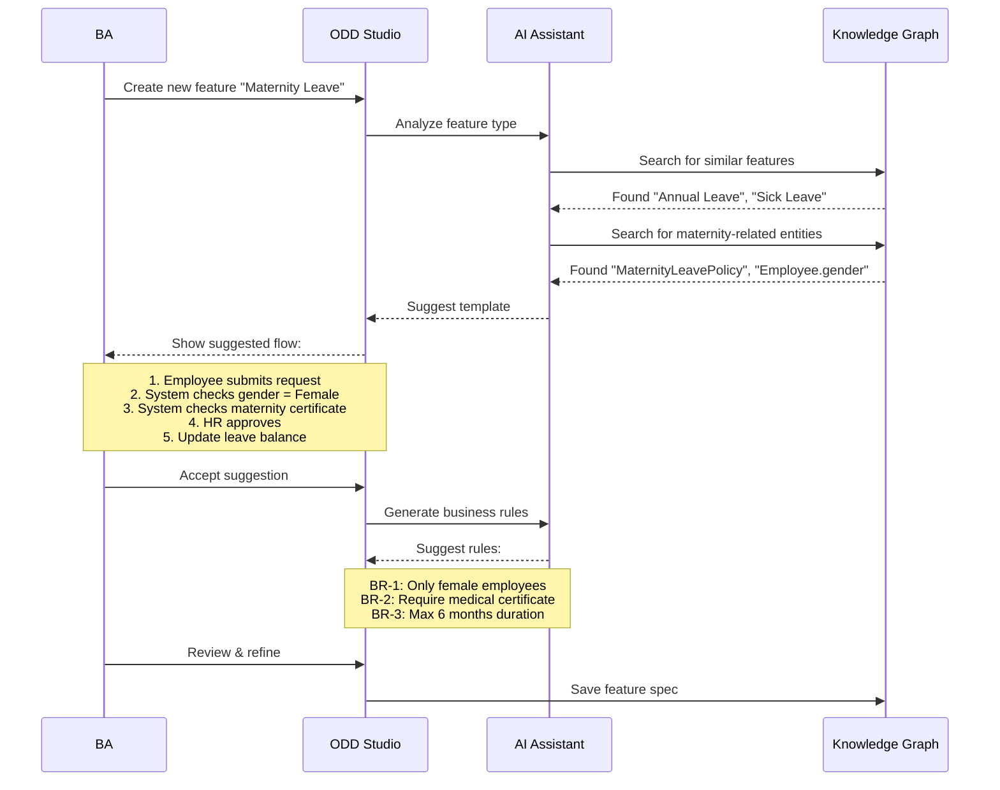

# 17. ODD Studio: The "No-Code" Spec Builder

> [!NOTE]
> **Objective**: Define **ODD Studio** - an interactive environment (Interactive Environment) that helps the Product Team build Feature Specs (`*.feat.md`) easily and intuitively without writing Markdown manually.

## Overview

ODD Studio is a "Visual IDE" for Business Analysts and Product Owners - people who understand the business but don't want (or need) to write code. It turns the task of writing a Feature Spec from a technical job into a visual design experience.

**Core Philosophy**: *"If you can draw it, you can spec it"*

## 1. The Problem: The BA-Developer Gap

### 1.1. Current Pain Points



### 1.2. Why BAs Struggle with Markdown

| Challenge | Impact | ODD Studio Solution |
|-----------|--------|---------------------|
| **Syntax Fear** | BAs are afraid of YAML, Mermaid syntax | Visual editors, no syntax needed |
| **No Validation** | Typos in entity names | Auto-complete from Ontology |
| **No Preview** | Can't see diagram while writing | Live preview panel |
| **No Guidance** | Don't know what to write | AI assistant suggests structure |
| **Version Control** | Unfamiliar with Git | Built-in versioning UI |

## 2. Architecture: The Knowledge IDE

### 2.1. System Architecture



### 2.2. Technology Stack Recommendation

| Layer | Technology | Rationale |
|-------|-----------|-----------|
| **Frontend** | Next.js 14 + React | SSR, API routes, modern DX |
| **UI Components** | shadcn/ui + Tailwind | Beautiful, accessible, customizable |
| **Diagram Editor** | Mermaid.js + Monaco Editor | Industry standard, extensible |
| **Flow Builder** | React Flow | Drag-drop, visual flow design |
| **State Management** | Zustand | Simple, performant |
| **Backend** | FastAPI (Python) | Easy integration with NetworkX, GraphRAG |
| **Graph DB** | NetworkX (in-memory) | Lightweight, Python-native |
| **Vector DB** | LanceDB | Local-first, fast similarity search |
| **LLM Integration** | OpenAI API / Anthropic Claude | Best-in-class reasoning |

## 3. Core Features

### 3.1. Feature 1: Visual Flow Builder



**User Experience**:
1. BA drags the "Employee" actor onto the canvas
2. BA drags the "System" participant
3. BA draws an arrow from Employee to System
4. BA types the label: "Submit Leave Request"
5. **Auto-generated Mermaid**:


### 3.2. Feature 2: Intelligent Rule Assistant



**Features**:
- **Natural Language Input**: BA types in plain Vietnamese/English
- **Similarity Search**: AI finds existing similar rules
- **Auto-linking**: Automatically creates `[[WikiLinks]]`
- **Validation**: Checks for conflicts with existing rules
- **Test Case Generation**: AI suggests test scenarios

### 3.3. Feature 3: Entity Picker with Auto-complete



**User Experience**:
```
BA types: "empl"
Dropdown shows:
  ✅ Employee (Entity) - Used in 15 features
  ✅ EmployeeContract (Entity) - Used in 8 features
  ✅ EmploymentType (Reference) - Used in 12 features

BA selects "Employee"
Preview shows:
  - Attributes: id, name, email, contractType, ...
  - Relationships: hasContract, belongsToDepartment
  - Used in: FEAT-HR-001, FEAT-HR-002, ...
```

### 3.4. Feature 4: Live Preview & Validation



**Validation Types**:
- ✅ **Syntax**: Is YAML frontmatter valid?
- ✅ **Ontology**: Do entity names exist in the graph?
- ✅ **Rules**: Are there no conflicting business rules?
- ✅ **Completeness**: Are all required sections filled?
- ✅ **Consistency**: Does the flow match the logic mapping?

## 4. The AI Design Assistant

### 4.1. Assistant Capabilities



### 4.2. Example: Maternity Leave Feature

**Scenario**: BA creates new feature "Maternity Leave Request"



> [!IMPORTANT]
> **Value Proposition**: Reduces Spec writing time by 80%. Ensures consistency with the Ontology right from the design phase.

## 5. User Interface Mockup (Conceptual)

### 5.1. Main Layout

```
┌─────────────────────────────────────────────────────────────┐
│ ODD Studio                    [Save] [Preview] [Publish]    │
├─────────────────────────────────────────────────────────────┤
│ ┌─────────────┐ ┌───────────────────────────────────────┐  │
│ │ Navigator   │ │ Editor Canvas                         │  │
│ │             │ │                                       │  │
│ │ Features    │ │ ┌───────────────────────────────┐   │  │
│ │ ├─ Time     │ │ │ Feature: Submit Leave Request │   │  │
│ │ │  ├─ 001   │ │ │                               │   │  │
│ │ │  └─ 002   │ │ │ [Flow Builder Tab]            │   │  │
│ │ ├─ Payroll  │ │ │ [Rules Tab]                   │   │  │
│ │ └─ HR       │ │ │ [Testing Tab]                 │   │  │
│ │             │ │ │                               │   │  │
│ │ Ontology    │ │ │ (Visual editing area)         │   │  │
│ │ ├─ Employee │ │ │                               │   │  │
│ │ └─ Contract │ │ └───────────────────────────────┘   │  │
│ │             │ │                                       │  │
│ │ Rules       │ │ ┌───────────────────────────────┐   │  │
│ │ ├─ BR-001   │ │ │ AI Assistant                  │   │  │
│ │ └─ BR-002   │ │ │ 💡 Suggestion: Link to        │   │  │
│ └─────────────┘ │ │    existing rule BR-TA-001?   │   │  │
│                 │ └───────────────────────────────┘   │  │
│                 └───────────────────────────────────────┘  │
│ ┌─────────────────────────────────────────────────────────┐│
│ │ Live Preview                                            ││
│ │ (Rendered Mermaid diagram + Markdown)                   ││
│ └─────────────────────────────────────────────────────────┘│
└─────────────────────────────────────────────────────────────┘
```

### 5.2. Flow Builder Interface

```
┌─────────────────────────────────────────────────────────────┐
│ Flow Builder - Submit Leave Request                         │
├─────────────────────────────────────────────────────────────┤
│ [Add Actor] [Add System] [Add Database] [Add Service]       │
├─────────────────────────────────────────────────────────────┤
│                                                              │
│    ┌─────────┐                                              │
│    │Employee │                                              │
│    └────┬────┘                                              │
│         │ 1. Click "New Request"                            │
│         ▼                                                    │
│    ┌────────┐                                               │
│    │  UI    │                                               │
│    └────┬───┘                                               │
│         │ 2. GET /api/leave/form-data                       │
│         ▼                                                    │
│    ┌────────┐                                               │
│    │  API   │───────┐                                       │
│    └────┬───┘       │ 3. Fetch policies                     │
│         │           ▼                                        │
│         │      ┌─────────┐                                  │
│         │      │   DB    │                                  │
│         │      └─────────┘                                  │
│         ▼                                                    │
│    (Continue flow...)                                       │
│                                                              │
└─────────────────────────────────────────────────────────────┘
```

## 6. Implementation Roadmap

### 6.1. MVP (Phase 1 - 3 months)

- [ ] Basic visual flow builder (React Flow)
- [ ] Markdown/YAML generator
- [ ] Entity picker with auto-complete
- [ ] Live preview panel
- [ ] Git integration (save to repo)

### 6.2. Enhanced (Phase 2 - 3 months)

- [ ] AI assistant integration
- [ ] Rule similarity search
- [ ] Validation engine
- [ ] Test case generator
- [ ] Collaboration features (comments, reviews)

### 6.3. Advanced (Phase 3 - 6 months)

- [ ] Visual diff for spec changes
- [ ] Impact analysis visualization
- [ ] Code generation preview
- [ ] Integration with MCP server
- [ ] Multi-language support

## Key Takeaways

1. **Visual-First**: BAs do not need to learn Markdown, just drag-drop and fill forms
2. **AI-Assisted**: AI assistant helps suggest structure, validate logic, generate content
3. **Graph-Connected**: Auto-complete and validation based on the Knowledge Graph
4. **Git-Backed**: All changes are version-controlled, diff-friendly
5. **Live Preview**: See results immediately, no need to compile

> [!IMPORTANT]
> **The Vision**
> 
> ODD Studio turns the writing of Feature Specs from a "coding task" into a "design task" - accessible to the entire Product Team, not just Developers.

## Related Documents
- **Data Standard**: [Feature Spec Design](../06-Feature-Standard/15-feature-spec-design.md) - Format of the output
- **External Interface**: [MCP Strategy](./18-mcp-strategy.md) - How AI agents consume specs
- **Workflow**: [Living Spec 2.0](../06-Feature-Standard/16-living-spec-2.0.md) - Spec-driven development

---

# 17. ODD Studio: The "No-Code" Spec Builder

> [!NOTE]
> **Mục tiêu**: Định nghĩa **ODD Studio** - môi trường tương tác (Interactive Environment) giúp Product Team xây dựng Feature Spec (`*.feat.md`) một cách dễ dàng, trực quan mà không cần viết Markdown thủ công.

## Overview

ODD Studio là "Visual IDE" cho Business Analysts và Product Owners - những người hiểu nghiệp vụ nhưng không muốn (hoặc không cần) viết code. Nó biến việc viết Feature Spec từ một công việc kỹ thuật thành một trải nghiệm thiết kế trực quan.

**Core Philosophy**: *"If you can draw it, you can spec it"*

## 1. The Problem: The BA-Developer Gap

### 1.1. Current Pain Points


### 1.2. Why BAs Struggle with Markdown

| Challenge | Impact | ODD Studio Solution |
|-----------|--------|---------------------|
| **Syntax Fear** | BA sợ YAML, Mermaid syntax | Visual editors, no syntax needed |
| **No Validation** | Typos in entity names | Auto-complete from Ontology |
| **No Preview** | Can't see diagram while writing | Live preview panel |
| **No Guidance** | Don't know what to write | AI assistant suggests structure |
| **Version Control** | Unfamiliar with Git | Built-in versioning UI |

## 2. Architecture: The Knowledge IDE

### 2.1. System Architecture


### 2.2. Technology Stack Recommendation

| Layer | Technology | Rationale |
|-------|-----------|-----------|
| **Frontend** | Next.js 14 + React | SSR, API routes, modern DX |
| **UI Components** | shadcn/ui + Tailwind | Beautiful, accessible, customizable |
| **Diagram Editor** | Mermaid.js + Monaco Editor | Industry standard, extensible |
| **Flow Builder** | React Flow | Drag-drop, visual flow design |
| **State Management** | Zustand | Simple, performant |
| **Backend** | FastAPI (Python) | Easy integration with NetworkX, GraphRAG |
| **Graph DB** | NetworkX (in-memory) | Lightweight, Python-native |
| **Vector DB** | LanceDB | Local-first, fast similarity search |
| **LLM Integration** | OpenAI API / Anthropic Claude | Best-in-class reasoning |

## 3. Core Features

### 3.1. Feature 1: Visual Flow Builder


**User Experience**:
1. BA drags "Employee" actor onto canvas
2. BA drags "System" participant
3. BA draws arrow from Employee to System
4. BA types label: "Submit Leave Request"
5. **Auto-generated Mermaid**:


### 3.2. Feature 2: Intelligent Rule Assistant


**Features**:
- **Natural Language Input**: BA types in plain Vietnamese/English
- **Similarity Search**: AI finds existing similar rules
- **Auto-linking**: Automatically creates `[[WikiLinks]]`
- **Validation**: Checks for conflicts with existing rules
- **Test Case Generation**: AI suggests test scenarios

### 3.3. Feature 3: Entity Picker with Auto-complete


**User Experience**:
```
BA types: "empl"
Dropdown shows:
  ✅ Employee (Entity) - Used in 15 features
  ✅ EmployeeContract (Entity) - Used in 8 features
  ✅ EmploymentType (Reference) - Used in 12 features

BA selects "Employee"
Preview shows:
  - Attributes: id, name, email, contractType, ...
  - Relationships: hasContract, belongsToDepartment
  - Used in: FEAT-HR-001, FEAT-HR-002, ...
```

### 3.4. Feature 4: Live Preview & Validation


**Validation Types**:
- ✅ **Syntax**: YAML frontmatter valid?
- ✅ **Ontology**: Entity names exist in graph?
- ✅ **Rules**: No conflicting business rules?
- ✅ **Completeness**: All required sections filled?
- ✅ **Consistency**: Flow matches logic mapping?

## 4. The AI Design Assistant

### 4.1. Assistant Capabilities


### 4.2. Example: Maternity Leave Feature

**Scenario**: BA creates new feature "Maternity Leave Request"


> [!IMPORTANT]
> **Value Proposition**: Giảm 80% thời gian viết Spec. Đảm bảo tính nhất quán (Consistency) với Ontology ngay từ lúc thiết kế.

## 5. User Interface Mockup (Conceptual)

### 5.1. Main Layout

```
┌─────────────────────────────────────────────────────────────┐
│ ODD Studio                    [Save] [Preview] [Publish]    │
├─────────────────────────────────────────────────────────────┤
│ ┌─────────────┐ ┌───────────────────────────────────────┐  │
│ │ Navigator   │ │ Editor Canvas                         │  │
│ │             │ │                                       │  │
│ │ Features    │ │ ┌───────────────────────────────┐   │  │
│ │ ├─ Time     │ │ │ Feature: Submit Leave Request │   │  │
│ │ │  ├─ 001   │ │ │                               │   │  │
│ │ │  └─ 002   │ │ │ [Flow Builder Tab]            │   │  │
│ │ ├─ Payroll  │ │ │ [Rules Tab]                   │   │  │
│ │ └─ HR       │ │ │ [Testing Tab]                 │   │  │
│ │             │ │ │                               │   │  │
│ │ Ontology    │ │ │ (Visual editing area)         │   │  │
│ │ ├─ Employee │ │ │                               │   │  │
│ │ └─ Contract │ │ └───────────────────────────────┘   │  │
│ │             │ │                                       │  │
│ │ Rules       │ │ ┌───────────────────────────────┐   │  │
│ │ ├─ BR-001   │ │ │ AI Assistant                  │   │  │
│ │ └─ BR-002   │ │ │ 💡 Suggestion: Link to        │   │  │
│ └─────────────┘ │ │    existing rule BR-TA-001?   │   │  │
│                 │ └───────────────────────────────┘   │  │
│                 └───────────────────────────────────────┘  │
│ ┌─────────────────────────────────────────────────────────┐│
│ │ Live Preview                                            ││
│ │ (Rendered Mermaid diagram + Markdown)                   ││
│ └─────────────────────────────────────────────────────────┘│
└─────────────────────────────────────────────────────────────┘
```

### 5.2. Flow Builder Interface

```
┌─────────────────────────────────────────────────────────────┐
│ Flow Builder - Submit Leave Request                         │
├─────────────────────────────────────────────────────────────┤
│ [Add Actor] [Add System] [Add Database] [Add Service]       │
├─────────────────────────────────────────────────────────────┤
│                                                              │
│    ┌─────────┐                                              │
│    │Employee │                                              │
│    └────┬────┘                                              │
│         │ 1. Click "New Request"                            │
│         ▼                                                    │
│    ┌────────┐                                               │
│    │  UI    │                                               │
│    └────┬───┘                                               │
│         │ 2. GET /api/leave/form-data                       │
│         ▼                                                    │
│    ┌────────┐                                               │
│    │  API   │───────┐                                       │
│    └────┬───┘       │ 3. Fetch policies                     │
│         │           ▼                                        │
│         │      ┌─────────┐                                  │
│         │      │   DB    │                                  │
│         │      └─────────┘                                  │
│         ▼                                                    │
│    (Continue flow...)                                       │
│                                                              │
└─────────────────────────────────────────────────────────────┘
```

## 6. Implementation Roadmap

### 6.1. MVP (Phase 1 - 3 months)

- [ ] Basic visual flow builder (React Flow)
- [ ] Markdown/YAML generator
- [ ] Entity picker with auto-complete
- [ ] Live preview panel
- [ ] Git integration (save to repo)

### 6.2. Enhanced (Phase 2 - 3 months)

- [ ] AI assistant integration
- [ ] Rule similarity search
- [ ] Validation engine
- [ ] Test case generator
- [ ] Collaboration features (comments, reviews)

### 6.3. Advanced (Phase 3 - 6 months)

- [ ] Visual diff for spec changes
- [ ] Impact analysis visualization
- [ ] Code generation preview
- [ ] Integration with MCP server
- [ ] Multi-language support

## Key Takeaways

1. **Visual-First**: BA không cần học Markdown, chỉ cần drag-drop và fill form
2. **AI-Assisted**: AI assistant giúp suggest structure, validate logic, generate content
3. **Graph-Connected**: Auto-complete và validation dựa trên Knowledge Graph
4. **Git-Backed**: Tất cả changes đều version-controlled, diff-friendly
5. **Live Preview**: Thấy ngay kết quả, không cần compile

> [!IMPORTANT]
> **The Vision**
> 
> ODD Studio biến việc viết Feature Spec từ "coding task" thành "design task" - accessible cho toàn bộ Product Team, không chỉ riêng Developers.

## Related Documents
- **Data Standard**: [Feature Spec Design](../06-Feature-Standard/15-feature-spec-design.md) - Format của output
- **External Interface**: [MCP Strategy](./18-mcp-strategy.md) - Cách AI agents consume specs
- **Workflow**: [Living Spec 2.0](../06-Feature-Standard/16-living-spec-2.0.md) - Spec-driven development
```
