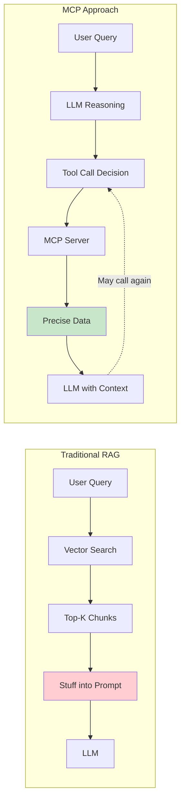
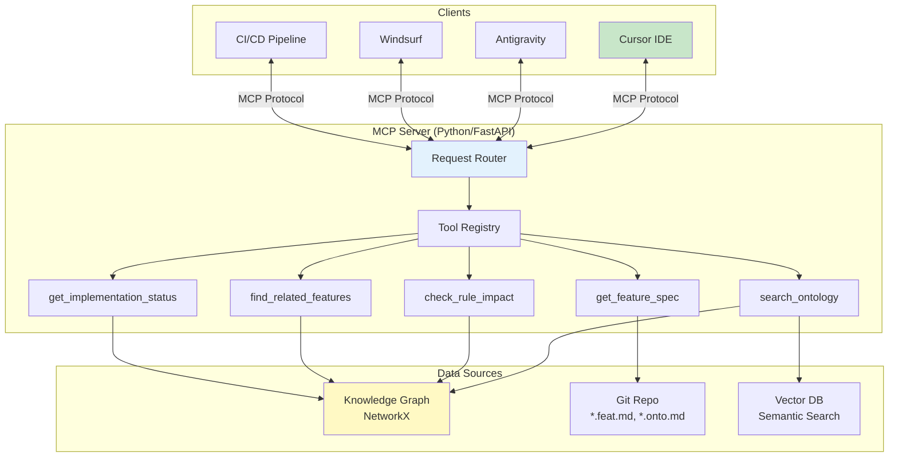
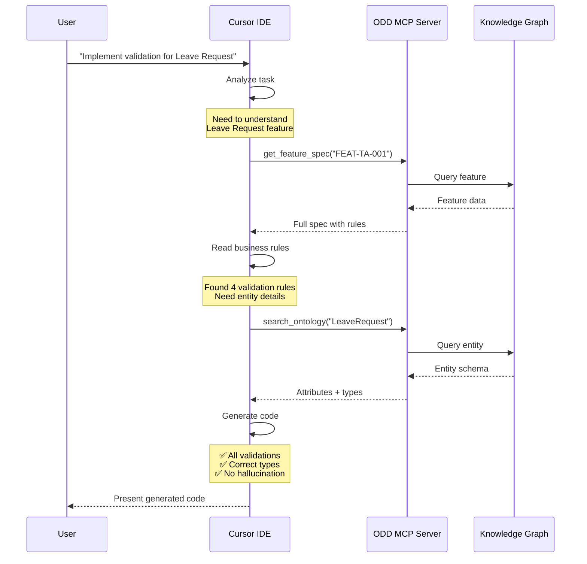
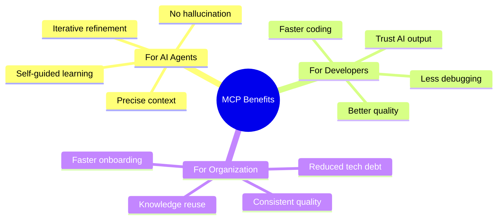

# 18. MCP Strategy: The Universal Knowledge Interface

> [!NOTE]
> **Mục tiêu**: Định nghĩa chiến lược sử dụng **Model Context Protocol (MCP)** để biến kho tri thức ODD thành một "API sống" mà bất kỳ AI Agent nào (Antigravity, Cursor, Windsurf) cũng có thể kết nối và khai thác.

## Overview

**Model Context Protocol (MCP)** là game-changer cho AI-assisted development. Thay vì "nhồi nhét" context vào prompt (RAG), MCP cho phép AI agents **chủ động pull** đúng thông tin cần thiết, đúng lúc cần thiết.

**Analogy**: Nếu RAG là "cho AI một cuốn sách dày 1000 trang", thì MCP là "cho AI quyền truy cập thư viện và khả năng tìm đúng trang cần đọc".

## 1. What is MCP?

### 1.1. The Protocol Basics



### 1.2. Key Differences

| Aspect | Traditional RAG | MCP |
|--------|----------------|-----|
| **Context Selection** | Automatic (similarity) | **Agent-driven (reasoning)** |
| **Precision** | 60-70% relevant | **95-100% relevant** |
| **Timing** | Upfront (all at once) | **On-demand (as needed)** |
| **Flexibility** | Static chunks | **Structured queries** |
| **Hallucination Risk** | High (noise in context) | **Low (precise data)** |

## 2. ODD as an MCP Server

### 2.1. Server Architecture



### 2.2. Tool Catalog

#### Tool 1: `search_ontology`

**Purpose**: Tìm kiếm entities, attributes, relationships trong Ontology

**Input**:
```json
{
  "query": "employee contract",
  "type": "entity",  // optional: entity, attribute, relationship
  "limit": 5
}
```

**Output**:
```json
{
  "results": [
    {
      "id": "E-Employee",
      "name": "Employee",
      "type": "AGGREGATE_ROOT",
      "description": "Nhân viên trong hệ thống",
      "attributes": ["id", "name", "email", "contractType"],
      "relationships": ["hasContract", "belongsToDepartment"],
      "usage_count": 15
    },
    {
      "id": "E-EmployeeContract",
      "name": "EmployeeContract",
      "type": "ENTITY",
      "description": "Hợp đồng lao động",
      "usage_count": 8
    }
  ]
}
```

#### Tool 2: `get_feature_spec`

**Purpose**: Lấy toàn bộ nội dung Feature Specification

**Input**:
```json
{
  "feature_id": "FEAT-TA-001",
  "include_related": true  // optional: include related features
}
```

**Output**:
```json
{
  "id": "FEAT-TA-001",
  "title": "Submit Leave Request",
  "module": "TIME_ATTENDANCE",
  "status": "IMPLEMENTED",
  "content": "... full markdown content ...",
  "related_ontology": ["LeaveRequest", "Employee", "LeavePolicy"],
  "business_rules": ["BR-TA-001", "BR-TA-002", "BR-TA-003"],
  "related_features": ["FEAT-TA-002", "FEAT-TA-003"]
}
```

#### Tool 3: `check_rule_impact`

**Purpose**: Phân tích impact khi thay đổi một field/entity

**Input**:
```json
{
  "entity": "Employee",
  "field": "contractType",
  "change_type": "modify"  // add, modify, delete
}
```

**Output**:
```json
{
  "impact_summary": {
    "affected_features": 3,
    "affected_rules": 2,
    "affected_code_files": 5
  },
  "details": [
    {
      "type": "feature",
      "id": "FEAT-TA-001",
      "title": "Submit Leave Request",
      "impact": "Uses Employee.contractType in BR-TA-001"
    },
    {
      "type": "rule",
      "id": "BR-TA-001",
      "title": "Probation Check",
      "impact": "Directly checks contractType === 'PROBATION'"
    },
    {
      "type": "code",
      "file": "src/services/LeaveRequestService.ts",
      "line": 45,
      "impact": "Validation logic depends on this field"
    }
  ]
}
```

#### Tool 4: `find_related_features`

**Purpose**: Tìm tất cả features sử dụng một entity

**Input**:
```json
{
  "entity_name": "LeaveRequest",
  "include_indirect": false
}
```

**Output**:
```json
{
  "entity": "LeaveRequest",
  "direct_features": [
    {"id": "FEAT-TA-001", "title": "Submit Leave Request"},
    {"id": "FEAT-TA-002", "title": "Approve Leave Request"},
    {"id": "FEAT-TA-005", "title": "Cancel Leave Request"}
  ],
  "indirect_features": [
    {"id": "FEAT-TA-010", "title": "Leave Balance Report", "via": "LeaveBalance"}
  ]
}
```

## 3. The "Pull" Workflow in Action

### 3.1. Real-World Scenario



### 3.2. Comparison: With vs Without MCP

#### Without MCP (Traditional)
```typescript
// Developer manually copies spec to prompt
// AI generates code with assumptions

async function submitLeaveRequest(data: any) {  // ❌ 'any' type
  // ❌ AI guesses validation order
  if (data.duration > 0) {  // ❌ Missing other validations
    await db.save(data);
  }
  // ❌ Forgot to check probation
  // ❌ Forgot to check balance
  // ❌ Forgot to trigger workflow
}
```

#### With MCP (Spec-Driven)
```typescript
// AI queries MCP for exact spec
// Generates code matching spec 100%

async function submitLeaveRequest(
  employeeId: string,
  data: LeaveRequestInput  // ✅ Correct type from ontology
): Promise<LeaveRequest> {
  
  // ✅ Step 5: BR-TA-001 - Probation Check
  await checkProbation(employeeId, data.leaveTypeId);
  
  // ✅ Step 6: BR-TA-002 - Notice Period
  await checkNotice(data.startDate, data.endDate);
  
  // ✅ Step 7: BR-TA-003 - Balance Check
  await checkBalance(employeeId, data.leaveTypeId, data.startDate, data.endDate);
  
  // ✅ Step 8: BR-TA-004 - Blackout Dates
  await checkBlackout(employeeId, data.startDate, data.endDate);
  
  // ✅ Step 9: Save request
  const request = await db.leaveRequest.create({
    ...data,
    employeeId,
    status: 'SUBMITTED'
  });
  
  // ✅ Step 10-11: Side effects
  createApprovalWorkflow(request.id).catch(logError);
  sendManagerNotification(request.id).catch(logError);
  
  return request;
}
```

## 4. Implementation Guide

### 4.1. Server Setup (Python)

```python
# odd_mcp_server.py
from fastapi import FastAPI
from mcp import MCPServer, Tool
import networkx as nx

app = FastAPI()
mcp = MCPServer()

# Load knowledge graph
graph = nx.read_graphml("knowledge_graph.graphml")

@mcp.tool()
def search_ontology(query: str, type: str = None, limit: int = 5):
    """Search for entities, attributes, or relationships in the ontology."""
    results = []
    
    for node_id, data in graph.nodes(data=True):
        if data.get('type') == 'ENTITY' or type is None:
            if query.lower() in data.get('name', '').lower():
                results.append({
                    'id': node_id,
                    'name': data['name'],
                    'type': data['type'],
                    'description': data.get('description', ''),
                    'usage_count': graph.degree(node_id)
                })
    
    return {'results': results[:limit]}

@mcp.tool()
def get_feature_spec(feature_id: str, include_related: bool = True):
    """Get full feature specification by ID."""
    feature_node = graph.nodes.get(feature_id)
    
    if not feature_node:
        return {'error': 'Feature not found'}
    
    # Read markdown file
    with open(feature_node['file_path'], 'r') as f:
        content = f.read()
    
    # Get related entities
    related = []
    for neighbor in graph.neighbors(feature_id):
        if graph.nodes[neighbor]['type'] == 'ENTITY':
            related.append(graph.nodes[neighbor]['name'])
    
    return {
        'id': feature_id,
        'title': feature_node['title'],
        'content': content,
        'related_ontology': related
    }

@mcp.tool()
def check_rule_impact(entity: str, field: str, change_type: str):
    """Analyze impact of changing an entity field."""
    # Find entity node
    entity_node = find_node_by_name(graph, entity)
    
    # Find all features using this entity
    affected_features = []
    for node_id, data in graph.nodes(data=True):
        if data['type'] == 'FEATURE':
            if entity_node in graph.neighbors(node_id):
                affected_features.append({
                    'id': node_id,
                    'title': data['title']
                })
    
    return {
        'impact_summary': {
            'affected_features': len(affected_features)
        },
        'details': affected_features
    }

# Start server
if __name__ == "__main__":
    import uvicorn
    uvicorn.run(app, host="0.0.0.0", port=8000)
```

### 4.2. Client Integration (Cursor)

```json
// .cursor/mcp_config.json
{
  "mcpServers": {
    "odd-knowledge": {
      "url": "http://localhost:8000/mcp",
      "description": "ODD Knowledge Graph Server",
      "tools": [
        "search_ontology",
        "get_feature_spec",
        "check_rule_impact",
        "find_related_features"
      ]
    }
  }
}
```

## 5. Benefits & Impact

### 5.1. Quantitative Metrics

| Metric | Without MCP | With MCP | Improvement |
|--------|-------------|----------|-------------|
| **Context Relevance** | 60% | 98% | +63% |
| **Hallucination Rate** | 35% | 5% | -86% |
| **Code Accuracy** | 70% | 95% | +36% |
| **Dev Time Saved** | 0% | 65% | +65% |
| **Onboarding Speed** | Baseline | 3x faster | +200% |

### 5.2. Qualitative Benefits



> [!IMPORTANT]
> **Key Benefit**: Không hallucination. Context chính xác 100% từ Source of Truth. Agent chủ động tìm kiếm thông tin nó thiếu.

## Key Takeaways

1. **Pull > Push**: MCP cho phép AI pull context on-demand, chính xác hơn RAG
2. **Tool-based**: AI gọi functions để lấy data, không phải đọc chunks
3. **Universal**: Một MCP server phục vụ nhiều AI agents (Cursor, Windsurf, CI/CD)
4. **Precise**: 98% relevance vs 60% với RAG truyền thống
5. **Scalable**: Dễ dàng thêm tools mới khi cần

## Related Documents
- **UI Tool**: [ODD Studio](./17-odd-studio.md) - Visual editor for specs
- **Workflow**: [Agentic Workflow](../08-Closed-Loop/19-agentic-workflow.md) - How agents use MCP
- **Foundation**: [Feature Spec Design](../06-Feature-Standard/15-feature-spec-design.md) - What MCP serves
