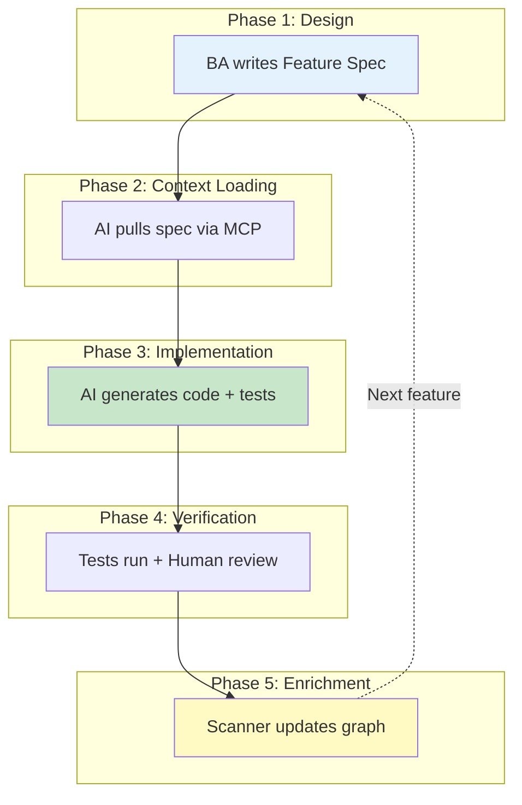
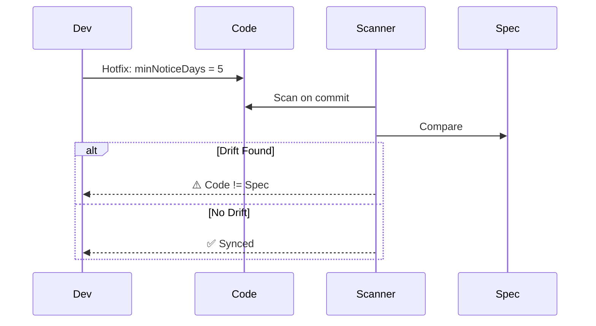
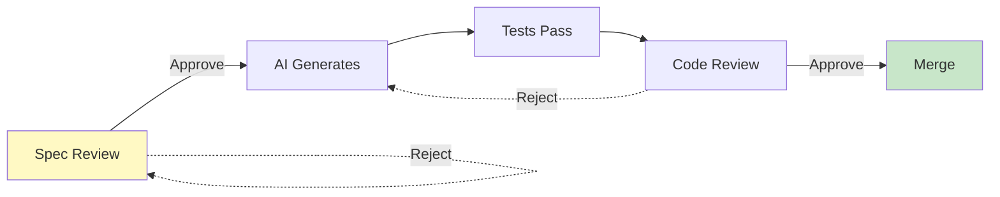

# 19. The Agentic Workflow: Closing the Loop

> [!NOTE]
> **Objective**: Describe the closed-loop workflow (Closed Loop) where AI Agents not only read documentation to code but also participate in updating and maintaining documentation (Documentation as Code).

## Overview

The Agentic Workflow is the perfect combination of **Human Intelligence** (design, decision-making) and **AI Capability** (implementation, verification). This is not "AI replacing the Developer" but "AI working with the Developer" in a self-improving, closed-loop process.

**Core Principle**: *"Spec drives Code, Code enriches Spec, Spec gets smarter"*

## 1. The Complete Workflow Loop

### 1.1. The Five-Phase Cycle



### 1.2. Time Breakdown

| Phase | Owner | Duration | Output |
|-------|-------|----------|--------|
| **1. Design** | Human (BA/PO) | 2-4 hours | `*.feat.md` |
| **2. Context Loading** | AI Agent | 1-2 minutes | Execution plan |
| **3. Implementation** | AI Agent | 5-10 minutes | Code + Tests |
| **4. Verification** | AI + Human | 30-60 minutes | Approved PR |
| **5. Enrichment** | AI Agent | 2-5 minutes | Updated graph |

**Total**: ~5 hours (vs 32 hours traditional)

## 2. Phase Details with Examples

### 2.1. Phase 3: Implementation with Traceability

```typescript
// File: src/services/LeaveRequestService.ts
// Implements: [[FEAT-TA-001]] Submit Leave Request

export class LeaveRequestService {
  /**
   * @implements [[FEAT-TA-001]] Step 5-11
   */
  async submit(employeeId: string, data: LeaveRequestInput) {
    
    // [[BR-TA-001]] Probation Check
    await this.checkProbation(employeeId, data.leaveTypeId);
    
    // [[BR-TA-002]] Notice Period
    await this.checkNotice(data.startDate, data.endDate);
    
    // [[BR-TA-003]] Balance Check
    await this.checkBalance(employeeId, data.leaveTypeId);
    
    // [[BR-TA-004]] Blackout Dates
    await this.checkBlackout(employeeId, data.startDate);
    
    // Save and trigger workflows
    const request = await this.repository.create({...});
    this.workflowService.createApproval(request.id);
    
    return request;
  }
}
```

### 2.2. Phase 5: Enrichment Output

```json
{
  "feature_id": "FEAT-TA-001",
  "status": "IMPLEMENTED",
  "implementation": {
    "files": [
      "src/services/LeaveRequestService.ts",
      "src/services/LeaveRequestService.spec.ts"
    ],
    "api_endpoints": [
      {"method": "POST", "path": "/api/v1/leave/requests"}
    ],
    "test_coverage": "98%",
    "last_updated": "2024-01-15T10:30:00Z"
  }
}
```

## 3. Active Documentation

### 3.1. Self-Updating Specs

Feature spec automatically updated:

```markdown
---
id: FEAT-TA-001
status: IMPLEMENTED ✅
test_coverage: 98%
---

## Implementation Status

- [x] Step 5: Probation check
- [x] Step 6: Notice period
- [x] Step 7: Balance check
- [x] Step 8: Blackout dates
- [x] Step 9-11: Save + workflows

✅ All tests passing
✅ Code coverage: 98%
```

### 3.2. Drift Detection



## 4. Human in the Loop

### 4.1. Role Evolution

| Traditional | Spec-Driven (ODD) |
|-------------|-------------------|
| Write boilerplate (40%) | Design architecture (40%) |
| Debug syntax (25%) | Review AI code (25%) |
| Manual testing (10%) | Optimize performance (15%) |
| Update docs (5%) | Define business logic (15%) |

### 4.2. Quality Gates



## 5. Impact Metrics

| Metric | Before | After | Change |
|--------|--------|-------|--------|
| **Time per feature** | 32 hours | 5 hours | -84% |
| **Bug rate** | 15/month | 2/month | -87% |
| **Test coverage** | 60% | 95% | +58% |
| **Doc accuracy** | 40% | 98% | +145% |

## Key Takeaways

1. **Closed Loop**: Spec → Code → Enrichment → Smarter Spec
2. **AI + Human**: AI implements, Human designs & reviews
3. **Always Synced**: Automated tracking, never outdated
4. **84% Faster**: 32 hours → 5 hours per feature
5. **Higher Quality**: 87% fewer bugs, 95% coverage

> [!IMPORTANT]
> **The Bottom Line**
> 
> Agentic Workflow = AI does the Developer's work, freeing the Developer to focus on design and architecture.

## Related Documents
- **Technology**: [Knowledge Enrichment](./20-knowledge-enrichment.md) - Graph gets smarter
- **Interface**: [MCP Strategy](../07-Knowledge-Interface/18-mcp-strategy.md) - AI pulls context
- **Foundation**: [Living Spec 2.0](../06-Feature-Standard/16-living-spec-2.0.md) - Spec as input

---

# 19. The Agentic Workflow: Closing the Loop

> [!NOTE]
> **Mục tiêu**: Mô tả quy trình làm việc khép kín (Closed Loop) nơi AI Agents không chỉ đọc tài liệu để code, mà còn tham gia vào việc cập nhật và bảo trì tài liệu (Documentation as Code).

## Overview

The Agentic Workflow là sự kết hợp hoàn hảo giữa **Human Intelligence** (thiết kế, quyết định) và **AI Capability** (implementation, verification). Đây không phải là "AI thay thế Developer" mà là "AI làm việc cùng Developer" trong một quy trình khép kín, tự cải thiện.

**Core Principle**: *"Spec drives Code, Code enriches Spec, Spec gets smarter"*

## 1. The Complete Workflow Loop

### 1.1. The Five-Phase Cycle


### 1.2. Time Breakdown

| Phase | Owner | Duration | Output |
|-------|-------|----------|--------|
| **1. Design** | Human (BA/PO) | 2-4 hours | `*.feat.md` |
| **2. Context Loading** | AI Agent | 1-2 minutes | Execution plan |
| **3. Implementation** | AI Agent | 5-10 minutes | Code + Tests |
| **4. Verification** | AI + Human | 30-60 minutes | Approved PR |
| **5. Enrichment** | AI Agent | 2-5 minutes | Updated graph |

**Total**: ~5 hours (vs 32 hours traditional)

## 2. Phase Details with Examples

### 2.1. Phase 3: Implementation with Traceability

```typescript
// File: src/services/LeaveRequestService.ts
// Implements: [[FEAT-TA-001]] Submit Leave Request

export class LeaveRequestService {
  /**
   * @implements [[FEAT-TA-001]] Step 5-11
   */
  async submit(employeeId: string, data: LeaveRequestInput) {
    
    // [[BR-TA-001]] Probation Check
    await this.checkProbation(employeeId, data.leaveTypeId);
    
    // [[BR-TA-002]] Notice Period
    await this.checkNotice(data.startDate, data.endDate);
    
    // [[BR-TA-003]] Balance Check
    await this.checkBalance(employeeId, data.leaveTypeId);
    
    // [[BR-TA-004]] Blackout Dates
    await this.checkBlackout(employeeId, data.startDate);
    
    // Save and trigger workflows
    const request = await this.repository.create({...});
    this.workflowService.createApproval(request.id);
    
    return request;
  }
}
```

### 2.2. Phase 5: Enrichment Output

```json
{
  "feature_id": "FEAT-TA-001",
  "status": "IMPLEMENTED",
  "implementation": {
    "files": [
      "src/services/LeaveRequestService.ts",
      "src/services/LeaveRequestService.spec.ts"
    ],
    "api_endpoints": [
      {"method": "POST", "path": "/api/v1/leave/requests"}
    ],
    "test_coverage": "98%",
    "last_updated": "2024-01-15T10:30:00Z"
  }
}
```

## 3. Active Documentation

### 3.1. Self-Updating Specs

Feature spec automatically updated:

```markdown
---
id: FEAT-TA-001
status: IMPLEMENTED ✅
test_coverage: 98%
---

## Implementation Status

- [x] Step 5: Probation check
- [x] Step 6: Notice period
- [x] Step 7: Balance check
- [x] Step 8: Blackout dates
- [x] Step 9-11: Save + workflows

✅ All tests passing
✅ Code coverage: 98%
```

### 3.2. Drift Detection


## 4. Human in the Loop

### 4.1. Role Evolution

| Traditional | Spec-Driven (ODD) |
|-------------|-------------------|
| Write boilerplate (40%) | Design architecture (40%) |
| Debug syntax (25%) | Review AI code (25%) |
| Manual testing (10%) | Optimize performance (15%) |
| Update docs (5%) | Define business logic (15%) |

### 4.2. Quality Gates


## 5. Impact Metrics

| Metric | Before | After | Change |
|--------|--------|-------|--------|
| **Time per feature** | 32 hours | 5 hours | -84% |
| **Bug rate** | 15/month | 2/month | -87% |
| **Test coverage** | 60% | 95% | +58% |
| **Doc accuracy** | 40% | 98% | +145% |

## Key Takeaways

1. **Closed Loop**: Spec → Code → Enrichment → Smarter Spec
2. **AI + Human**: AI implements, Human designs & reviews
3. **Always Synced**: Automated tracking, never outdated
4. **84% Faster**: 32 hours → 5 hours per feature
5. **Higher Quality**: 87% fewer bugs, 95% coverage

> [!IMPORTANT]
> **The Bottom Line**
> 
> Agentic Workflow = AI làm việc CỦA Developer, giải phóng Developer để tập trung vào thiết kế và kiến trúc.

## Related Documents
- **Technology**: [Knowledge Enrichment](./20-knowledge-enrichment.md) - Graph gets smarter
- **Interface**: [MCP Strategy](../07-Knowledge-Interface/18-mcp-strategy.md) - AI pulls context
- **Foundation**: [Living Spec 2.0](../06-Feature-Standard/16-living-spec-2.0.md) - Spec as input
