# 20. Knowledge Enrichment: The Self-Improving Graph

> [!NOTE]
> **Mục tiêu**: Giải thích cơ chế "Học ngược" (Reverse Engineering). Hệ thống không chỉ dùng Knowledge Graph để sinh code, mà còn dùng Code để làm giàu lại Knowledge Graph.

## Overview

Knowledge Enrichment là "vòng lặp học tập" của hệ thống ODD. Ban đầu, Knowledge Graph chỉ chứa **Spec** (lý thuyết). Sau mỗi lần implementation, nó được làm giàu thêm với **Code** (thực tế), tạo nên một hệ thống ngày càng thông minh hơn.

**Core Principle**: *"Every implementation teaches the system something new"*

## 1. The Enrichment Cycle

### 1.1. From Theory to Reality

```mermaid
graph TD
    subgraph "Initial State (Theory Only)"
        I1[Feature Spec]
        I2[Ontology]
        I3[Business Rules]
    end
    
    subgraph "After Implementation (Theory + Reality)"
        A1[Feature Spec ✅]
        A2[Ontology]
        A3[Business Rules]
        A4[Source Code]
        A5[API Endpoints]
        A6[Database Schema]
        A7[Test Cases]
    end
    
    I1 --> A1
    I2 --> A2
    I3 --> A3
    
    A1 -.->|"Implemented by"| A4
    A4 -.->|"Exposes"| A5
    A4 -.->|"Uses"| A6
    A4 -.->|"Tested by"| A7
    
    style I1 fill:#fff9c4
    style A4 fill:#c8e6c9
    style A5 fill:#c8e6c9
```



### 1.2. What Gets Enriched?

| Layer | Before Implementation | After Implementation |
|-------|----------------------|----------------------|
| **Feature** | Spec only | Spec + Implementation status + Code locations |
| **Ontology** | Entity definition | Entity + Tables + Code classes |
| **Rules** | Rule definition | Rule + Validation functions + Test cases |
| **Graph** | Logical relationships | Logical + Physical relationships |

## 2. Enrichment Mechanisms

### 2.1. Code Scanning & Metadata Extraction


### 2.2. The Enriched Graph Structure


### 2.3. Traceability Comment Format

```typescript
/**
 * Submit a new leave request
 * 
 * @implements [[FEAT-TA-001]] Submit Leave Request
 * @uses [[E-LeaveRequest]] LeaveRequest entity
 * @uses [[E-Employee]] Employee entity
 * @enforces [[BR-TA-001]] Probation check
 * @enforces [[BR-TA-002]] Notice period
 * @enforces [[BR-TA-003]] Balance validation
 * @enforces [[BR-TA-004]] Blackout dates
 * @exposes POST /api/v1/leave/requests
 * @persists leave_requests table
 */
async function submitLeaveRequest(employeeId: string, data: LeaveRequestInput) {
  // Implementation...
}
```

## 3. Benefits of Enrichment

### 3.1. Automated Impact Analysis (Real)

**Query**: "Nếu sửa cột `contractType` trong database, những Feature nào sẽ bị ảnh hưởng?"

```cypher
// Cypher query on enriched graph
MATCH (field:Field {name: 'contractType'})<-[:USES]-(code:Code)
MATCH (code)<-[:IMPLEMENTED_BY]-(feature:Feature)
RETURN feature.title, code.filePath, code.lineNumber
```

**Result**:
```json
{
  "affected_features": [
    {
      "feature": "FEAT-TA-001: Submit Leave Request",
      "code_file": "src/services/LeaveRequestService.ts",
      "line": 45,
      "impact": "Uses contractType in probation check"
    },
    {
      "feature": "FEAT-HR-005: Employee Onboarding",
      "code_file": "src/services/OnboardingService.ts",
      "line": 78,
      "impact": "Checks contractType for benefit eligibility"
    }
  ],
  "total_affected": 2,
  "risk_level": "HIGH"
}
```

### 3.2. Dead Code Detection

```mermaid
graph LR
    subgraph "All Code Files"
        C1[LeaveService.ts]
        C2[OldLeaveService.ts]
        C3[UtilityFunctions.ts]
    end
    
    subgraph "Features in Graph"
        F1[FEAT-TA-001]
        F2[FEAT-TA-002]
    end
    
    C1 -.->|"linked to"| F1
    C3 -.->|"linked to"| F2
    C2 -.->|"❌ No link"| X[Dead Code]
    
    style C2 fill:#ffcdd2
    style X fill:#ffcdd2
```



**Scanner Report**:
```
⚠️ Dead Code Detected:
- src/services/OldLeaveService.ts (250 lines)
  - Not linked to any feature
  - Last modified: 6 months ago
  - Recommendation: Archive or delete

- src/utils/LegacyHelpers.ts (180 lines)
  - Not linked to any feature
  - No test coverage
  - Recommendation: Delete
```

### 3.3. Spec Coverage Analysis


**Dashboard Output**:
```
📊 Implementation Status

✅ Implemented (84%): 42 features
  - All tests passing
  - Code coverage > 90%

🔄 In Progress (10%): 5 features
  - FEAT-TA-010: Leave Balance Report (60% complete)
  - FEAT-HR-015: Performance Review (30% complete)
  - ...

❌ Not Started (6%): 3 features
  - FEAT-PA-020: Payroll Simulation
  - FEAT-HR-025: Career Path Planning
  - FEAT-TA-030: Shift Scheduling
```

## 4. The Continuous Improvement Loop

### 4.1. The Virtuous Cycle


### 4.2. Learning Patterns

As the graph grows, AI learns:

| Iteration | Graph Size | AI Capability |
|-----------|------------|---------------|
| **1** | 100 nodes | Basic code generation |
| **5** | 300 nodes | Recognizes common patterns |
| **10** | 500 nodes | Suggests best practices |
| **20** | 800 nodes | Predicts edge cases |
| **50** | 1500 nodes | Architectural insights |

**Example**:
```
Iteration 1:
AI: "I'll create a basic validation function"

Iteration 10:
AI: "Based on 8 similar features, I suggest:
     - Use decorator pattern for validation
     - Cache policy lookups
     - Add rate limiting
     - Include audit logging"
```

## 5. Implementation: The Scanner Tool

### 5.1. Scanner Architecture

```python
# odd_scanner.py
import ast
import re
from pathlib import Path
import networkx as nx

class ODDScanner:
    def __init__(self, graph: nx.DiGraph):
        self.graph = graph
        
    def scan_file(self, file_path: Path):
        \"\"\"Scan a TypeScript/Python file for traceability comments\"\"\"
        content = file_path.read_text()
        
        # Extract traceability comments
        features = re.findall(r'@implements \[\[(FEAT-[A-Z]+-\d+)\]\]', content)
        rules = re.findall(r'@enforces \[\[(BR-[A-Z]+-\d+)\]\]', content)
        entities = re.findall(r'@uses \[\[(E-[A-Za-z]+)\]\]', content)
        
        # Create code node
        code_node = {
            'type': 'CODE',
            'file_path': str(file_path),
            'features': features,
            'rules': rules,
            'entities': entities
        }
        
        # Add to graph
        node_id = f\"CODE-{file_path.stem}\"
        self.graph.add_node(node_id, **code_node)
        
        # Link to features
        for feature_id in features:
            if self.graph.has_node(feature_id):
                self.graph.add_edge(feature_id, node_id, rel='implemented_by')
                
        # Link to rules
        for rule_id in rules:
            if self.graph.has_node(rule_id):
                self.graph.add_edge(rule_id, node_id, rel='enforced_by')
                
        return code_node
    
    def detect_dead_code(self):
        \"\"\"Find code files not linked to any feature\"\"\"
        dead_code = []
        
        for node_id, data in self.graph.nodes(data=True):
            if data['type'] == 'CODE':
                # Check if linked to any feature
                has_feature = any(
                    self.graph.nodes[pred]['type'] == 'FEATURE'
                    for pred in self.graph.predecessors(node_id)
                )
                
                if not has_feature:
                    dead_code.append(data['file_path'])
                    
        return dead_code
    
    def impact_analysis(self, entity_name: str, field_name: str):
        \"\"\"Analyze impact of changing an entity field\"\"\"
        affected = []
        
        # Find entity node
        entity_node = f\"E-{entity_name}\"
        
        # Find all code using this entity
        for successor in self.graph.successors(entity_node):
            if self.graph.nodes[successor]['type'] == 'CODE':
                # Find features implemented by this code
                for feature in self.graph.predecessors(successor):
                    if self.graph.nodes[feature]['type'] == 'FEATURE':
                        affected.append({
                            'feature': self.graph.nodes[feature]['title'],
                            'code_file': self.graph.nodes[successor]['file_path']
                        })
                        
        return affected
```

### 5.2. CI/CD Integration

```yaml
# .github/workflows/odd-enrichment.yml
name: ODD Knowledge Enrichment

on:
  push:
    branches: [main, develop]

jobs:
  enrich:
    runs-on: ubuntu-latest
    steps:
      - uses: actions/checkout@v3
      
      - name: Run ODD Scanner
        run: |
          python odd_scanner.py scan --dir src/
          
      - name: Update Knowledge Graph
        run: |
          python odd_scanner.py enrich --graph knowledge_graph.graphml
          
      - name: Generate Reports
        run: |
          python odd_scanner.py report --output reports/
          
      - name: Check for Dead Code
        run: |
          python odd_scanner.py dead-code --fail-on-found
```

## 6. Metrics & Evolution

### 6.1. Graph Growth Over Time

| Month | Nodes | Edges | Features | Code Files | Avg. Connections |
|-------|-------|-------|----------|------------|------------------|
| **Month 1** | 150 | 300 | 10 | 25 | 2.0 |
| **Month 3** | 400 | 950 | 30 | 75 | 2.4 |
| **Month 6** | 800 | 2100 | 50 | 150 | 2.6 |
| **Month 12** | 1500 | 4500 | 80 | 250 | 3.0 |

### 6.2. Quality Improvement


## Key Takeaways

1. **Reverse Learning**: Code enriches Spec, making the system smarter
2. **Real Impact Analysis**: Know exactly what breaks when you change something
3. **Dead Code Detection**: Automatically find unused code
4. **Continuous Improvement**: Graph gets better with every implementation
5. **Self-Documenting**: Code automatically updates documentation

> [!IMPORTANT]
> **The Bottom Line**
> 
> Knowledge Enrichment tạo ra một hệ thống "tự học" - càng dùng càng thông minh, càng chính xác, càng hữu ích.

## Related Documents
- **Workflow**: [Agentic Workflow](./19-agentic-workflow.md) - How enrichment fits in the cycle
- **Overview**: [Phase 2 README](../README.md) - Complete Feature Engine vision
- **Foundation**: [Feature Spec Design](../06-Feature-Standard/15-feature-spec-design.md) - What gets enriched
