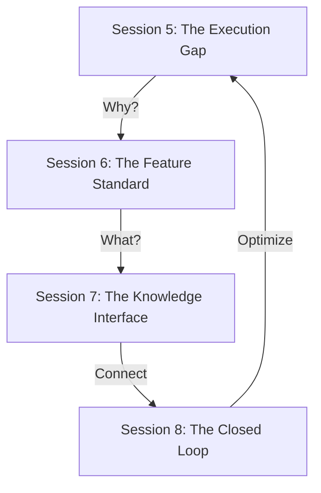

# Phase 2: The Feature Engine
> **From Static Ontology to Dynamic Execution**

## 🎯 Overview
In Phase 1 (ODD Framework), we solved the problem of defining data and structure through Ontology. However, to transform that understanding into executing software, we face the "Execution Gap" - a gap in behavior and context.

**Phase 2 Research** focuses on building **"The Feature Engine"** - an intermediate layer that connects Ontology with Code, allowing both humans and AI agents to collaborate in software production following an industrialized process.

## 🗺️ Research Sessions Navigation

The entire Phase 2 research is divided into 4 sessions, leading from problems to solutions:

### 1. The Need (Session 5)
Why does the AI still "hallucinate" code even with the Ontology? Why do Developers still need to ask POs?
*   [13. The Execution Gap](./05-Feature-Engine/13-execution-gap.md): The lack of a Dynamic Behavior layer in the Ontology.
*   [14. The Prompt Context Bottleneck](./05-Feature-Engine/14-prompt-context-bottleneck.md): The problem of "information poisoning" when feeding the entire graph to the AI.

### 2. The Standard (Session 6)
Defining a new knowledge unit - **Feature Specification 2.0**.
*   [15. Feature Spec Design](./06-Feature-Standard/15-feature-spec-design.md): Structure of `*.feat.md` files (Metadata + Mermaid Flow + Logic Rules).
*   [16. Living Spec 2.0](./06-Feature-Standard/16-living-spec-2.0.md): The evolution from a reference document to a production input source.

### 3. The Interface (Session 7)
How do humans and AI Agents access and manipulate this knowledge?
*   [17. ODD Studio Architecture](./07-Knowledge-Interface/17-odd-studio.md): A "No-code" Visual Editor tool to help the Product Team write Specs quickly.
*   [18. MCP Strategy (Model Context Protocol)](./07-Knowledge-Interface/18-mcp-strategy.md): **[CRITICAL]** Turning the knowledge base into a standard API for external Agents (Cursor, Windsurf) to actively "pull" context.

### 4. The Loop (Session 8)
A closed-loop production and self-improvement process.
*   [19. The Agentic Workflow](./08-Closed-Loop/19-agentic-workflow.md): From Spec -> Code -> Verify.
*   [20. Knowledge Enrichment](./08-Closed-Loop/20-knowledge-enrichment.md): The "Reverse Engineering" mechanism - scanning Code to update the Graph (Actual Impact Analysis).

## 🔑 Key Concepts

| Concept | Definition | Role |
| :--- | :--- | :--- |
| **Logic Core** | **Feature Spec (`*.feat.md`)** | "Technical drawing" for each feature, connecting Ontology Entities together along a timeline (Flow). |
| **Connector** | **MCP (Model Context Protocol)** | "Communication portal" that helps AI Agents understand the project deeply and accurately without complex RAG. |
| **Workflow** | **Spec-Driven Development** | A process where the Spec is written first and used to "drive" the AI to write Code and Tests. |

## 🚀 Next Steps

After completing Phase 2 research, the next roadmap (Phase 3) will be **Implementation**:
1.  **Pilot Feature Spec**: Test write 1 module (e.g., Time Off) according to the new standard.
2.  **Build ODD Compiler**: A tool to parse `*.feat.md` and `*.onto.md` into a Knowledge Graph (NetworkX).
3.  **Setup MCP Server**: Build a simple server to test connection with Cursor/Windsurf.

---

# Phase 2: The Feature Engine
> **From Static Ontology to Dynamic Execution**

## 🎯 Overview
Trong Phase 1 (ODD Framework), chúng ta đã giải quyết bài toán định nghĩa dữ liệu (Data) và cấu trúc (Structure) thông qua Ontology. Tuy nhiên, để chuyển hóa những hiểu biết đó thành phần mềm chạy được (Executing Software), chúng ta đối mặt với "Execution Gap" - khoảng trống về mặt hành vi (Behavior) và ngữ cảnh (Context).

**Phase 2 Research** tập trung vào việc xây dựng **"Hệ thống động cơ tính năng" (The Feature Engine)** - một lớp trung gian giúp kết nối Ontology với Code, cho phép cả con người và AI agents hợp tác sản xuất phần mềm theo quy trình công nghiệp hóa.

## 🗺️ Research Sessions Navigation

Toàn bộ nghiên cứu Phase 2 được chia thành 4 sessions, dẫn dắt từ vấn đề đến giải pháp:

### 1. The Need (Session 5)
Tại sao có Ontology rồi mà AI vẫn "bịa" code (Hallucination)? Tại sao Dev vẫn cần hỏi PO?
*   [13. The Execution Gap](./05-Feature-Engine/13-execution-gap.md): Sự thiếu hụt của lớp Dynamic Behavior trong Ontology.
*   [14. The Prompt Context Bottleneck](./05-Feature-Engine/14-prompt-context-bottleneck.md): Vấn đề "ngộ độc thông tin" khi feed toàn bộ graph cho AI.

### 2. The Standard (Session 6)
Định nghĩa đơn vị kiến thức mới - **Feature Specification 2.0**.
*   [15. Feature Spec Design](./06-Feature-Standard/15-feature-spec-design.md): Cấu trúc file `*.feat.md` (Metadata + Mermaid Flow + Logic Rules).
*   [16. Living Spec 2.0](./06-Feature-Standard/16-living-spec-2.0.md): Sự tiến hóa từ tài liệu tham khảo (Reference) thành nguồn nguyên liệu sản xuất (Input Source).

### 3. The Interface (Session 7)
Làm sao để con người và AI Agents truy cập và thao tác với tri thức này?
*   [17. ODD Studio Architecture](./07-Knowledge-Interface/17-odd-studio.md): Công cụ "No-code" Visual Editor giúp Product Team viết Spec nhanh chóng.
*   [18. MCP Strategy (Model Context Protocol)](./07-Knowledge-Interface/18-mcp-strategy.md): **[CRITICAL]** Biến kho tri thức thành một API chuẩn để các Agents bên ngoài (Cursor, Windsurf) chủ động "pull" ngữ cảnh.

### 4. The Loop (Session 8)
Quy trình sản xuất khép kín và tự cải thiện.
*   [19. The Agentic Workflow](./08-Closed-Loop/19-agentic-workflow.md): Từ Spec -> Code -> Verify.
*   [20. Knowledge Enrichment](./08-Closed-Loop/20-knowledge-enrichment.md): Cơ chế "Reverse Engineering" - quét Code để update lại Graph (Impact Analysis thực tế).

## 🔑 Key Concepts

| Concept | Definition | Role |
| :--- | :--- | :--- |
| **Logic Core** | **Feature Spec (`*.feat.md`)** | "Bản vẽ kỹ thuật" cho từng tính năng, kết nối các Entity của Ontology lại với nhau theo trục thời gian (Flow). |
| **Connector** | **MCP (Model Context Protocol)** | "Cổng giao tiếp" giúp AI Agent hiểu sâu và chính xác về dự án mà không cần RAG phức tạp. |
| **Workflow** | **Spec-Driven Development** | Quy trình nơi Spec được viết trước và dùng để "lái" (drive) AI viết Code và Test. |

## 🚀 Next Steps

Sau khi hoàn tất nghiên cứu Phase 2, lộ trình tiếp theo (Phase 3) sẽ là **Implementation**:
1.  **Pilot Feature Spec**: Viết thử nghiệm 1 module (ví dụ: Time Off) theo chuẩn mới.
2.  **Build ODD Compiler**: Tool parse `*.feat.md` và `*.onto.md` thành Knowledge Graph (NetworkX).
3.  **Setup MCP Server**: Dựng server đơn giản để test kết nối với Cursor/Windsurf.