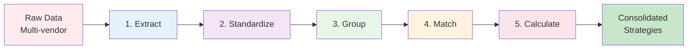
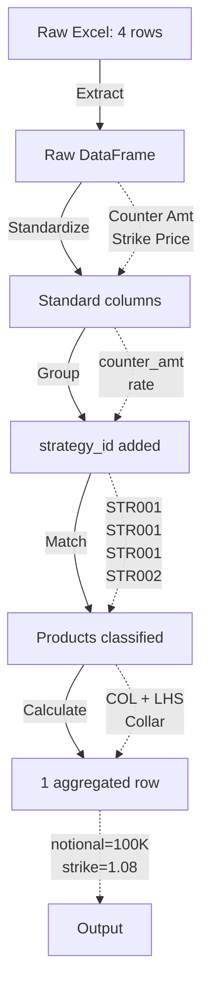

# Solution Approach: 5-Stage Data Pipeline

## Overview

The solution employs a **5-stage sequential pipeline** to transform raw, fragmented FX option data into consolidated, classified strategies with standardized output fields.



---

## Design Philosophy

### 1. **Separation of Concerns**
Each stage has a single, well-defined responsibility:
- **Extract**: Read data
- **Standardize**: Normalize fields
- **Group**: Identify strategies
- **Match**: Classify products
- **Calculate**: Aggregate outputs

**Benefit**: Easy to test, debug, and extend each stage independently

### 2. **Configuration Over Code**
Business logic resides in external YAML files, not hardcoded:
- Field mappings
- Product fingerprints
- Classification rules
- Aggregation formulas

**Benefit**: Business users can modify rules without developer intervention

### 3. **AI-Assisted Automation**
Leverage machine learning for tasks that resist rule-based solutions:
- Semantic field mapping (embeddings)
- Pattern recognition (fingerprinting)

**Benefit**: Zero-shot learning → supports new vendors without training

### 4. **Graceful Degradation**
Each stage can operate with partial information:
- Missing fields → use defaults
- Unmatched products → flag as "Unknown"
- Failed grouping → treat as single-leg

**Benefit**: System doesn't break; provides partial results

---

## Stage-by-Stage Solution

### **Stage 1: Extract** 📄
**Problem**: Data in various formats (PDF, Excel, CSV)

**Solution**: 
- AI OCR for PDFs (vision models extract tables)
- Direct parsing for structured formats (Excel → DataFrame)

**Output**: Raw tabular data with vendor-specific columns

**Key Innovation**: Multimodal AI handles unstructured documents

---

### **Stage 2: Standardize** 🎯
**Problem**: Inconsistent column names across vendors

**Solution**:
- **Semantic embeddings**: Encode both standard fields and vendor columns into vector space
- **Similarity matching**: Cosine similarity to find best matches
- **Manual override**: UI allows human correction

**Output**: DataFrame with standardized column names

**Key Innovation**: Zero-shot mapping using sentence embeddings (no pre-training per vendor)

**Example**:
```
"Counter Amt" → [0.21, 0.45, 0.12, ...] (embedding)
"Amount"      → [0.19, 0.47, 0.11, ...] (embedding)
Cosine similarity: 0.92 ✅ MATCH
```

---

### **Stage 3: Group** 🔗
**Problem**: Multi-leg strategies split across rows

**Solution**:
- **Grouping keys**: Combine multiple fields (trade_date, expiry_date, currency_pair, etc.)
- **Multi-level grouping**: 
  - Level 1: Exact match on all keys
  - Level 2: Fuzzy match (if enabled)
- **Strategy ID assignment**: Unique ID per group

**Output**: DataFrame with `strategy_id` column linking related legs

**Key Innovation**: Configurable grouping keys adapt to data quality

**Example**:
```
Row 1: trade_date=2024-01-15, expiry=2024-06-15, pair=EUR/USD → strategy_id=STR001
Row 2: trade_date=2024-01-15, expiry=2024-06-15, pair=EUR/USD → strategy_id=STR001
Row 3: trade_date=2024-01-16, expiry=2024-06-15, pair=EUR/USD → strategy_id=STR002
```

---

### **Stage 4: Match** 🎯
**Problem**: Identify what product this strategy is

**Solution**:
- **Fingerprint matching**: Compare strategy legs against predefined patterns
  - Pattern: `{legs: 2, positions: [Sell-Put, Buy-Call], barriers: 0}`
  - Match: "Collar" (academic) + "COL" (internal code)
- **Academic classification**: Apply textbook rules for well-known structures
  - Collar, Straddle, Strangle, Seagull, Butterfly, etc.

**Output**: DataFrame with `fp_product_code`, `fp_rmi_type`, `option_strategy`

**Key Innovation**: Dual classification (internal + academic) + RMI detection

**Example**:
```
Strategy STR001: [Sell Put @ 1.08, Buy Call @ 1.10]
→ Fingerprint match: COL (Collar)
→ Academic match: Collar
→ RMI detection: LHS (Sell Put present)
```

---

### **Stage 5: Calculate** 🧮
**Problem**: Consolidate multi-leg rows into single-row with calculated fields

**Solution**:
- **RMI-aware leg filtering**:
  - LHS: Notional from Sell-Put, Leverage from Buy-Call
  - RHS: Notional from Sell-Call, Leverage from Buy-Put
- **Aggregation rules**: Sum amounts, extract rates, calculate ratio
- **Barrier detection**: Infer European/American/Window from window_start dates

**Output**: Single row per strategy with 23 standard output fields

**Key Innovation**: Perspective-aware aggregation ensures correct calculations

**Example**:
```
Input (2 legs):
  Leg 1: Sell Put, rate=1.08, counter_amt=100,000, buy_sell=Sell, call_put=Put
  Leg 2: Buy Call, rate=1.10, counter_amt=100,000, buy_sell=Buy, call_put=Call

Output (1 row):
  strategy_id: STR001
  original_notional: 100,000 (from Sell Put)
  strike_rate: 1.08 (from Sell Put)
  upper_barrier: 1.10 (from Buy Call rate)
  ratio: null (no leverage in Collar)
  rmi_type: LHS
```

---

## Data Flow Visualization



---

## Why This Approach Works

### Modularity
- Each stage can be developed/tested independently
- Easy to swap implementations (e.g., different AI models)

### Scalability
- Pipeline processes in batches (vectorized operations)
- Configurable to handle 10 or 10,000 strategies

### Maintainability
- Business logic in YAML (version-controlled)
- Clear separation: data transformation vs business rules

### Adaptability
- New vendors: Update field mappings (no code)
- New products: Add fingerprints (no code)
- New calculations: Add aggregation rules (no code)

---

## Alternative Approaches Considered

### ❌ Rule-Based Mapping
**Rejected**: Would require manual rules for each vendor → not scalable

### ❌ Supervised ML for Classification
**Rejected**: Requires labeled training data → cold start problem for new products

### ❌ Single-Stage Processing
**Rejected**: Monolithic logic hard to debug and extend

### ✅ **Chosen Approach**: Sequential pipeline with AI-assisted automation
**Rationale**: Balances automation (embeddings) with control (configurations)
