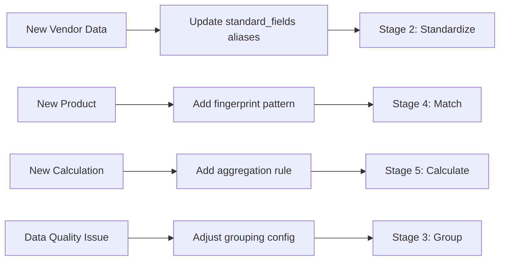

# Phase 4 Complete: Configuration Guides ✅

## Completed Documents

### 1. [Standard Fields Guide](01-standard-fields-guide.md)
**Config File**: `configs/standard_fields.yaml`  
**Purpose**: Define canonical field names for semantic mapping  
**Key Topics**:
- Field structure (name, description, aliases)
- Field categories (identifiers, amounts, dates, barriers)
- Adding aliases for vendor variations
- Best practices: Qualified aliases, avoid generics

**Example**:
```yaml
- name: counter_amt
  description: "Notional amount in contract currency"
  aliases:
    - Counter Amount
    - Notional
    - Trade Amount
```

### 2. [Product Fingerprints Guide](02-product-fingerprints-guide.md)
**Config File**: `configs/strategy_fingerprints.yaml`  
**Purpose**: Define structural patterns for product recognition  
**Key Topics**:
- Fingerprint structure (leg_count, patterns, features)
- Leg pattern syntax ({bs: S, cp: P})
- RMI patterns (LHS vs RHS mirrors)
- Product categories (Vanilla, Forwards, Seagulls, Complex)
- Differentiation via feature flags (has_ratio, has_barrier)

**Example**:
```yaml
- name: Collar (COL)
  leg_count: 2
  patterns:
    - legs: [{bs: S, cp: P}, {bs: B, cp: C}]
      rmi_type: LHS
```

### 3. [Aggregation Rules Guide](03-aggregation-rules-guide.md)
**Config File**: `configs/aggregation_rules.yaml`  
**Purpose**: Define multi-leg consolidation logic with RMI-awareness  
**Key Topics**:
- Leg filters (lhs_notional, rhs_leverage)
- RMI-aware rules (single rule, dual filters)
- Aggregation types (sum, min, max, first, count)
- Calculated fields (ratio, barrier_type)
- Format rules (numbers, dates, rates)

**Example**:
```yaml
- name: original_notional_amount
  source_field: counter_amt
  aggregation: sum
  rmi_logic:
    LHS: lhs_notional  # Sell-Put filter
    RHS: rhs_notional  # Sell-Call filter
```

### 4. [Grouping Config Guide](04-grouping-config-guide.md)
**Config File**: `configs/grouping_config.yaml`  
**Purpose**: Define leg grouping strategy (composite keys + fuzzy matching)  
**Key Topics**:
- Grouping keys (trade_date, expiry, currency_pair)
- Fuzzy matching (±1 day tolerance for typos)
- Bad trade filters (exclude invalid rows)
- Multi-level grouping (strict → permissive fallback)
- Strategies: Conservative vs Permissive vs Balanced

**Example**:
```yaml
keys:
  - field: expiry_date
    required: true
    fuzzy: true
    tolerance: ±1 day  # Handle data entry errors
```

---

## Configuration Files Summary

| Config File | Purpose | Used In Stage | Key Concept |
|-------------|---------|---------------|-------------|
| `standard_fields.yaml` | Field definitions | Stage 2: Standardize | Semantic mapping via aliases |
| `strategy_fingerprints.yaml` | Product patterns | Stage 4: Match | Pattern matching + RMI |
| `aggregation_rules.yaml` | Calculation logic | Stage 5: Calculate | RMI-aware aggregation |
| `grouping_config.yaml` | Grouping strategy | Stage 3: Group | Composite keys + fuzzy |

---

## Key Configuration Patterns

### 1. Externalized Business Logic
All rules live in YAML, not code:
- ✅ Change rules without deployment
- ✅ Version control for rules
- ✅ Business users can edit

### 2. RMI-Aware Processing
LHS (Importer) vs RHS (Exporter) handled automatically:
- Same pattern, different filters
- Auto-detection from leg positions
- Correct calculations per perspective

### 3. Progressive Matching
Multi-level strategies with fallbacks:
- Try strict matching first
- Fall back to fuzzy if needed
- Metrics guide which level to use

### 4. Semantic Not Syntactic
Embeddings >> string matching:
- "Counter Amt" → "counter_amt" (semantic)
- Not "ctr_amt" → "counter_amt" (lexical)

---

## Configuration Workflow



---

## Next Steps

### Recommended Reading Order for Users
1. **Start**: `01-standard-fields-guide.md` (understand field mapping)
2. **Then**: `04-grouping-config-guide.md` (leg grouping)
3. **Next**: `02-product-fingerprints-guide.md` (product recognition)
4. **Finally**: `03-aggregation-rules-guide.md` (calculations)

### For Developers
1. Study aggregation rules (most complex: RMI logic)
2. Understand fingerprint matching (pattern scoring)
3. Review standard fields (semantic mapping)
4. Check grouping config (fuzzy matching edge cases)

---

## Summary

**Phase 4 Objective**: Enable system customization via YAML configuration  
**Documents Created**: 4 comprehensive guides  
**Coverage**: All major configuration files  
**Audience**: Both business users (rules) and developers (extension)  

**Key Achievement**: Complete separation of business logic from code  
**Benefit**: Adapt to new products, vendors, and requirements without code changes
