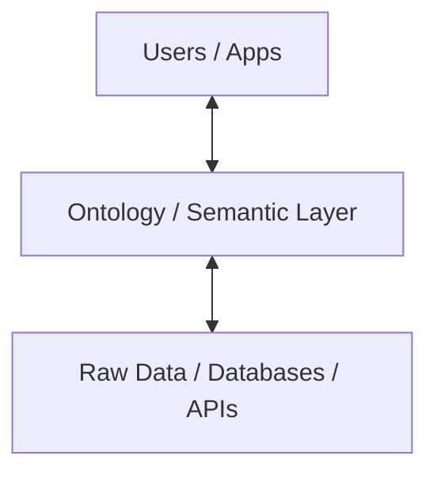

# Part 1: Ontology Concept (THE WHAT)

Tài liệu này giải thích các khái niệm cơ bản về **Ontology** trong bối cảnh Khoa học Dữ liệu và Kỹ thuật Phần mềm, tách biệt khỏi các triển khai cụ thể (như Palantir).

## 1. Ontology là gì?

Trong khoa học máy tính và thông tin, **Ontology** (Bản thể học) là một cách chính thức để biểu diễn tri thức như một tập hợp các khái niệm trong một miền (domain) và các mối quan hệ giữa chúng.

Khác với **Database Schema** (Lược đồ cơ sở dữ liệu) tập trung vào việc lưu trữ dữ liệu hiệu quả (hàng, cột, khóa ngoại, chỉ mục), **Ontology** tập trung vào **Ý nghĩa** (Semantics) và **Ngữ cảnh** (Context) của dữ liệu đó đối với thế giới thực.

### Sự khác biệt cốt lõi

| Đặc điểm | Database Schema (RDBMS) | Ontology (Semantic Layer) |
| :--- | :--- | :--- |
| **Đơn vị cơ sở** | Table, Row, Column | Object (Entity), Property, Link |
| **Mục tiêu** | Tối ưu hóa lưu trữ, tính toàn vẹn dữ liệu (ACID) | Tối ưu hóa sự hiểu biết của con người và máy móc |
| **Mối quan hệ** | Foreign Key (JOIN) - mang tính kỹ thuật | Relationship/Link - mang tính ý nghĩa (Semantic) |
| **Góc nhìn** | "Dữ liệu trông như thế nào khi lưu vào đĩa?" | "Thực thể này là gì trong thế giới thực?" |

## 2. Các thành phần cốt lõi của Ontology

Một hệ thống Ontology thường được xây dựng dựa trên ba trụ cột chính (thường được gọi là bộ ba **Object-Property-Link**):

### 2.1 Objects (Entities) - Thực thể
Đây là các "Danh từ" của hệ thống. Object đại diện cho một vật thể, con người, hoặc khái niệm trong thế giới thực.
*   **Ví dụ:** `Employee` (Nhân viên), `Flight` (Chuyến bay), `Ticket` (Vé), `Incident` (Sự cố).
*   **Lưu ý:** Một Object có thể được tổng hợp (aggregate) từ nhiều bảng dữ liệu khác nhau. Ví dụ, Object `Employee` có thể lấy thông tin cơ bản từ bảng `HR_PROFILE` và thông tin lương từ bảng `PAYROLL`.

### 2.2 Properties (Attributes) - Thuộc tính
Đây là các đặc điểm mô tả Object.
*   **Ví dụ:** Object `Employee` có các properties: `Name`, `Employee ID`, `Start Date`, `Role`.
*   Properties không chỉ là giá trị text/number mà còn có thể là metadata về trạng thái, độ tin cậy của dữ liệu.

### 2.3 Links (Relationships) - Mối quan hệ
Đây là các kết nối có ý nghĩa giữa các Objects. Trong Ontology, Link là "First-class citizen" (công dân hạng nhất), quan trọng ngang hàng với Object.
*   **Ví dụ:**
    *   `Employee` *works for* `Department`.
    *   `Plane` *flights on* `Route`.
    *   `Customer` *filed* `Complaint`.
*   Khác với `JOIN` trong SQL (vốn là một thao tác tốn kém khi truy vấn), Links trong Ontology thường được mô hình hóa dưới dạng một **Graph** (Đồ thị), cho phép duyệt (traverse) rất nhanh và trực quan.

## 3. The Semantic Layer (Lớp ngữ nghĩa)

**Semantic Layer** là lớp trừu tượng nằm giữa **Dữ liệu thô** (Data Lake, DB) và **Người dùng/Ứng dụng**.

Vai trò của Semantic Layer:
1.  **Translation (Dịch thuật):** Dịch từ ngôn ngữ kỹ thuật (`SELECT * FROM tbl_usr_01`) sang ngôn ngữ nghiệp vụ (`Get Employee "Nguyen Van A"`).
2.  **Unification (Hợp nhất):** Nhìn thấy một Object duy nhất dù dữ liệu nằm rải rác ở 5 hệ thống khác nhau (ERP, CRM, HRIS...).
3.  **Context (Ngữ cảnh):** Cung cấp thêm ý nghĩa cho dữ liệu. Ví dụ: Số `10,000,000` không chỉ là một con số, mà được định nghĩa là `Base Salary` (Lương cơ bản) của `Employee` này.

## Kết luận

Ontology không phải là một công nghệ lưu trữ mới thay thế Database. Nó là một **lớp mô hình hóa** (Modeling Layer) nằm bên trên, giúp biến đổi "Dữ liệu vô tri" thành "Tri thức có thể hành động" (Actionable Knowledge).
