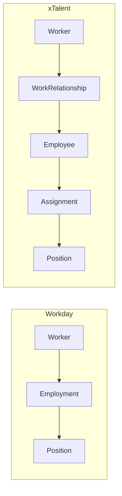
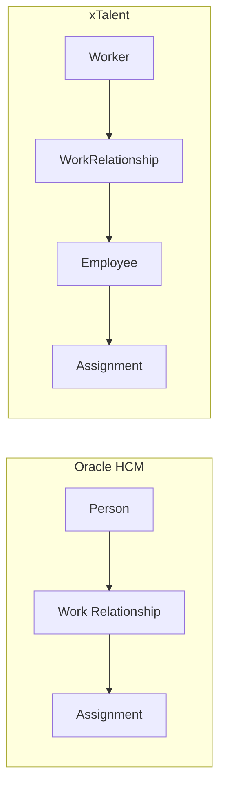

# Core HR (CO) Module: Executive Brief

> **RE-INITIATION Analysis** | Solution Architecture Research
> Date: 2026-01-19 | Version: 1.0

---

## Executive Summary

The Core HR (CO) module RE-INITIATION confirms that xTalent's existing ontology foundation is **architecturally sound** and aligns with enterprise HCM best practices. The Worker → WorkRelationship → Employee model matches Workday's industry-leading design, with enhancements for Vietnam Labor Code compliance.

### Key Findings

| Area | Assessment | Recommendation |
|------|------------|----------------|
| **Ontology Structure** | ✅ Excellent | Maintain current Worker/WorkRelationship/Employee separation |
| **WorkRelationship Types** | ✅ Complete | 4-type model (EMPLOYEE, CONTINGENT, CONTRACTOR, NON_WORKER) covers all scenarios |
| **Facility Hierarchy** | ✅ Appropriate | Place → Location → WorkLocation is industry standard |
| **Vietnam Compliance** | ⚠️ Good, needs refinement | Contract type mapping needs alignment with Labor Code 2019 |
| **Cross-Module Integration** | ✅ Well-designed | CO → TA, TR, PR event-driven integration ready |

---

## Problem Taxonomy

### Strategic Goal
Re-architect Core HR with clean ontology foundation, matching Workday/SAP concepts while maintaining Vietnam compliance depth.

### Problem Classification

| Problem Type | Description | Resolution |
|--------------|-------------|------------|
| **Conceptual** | Worker vs Employee confusion in previous designs | ✅ Resolved - Clear 3-level hierarchy |
| **Regulatory** | Vietnam Labor Code 2019 contract requirements | 🔄 Document system invariants |
| **Operational** | WorkRelationship type coverage | ✅ Resolved - 4 types cover all scenarios |
| **Integration** | Cross-module data flow | 🔄 Define event contracts |

---

## The Winning Edge (Differentiation)

### Competitive Position

| Dimension | Workday | SAP SF | Oracle | **xTalent** |
|-----------|---------|--------|--------|-------------|
| Worker-centric model | ✅ | ⚠️ | ✅ | ✅ |
| WorkRelationship types | 2 | 1 | 3 | **4** |
| Vietnam compliance depth | ❌ | ❌ | ❌ | **✅** |
| SEA localization | Limited | Limited | Limited | **Focus** |
| Multi-entity support | ✅ | ✅ | ✅ | ✅ |

### xTalent Advantages

1. **Vietnam Labor Code Native**: Contract types, probation rules, BHXH integration designed from ground up
2. **Worker Lifecycle**: Clean separation of person identity from employment records
3. **Flexible WorkRelationship**: 4-type model covers Employee, Contingent, Contractor, Non-Worker
4. **Ontology-First Design**: AI-ready data model with structured metadata

---

## Key Recommendations

### Priority 1: Validate Contract Type Mapping

| Vietnam Labor Code 2019 | xTalent contractTypeCode | Status |
|------------------------|--------------------------|--------|
| Không xác định thời hạn (Điều 20) | INDEFINITE | ✅ Aligned |
| Có thời hạn 12-36 tháng (Điều 20) | FIXED_TERM | ✅ Aligned |
| Thời vụ < 12 tháng | SEASONAL | ⚠️ Deprecated in 2019 Code |
| Thử việc (Điều 24) | PROBATION | ⚠️ Not contract type, but period |

**Recommendation**: Update contract type model:
- Remove SEASONAL (deprecated in Labor Code 2019)
- Treat PROBATION as a contract attribute, not type
- Add contract duration validation (max 36 months for FIXED_TERM)

### Priority 2: Strengthen WorkRelationship Business Rules

```
Rule: Maximum 2 consecutive FIXED_TERM contracts per Vietnam Labor Code
      → Third renewal MUST be INDEFINITE type
      
Rule: Probation period limits by job level:
      - Senior management: max 180 days
      - Professional/technical: max 60 days
      - Skilled workers: max 30 days
      - Other jobs: max 6 working days
```

### Priority 3: Define Cross-Module Event Contracts

| Event | Source | Consumers | Data |
|-------|--------|-----------|------|
| `employee.hired` | CO | TA, TR, PR | employeeId, hireDate, positionId |
| `assignment.created` | CO | TA | assignmentId, workLocationId, scheduleId |
| `workrelationship.terminated` | CO | TA, TR, PR | workRelationshipId, terminationDate, reason |
| `contract.renewed` | CO | PR | contractId, type, startDate, endDate |

---

## Risk Assessment

| Risk | Likelihood | Impact | Mitigation |
|------|------------|--------|------------|
| Contract type confusion | Medium | High | Document mapping in BRS |
| Probation rule complexity | Medium | Medium | Build rule engine |
| Cross-module inconsistency | Low | High | Event-driven integration |
| WorkRelationship type gaps | Low | Medium | 4-type model complete |

---

## Next Steps

1. **Immediate**: Update Contract entity to align with Labor Code 2019
2. **Short-term**: Complete Phase 2 entities (Employment, Org Structure)
3. **Medium-term**: Implement cross-module event contracts
4. **Long-term**: Build rule engine for probation and renewal limits

---

## Appendix: Benchmark Alignment

### Workday Model Comparison



**Key Insight**: xTalent adds explicit WorkRelationship layer, enabling cleaner handling of non-employee types (Contingent, Contractor, Non-Worker).

### Oracle Model Comparison



**Key Insight**: Both use Work Relationship concept. xTalent adds Employee entity for Vietnam-specific employment details (BHXH, contracts).
