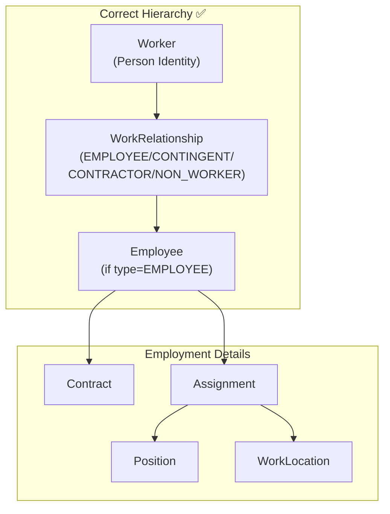
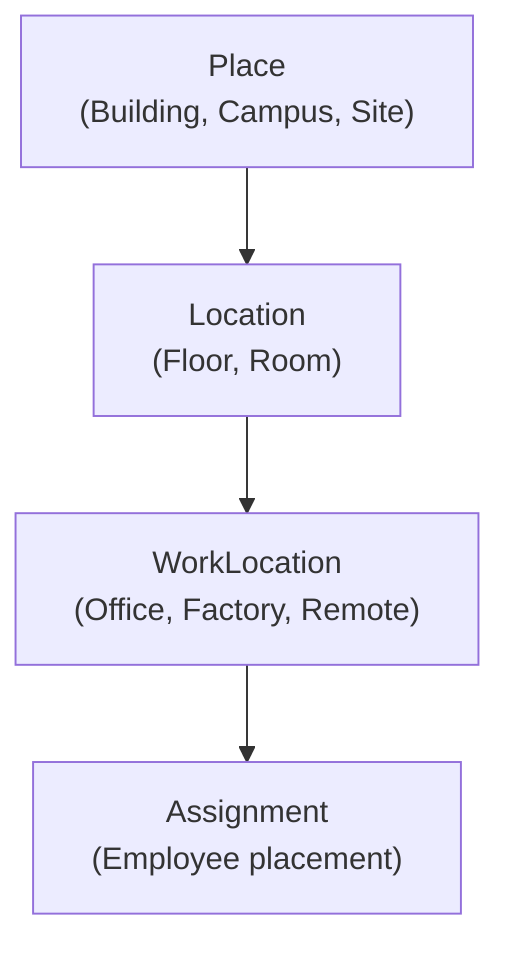
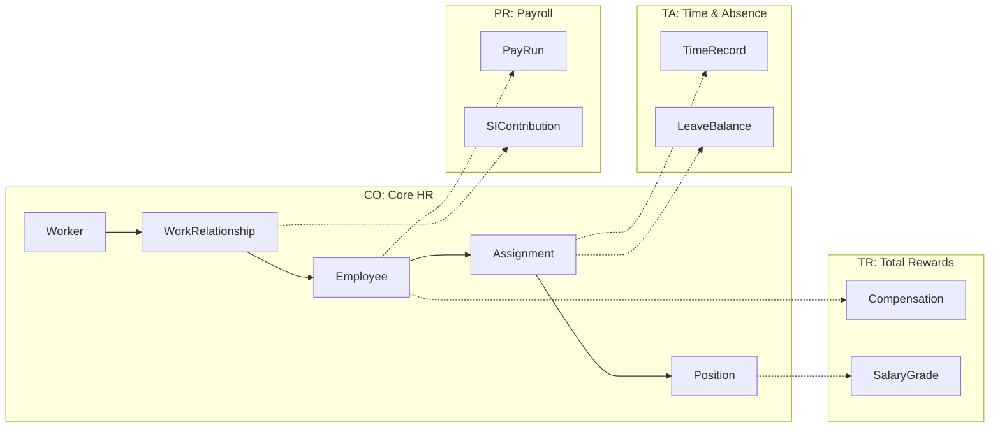

# Ontology Review

> **Core HR (CO) Module** | Validation of Existing Ontology Structure
> Date: 2026-01-19

---

## Executive Summary

The existing Core HR ontology at `/01-modules/CO/00-ontology/domain/` provides a **solid foundation** that aligns with enterprise HCM best practices (Workday, Oracle). The core concept hierarchy of Worker → WorkRelationship → Employee is correctly implemented.

### Assessment Summary

| Domain | Entities | Status | Phase | Recommendation |
|--------|----------|--------|-------|----------------|
| **Person** | 10 | ✅ Complete | 1 | Maintain |
| **Work Relationship** | 6 | ✅ Planned | 2 | Prioritize |
| **Organization** | 10 | ⚠️ Planned | 2 | Add OrgRelation|
| **Job & Position** | 8 | ⚠️ Planned | 3 | Add Career Path |
| **Facility** | 3 | ✅ Planned | 3 | Maintain |
| **Eligibility** | 3 | ⚠️ Planned | 4 | Define rules |
| **Talent Market** | 4 | ⚠️ Planned | 4 | Lower priority |

---

## Core Concept Validation

### 1. Worker vs WorkRelationship vs Employee

**Validation Status**: ✅ **CORRECT**

| Entity | Definition | Alignment |
|--------|------------|-----------|
| **Worker** | Lifetime identity (name, DOB, nationality) | ✅ Matches Workday Worker |
| **WorkRelationship** | Employment type linking Worker to LegalEntity | ✅ Matches Oracle Work Relationship |
| **Employee** | Employment record for EMPLOYEE type | ✅ Vietnam-specific enhancement |

**Key Insight**: xTalent adds Employee entity between WorkRelationship and Assignment, which is correct for Vietnam where employment-specific data (BHXH, employeeCode) differs from the generic relationship type.

### 2. WorkRelationship Types

| Type | Definition | Use Case | Status |
|------|------------|----------|--------|
| **EMPLOYEE** | HĐLĐ/HĐTT with company | Full-time, Part-time, Probation, Intern (paid) | ✅ Complete |
| **CONTINGENT** | HĐLĐ with third party | Agency temp, Outsource staff | ✅ Complete |
| **CONTRACTOR** | HĐDV, self-employed | Freelancer, Consultant | ✅ Complete |
| **NON_WORKER** | No labor relationship | Board member, Volunteer, Unpaid intern | ✅ Complete |

**Validation Status**: ✅ **COMPLETE** - All 4 types cover 100% of employment scenarios.

### 3. Facility Hierarchy

**Validation Status**: ✅ **APPROPRIATE**

| Entity | Purpose | Examples |
|--------|---------|----------|
| **Place** | Physical site | VNG Tower, Factory A |
| **Location** | Space within place | Floor 12, Room 1201 |
| **WorkLocation** | Where people work | Office HQ, Factory Production |

---

## Entity Phase Review

### Phase 1: Worker Domain (COMPLETE ✅)

| Entity | Type | Status | Notes |
|--------|------|--------|-------|
| Worker | AGGREGATE_ROOT | ✅ Complete | Core identity |
| Contact | ENTITY | ✅ Complete | Email, phone |
| Address | ENTITY | ✅ Complete | Home, work address |
| Document | ENTITY | ✅ Complete | ID, passport |
| BankAccount | ENTITY | ✅ Complete | Salary payment |
| WorkerRelationship | ENTITY | ✅ Complete | Family, dependents |
| WorkerQualification | ENTITY | ✅ Complete | Education, certs |
| WorkerSkill | ENTITY | ✅ Complete | Technical skills |
| WorkerCompetency | ENTITY | ✅ Complete | Behaviors |
| WorkerInterest | ENTITY | ✅ Complete | Career interests |

**Reference Data (Phase 1)**:
- CodeList, Currency, TimeZone, Industry ✅
- ContactType, RelationshipGroup, RelationshipType ✅
- SkillCategory, SkillMaster, CompetencyCategory, CompetencyMaster ✅
- Country, AdminArea ✅

### Phase 2: Employment & Org (PLANNED)

| Entity | Type | Priority | Notes |
|--------|------|----------|-------|
| WorkRelationship | ENTITY | High | Core - 4 types |
| Employee | AGGREGATE_ROOT | High | Employment record |
| Contract | ENTITY | High | HĐLĐ/HĐTT |
| ContractTemplate | ENTITY | Medium | Standard terms |
| Assignment | ENTITY | High | Position + Location link |
| EmployeeIdentifier | ENTITY | Medium | External IDs |
| GlobalAssignment | ENTITY | Low | Cross-entity |
| LegalEntity | AGGREGATE_ROOT | High | Company structure |
| BusinessUnit | AGGREGATE_ROOT | High | Departments |
| OrgRelationSchema | ENTITY | Medium | Hierarchy types |
| OrgRelationType | ENTITY | Medium | Reporting line types |
| OrgRelationEdge | ENTITY | Medium | Hierarchy links |

**Recommendation**: Prioritize WorkRelationship, Employee, Contract, Assignment, LegalEntity, BusinessUnit for Phase 2.

### Phase 3: Job & Facility (PLANNED)

| Entity | Type | Priority | Notes |
|--------|------|----------|-------|
| Job | AGGREGATE_ROOT | High | Generic role |
| Position | AGGREGATE_ROOT | High | Specific seat |
| JobTaxonomy | ENTITY | Medium | Job family tree |
| JobProfile | ENTITY | Medium | Requirements |
| JobProgression | ENTITY | Low | Career ladder |
| TaxonomyTree | AGGREGATE_ROOT | Low | Taxonomy root |
| JobTree | AGGREGATE_ROOT | Low | Job hierarchy |
| CareerPath | AGGREGATE_ROOT | Low | Career routes |
| Place | ENTITY | Medium | Buildings |
| Location | ENTITY | Medium | Spaces |
| WorkLocation | ENTITY | Medium | Work sites |

### Phase 4: Supporting (PLANNED)

| Entity | Type | Priority | Notes |
|--------|------|----------|-------|
| EligibilityProfile | AGGREGATE_ROOT | Medium | Rule-based eligibility |
| EligibilityMember | ENTITY | Medium | Profile members |
| EligibilityEvaluation | ENTITY | Medium | Evaluation results |
| TalentMarket | AGGREGATE_ROOT | Low | Opportunity marketplace |
| Opportunity | AGGREGATE_ROOT | Low | Internal opportunities |

---

## Gap Analysis

### Missing Concepts

| Concept | Description | Priority | Recommendation |
|---------|-------------|----------|----------------|
| **Leave Balance** | Employee leave entitlements | High | Add to TA module |
| **Time Record** | Actual hours worked | High | Add to TA module |
| **Compensation** | Salary, allowances | High | Add to TR module |
| **PayElement** | Payroll components | High | Add to PR module |

**Note**: These are correctly scoped to TA, TR, PR modules (not CO).

### Improvement Opportunities

| Entity | Current | Suggested | Reason |
|--------|---------|-----------|--------|
| Contract.contractTypeCode | 4 values | 2 values | Align with Labor Code 2019 |
| Contract | Type for probation | Attribute | Probation is period, not type |
| Employee | employeeClassCode | Expand values | Add INTERN, SEASONAL if needed |
| WorkRelationship | 4 types | Keep 4 | Comprehensive |

---

## Cross-Module Entity Mapping

---

## Recommendations

### Immediate (Phase 2 Start)

1. **Complete WorkRelationship ontology** with all 4 types documented
2. **Refine Contract types** per Labor Code 2019 (2 types, not 4)
3. **Add probation as Contract attribute**, not type

### Short-term

1. **Define OrgRelation schema** for flexible hierarchies
2. **Complete Assignment ontology** with Position and WorkLocation links
3. **Document business rules** in BRS files

### Medium-term

1. **Build Phase 3 entities** (Job, Position, Facility)
2. **Define cross-module events** for integration
3. **Implement Eligibility engine** rules

---

## Statistics Summary

| Category | Count | Complete | Planned |
|----------|-------|----------|---------|
| Aggregate Roots | 12 | 1 | 11 |
| Entities | 40 | 9 | 31 |
| Reference Data | 18 | 14 | 4 |
| **Total** | **70** | **24** | **46** |
