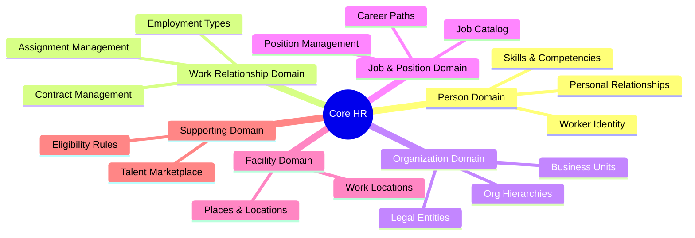
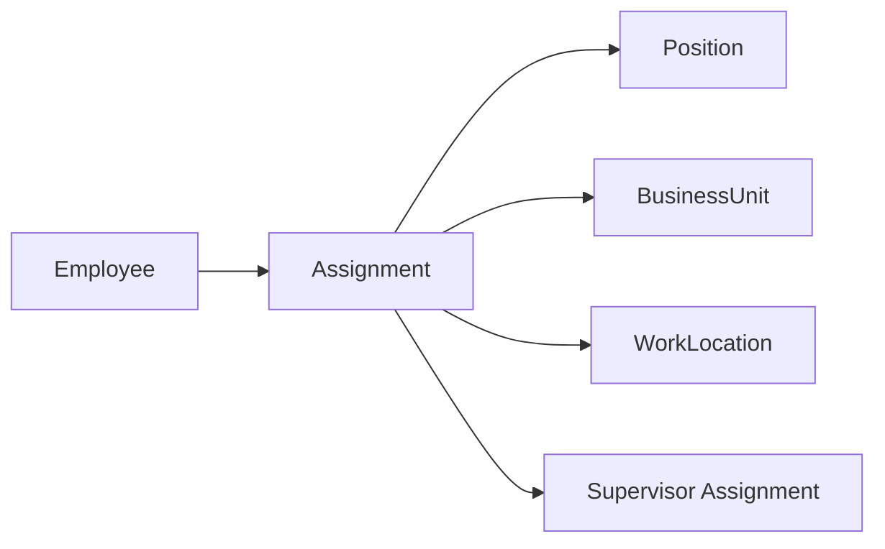

# Capability Map

> **Core HR (CO) Module** | Capability Architecture by Domain
> Date: 2026-01-19

---

## Overview

This document maps Core HR capabilities organized by domain, showing Data Objects, Business Rules, and Integration Patterns for each capability.



---

## 1. Person Domain

### Capability: Worker Identity Management

| Aspect | Details |
|--------|---------|
| **Purpose** | Maintain lifetime identity of people in the organization |
| **Data Objects** | Worker, Contact, Address, Document, BankAccount |
| **Business Rules** | Immutable ID, DOB validation (age ≥15), privacy protection |
| **Rule Density** | Low - mostly CRUD |
| **Integration** | API Sync: Lookup by ID, name |


### Capability: Skills & Competency Tracking

| Aspect | Details |
|--------|---------|
| **Purpose** | Track and manage worker capabilities for career development |
| **Data Objects** | WorkerSkill, WorkerCompetency, SkillMaster, CompetencyMaster |
| **Business Rules** | Proficiency levels, certification verification |
| **Rule Density** | Medium - proficiency validation |
| **Integration** | Event: skill_added, competency_updated |

### Capability: Personal Relationship Management

| Aspect | Details |
|--------|---------|
| **Purpose** | Track family, dependents, emergency contacts |
| **Data Objects** | WorkerRelationship, RelationshipType |
| **Business Rules** | Dependent eligibility, beneficiary designation |
| **Rule Density** | Medium - eligibility rules |
| **Integration** | Event: dependent_added → TR (benefits) |

---

## 2. Work Relationship Domain

### Capability: Employment Type Management

| Aspect | Details |
|--------|---------|
| **Purpose** | Define and manage how people are engaged with organization |
| **Data Objects** | WorkRelationship |
| **Business Rules** | One active per type per entity, primary required |
| **Rule Density** | High - type-specific rules |
| **Integration** | Event: relationship_created → TA, TR, PR |

**WorkRelationship Type Rules**:

| Type | Creates Employee | SI/Tax | Payroll |
|------|-----------------|--------|---------|
| EMPLOYEE | ✅ Yes | Internal | Internal |
| CONTINGENT | ❌ No | External | External |
| CONTRACTOR | ❌ No | Self | Invoice |
| NON_WORKER | ❌ No | None | None |

### Capability: Contract Management

| Aspect | Details |
|--------|---------|
| **Purpose** | Manage employment contracts per Vietnam Labor Code |
| **Data Objects** | Contract, ContractTemplate |
| **Business Rules** | Type validation, duration limits, renewal rules |
| **Rule Density** | **High** - Complex legal rules |
| **Integration** | Event: contract_signed → PR |

**Contract Rule Engine Required**:

```yaml
rules:
  - name: fixed_term_max_36_months
    condition: "contractTypeCode = 'FIXED_TERM'"
    validation: "endDate - startDate <= 36 months"
    
  - name: max_2_renewals
    condition: "parentRelationshipType = 'RENEWAL'"
    validation: "count(renewals) <= 2"
    action: "IF count = 2 THEN warn('Third must be INDEFINITE')"
    
  - name: probation_by_level
    condition: "probationDays IS NOT NULL"
    validation: "probationDays <= maxForJobLevel(jobLevelCode)"
```

### Capability: Assignment Management

| Aspect | Details |
|--------|---------|
| **Purpose** | Link employees to positions and work locations |
| **Data Objects** | Assignment |
| **Business Rules** | One primary, valid position slot, no supervisor cycles |
| **Rule Density** | Medium - hierarchy validation |
| **Integration** | Event: assignment_created → TA (time rules) |



---

## 3. Organization Domain

### Capability: Legal Entity Management

| Aspect | Details |
|--------|---------|
| **Purpose** | Manage company, branch, subsidiary structure |
| **Data Objects** | LegalEntity, EntityRepresentative, EntityLicense |
| **Business Rules** | Unique tax ID, representative required, dissolution process |
| **Rule Density** | Medium - compliance rules |
| **Integration** | Batch: Statutory reporting |

### Capability: Business Unit Management

| Aspect | Details |
|--------|---------|
| **Purpose** | Manage operational structure (departments, teams) |
| **Data Objects** | BusinessUnit, BusinessUnitType |
| **Business Rules** | Hierarchy validation, cost center linking |
| **Rule Density** | Low - mostly CRUD |
| **Integration** | API Sync: BU lookup |

### Capability: Organization Hierarchy

| Aspect | Details |
|--------|---------|
| **Purpose** | Manage reporting lines and org structure |
| **Data Objects** | OrgRelationSchema, OrgRelationType, OrgRelationEdge |
| **Business Rules** | No cycles, single root, valid edge types |
| **Rule Density** | Medium - graph validation |
| **Integration** | Event: org_restructured → TA, TR |

---

## 4. Job & Position Domain

### Capability: Job Catalog Management

| Aspect | Details |
|--------|---------|
| **Purpose** | Define generic roles and job families |
| **Data Objects** | Job, JobTaxonomy, JobProfile, TaxonomyTree |
| **Business Rules** | Taxonomy hierarchy, profile completeness |
| **Rule Density** | Low - catalog management |
| **Integration** | API Sync: Job lookup |

### Capability: Position Management

| Aspect | Details |
|--------|---------|
| **Purpose** | Manage specific seats in organization (Position Management model) |
| **Data Objects** | Position |
| **Business Rules** | MaxIncumbents, position availability |
| **Rule Density** | Medium - headcount control |
| **Integration** | Event: position_created → Recruiting |

**Staffing Models** (Workday alignment):

| Model | Description | Use Case |
|-------|-------------|----------|
| **Position Management** | Create position first, then hire | Budgeted roles, strict headcount |
| **Job Management** | Position auto-created on hire | Flexible staffing |

### Capability: Career Path Management

| Aspect | Details |
|--------|---------|
| **Purpose** | Define career progression routes |
| **Data Objects** | CareerPath, JobProgression |
| **Business Rules** | Valid progression steps, competency requirements |
| **Rule Density** | Low - configuration |
| **Integration** | Used by: TR (compensation bands) |

---

## 5. Facility Domain

### Capability: Site Management

| Aspect | Details |
|--------|---------|
| **Purpose** | Manage physical sites (buildings, campuses) |
| **Data Objects** | Place, Location |
| **Business Rules** | Unique codes, address validation |
| **Rule Density** | Low - master data |
| **Integration** | API Sync: Location lookup |

### Capability: Work Location Management

| Aspect | Details |
|--------|---------|
| **Purpose** | Manage where employees work |
| **Data Objects** | WorkLocation |
| **Business Rules** | Capacity limits, relocation before close |
| **Rule Density** | Medium - capacity validation |
| **Integration** | Event: location_closed → Assignment updates |

---

## 6. Supporting Domain

### Capability: Eligibility Engine

| Aspect | Details |
|--------|---------|
| **Purpose** | Rule-based eligibility for benefits, programs |
| **Data Objects** | EligibilityProfile, EligibilityMember, EligibilityEvaluation |
| **Business Rules** | Complex condition evaluation |
| **Rule Density** | **High** - Rule engine required |
| **Integration** | Used by: TR (benefits), TA (leave) |

**Eligibility Rule Example**:
```yaml
profile: annual_leave_eligibility
conditions:
  - field: workRelationship.type
    operator: IN
    value: [EMPLOYEE]
  - field: employee.tenure_months
    operator: >=
    value: 12
evaluation: REAL_TIME
```

### Capability: Talent Marketplace

| Aspect | Details |
|--------|---------|
| **Purpose** | Internal opportunity matching |
| **Data Objects** | TalentMarket, Opportunity, OpportunityApplication |
| **Business Rules** | Skill matching, eligibility checking |
| **Rule Density** | Medium - matching algorithm |
| **Integration** | Uses: WorkerSkill, Position |

---

## Integration Pattern Summary

| Capability | API Sync | Event-Driven | Batch |
|------------|----------|--------------|-------|
| Worker Identity | ✅ Lookup | ✅ Updated | - |
| Skills Tracking | ✅ Lookup | ✅ Added | - |
| Employment Types | ✅ Lookup | ✅ Created/Terminated | - |
| Contract Mgmt | ✅ Lookup | ✅ Signed/Renewed | - |
| Assignment Mgmt | ✅ Lookup | ✅ Created/Ended | - |
| Legal Entity | ✅ Lookup | ✅ Activated | ✅ Statutory |
| Business Unit | ✅ Lookup | - | - |
| Position Mgmt | ✅ Lookup | ✅ Created/Closed | - |
| Work Location | ✅ Lookup | ✅ Closed | - |
| Eligibility | - | ✅ Evaluated | - |

---

## Rule Density Analysis

| Domain | Rule Density | Engine Needed |
|--------|--------------|---------------|
| Person | Low | No |
| Work Relationship | **High** | ✅ Yes - Contract/Probation |
| Organization | Medium | No |
| Job & Position | Medium | No |
| Facility | Medium | No |
| Supporting | **High** | ✅ Yes - Eligibility |

**Recommendation**: Build dedicated rule engine for Contract Management and Eligibility Engine capabilities.
